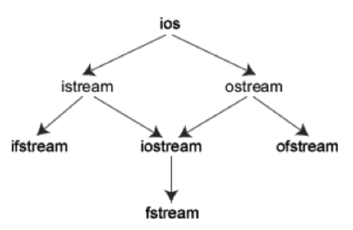

# I/O库

C++不直接处理输入输出，而是通过定义在标准库中的类型来处理IO。

## 1 IO类

为了支持不同的IO操作，标准库定义了一些IO类型，分别在3个独立的头文件中。

**头文件：iostream**，包含了对输入输出流进行操作所需的基本信息
- ios istream和iostream的共同基类
- istream、wiostream 从流读取数据
- ostream、wostream 从流写入数据
- iostream、wiostream 读写流

前面用到的cin是istream是实现，而cout是ostream的实现。

**头文件：fstream**
- ifstream、 wifstream 从文件读取数据
- ofstream、 wofstream 向文件写入数据
- fstream、wfstream 读写文件
   
**头文件：sstream**
- istringstream、wistringstream 从string读取数据
- ostringstream、wostringstream 向string写入数据
- stringstream、wstringstream 读写string

>以w开头的IO类型，用处理宽字符。


### IO类型之间的关系

通过**继承机制**，C++屏蔽了具体IO操作的细节，标准库使我们能够忽略不同类型的流之间的差异。


ios是抽象基类，由它派生出istream类和ostream类，两个类名中第1个字母i和o分别代表输入(input)和输出(output)。
istream类支持输入操作，ostream类支持输出操作，iostream类支持输入输出操作。iostream类是从istream类和ostream类通过多重继承而派生的类。

C++对文件的输入输出需要用ifstrcam和ofstream类，两个类名中第1个字母i和o分别代表输入和输出，第2个字母f代表文件    (file)。ifstream支持对文件的输入操作，    
ofstream支持对文件的输出操作。类ifstream继承了类istream，类ofstream继承了类ostream，类fstream继承了类iostream。如下图：





###  IO对象无拷贝和赋值

IO对象不能够被拷贝和赋值，这个要求有两层特别重要的含义：

- 只有支持复制的元素类型可以存储在 vector 或其他容器类型里。由于流对象不能复制，因此不能存储在 vector（或其他）容器中（即不存在存储流对象的 vector 或其他容器）。
- 不能将形参和返回类型设置为IO类型，通常以引用的方式传递和返回流，读写一个IO对象会改变其状态，因此传递和返回的流的引用不能使const的。

### IO条件状态

IO操作与生俱来的问题就是可能发生错误，一些错误可以修复，一些系统深处的错误却超出了应用程序的处理范围，
下面列出的一些函数和标识可以帮助我们访问和操纵流的条件状态:

 
状态    | 含义
--- | ---
`strm::iostate`        | strm是一种IO类型。iostate是一种机器相关的整型，提供了表达条件状态的完整功能
`strm::badbit`        | strm::badbit用来指出流已崩溃
`strm::failbit`        | strm::failbit用来指出一个IO操作失败了
`strm::eofbit    `    | strm::eofbit用来指出流达到了文件结束
`strm::goodbit`        | strm::goodbit用来指出流未处于错误状态。此值保证为零
`s.eof()    `    | 若流 s 的 eofbit 置位，则返回 true
`s.fail()    `    | 若流 s 的 failbit 或 badbit 置位，则返回 true
`s.bad()    `    | 若流 s 的 badbit 置位，则返回 true
`s.good()`        | 若流 s 处于有效状态，则返回 true
`s.clear()`        | 将流 s 中的所有条件状态位复位，将流的状态设置为有效。返回void
`s.clear(flag)    `    | 根据给定的 flags 标志位，将流 s 中对于条件状态位复位。 flag 的类型是`strm::iostate`。返回 void，flag示例：`cin.rdstate() & ~cin.failbit & ~cin.badbit`表示复位failbit和badbit，其他位保持不变
`s.setstate(flag)`        | 根据给定的 flags 标志位，将流 s 中对于条件状态位置位。 flag 的类型是`strm::iostate`。返回 void
`s.rdstate()`        | 返回流 s 的当前条件，返回值类型为 `strm::iostate`


参考下面代码：

```
int val
cin >> val
```
如果在标准输入流中输入字符串"BOO"，读操作会失败，cin会进入错误状态，类似如果输入一个文件
结束标识，cin也会进入错误状态。**一旦一个流发生错误，其后续的操纵都会失败**，由于在操作
流时，流可能处于错误状态，所以代码应该在使用流之前检查流是否处于正常状态。比如：
```
while(cin >> word){
    //ok 操作时成功的
}
```

有时需要知道流发生了什么错误，IO定义的`iostate`是一种机器相关的整型，提供了表达条件状态的完整功能，
这个类型应该作为一个位集来使用，IO库定义了4个`iostate`类型的constexpr值标识特定的位模式。


四种条件状态：

状态     | 含义     | 数值     | good()     | eof()     | bad()     | fail()     | rdstate()
---|---|---|---|---|---|---|---
`ios::goodbit`     | 流状态完全正常     | 0     | 1     | 0     | 0     | 0     | goodbit
`ios::eofbit` |     已达到文件结束     | 2     | 0     | 1     | 0     | 0     | eofbit
`ios::badbit`     | 输入（输出）流出现非致命错误，可挽回     | 1     | 0     | 0     | 1     | 0     | badbit
`ios::failbit`     | 输入（输出）流出现致命错误，不可挽回     | 4     | 0     | 0     | 0     | 1     | failbit

`goodbit`为0表示流未发生错误，如果`badbit、failbit、 eofbit`任一个被置位，则检查流状态的条件都会失败。
**使用`good和fail`是确定流整体状态的正确方法，我们将流当作条件使用的代码就等价于`!fail()`,而`eof和badbit`只表示特定类型的错误。**


### 管理输出缓冲

每个操作系统都管理着一个缓冲区，用来保存程序读写的数据，因为设备的读写操作很耗时，所以操作系统运行将多个输入输出操作组合为一个设备的读写操作。
下面代码可以立即执行，也可能被操作系统保留在缓冲区，随后再输出。

```
std::cout << "abcdefg"
```

导致缓冲区刷新的原因有很多，例如：
- 程序正常退出
- 使用操作符号`endl`显示刷新
- 在每个输出操作后，使用操作符`unitbuf`设置流的内部状态来情况缓冲区
- 一个输出流可能被关联到另一个，当读写被关联时，关联到的流的缓冲区将被刷新

注意：**当程序崩溃，缓冲区不会刷新。**

#### 缓冲区刷新
```
cout << "hi" << endl; // 换行+刷新缓冲区
cout << "hi" << flush; // 刷新缓冲区不附加任何字符
cout << "hi" << ends; //  附加一个空字符，然后刷新缓冲区
```

#### unitbuf

`unitbuf`告诉流接下来的每一次操作都要刷新一次，`nounitbuf`重置
```
cout << unitbuf;//每一次操作都要刷新一次
        ......流操作
cout << nounitbuf;//复位
```
#### 关联输入和输出流

当一个输入流被关联到一个输出流时，任何试图从输入流读取数据的操作都会刷新关联的输出流。标准库默认将cout和cin关联在一起。
```
int a;
cin >> a; //输入的同时cout也会输出
```

关联函数位`tie()`，tie有两个版本：
- 无参的tie：返回指向输出流的指针，如果本对象当前关联到一个输出流，返回指向该输出流的指针，否则返回空指针
- 接受一个指向ostream的指针，将自己关联到指针指向的ostream，`x.tie(&o)`表示将x关联到o

可以将一个istream关联到ostream，也可以将一个ostream关联到istream：
```
cin.tie(&out);
//old_tie指向当前流关联到cin的流
ostream *old_tie = cin.tie(nullptr);// cin不再与其他流关联
//将cin与cerr关联，开发中不要这么做
cin.tie(&cerr);
cin.tie(old_tie);
```
每个流最多同时关联到一个流，但多个流可以同时关联到同一个`ostream`。


---
## 2 文件操作

`fstream` 头文件定义了三种支持文件 IO 的类型：

- ifstream，由 istream 派生而来，提供读文件的功能。
- ofstream，由 ostream 派生而来，提供写文件的功能。
- fstream，由 iostream 派生而来，提供读写同一个文件的功能。

### 文件流输入输出

```
fstream fStream1(file);//创建并打开文件

fstream fStream2;//创建一个文件流
fStream2.open(file);//打开文件流
fStream2.close();
fStream2.is_open();

fstream fStream1(file, mode);
    
//判断打开状态
ofstream out;
out.open(file);
if(out){//如果打开成功，则条件成立
    //...
}
```

文件模式：

模式|说明
--- | ---
ios::app |     追加模式。所有写入都追加到文件末尾。
ios::ate |     文件打开后定位到文件末尾。
ios::in |     打开文件用于读取。
ios::out |     打开文件用于写入。
ios::trunc |     如果该文件已经存在，其内容将在打开文件之前被截断，即把文件长度设为 0。
ios:binary | 以二进制模式进行IO

并不是所有的打开模式都可以同时指定。有些模式组合是没有意义的，例如同时以 in 和 trunc 模式打开文件，
准备读取所生成的流，但却因为 trunc 操作而导致无数据可读。下表列出了有效的模式组合及其含义。

- `out` 打开文件做写操作，删除文件中已有的数据 
- `out | app` 打开文件做写操作，在文件尾写入 
- `out | trunc` 与 out 模式相同 
- `in` 打开文件做读操作 
- `in | out` 打开文件做读、写操作，并定位于文件开头处 
- `in | out | trunc` 打开文件做读、写操作，删除文件中已有的数据

out、trunc 和 app 模式只能用于指定与 ofstream 或 fstream 对象关联的文件；in 模式只能用于指定与 ifstream 或 fstream 对象关联的文件。
所有的文件都可以用 ate 或 binary 模式打开。ate 模式只在打开时有效：文件打开后将定位在文件尾。
以 binary 模式打开的流则将文件以字节序列的形式处理，而不解释流中的字符。

默认时，与 ifstream 流对象关联的文件将以 in 模式打开，该模式允许文件做读的操作：
与 ofstream 关联的文件则以 out 模式打开，使文件可写。以 out 模式打开的文件会被清空：丢弃该文件存储的所有数据。


### 对同一个文件作输入和输出运算

fstream 对象既可以读也可以写它所关联的文件。fstream 如何使用它的文件取决于打开文件时指定的模式。

默认情况下，fstream 对象以 in 和 out 模式同时打开。 当文件同时以 in 和 out 打开时不清空 。
如果打开 fstream 所关联的文件时，只使用 out 模式，而不指定 in 模式，则文件会清空已存在的数据。
如果打开文件时指定了 trunc 模式，则无论是否同时指定了 in 模式，文件同样会被清空。

### 将文件流与新文件重新捆绑

fstream 对象一旦打开，就保持与指定的文件相关联。如果要把 fstream 对象与另一个不同的文件关联，
则必须 先关闭 （close）现在的文件，然后再打开 （open）另一个文件：要点是在尝试打开新文件之前，
必须先关闭当前的文件流。open 函数会检查流是否已经打开。如果已经打开，则设置内部状态，以指出发生了错误。


---
## 3 string流

标准库定义了三种类型的字符串流：

- istringstream，由 istream 派生而来，提供读 string 的功能。
- ostringstream，由 ostream 派生而来，提供写 string 的功能。
- stringstream，由 iostream 派生而来，提供读写 string 的功能。

与 fstream 类型一样，上述类型由 iostream 类型派生而来，这意味着 iostream 上所有的操作适用于 sstream 中的类型。
sstream 类型除了继承的操作外，还各自定义了一个有 string 形参的构造函数，这个构造函数将 string 类型的实参复制给 stringstream 对象。
对 stringstream 的读写操作实际上读写的就是该对象中的 string 对象。这些类还定义了名为 str 的成员，用来读取或设置 stringstream 对象所操纵的 string 值。


```
string line, word;
while (getline(cin, line))   {            
    istringstream stream(line);  
    while (stream >> word){
      // 
    } 
 }
```

### 转换和格式化

`stringstream` 对象的一个常见用法是， 需要在多种数据类型之间实现自动格式化时使用该类类型。
例如，有一个数值型数据集合，要获取它们的 string 表示形式，或反之。sstream 输入和输出操作可自动地把算术类型转化为相应的 string 表示形式，反过来也可以。

```
int val1 = 512, val2 = 1024; 
ostringstream format_message; 
format_message << "val1: " << val1 << "\n" 
               << "val2: " << val2 << "\n";
```

用 `istringstream` 读 string 对象，即可重新将数值型数据找回来。读取 istringstream 对象自动地将数值型数据的字符表示方式转换为相应的算术值。
```
istringstream input_istring(format_message.str()); 
string dump; 
input_istring >> dump >> val1 >> dump >> val2; 
cout << val1 << " " << val2 << endl;
```

---
## 4 文件位置指针

istream 和 ostream 都提供了用于重新定位文件位置指针的成员函数。这些成员函数包括关于 `istream 的 seekg("seek get")`和关于 `ostream 的 seekp("seek put")`。

seekg 和 seekp 的参数通常是一个长整型。第二个参数可以用于指定查找方向。查找方向可以是：

 - `ios::beg`（默认的，从流的开头开始定位）
 - `ios::cur`（从流的当前位置开始定位）
 - `ios::end`（从流的末尾开始定位）
 
 ```
 // 定位到 fileObject 的第 n 个字节（假设是 ios::beg）
 fileObject.seekg( n );
  
 // 把文件的读指针从 fileObject 当前位置向后移 n 个字节
 fileObject.seekg( n, cur );
  
 // 把文件的读指针从 fileObject 末尾往回移 n 个字节
 fileObject.seekg( n, end );
  
 // 定位到 fileObject 的末尾
 fileObject.seekg( 0, end );
 
 //返回输入文件读指针的当前位置
 tellg()
 
 //返回输出文件写指针的当前位置
 tellp()
 ```
 
 ---
 ## 5 标准IO
 
 标准I/O对象:`cin、cout、cerr、clog`
 
 - cout流对象：cout是console output的缩写，意为在控制台（终端显示器）的输出。
 - cerr流对象是标准错误流，cerr流已被指定为与显示器关联。cerr的作用是向标准错误设备(standard error device)输出有关出错信息
 - clog流对象也是标准错误流，它是console log的缩写。它的作用和cerr相同，都是在终端显示器上显示出错信息。区别：cerr是不经过缓冲区，直接向显示器上输出有关信息，而clog中的信息存放在缓冲区中，缓冲区满后或遇endl时向显示器输出。
 
 
 