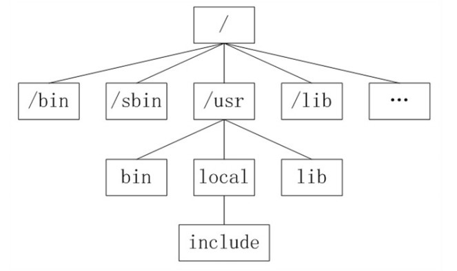
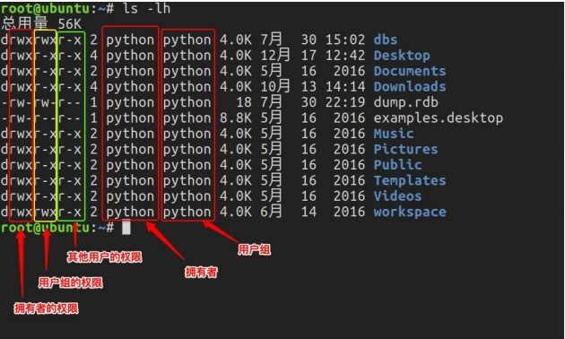

# Linux文件系统与文件权限

---
## 1 Linux文件系统

**Unix Like**的文件系统包括两个概念：根文件系统和存储类文件系统

**根文件系统**(rootfs:`root file system`)，其并不是用于存储实际的文件
有如下特点：
- **文件**不仅仅是硬盘上的数据，还包括任何设备资源，**Unix Like**系统中所有的硬件都被看做式文件，文件是内核范畴的概念，内存、网络、U盘、甚至CPU都被内核抽象为文件，为了区别一般意义上的文件，内核级别的文件称为**设备文件**或者**设备虚拟文件**，这些设备文件都可以在rootfs中被看到，表面上就像windows系统中的磁盘文件一样。
- 并不是所有的命令或者文件都对应磁盘上的存储空间，比如`sys,proc,dev`三个目录对应的就不是存储空间，而是设备文件。这三个目录中的内容由内核及相应的驱动程序维护。
- **存储类文件系统**不能和rootfs并列的存在，而只能挂着到rootfs下的一个子目录上
- **存储类文件系统**内部等同于windows中的文件系统。

**Unix Like**系统存储类文件系统⽬录结构，没有盘符这个概念，只有⼀个根⽬录`/`，所有⽂件都在它下⾯：

### 用户目录

位于`/home/user`，称之为⽤户⼯作⽬录或家⽬录

---
## 2 文件权限

⽂件权限就是⽂件的访问控制权限，即哪些⽤户和组群可以访问⽂件以及可以执⾏什么样 的操作。 Unix/Linux系统是⼀个典型的多⽤户系统，不同的⽤户处于不同的地位，对⽂件和⽬录有 不同的访问权限。为了保护系统的安全性，Unix/Linux系统除了对⽤户权限作了严格的界 定外，还在⽤户身份认证、访问控制、传输安全、⽂件读写权限等⽅⾯作了周密的控制。在 Unix/Linux中的每⼀个⽂件或⽬录都包含有访问权限，这些访问权限决定了谁能访问和 如何访问这些⽂件和⽬录。

### 访问⽤户

通过设定权限可以从以下三种访问⽅式限制访问权限：

- 只允许⽤户⾃⼰访问（所有者） 所有者就是创建⽂件的⽤户，⽤户是所有⽤户所创 建⽂件的所有者，⽤户可以允许所在的⽤户组能访问⽤户的⽂件。
- 允许⼀个预先指定的⽤户组中的⽤户访问（⽤户组） ⽤户都组合成⽤户组，例如， 某⼀类或某⼀项⽬中的所有⽤户都能够被系统管理员归为⼀个⽤户组，⼀个⽤户能够 授予所在⽤户组的其他成员的⽂件访问权限。
- 允许系统中的任何⽤户访问（其他⽤户） ⽤户也将⾃⼰的⽂件向系统内的所有⽤户 开放，在这种情况下，系统内的所有⽤户都能够访问⽤户的⽬录或⽂件。在这种意义 上，系统内的其他所有⽤户就是 other ⽤户类

### 访问权限

⽤户能够控制⼀个给定的⽂件或⽬录的访问程度，⼀个⽂件或⽬录可能有读、写及执⾏权限：

- 读权限（r） 对⽂件⽽⾔，具有读取⽂件内容的权限；对⽬录来说，具有浏览⽬录的 权限。
- 写权限（w） 对⽂件⽽⾔，具有新增、修改⽂件内容的权限；对⽬录来说，具有删 除、移动⽬录内⽂件的权限。
- 可执⾏权限（x） 对⽂件⽽⾔，具有执⾏⽂件的权限；对⽬录了来说该⽤户具有进⼊ ⽬录的权限。 注意：通常，Unix/Linux系统只允许⽂件的属主(所有者)或超级⽤户改变⽂件的读写权

第1个字⺟代表⽂件的类型：

`d` 代表⽂件夹、
`-` 代表普通⽂件、
`c` 代表硬件字符设 备、
`b` 代表硬件块设备、
`s` 表示管道⽂件、
`l` 代表软链接⽂件。

后面9个字⺟分别代表三组权限：`文件所有者、用户组、其他用户拥有的权限`。

