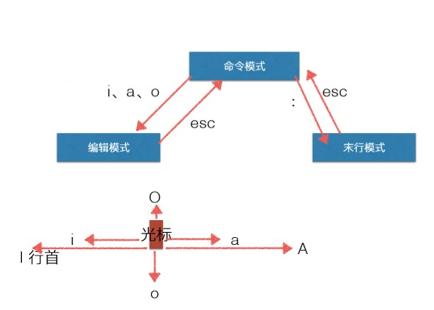

# VIM

---
## 1 VIM介绍

vi是Visual interface的简称，它在Linux上的地位就仿佛Edit程序在DOS上一样。它可以执行输出、删除、查找、替换、块操作等众多文本操作，而且用户可以根据自己的需要对其进行定制。Vi不是一个排版程序，它不象Word或WPS那样可以对字体、格式、段落等其他属性进行编排，它只是一个文本编辑程序。 vi没有菜单，只有命令，且命令繁多。

Vi有三种基本工作模式：

-  命令模式
-  文本输入模式
-  末行模式




### 命令行模式

任何时候，不管用户处于何种模式，只要按一下ESC键，即可使Vi进入命令模式；我们在shell环境(提示符为$)下输入启动Vi命令，进入编辑器时，也是处于该模式下。在该模式下，用户可以输入各种合法的Vi命令，用于管理自己的文档。此时从键盘上输入的任何字符都被当做编辑命令来解释，若输入的字符是合法的Vi命令，则Vi在接受用户命令之后完成相应的动作。但需注意的是，所输入的命令并不在屏幕上显示出来。若输入的字符不是Vi的合法命令，Vi会响铃报警。

### 文本输入模式

在命令模式下输入插入命令i、附加命令a 、打开命令o、修改命令c、取代命令r或替换命令s都可以进入文本输入模式。在该模式下，用户输入的任何字符都被Vi当做文件内容保存起来，并将其显示在屏幕上。在文本输入过程中，若想回到命令模式下，按键ESC即可。


### 末行模式

末行模式也称ex转义模式。在命令模式下，用户按“:”键即可进入末行模式下，此时Vi会在显示窗口的最后一行(通常也是屏幕的最后一行)显示一个“:”作为末行模式的提示符，等待用户输入命令。多数文件管理命令都是在此模式下执行的(如把编辑缓冲区的内容写到文件中等)。末行命令执行完后，Vi自动回到命令模式。

---
## 2 命令

### 进入插入模式

```
    i: 插入光标前一个字符
    I: 插入行首
    a: 插入光标后一个字符
    A: 插入行未
    o: 向下新开一行,插入行首
    O: 向上新开一行,插入行首
```

### 命令模式

```
    h: 左移
    j: 下移
    k: 上移
    l: 右移
    yy：复制光标所在行
    4yy：复制从光标所在行开始四行
    dd：剪切光标所在行
    d0：从当前光标开始剪切到行首
    4dd：剪切从光标所在行开始四行
    dw：删除光标开始位置的字，包含关闭所在字符
    x：剪切当前的光标所在字符
    X：剪切当前的光标所在字符的前一个
    D：从当前光标开始剪切到行末
    p：黏贴
    H：当前屏幕的上方
    M：当前屏幕的中间
    L：当前屏幕的下方
    Ctrl+b ：上一页；Ctrl+f：下一页
    Ctrl+u ：上半一页；Ctrl+d：下半一页
    G：回到整个代码的最后一行
    20G：快速定位的18行
    gg：回到整个代码的最一行
    w：向后跳一个单词的长度，调到下一个单词的第一位
    b：向前跳一个单词的长度，调到上一个单词的第一位
    u：撤销刚刚的操作
    Ctrl+r：反撤销
    .：重复执行上一次的操作

    选择一片代码：
        - v：基于当前光标
        - V：当前光标的整行
        - >>：整体向右缩进
        - <<：整体向左
    
    (：上一段代码
    )：下一段代码
    
    
    替换：
        r：替换一个字符
        R：从当前光标开始替换
        末行模式下：%s/world/hello/g (所有world替换成hello)
        11,16s/world/hello/g(11行到16行的world替换成hello)
    
    搜索：
        /hello：搜索，搜一个不存在的即消除高亮
        N：上一个
        n：下一个
```

### 末行模式

```
    w：保存
    q：退出
    q!：强制退出
    wq：保存+退出
    shift+zz相当于wq
```

---
## 教程

- [Linux vi/vim](http://www.runoob.com/linux/linux-vim.html)
