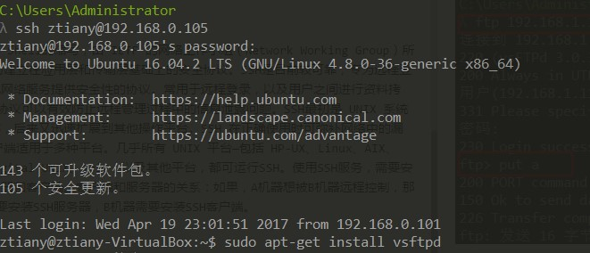

# 常用服务器搭建

---
## 1 ftp

FTP 是File Transfer Protocol（文件传输协议）的英文简称，而中文简称为“文传协议”。用于Internet上的控制文件的双向传输。同时，它也是一个应用程序（Application）。基于不同的操作系统有不同的FTP应用程序，而所有这些应用程序都遵守同一种协议以传输文件。在FTP的使用当中，用户经常遇到两个概念："下载"（Download）和"上传"（Upload）。"下载"文件就是从远程主机拷⻉文件至自己的计算机上；"上传"文件就是将文件从自己的计算机中拷⻉至远程主机上。用Internet语言来说，用户可通过客户机程序向（从）远程主机上传（下载）文件。

**安装vsftpd服务器** `sudo apt-get install vsftpd`

### 1.1 配置ftp

- 配置ftp，`/etc/vsftpd.conf`
```
anonymous_enable=NO   //不允许匿名登录
local_enable=YES   //允许本地用户登录
local_root=/home/ztiany/ftp   //指定上传下载的目录
chroot_list_enable=YES   //允许vsftpd.chroot_list文件中的用户登录FTP服务器
chroot_list_file=/etc/vsftpd.chroot_list //记录可以登录的用户
write_enable=YES   //允许用户上传文件
```

- 添加用户
```shell
mkdir -p /home/ztiany
useradd ztiany -g ftp -d /home/ztiany -s /sbin/nologin #添加用户，-s表示指定用户登入后所使用的shell
passwd ztiany #设置密码
chmod 777 -R /home/ztiany
```

- 设置`etc/shells`，如果没有则加上下面两项
```
# 命令 vim /etc/shells
/usr/sbin/nologin
/sbin/nologin
```

- 创建并编辑`/ect/vsftpd.chroot_list`文件，加入刚刚创建的用户
```shell
ztiany #此时表示ztiany可以登录ftp服务器
```

- 配置好后需要重启vsftpd服务
```
service vsftp restart
```

### 1.2 远程登录ftp服务器

```
    ftp ipAddress
    put localfile targetFile 上传文件
    get targetFile localFile 拉取文件
```

---
## 2 SSH

SSH为Secure Shell的缩写，由 IETF 的网络工作小组（Network Working Group）所制定；SSH 为建立在应用层和传输层基础上的安全协议。SSH是目前较可靠，专为远程登录会话和其他网络服务提供安全性的协议。常用于远程登录，以及用户之间进行资料拷⻉。利用SSH协议可以有效防止远程管理过程中的信息泄露问题。SSH最初是 UNIX 系统上的一个程序，后来又迅速扩展到其他操作平台。SSH 在正确使用时可弥补网络中的漏洞。SSH 客户端适用于多种平台。几乎所有 UNIX 平台—包括 HP-UX、Linux、AIX、Solaris、Digital UNIX、Irix，以及其他平台，都可运行SSH。使用SSH服务，需要安装相应的服务器和客户端。客户端和服务器的关系：如果，A机器想被B机器远程控制，那么，A机器需要安装SSH服务器，B机器需要安装SSH客户端。

### 2.1 安装ssh

```
        sudo apt-get install openssh-server//安装ssh(Secure Shell)服务
```

### 2.2 远程登录ssh

```
       ssh 用户名@IP使用
```



### 2.3 SCP

远程拷⻉文件,scp -r 的常用方法：

本地文件复制到远程：

```
      scp FileName RemoteUserName@RemoteHostIp:RemoteFile
      scp FileName RemoteHostIp:RemoteFolder
      scp FileName RemoteHostIp:RemoteFile
      scp -r FolderName RemoteUserName@RemoteHostIp:RemoteFolder
      scp -r FolderName RemoteHostIp:RemoteFolder
```

远程文件复制到本地：

```
      scp RemoteUserName@RemoteHostIp:RemoteFile FileName
      scp RemoteHostIp:RemoteFolder FileName
      scp RemoteHostIp:RemoteFile FileName
      scp -r RemoteUserName@RemoteHostIp:RemoteFolder FolderName
      scp -r RemoteHostIp:RemoteFolder FolderName
```

---
## 3 samba

Samba是在Linux和UNIX系统上实现SMB协议的一个免费软件，能够完成在windows、mac操作系统下访问linux系统下的共享文件


