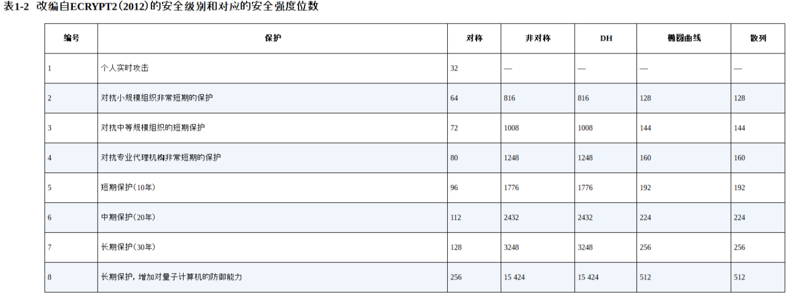
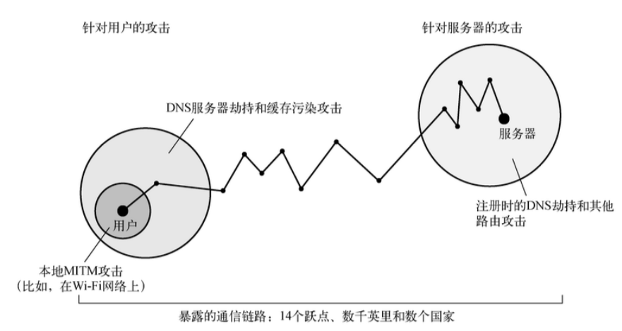

# 密码学简介

密码学是一门通信安全的科学，总的来说，密码学已经有两千多年的历史了。

部署正确的密码能够解决三个核心需求：

- 保持秘密（机密性）
- 验证身份（真实性）
- 保护传输安全（完整性）

>如果想深入学习密码学，推荐阅读《深入浅出密码学》、《图解密码技术》。

---
## 1 构建基块

在最底层，使用密码依赖于各种加密基元（cryptographic primitive），每种基元都着眼于解决某个特定的问题，比如使用某个基元加密，而使用两个基元来验证完整性，单个基元本身的作用不大，但我们可以将它们组合 **方案（scheme）** 和 **协议（protocol）**，从而提供可靠的安全性。

### 对称密码

对称密钥加密（英语：Symmetric-key algorithm）又称为对称加密、私钥加密、共享密钥加密，是密码学中的一类加密算法。这类算法在加密和解密时使用相同的密钥。

对称加密可以追溯到上千年以前，当时的密码不存在密钥，安全性取决于保守加密方法的秘密，而现在对称加密采用的方法，来自 19 世纪的一位密码学家 Auguste Kerckhoffs 的观察结果发展而来：**即使攻击者知晓了整个密码系统除密钥以外的所有情报**，系统仍然能够保证安全。原因如下：

- 如果一种加密算法要得到广泛应用，就必须让其他人知道，当越来越多的人接触到这个算法，那么敌人得到这个算法的可能性也会增加。
- 没有密钥的算法非常不便于在大群体中使用，每个人都可以解密所有人的通信。
- 设计出优秀的加密算法非常困难，一种算法想要更安全，就得经过更多的曝光和审视，当需要采用一种新算法时，密码学家推荐使用保守的方法来确定密码是否安全，那就是算法需要经过许多年的破解尝试。

如果密码算法设计非常优秀，那么只有一种方法可以破解它——穷举密钥搜索（exhaustive key search）。基于这一点，我们可以说密文的安全性完全取决于密钥，如果密钥是从非常大的空间选取的，那么破解需要遍历几乎所有这些可能的密钥，其基数巨大，几乎不可能，我们可以说这种算法在计算上时安全性的。

密码可以分为两大类：序列密码和分组密码：

### 散列函数

散列函数（hash function）就是将任意长度的输入转换为固定长度的输出的算法，其输出就哦简称为 **散列（hash）**，编程中使用的散列算法并不普遍适用于密码学，密钥学要求散列函数有以下额外的特性：

- 抗原像性：无法根据给定的散列计算或者构造出生成它的消息
- 抗第二原像性（抗弱碰撞行）：给定一个消息和散列，计算上无法找到一条不同的消息具有相同的散列
- 抗强碰撞行：计算上无法找到两条散列相同的消息

散列函数的使用场景是以紧凑的数据来比较数据量较大的数据，以此来避免直接比较原数据，散列常被称为 **指纹**，**消息摘要**，或者简称 **摘要**。

使用最为广泛的散列函数:

- sha1：已经变弱，不建议使用了。
- sha256

### 消息验证码

散列函数用于验证数据的 **完整性**，但仅在数据的散列和数据本身分开传输的时候如此，否者攻击者可以同时修改数据和数据的散列，从而避开检测。消息验证码（message authentication code, MAC）或使用 **密钥的散列(keyed-hash)**是以身份验证扩展了散列函数的密码学函数，**只有拥有散列密钥，才能生成合法的 MAC**。MAC 通常与加密一起使用，当 MAC 与 密文被一起传输的时候，就能确认消息是否被篡改了。即提供了数据的完整性。

### 分组密码模式

分组密码模式是为了加密任意长度的数据而设计的密码学方案，是对分组密码的扩展。常用的分组模式有：ECB、CBC、CFB、OFB、CTR、GCM。

- ECB：电话本模式，最简单的模式，容易被破解，不建议使用
- CBC：加密块链接欸模式。

### 非对称加密

对称加密在高速处理大量数据方便具有加好的性能，然而随着使用它的团体增加，产生了更多的需求，使得对称加密无法满足：

- 相同团体成员必须使用相同的密钥，人越多，团体密钥出现的问题的次数就越多。
- 为了安全性，可以在每两个人之间使用不同密钥，但这样的扩展性不高，想象一下，10 个人需要 45(1+2+...+9) 把公钥，1000个人需要 499500 个密钥。而且每个人要为其他 999 个人维护着公钥列表。
- 对称加密不能用于访问安全数据的无人系统，因为使用相同的密钥可以反转整个系统，这样的系统出现任何问题都会影响到存储在这个系统中所有的数据。

非对称加密（asymmetric encryption）又称公钥加密（publick-key enryption），使用两个密钥：公钥和密钥。公钥加密的数据只能被私钥解开，而私钥加密的数据也只能被公钥解开。非对称加密使得大规模团体的安全通信大幅简化。

非对称加密通用存在着问题：它非常缓慢，不适用于大量数据的场景，它往往被部署于进行身份验证和贡献秘密的协商。RAS（三位发明者的姓氏首字母）是目前最常用的非对称加密算法，现在推荐的 RSA 强度是 2048 位，强度等同于 112 位的对称密钥。

### 数字签名

数字签名（digital signatrue）是一种密码学方案，它使得验证一条电子消息和电子文档的 **真实性** 成为可能。上面描述的 MAC 就是一种电子签名。它可以利用事先安全交换的散列密钥验证真实性，虽然这种校验非常有用，但是不知之处是它依赖于一个私有密钥。

借助公钥密钥，数据签名可以与现实生活中的手写签名类似，我们可以利用公钥密钥的非对称性设计一种算法，使用私钥对数据进行签名，并使用对应的公钥验证它。

设计的方式依照选择的公钥密码体系不同而不同，以 RSA 为例，结合散列函数，实现数字签名：

- 计算希望签名的文档的散列，不论输入的文档多长，输出的散列的长度是固定的，比如 SHA256 的长度就是 256 位。
- 对结果散列和一些额外的元素据进行编码，比如接受方需要知道你使用的散列算法，否则不能处理签名。
- 使用私钥加密编码过的数据，其结果就是其签名，可以追加到文档中作为身份验证的依据。

如果验证：

- 接收方接受文档使用相同的散列算法独立计算出文档散列。
- 使用公钥对消息进行解密，将散列解码出来，再确认使用的散列算法是否正确，解密出的散列是否与本地计算的相同。

>并非所有的数字签名算法都与RSA的工作方式一致，事实上，RSA是一个特例。因为它可以同时用于加密和数字签名，其他流行的公钥密钥算法则不能用于加密，比如 DSA 和 ECDSA，它们依赖于其他方式进行签名。

对于这章的描述不是很清晰，参考维基百科：数字签名（又称公钥数字签名，英语：Digital Signature）是一种类似写在纸上的普通的物理签名，但是使用了公钥加密领域的技术实现，用于鉴别数字信息的方法。一套数字签名通常定义两种互补的运算，一个用于签名，另一个用于验证，但法条中的电子签章与数字签名，代表之意义并不相同，电子签章用以辨识及确认电子文件签署人身份、资格及电子文件真伪者。而数字签名则是以数学算法或其他方式运算对其加密，才形成电子签章，意即使用数字签名才创造出电子签章。数字签名了的文件的完整性是很容易验证的，而且数字签名具有不可抵赖性（即不可否认性），不需要笔迹专家来验证。

参考下面图示清晰地描述了签名和验证的过程：

>图片来自维基百科，需要明确的一点是，私钥加密的数据，只有加密方提供的对应公钥才能解密，这就提供了通信过程的不可否认性。

### 随机数生成

在密码学中，所有安全性都依赖于生成随机数的质量，安全性构建于已知的算法和未知的密钥之上，而密钥最简单的形式就是非常长的随机数。

随机数不易生成，因为计算机十分善于预测，它会严格按照指令执行，如果告诉它生成一个随机数，它很可能做不好这项工作。真正的随机数只能通过观测特定的物理处理器才能得到，没有的话，计算机将关注收集少量的熵（entropy），这通常意味着监视按键状态，鼠标移动，以及各种外设（比如硬盘）的交互情况。

通过这种方式收集的熵是一种 **真随机数生成器（true random number generator, TRNG）**，但是直接使用这种方式并不够，比如需要生成一个 4096 位的随机数，但是计算机只收集了几百位的熵，如果没有可靠的外部事件可以收集足够的熵，系统就可能会停止，基于这种原因，我们在实际使用中依靠 **伪随机数生成器（pseudorandom number generator, PRNG）**， PRNG 依靠少量的真随机数来运作，这个过程称为 **种子设定（seeding）**。

---
## 2 协议

本节描述了如果使用已近学习到的加密算法来构建出一个相对安全的通信机制，这其实就是简化版的 TLS。

独立的加密基于可能并不能发挥多大的作用，只有将它们组合成方案和协议，才能满足负责的安全需求。这里我们来构建一个简化的密码协议，使用通信双方可以安全地通信，我们的目标是全部三个重要的需求：**机密性、完整性、真实性**。

- 我们的协议允许传输任意长度的数据，因为对称加密算法擅长加密大量数据，这里选用 AES。
- 攻击者看不到双方的通信数据，但是可以神不知鬼不觉地修改这些数据，所以使用只有通信双方已知的散列密钥计算每个消息的 MAC，在发送消息时，同时发送 MAC，现在攻击者也不能修改消息了。
- 但是攻击者仍然可以丢弃和重放发送的任意消息，为了解决这个问题，我们扩展协议，为每条消息指定需要，最为重要的是，将序号作为 MAC 计算数据的一部分，如果序号出现空缺，就知道消息丢了，如果发现序号重复，就检测重放攻击，为了得到最佳效果，应该使用特殊消息来标记会话结束，如果没有这个设计，攻击者可以悄悄地截断会话。

到目前为止，一切都比较顺利，但是还有一个最大的缺失，通信双方如何商榷得到需要的两个密钥（一个用于加密，一个用于完整性那个校验），同时还要防御攻击者，我们通过为协议增加两个额外的步骤来解决这个问题。

1. 在会话的开始，我们使用公钥密钥对通信方法的身份进行验证，比如 A  生成了一个随机数，要求 B 对其签名以证明真的是它，B 也可以要求 A 做通用的事。
2. 使用密钥交换方案对加密密钥进行协商，比如 A 可以生成所有密钥，用 B 的公钥加密，再发送给 B，这就是 RSA 的密钥交换方式。当然也可以使用 Diffie-Hellman(DH) 密钥交换作为代替。

最后我们的协议完工时的状态是：

1. 以握手阶段开始，包括身份验证和密钥交换；
2. 接下来是数据交换，保证机密性和完整性；
3. 以关闭连接结束。

---
## 3 攻击密码

攻击密码包括：

- 如果密钥很短，攻击者可以暴力破解。
- 针对协议本身的攻击，协议的设计引入了额外的复杂性。协议本身可能存在缺陷。
- 针对协议实现（implementation）进行攻击，即利用软件的 bug。

在加密方案上切记:

- 使用完善的系统，不要自己设计。
- 使用高级库，避免直接操作加密。
- 使用完备的基元，辅以足够强壮的密钥长度。

---
## 4 衡量强度

我们使用攻破某个基元所需执行的操作数量衡量密钥系统的强度。以安全的位数来表示。最容易做到的最符合正确部署的行为就是部署足够长度的密码。而且规则很简单，大部分系统部署 128(2的128次方操作) 位就够了，如果需要长期的安全或者较大的安全宽期限，则使用 256 位。

另外需要注意的是：加密的长度会随着时间的变化而变化，计算机会越来越快，更便宜。安全性同时也是与资源相关的函数。一个段密码对于个人来说可能不可破解，但对于专业代理机构就可以达成破解目标。**当我们谈论安全性的时候，提出诸如 “针对谁的安全性”，“多次时间的安全性” 的问题会更有价值。**

---
## 5 中间人攻击

针对传输层的攻击绝大多数来自冲进人（man-in-the-middle, MITM），这意味着处理对话双方团体，还存在另一个恶意团体，如果攻击者只是监听双方的会话，我么称之为 **被动网络攻击（passive network attack）**，如果攻击者主动改变数据流量或者影响双方会话，我们则称之为 **主动网络攻击（active network attack）**。

### 取得访问权

在很多案例中，攻击者需要接近受害人或服务器，或者取得通信设备的访问权，无论是谁，只要能进入线路和中心通信节点（比如路由器），就能看到通信线路上的数据帧。并且能对它们进行干预，可以割开电缆、于运营商共谋或者直接侵入设备来获取访问权限。

理论上 MITM 攻击最简单的方式方式就是加入网络，然后将受害者的通信路由到恶意节点。现在很多人使用的无限网络并没有身份验证机制，任何人都可以加入，所以尤其容易受到这种攻击，其他攻击方式包括妨碍域名解析、IP地址路由等的路由基础设施：

- ARP（address resolution protocol）欺骗
- WPAD（web proxy auto-discovery protocal）劫持：浏览器使用`Web 带来自动发现协议`自动获取 HTTP 代理的配置。
- DNS劫持：攻击者通过注册或者改变 DNS 配置来劫持某个域名。
- DNS缓存中毒：攻击者利用 DNS 缓存服务器的缺陷在缓存中注入非法域名信息的攻击方式。
- BGP（border gateway protocol）路由劫持：边界网关协议是一种互联网骨干网络用于发现如何精确定位 IP 地址段的路由协议。如果一个非法路由被一个或多个路由所接受，那所有通往某个特定IP地址的流量都将被重定向到另一处，即攻击者那里。

### 被动攻击

- 被动攻击对于未加密的流量最为有用。
- 另外攻击者可以保存监听到的所有流量，如果攻击者在未来破解者加密算法后，就可以追溯解密记录的所有数据，TLS 中最常见的密钥交换算法就是基于 RSA 算法的，在使用这种算法的系统中，密钥交换使用的 RSA 密钥也用于解密过去所有的会话，其他密钥交换算法不存在这个问题，这称为支持 **向前密集（forward secrecy）**，不幸的是大部分系统使用的仍然是 RSA 算法。

### 主动攻击

当大家谈论 MITM 攻击时，大部分指的是主动攻击，攻击者利用主动攻击以某种方式干预通信，传统的 MITM 会攻击目标是身份验证，诱使对方以为正在和期望的另一方进行通信。

攻击者的攻击方式：

- 扮演公钥证书体系的角色，伪造看似有效的证书，历史上这个领域内的 bug 较为常见。
- 发送无效的证书碰碰运气，很多浏览器使用者会选择信任证书。

