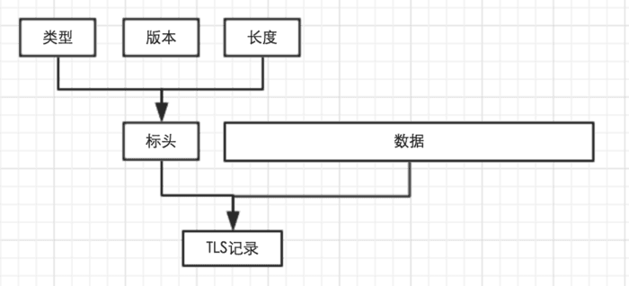
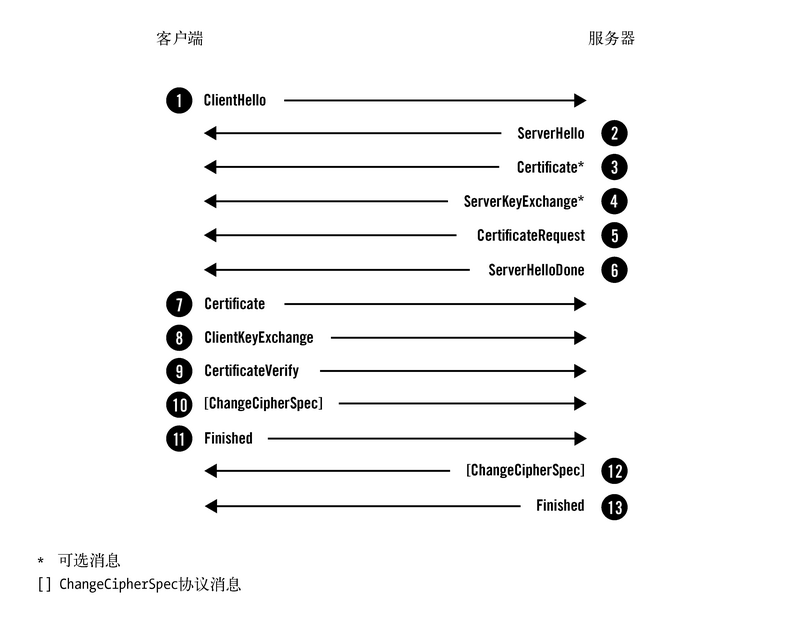
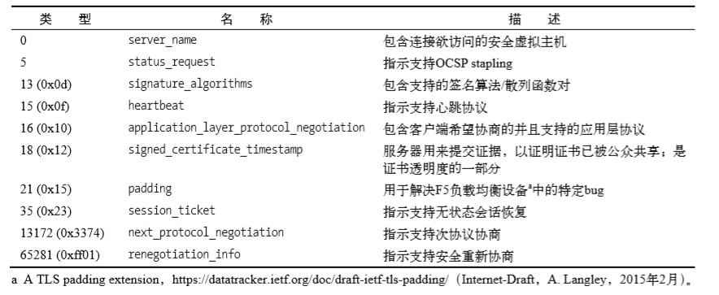

# TLS 协议

---
## 1 记录协议

宏观上，**TLS 以记录协议（record protocol）实现**，记录协议负责在整个传输连接上交换所有的底层消息，并且可以配置加密，每一条 TLS 记录以一个短标头起始，标头包括记录内容的类型（或子协议）、协议版本和长度。消息写紧跟在标头之后：



除了这些字段，还会给每一 TLS 记录指定唯一的 64 位序列号，但不会在线路上传输，任何一端都有自身的序列号并跟踪来自另一端的数量，这些值是对抗重放攻击的一部分。

记录协议从多个重要的宏观角度对公信进行考虑，是一个很有用的协议抽象：

- **消息传输**：`记录协议`传输由`其他协议层`提交给它的`不透明数据缓冲区`。如果缓冲区数据超过记录的长度限制（16384字节），记录协议会将其切割成更小的片段，反过来也是可能的，属于同一个子协议的小缓冲区也可以组合成一个单独的记录。
- **加密以及完整性验证**：在一个刚建立的连接上，最初的消息是没有受到任何保护的，这是必须的，否则第一次协商就无法完成，但是一旦握手完成，记录层就开始按照协商取得的连接参数进行加密和完整性校验。
- **压缩**：理论上，在加密前对数据机进行压缩非常好，可是实践中几乎没有人这样做。
- **扩展性**：记录协议只关注数据传输和加密，而将其他特新转交给子协议，这个方法使得 TLS 可以扩展，因为可以很方便地添加子协议。

TLS 的主规格说明书定义了四个核心子协议：握手协议（handshake protocol）、密钥规格变更协议（change cipher spec protocol）、应用数据协议（application data protocol）、警报协议（alert protocol）。

---
## 2 握手协议

握手是 TLS 协议中最精密复杂的部分。在这个过程中，通信双方协商连接参数，并且完成身份验证。根据使用的功能不同，整个过程需要交换 6-10 条消息，根据配置和支持的协议扩展的不同，交换过程可能有多种变种，在使用中经常可以观察到以下三种流程：

1. 完整的握手：对服务器身份进行验证。
2. 回复之前的会话采用的简短握手。
3. 对客户端和服务器都进行身份验证。

### 完整的握手（单向验证）

每一个 TLS 连接都会以握手开始，如果客户端此前并未与服务器建立会话，那么双方执行一次完整的握手流程来协商 TLS 会话。握手过程中，客户端和服务器进行以下四个主要步骤：

- 交换各自支持的功能，对需要的连接参数达成一致。
- 验证出示的证书，或使用其他方式进行身份验证。
- 对将用于保护的会话的共享主密钥达成一致。（协商对称加密的密钥）
- 验证握手消息并未被第三方团队修改。

>在实际使用中，第 2 步和第 3 步都是密钥交换（更通用的说法是密钥生成）的一部分， 密钥交换是一个单独的步骤。作者更倾向于将它们分开来说，用以强调 **协议的安全性取决于正确的身份验证**。身份验证有效地在 TLS 的外层工作。如果没有身份验证，主动攻 击者就可以将自身嵌入会话，并冒充会话的另一端。 

常见的TLS握手流程，就是一种在不需要身份验证的客户端与需要身份验证的 服务器之间的握手，如下图所示：



对服务器进行身份验证的完整握手，10 个步骤描述如下：

1. 客户端开始新的握手，并将自身支持的功能提交给服务器。
2. 服务器选择连接参数。
3. 服务器发送其证书链（仅当需要服务器身份验证时）。
4. 根据选择的密钥交换方式，服务器发送生成主密钥的额外信息。
5. 服务器通知自己完成了协商过程。
6. 客户端发送生成主密钥所需要的额外信息。
7. 客户端切换加密方式并通知服务器。
8. 客户端计算发送和接受到的握手消息的 MAC 并发送。
9. 服务器切换到加密方式并通知客户端。
10. 服务器计算发送和接受到的握手消息的 MAC 并发送。

假设没有错误，到最后一步，练级就建立起来了，可以开始发送应用数据了。具体握手细节如下：

#### (1) ClientHello 

- 在一次新的握手流程中，ClientHello消息总是第一条消息。这条消息将客户端的功能和首选项传送给服务器。
- 客户端会在新建连接后，希望重新协商或者响应服务器发起的重新协商请求 （由HelloRequest消息指示）时，发送这条消息。 

一条被简化的 ClientHello 消息内容如下：

```
Handshake protocol: ClientHello     
    Version: TLS 1.2     
    Random         
        Client time: May 22, 2030 02:43:46 GMT         
        Random bytes: b76b0e61829557eb4c611adfd2d36eb232dc1332fe29802e321ee871     
        Session ID: (empty)     
        Cipher Suites         
            Suite: TLS_ECDHE_RSA_WITH_AES_128_GCM_SHA256         
            Suite: TLS_DHE_RSA_WITH_AES_128_GCM_SHA256         
            Suite: TLS_RSA_WITH_AES_128_GCM_SHA256         
            Suite: TLS_ECDHE_RSA_WITH_AES_128_CBC_SHA         
            Suite: TLS_DHE_RSA_WITH_AES_128_CBC_SHA         
            Suite: TLS_RSA_WITH_AES_128_CBC_SHA         
            Suite: TLS_RSA_WITH_3DES_EDE_CBC_SHA         
            Suite: TLS_RSA_WITH_RC4_128_SHA     
        Compression methods         
        Method: null     
        Extensions         
            Extension: server_name             
                Hostname: www.feistyduck.com         
            Extension: renegotiation_info         
            Extension: elliptic_curves             
                Named curve: secp256r1             
                Named curve: secp384r1         
            Extension: signature_algorithms             
                Algorithm: sha1/rsa             
                Algorithm: sha256/rsa             
                Algorithm: sha1/ecdsa             
                Algorithm: sha256/ecdsa 
```

字段描述：

- Version：协议版本（protocol version）指示客户端支持的佳协议版本。
- Random：随机数（random）字段包含32字节的数据（只有28字节是随机生成的；剩余的4字 节包含额外的信息，受客户端时钟的影响）。在握手时，`客户端和服务器都会提供随机数`。这种随机性对每次握手都是独一无二的，在身份验证中起着举足轻重的作用。它可以防止重放攻击，并确认初始数据交换的完整性。同时随机数也是生成后续摘要密钥和加密密钥的重要参数。 
- Session ID ：在第一次连接时，会话ID（session ID）字段是空的，这表示客户端并不希望恢复某个已 存在的会话。在后续的连接中，这个字段可以保存会话的唯一标识。服务器可以借助会 话ID在自己的缓存中找到对应的会话状态。
- Cipher Suites ：密码套件（cipher suite）块是由客户端支持的所有密码套件组成的列表，该列表是按优先 级顺序排列的。
- Compression ：客户端可以提交一个或多个支持压缩的方法。默认的压缩方法是null，代表没有压缩。 
- Extensions 扩展（extension）块由任意数量的扩展组成。这些扩展会携带额外数据。

#### (2) ServerHello 

ServerHello 消息的意义是将服务器选择的连接参数传送回客户端。这个消息的结构与 ClientHello 类似，只是每个字段只包含一个选项。服务器无需支持客户端支持的佳版本。如果服务器不支持与客户端相同的版本，可以提供 某个其他版本以期待客户端能够接受。 

```
Handshake protocol: ServerHello     
    Version: TLS 1.2     
    Random         
        Server time: Mar 10, 2059 02:35:57 GMT         
        Random bytes: 8469b09b480c1978182ce1b59290487609f41132312ca22aacaf5012     
    Session ID: 4cae75c91cf5adf55f93c9fb5dd36d19903b1182029af3d527b7a42ef1c32c80     
    Cipher Suite: TLS_ECDHE_RSA_WITH_AES_128_GCM_SHA256     
    Compression method: null     
    Extensions
        Extension: server_name         
        Extension: renegotiation_info
```

#### (3) Certificate 

典型的Certificate消息用于携带服务器X.509证书链。证书链是以ASN.1 DER编码的一系列 证书，一个接着一个组合而成。主证书必须第一个发送，中间证书按照正确的顺序跟在主证书之后。服务器必须保证它发送的证书与选择的算法套件一致。

>Certificate消息是可选的，因为并非所有套件都使用身份验证，也并非所有身份验证方法都需要证书。更进一步说，虽然消息默认使用 X.509 证书，但是也可以携带其他形式的标志；一些套件就依赖PGP密钥。 

#### (4) ServerKeyExchange

ServerKeyExchange消息的目的是携带密钥交换的额外数据。消息内容对于不同的协商算法套 件都会存在差异。在某些场景中，服务器不需要发送任何内容，这意味着在这些场景中根本不会 发送 ServerKeyExchange 消息。

#### (5) ServerHelloDone 

ServerHelloDone 消息表明服务器已经将所有预计的握手消息发送完毕。在此之后，服务器会等待客户端发送消息。

#### (6) ClientKeyExchange 

ClientKeyExchange 消息携带客户端为密钥交换提供的所有信息。这个消息受协商的密码套件的影响，内容随着不同的协商密码套件而不同。 

#### (7) ChangeCipherSpec 

ChangeCipherSpec消息表明发送端已取得用以生成连接参数的足够信息，已生成加密密钥， 并且将切换到加密模式。客户端和服务器在条件成熟时都会发送这个消息。 

#### (8) Finished 

Finished 消息意味着握手已经完成。消息内容将加密，以便双方可以安全地交换验证整个握 手完整性所需的数据。


### 客户端验证（双向验证）

只有已经经过身份验证的服务器才能请求客户端进行身份验证。基于这个原因，这个选项被称为互相身份验证（mutual authentication）。

图示过程如下：


### 会话回复

会话回复可以重新恢复之前建立的 TLS 连接，这个机制减少了 TLS 握手过程的通信次数。

---
## 3 密钥交换

密钥交换是握手过程中最引人入胜的地方，在 TLS 中，会话安全性取决于称为 **主密钥（master secret）** 的 48 字节共享密钥。密钥交换的目的就是计算另一个值，即预主密钥（premaster secret）。这个值是组成主密钥的来源。

密钥交换算法：

- RSA 密钥交换
- Diffie-Hellman 密钥交换
- 椭圆曲线 Diffie-Hellman 密钥交换

>原书关于密钥交换算法有非常完整的描述，如果需要进一步了解可以参阅原书。

---
## 4 身份验证

在 TLS 中，为了避免重复执行密码操作造成的巨大开销，身份验证与密钥交换紧紧捆绑在一起。大多数场景下，身份验证的基础是证书支持的公钥密码（最常见的是 RSA，又是也用 ECDSA）。

一旦证书验证通过，客户端就知道使用的公钥，在此之后，客户端将公钥交给指定的密钥交换算法，并由它负责以某种方式使用公钥验证另一端。

在 RSA 密钥交换过程中：

- 客户端生成一个随机值作为预主密钥，并服务器公钥加密后发送出去。
- 用于对于私钥的服务器解密消息得到预主密钥。
- 身份验证的原理就是：只有用于对于私钥的服务器才能取得预主密钥，构造出正确的会话密钥，并生成正确的 Finished 消息。

---
## 5 加密

TLS 可以使用各种加密算法，比如使用 3DES、AES、ARIA、CAMELLIA、RC4 或者 SEED 等算法，目前使用最为广泛的加密算法是 AES，TLS 支持三种加密类型：**序列密码、分组密码、已验证的密码**。在 TLS 中，完整性验证是加密处理的一部分，它要么在协议级中显式的处理，要么由协商的密钥隐式处理。

>原书三种加密类型加密算法有非常完整的描述，如果需要进一步了解可以参阅原书。

## 6 重新协商

大部分 TLS 连接都以握手为起点，经过应用数据传输，最后关闭会话，但是如果请求重新协商，就会发起一次新的握手，对新的连接安全参数达成一致，这个功能在以下场景会很有用：

- 客户端证书
- 隐藏消息：第二次握手时加密的。
- 改变加密长度

协议允许客户端在任意时刻简单地发送 ClientHello 消息请求重新协商，就如同建立一个新的连接一样，这称为 **客户端的重新连接（client-initiated renegotiation）**。服务器如果希望重新协商，它会发送 HelloRequest 协议消息给客户端，这个消息通知客户端停止发送应用数据，并开始新的握手，这称为 **服务器的重新连接（server-initiated renegotiation）**。

TLS RFC5246 允许客户端或服务器启动重新协商，建立新的加密参数的新握手。但正如设计的那样，重新协商并不安全，并且可被主动网络攻击者以很多方式滥用，它的弱点于 2009 年被发现，然后通过引进 renegotiatioin_info 扩展得以修正。

---
## 7 应用数据协议

应用数据协议携带者应用消息，只以 TLS 角度考虑的话，这些就是数据缓冲区。记录层使用当前连接安全参数对这些消息进行打包、碎片整理和加密。

---
## 8 警报协议

警报协议的目的是以简单的通知机制来告知对端通信发生异常，它通常会携带 close_notify  异常，在连接关闭时使用，报告错误，警报协议很简单，只有两个字段：

```c
struct{
    AlertLevel level; //严重程度
    AlertDescription description;//警报代码
}
```

## 9 关闭连接

关闭连接警报（closure alert）用于以有序的方式关闭 TLS 连接，一旦一端决定关闭连接，就会发送一个 close_notify 警报，另一端收到这个警报后，会丢弃任何未发送的数据，比发送自己的 close_notify 警报，在警报之后到来的任何消息都会被忽略。这个协议虽然简单，但是它可以避免截断攻击，也就是主动攻击者打断通信过程，组端后续所有消息的攻击，因为是必须的。

---
## 10 密码操作

下面是协议中一些重要的方面：伪随机函数、构建主密钥和生成连接密钥。

- 伪随机函数：在 TLS 中，伪随机函数用于生成任意数量的伪随机数。
- 主密钥：密钥交换过程生成的是预主密钥，对这个值的进一步加工，就是使用 PRF 生成的 48 字节主密钥。`master_secret = PRF(pre_master_secret, "master secret", ClientHello.random + ServerHello.random)`。因为使用不同的密钥交换方法，得到的预主密钥长度可能不同，所以需要执行这个步骤。同时，因为客户端和服务器的随机字段被用作种子，所以主密钥实际上也是随机的①，且与协商握 手绑定
- 密钥生成：连接所需的密钥材料是用单一的 PRF 调用基于主密钥和客户端、服务器的随机数生成的：`key_block = PRF(master_sercet, "key expansion",server_random + client_random)`。密钥块的长度根据协商的参数而有所不同。密钥块分为六个密钥：`两个MAC密钥、两个加密密钥和两个初始向量（只在必要时生成；序列密码不会使用IV）`。AEAD 套件不使用 MAC 密钥。 不同的密钥用于不同的操作，这样可以预防当共享相同密钥时，密钥学基元之间出现不可预见的 交互。同样，因为客户端和服务器都拥有各自的一组密钥，由其中一方产生的消息不会被解释成 是由另一方产生的。这个设计决策使协议更加可靠。

---
## 11 密码套件

TLS 为了实现所需的安全特性提供了非常大的灵活性，它是一个创造实际密码协议的框架，虽然以往版本将某些机密基元硬编码到协议中，但是 TLS1.2 是完全可配置的，密钥套件是 **一组选定的加密基元和其他参数，它可以精确定义如何实现安全**。套件大致由以下属性定义：

- 身份验证方法
- 密钥交换方法
- 加密算法
- 加密密钥大小
- 密码模式
- MAC 算法
- PRF（TLS 1.2 一定使用）
- 用于 Finished 消息的散列函数
- verify_data 结构的长度

密钥套件都倾向于使用较长的描述性名称，并且相当一致：它们都由密钥交换方法、身份验 证方法、密码定义以及可选的MAC或PRF算法组合而成，参考下图


---
## 12 扩展

TLS 扩展是一种通用目的的扩展机制，使用这种机制可以在不修改协议本身的条件下为 TLS 协议增加功能，它在 2003 年作为一个单独的规格说明（RFC 3456）首次出现，但随后即被加入到 TLS 1.2 中。扩展以扩展块的形式加在 ClientHello 和 ServerHello 消息的末尾：`Extension extensions`。

扩展块由所需数量的扩展一个个堆叠而成。每一个扩展标头是2字节扩展类型（唯一标志）， 后接扩展数据：

```c
struct {     
    ExtensionType extension_type;     
    opaque extension_data; 
} Extension; 
```

常见的 TLS 扩展有:



---
## 13 协议限制

因为TLS在OSI层次中的定位和某些设计安排，除了那些偶然的弱点之外，当前它仍有几处众所周知的限制。

- 加密保护 TCP 连接的内容，但 **TCP 和所有其他更低层的协议的元数据仍然是明文传输** 。因 此，被动观察者可以确定源和目标的IP地址。这类信息的泄露不是TLS的责任，而是我们 当前的分层网络模型导致的限制。 
-  即使在TLS层，也有 **很多信息以明文形式暴露出去** 。第一次握手一定是非加密的，可以`让被动观察者`（这些问题有方法可以避免，但是这些方法都没有被主流实现 所采用。 ）：
    - 了解客户端的功能，并使用其作为指纹；
    - 检查SNI信息确定期望访 问的虚拟主机；
    - 检查主机证书，以及何时会使用客户端证书；
    - 存在得到足够信息 以识别用户身份的可能性。
- 当启动加密以后，**某些协议信息仍能被清楚地探查到**：观察者可以了解到子协议和每条消息的长度。根据不同的协议，这些长度可以揭示某些底层通信的线索。

---
## 14 各协议版本之间的差异

自从SSL 3以来，协议核心并没有大幅改 变。TLS 1.0为了迎合使用另一个名称进行了有限的改变，发布TLS 1.1的首要目标是为了解决几 个安全性问题。TLS 1.2引入了已验证加密，清理了散列，另外去掉了协议中的硬编码基元。 

- **SSL 3** ：SSL 3于1995年年末发布。为了弥补先前协议版本的诸多弱点，SSL 3从头开始设计了一套协 议，并一直沿用到了新版本的TLS。
- **TLS 1.0** ：TLS 1.0 于 1999年 1 月发布。
- **TLS 1.1** ：TLS 1.1 于 2006 年 4 月发布。
- **TLS 1.2** ：TLS 1.2于2008年8月发布。与TLS 1.1相比，它包含以下主要改进：
    - 添加已验证加密支持。 
    - 添加对HMAC-SHA256密码套件的支持。 
    - 删除IDEA和DES密码套件。 
    - 虽然大部分扩展的实际文档还是在其他地方，但TLS将扩展和协议的主规格说明书进行了 集成。
    - 客户端可以使用一种新的扩展（signature_algorithms）来通报它愿意接受的散列和签名 算法。
    - 当使用TLS 1.2套件或者以协商协议是TLS 1.2为条件使用之前的套件时，在PRF中使用 SHA256代替MD5/SHA1组合。 
    - 允许密码套件定义其自身的PRF。 
    - 使用单一散列代替用于数字签名的MD5/SHA1组合。默认使用SHA256，并且密码套件可 以指定其自身使用的散列。签名散列算法以往是由协议强制指定，现在是散列函数式签 名结构中的一部分，而且在实施启用中可以选择佳算法。 
    -  密码套件可以显式指定Finished消息中的verify_data成员的长度。 