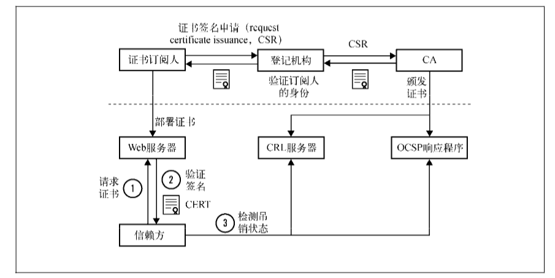
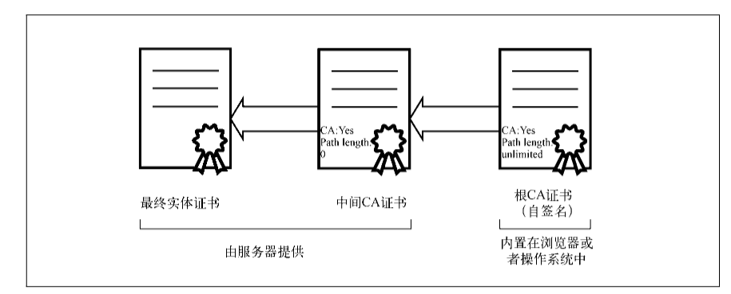

# 公钥基础设施

有了公开密钥算法之后，我们就可以通过他人的公开密钥与其安全通信，但是还有非常重要的问题：如何与那些从未谋面的人进行沟通？如何存储和吊销密钥？最重要的是，如何让现实世界中数以百万计的服务器、几十亿人和设备之间安全通信？这个问题非常的复杂，而 **公钥基础设施（public key infrastructure，PKI）** 就是为解决此问题而建立的。

---
## 1 互联网公钥基础设施

>对大多数人来说，PKI就是互联网公钥基础设施。实际上PKI的含义更宽泛，因为其原本是为了别的用途而开发的。因此更准确的说法是，由 PKIX 工作组为适应PKI 在互联网上的使用而提出的互联网公钥基础设施（Internet PKI）；另外一个最近常被用到的词是 WebPKI，主要关注在浏览器上如何使用和验证证书。

公开密钥基础建设（英语：Public Key Infrastructure，缩写：PKI），又称 **公开密钥基础架构**、**公钥基础建设**、**公钥基础设施**、**公开密码匙基础建设**或**公钥基础架构**，是一组由`硬件、软件、参与者、管理政策与流程`组成的基础架构，其目的在于创造、管理、分配、使用、存储以及撤销数字证书。——维基百科

PKI 的目标就是实现不同成员在不见面的情况下进行安全通信，当前采用的模型是基于 **可信的第三方机构**，也就是证书颁发机构（certification authority 或 certificate authority，CA）签发的证书。

互联网 PKI 证书生命周期如下图：

性格角色说明：

- **订阅人**：订阅人（或者说最终实体）是指那些需要证书来提供安全服务的团体。
- **登记机构**：登记机构（registration authority，RA）主要是完成一些证书签发的相关管理工作。例如，RA会首先对用户进行必要的身份验证，然后才会去找CA签发证书。
- **证书颁发机构**：证书颁发机构（certification  authority，CA）是指我们都信任的证书颁发机构，它会在确认申请用户的身份之后签发证书。同时CA会在线提供其所签发证书的最新吊销信息，这样信赖方就可以验证证书是否仍然有效。
- **信赖方**：信赖方（relying  party）是指那些证书使用者。技术上来说，一般是指那些执行证书验证的`网页浏览器、其他程序以及操作系统`。他们是通过维护根可信证书库来执行验证的，这些证书库包含某些 CA 的最终可信证书（信任密钥，trust anchor）。更广泛地说，信赖方是指那些需要通过证书在互联网上进行安全通信的最终用户。

---
## 2 标准

### X.509标准

互联网公钥基础设施可以追溯到 X.509，它是一种公钥基础设施的国际标准，最初是为了支持 X.500 而设计的。X.500 是电子目录服务的标准，但是从来没有被广泛使用过；X.509 经 PKIX 工作组的改造，适合在互联网上使用，PKIX 工作组产出的最重要的文档是RFC 5280，它描述了证书格式、可信证书链的建立，以及证书吊销列表（CRL）的格式。PKIX工作组在2013年10月结束了自己的使命。

`X.509` 是密码学里公钥证书的格式标准。 X.509 证书己应用在包括 TLS/SSL（WWW万维网安全浏览的基石）在内的众多 Intenet协议里，同时它也用在很多非在线应用场景里，比如电子签名服务。X.509 证书里含有公钥、身份信息(比如网络主机名，组织的名称或个体名称等)和签名信息（可以是证书签发机构CA的签名，也可以是自签名）。对于一份经由可信的证书签发机构签名或者可以通过其它方式验证的证书，证书的拥有者就可以用证书及相应的私钥来创建安全的通信，对文档进行数字签名。——[维基百科](https://zh.wikipedia.org/wiki/X.509)

>互联网上最普遍的一点就是 **现实和标准从来都是大相径庭的**，PKIX 就如此。一部分是因为标准经常含糊不清而且满足不了现实的需求，另外想要预测未来技术的演变几乎不可能，所以每个人都有自己的实现方式。另外，主流的产品和代码库中经常会存在一些bug，极大地限制了很多技术在实际中的应用。

### PKCS 标准

公钥加密标准（Public Key Cryptography Standards, PKCS），此一标准的设计与发布皆由 RSA 信息安全公司所制定。公钥加密标准（Public Key Cryptography Standards, PKCS），此一标准的设计与发布皆由RSA信息安全公司所制定。——[维基百科](https://zh.wikipedia.org/wiki/%E5%85%AC%E9%92%A5%E5%AF%86%E7%A0%81%E5%AD%A6%E6%A0%87%E5%87%86)

---
## 3 证书

证书是一个包含公钥、订阅人相关信息以及证书颁发者数字签名的数字文件，也就是一个让我们可以交换、存储和使用公钥的壳。因此，证书成为了整个PKI体系的基础组成元素。

证书由一些字段组成：

- 版本：证书一共有3个版本号，分别用0、1、2编码表示版本1、版本2和版本3。版本1只支持简单的字段，版本2增加了两个标识符（新增的字段），而版本3则增加了扩展功能。现在大部分的证书都采用版本3的格式。
- 序列号
- 签名算法：这个字段指明证书签名所用的算法，需要放到证书里面，这样才能被证书签名保护。
- 颁发者：颁发者（issuer）字段包括了证书颁发者的可分辨名称（distinguished  name，DN），这个字段比较复杂，根据不同的实体会包含许多部分。比如Verisign 根证书的可分辨名称是 `/C=US/O=VeriSign, Inc./OU=Class 3 Public Primary Certification Authority`；它包括了国家、组织和组织单位三个部分。
- 有效期：证书的有效期包括开始日期和结束日期，在这段时间内证书是有效的。
- 使用者：使用者是实体的可分辨名称，和公钥一起用于证书的签发。在自签名证书里，使用者（subject）和颁发者（issuer）字段的可分辨名称是一样的。在最开始，可分辨名称里面的公用名（common  name，CN）主要用于服务器主机名（例如/CN=www.example.com用于www.example.com域名的证书），但是如何为一个证书匹配多个主机名就变得比较麻烦了。如今，使用者字段已经废弃，转而使用使用者可选名称扩展。
- 公钥：这个字段包含了公钥，以使用者公钥信息（subject  public-key  info）结构呈现。公钥算法在RFC 3279里面有具体说明。

**证书扩展**：为了让原本死板的证书格式变得更加灵活，版本3 引入了证书扩展。每一个扩展都包括唯一的对象标识符（object  identifier，OID）、关键扩展标识器以及ASN.1格式的值。如果将某个扩展设置为关键扩展，那么客户端必须能够解析和处理这个扩展，否则就应该拒绝整张证书。扩展字段比较多：

- 使用者可选名称：原本使用者证书字段（更准确地说是其中的通用名部分）是用来将身份信息和公钥绑定在一起的。而在实际使用的时候发现使用者字段不够灵活，只能支持与一个主机名进行绑定，无法同时处理多个身份信息。使用者可选名称扩展就是为了替换使用者字段，它支持通过DNS名称、IP地址和URI来将多个身份绑定在一起。（即一个证书可以支持多个域名）
- 名称约束：名称约束扩展可以限制CA签发证书的对象，这样命名空间就在可控范围内。
- 基础约束：基础约束扩展用来表明证书是否为CA证书，同时通过路径长度（path length）约束字段，来限制二级CA证书路径的深度（例如限制CA证书是否可以签发更深一层的CA证书以及能签发多少层）。
- 密钥用法：该扩展定义了证书中密钥可以使用的场景，这些场景已经定义好了，可以通过设置来让证书支持某个场景。
- 扩展密钥用法：为了更加灵活地支持和限制公钥的使用场景。
- 证书策略
- CRL分发点：该扩展用来确定证书吊销列表（certificate  revocation  list，CRL）的LDAP或者HTTP  URI地址。
- 颁发机构信息：访问颁发机构信息访问扩展表明如何访问签发 CA 提供的额外信息和服务，其中之一就是 OCSP 响应程序的 HTTP URI 地址。
- 使用者密钥标识符：该扩展包含了唯一的值，可以用来识别包含特别公钥的证书，一般建议使用公钥本身来建立这个标识符（例如通过散列）。所有的CA证书都必须包含这个扩展，并且它的值要与CA所签发出来的证书上的授权密钥标识符的值一样。
- 授权密钥标识符：这个扩展的内容是签发此证书的CA的唯一标识符，通常用于在构建证书链时找到颁发者的证书。

---
## 4 证书链

在大多数情况下，仅仅有最终实体证书是无法进行有效性验证的，所以在实践中，服务器需要提供证书链才能一步步地最终验证到可信根证书。证书链的使用可能出于安全、技术和管理等方面的原因。

关于根证书，有以下几点需要注意：

- 保护根证书安全：根证书必须离线保存，直接由根证书签发最终实体证书是不允许的。
- 交叉证书：交叉证书是可以让新的CA立即投入运营的唯一方式。因为想要在短期内让新的根证书部署得足够广泛是不可能的，所以新的CA都会找已经进行广泛内置的CA对他们的根密钥进行签名。随着时间的流逝，那些老的设备会逐渐淘汰掉，新的CA才能最终独立使用。

---
## 5 信赖方

信赖方为了能够验证证书，必须收集信任的所有根 CA 证书。大多数的操作系统都提供一个根证书库，从而在一开始启动的时候就能够建立信任。几乎所有的软件开发者都重用了底层操作系统提供的根证书库，唯一的例外是 Mozilla，为了保证不同平台的兼容性，它维护了自己的根证书库。

>浏览器验证网站数字证书的流程简述：CA 下发给网站的证书都是一个证书链，从根证书开始，到下级CA，最后一层就是网站证书。当浏览器收到服务器发送的证书后，需要验证其真实性才能使用其公钥。而证书的签名是通过签名算法和上级 CA 的私钥生成的，浏览器需要用上级 CA 的公钥才能解密签名，并与生成的指纹对比。这个公钥就明文保存在证书链中的上层证书中。具体可以参考 [浏览器如何验证HTTPS证书的合法性？](https://www.zhihu.com/question/37370216)

所有的根证书库都要求 CA 通过专门为证书颁发机构设计的独立审计。要签发 D V和 OV 证书，必须通过下面至少一项审计。

- 针对证书颁发机构的 WebTrust 审计：
- ETSI TS 101 456 
- ETSI TS 102 042 
- ISO 21188:2006 
  
要想签发 EV 证书，还必须通过由 WebTrust 运营的 EV 证书审计程序。

---
## 6 证书颁发机构：CA

开放网络上的电子商务要求为信息安全提供有效的、可靠的保护机制。这些机制必须提供`机密性`、`身份验证特性`(使交易的每一方都可以确认其它各方的身份)、`不可否认性`(交易的各方不可否认它们的参与)。这就需要依靠一个可靠的第三方机构验证，而认证中心（CA：Certification Authority）专门提供这种服务。

CA 功能组成：

1.  证书的颁发：接收、验证用户(包括下级认证中心和最终用户)的数字证书的申请。可以受理或拒绝。
2.  证书的更新：认证中心可以定期更新所有用户的证书，或者根据用户的请求来更新用户的证书。
3.  证书的查询：查询当前用户证书申请处理过程；查询用户证书的颁发信息，这类查询由目录服务器ldap来完成。
4.  证书的作废：由于用户私钥泄密等原因，需要向认证中心提出证书作废的请求；证书已经过了有效期，认证中心自动将该证书作废。认证中心通过维护证书作废列表 (Certificate Revocation List,CRL) 来完成上述功能。
5.  证书的归档：证书具有一定的有效期，证书过了有效期之后就将作废，但是我们不能将作废的证书简单地丢弃，因为有时我们可能需要验证以前的某个交易过程中产生的数字签名，这时我们就需要查询作废的证书。

---
## 7 证书生命周期

证书的生命周期在订阅人准备证书签名申请（certificate  signing  request，CSR）文件，并将它提交给所选CA的时候就开始了。

CSR文件的主要目的是携带公钥信息，并且证明订阅人拥有对应的私钥（通过签名来证明）。CSR还设计携带额外的元数据，但实际中并非所有的都用到了。CA一般都会覆盖CSR文件的一些内容并且将其他信息内置到证书里面。

CA会根据不同类型的证书申请，执行不同的验证流程：

- 域名验证（domain validated，DV）证书需要CA验证订阅人对域名的所有权之后才能进行签发。
- 组织验证（organization  validated，OV）证书会对身份和真实性进行验证。
- 扩展验证（extended  validation，EV）证书以更加严格的要求验证身份和真实性。它是为了解决OV证书缺乏的前后一致性而引入的，所以EV证书的验证流程非常详细，几乎不会出现前后不一致的情况。

DV证书的签发是全自动的，所以非常快，它的签发时间主要取决于DNS管理员确认邮件所需的时间；而EV证书则相反，可能需要几天甚至几周才能拿到。

---
## 8 证书吊销

当出现 `私钥泄露` 或者 `不再需要使用` 的时候，我们就需要吊销证书。但是这里存在误用的风险。吊销协议和流程的设计是为了确保证书是有效的，否则就需要将吊销情况通知信赖方。现在有下面两种证书吊销标准。

- 证书吊销列表（certificate revocation list，CRL）是一组未过期、但是却已经被吊销的证书序列号列表，CA维护了一个或多个这样的列表。每一张证书都需要在CRL分发点（CRL distribution point）扩展中包含对应的CRL地址。CRL最大的问题在于它越来越大，实时查询起来会非常慢。
- 在线证书状态协议（online certificate status protocol，OCSP）允许信赖方获得一张证书的吊销信息。OCSP服务器通常称为OCSP响应程序，OCSP响应程序的地址编码在颁发机构信息访问（authority information access，AIA）证书扩展中。OCSP支持实时查询并且解决了CRL最大的缺点，但是并没有解决所有的吊销问题：因为OCSP的使用带来了性能、隐私方面的问题和新的漏洞。其中一部分问题可以通过OCSP stapling技术来解决，它允许服务器在TLS握手的过程中直接嵌入OCSP响应。

---
## 引用

- [维基百科：PKI](https://zh.wikipedia.org/wiki/%E5%85%AC%E9%96%8B%E9%87%91%E9%91%B0%E5%9F%BA%E7%A4%8E%E5%BB%BA%E8%A8%AD)
- [维基百科：CA](https://zh.wikipedia.org/wiki/%E8%AF%81%E4%B9%A6%E9%A2%81%E5%8F%91%E6%9C%BA%E6%9E%84)
- [维基百科：X.509](https://zh.wikipedia.org/wiki/X.509)
- [维基百科：TLS](http://zh.wikipedia.org/wiki/%E4%BC%A0%E8%BE%93%E5%B1%82%E5%AE%89%E5%85%A8%E5%8D%8F%E8%AE%AE)  
- [维基百科：PKCS](https://zh.wikipedia.org/wiki/%E5%85%AC%E9%92%A5%E5%AF%86%E7%A0%81%E5%AD%A6%E6%A0%87%E5%87%86)  
- [PKI/CA 技术的介绍](http://netsecurity.51cto.com/art/200602/21066.htm)
- [OpenSSL命令、PKI、CA、SSL证书原理](http://www.cnblogs.com/LittleHann/p/3738141.html)
- [数字证书及CA的扫盲介绍](https://program-think.blogspot.com/2010/02/introduce-digital-certificate-and-ca.html)
- [SSL/TLS原理详解](https://segmentfault.com/a/1190000002554673)
- [SSL/TLS协议运行机制的概述](http://www.ruanyifeng.com/blog/2014/02/ssl_tls.html)
- [SSL 的保密性、真实性、完整性和不可否认性具体怎么体现？](https://segmentfault.com/q/1010000000192807)
- [Sun Java System Application Server Enterprise Edition 8.2 管理指南——第九章：配置安全性](https://docs.oracle.com/cd/E19900-01/820-0847/ablnk/index.html)