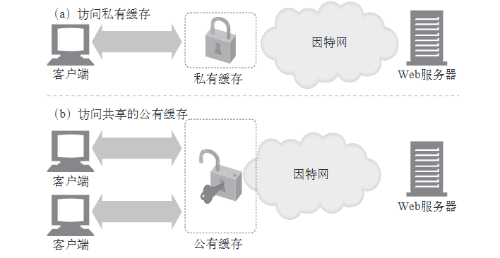
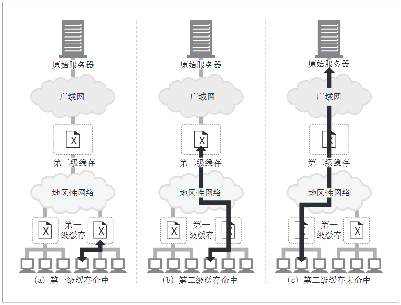
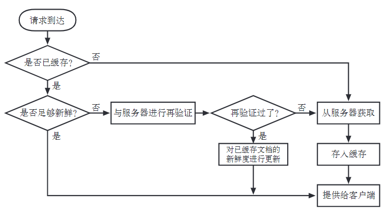
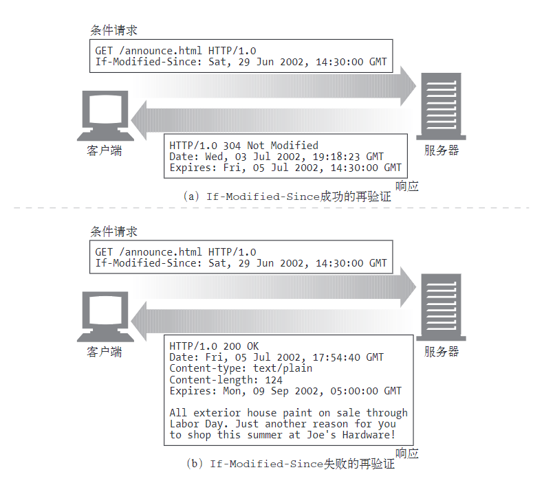
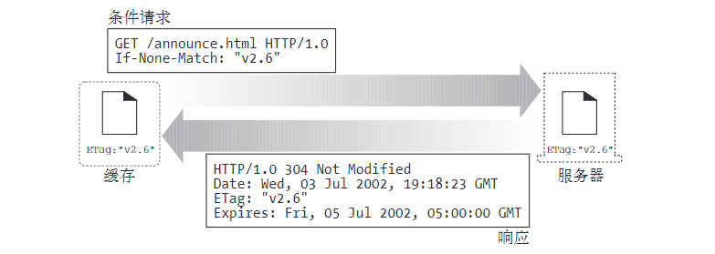

#  HTTP 缓存

Web 缓存是可以自动保存常见文档副本的 HTTP 设备。包括 `HTTP 客户端本地缓存`和`缓存服务器`，使用缓存有下列优点。

- 缓存减少了冗余的数据传输，节省了你的网络费用。
- 缓存缓解了网络瓶颈的问题。不需要更多的带宽就能够更快地加载页面。
- 缓存降低了对原始服务器的要求。服务器可以更快地响应，避免过载的出现。
- 缓存降低了距离时延，因为从较远的地方加载页面会更慢一些。

这里讨论的缓存并不局限于浏览器本地缓存，浏览器本地缓存只是整个缓存架构中很小的一部分，缓存架构更侧重于缓存服务器。下面用词中缓存可能存在两种含义，一种是被缓存的HTTP响应，另一种是缓存处理者（缓存服务器）。

## 1 基本概念

###  1.1 冗余的数据传输

HTTP 请求是多个客户端向单个服务器的请求，很多客户端访问一个原始服务器页面时，服务器会多次传输同一份文档，每次传送给一个客户端。一些相同的字节会在网络中一遍遍地传输。这些冗余的数据传输会耗尽昂贵的网络带宽，降低传输速度，加重 Web 服务器的负载。

缓存可以保留第一条服务器响应的副本，后继请求就可以由缓存的副本来应对了，这样可以减少那些**流入/流出**原始服务器的、被浪费掉了的重复流量。

### 1.2 带宽瓶颈

缓存可以缓解网络的瓶颈问题。比如很多网络为本地网络客户端提供的带宽比为远程服务器提供的带宽要宽，而**客户端会以路径上最慢的网速访问服务器**。

- 1.4Mbit/s的因特网连接，下载一个5MB的库存文件要花30秒的时间。
- 54kbit/s的Modem传输一个5MB的文件需要749秒（超过12分钟）。

>MB/s和Mb/s是有区别的。其中大B代表Byte(字节)，小b代表bit(比特 或 位)。这里是比特

如果客户端从一个快速局域网的缓存中得到了一份副本，那么缓存就可以提高性能——尤其是要传输比较大的文件时。缓存可以改善由有限广域带宽造成的网络瓶颈。

### 1.3 瞬间拥塞

突发的新闻、重大事件等，使很多人几乎同时去访问一个Web文档时，就会出现瞬间拥塞。由此造成的过多流量峰值可能会使网络和Web服务器产生灾难性的崩溃。间拥塞会使Web服务器过载。缓存在破坏瞬间拥塞（Flash  Crowds）时显得非常重要。

### 1.4 距离时延

即使网络没有时延，距离也可能成为问题。每台网络路由器都会增加因特网流量的时延。即使客户端和服务器之间没有太多的路由器，光速（信息以比光速稍低的速度进行传输）自身也会造成显著的时延。

### 1.5 缓存命中与未命中

- 缓存命中（cache hit）：可以用已有的副本为某些到达缓存的请求提供服务。
- 缓存未命中（cache miss）：一些到达缓存（服务器）的请求可能会由于没有副本可用，而被转发给原始服务器。

#### 缓存再验证

原始服务器的内容可能会发生变化，缓存（服务器）要不时对其进行检测，看看它们保存的副本是否仍是服务器上最新的副本。这些`“新鲜度检测”`被称为 HTTP 再验证（ revalidation）。为了有效地进行再验证，HTTP 定义了一些特殊的请求，不用从服务器上获取整个对象，就可以快速检测出内容是否是最新的。

缓存校验时机

- 缓存可以在任意时刻，以任意的频率对副本进行再验证。
- 由于缓存中通常会包含数百万的文档，而且网络带宽是很珍贵的，所以**大部分缓存只有在客户端发起请求，并且副本旧得足以需要检测的时候，才会对副本进行再验**证。

再验证命中（revalidate  hit）：

- 再验证命中也叫缓慢命中（slow  hit）。
- 缓存对缓存的副本进行再验证时，会向原始服务器发送一个`小的再验证请求`。如果内容没有变化，服务器会以一个小的 304  Not  Modified 进行响应。
- 只要缓存知道副本仍然有效，就会再次将副本标识为暂时新鲜的，并将副本提供给客户端。
- 这种方式确实要与原始服务器进行核对，所以会比单纯的缓存命中要慢，但它没有从服务器中获取对象数据，所以要比缓存未命中快一些。

#### 缓存校验工具

HTTP提供了用来对已缓存对象进行再验证的工具，最常用的是 `If-Modified-Since` 首部。将这个首部添加到`GET请求`中去，就可以告诉服务器，只有在缓存了对象的副本之后，又对其进行了修改的情况下，才发送此对象。

服务器收到 `GET If-Modified-Since` 请求时会发生的情况：

- 再验证命中：如果服务器对象未被修改，服务器会向客户端发送一个小的 `HTTP  304  Not Modified` 响应。功的再验证比缓存未命中要快，失败的再验证几乎和未命中的速度一样。
- 在验证未命中：如果服务器对象与已缓存副本不同，服务器向客户端发送一条普通的、带有完整内容的 `HTTP 200 OK` 响应。
- 对象被删除：如果服务器对象已经被删除了，服务器就回送一个 `404  Not  Found` 响应，缓存也会将其副本删除。

#### 缓存命中率

- 缓存命中率（cache  hit  rate）:也称为缓存命中比例,由缓存提供服务的请求所占的比例被称为，有时也被称为文档命中率（document  hit  rate）。命中率在0到1之间
- 字节命中率（byte  hit  rate）：由于文档并不全是同一尺寸的，所以文档命中率并不能说明一切。有些大型对象被访问的次数可能较少，但由于尺寸的原因，对整个数据流量的贡献却更大。因此，有些人更愿意使用字节命中率（byte  hit  rate）作为度量值，字节命中率表示的是缓存提供的字节在传输的所有字节中所占的比例。通过这种度量方式，可以得知节省流量的程度。

#### 如何缓存区分命中和未命中的情况

HTTP没有为用户提供一种手段来区分响应是缓存命中的，还是访问原始服务器得到的。因此：

- 有些商业代理缓存会在 Via 首部附加一些额外信息，以描述缓存中发生的情况。
- 使用 Date 首部。将响应中 Date 首部的值与当前时间进行比较，如果响应中的日期值比较早，客户端通常就可以认为这是一条缓存的响应。
- 客户端也可以通过Age首部来检测缓存的响应，通过这个首部可以分辨出这条响应的使用期

---
## 2  缓存的拓扑结构

缓存可以是单个用户专用的，也可以是数千名用户共享的。

- 私有缓存（private  cache）：专用缓存被称为。私有缓存是个人的缓存，包含了单个用户最常用的页面。
- 公有缓存（public  cache）：共享的缓存被称为公有缓存。公有缓存中包含了某个用户团体的常用页面。



HTTP Header 中有用于控制缓存是否为私有或共有的头部：

```
Cache-Control: private // "private" 表示该响应是专用于某单个用户的，中间人不能缓存此响应，该响应只能应用于浏览器私有缓存中。
Cache-Control: public // "public" 指令表示该响应可以被任何中间人（比如中间代理、CDN等）缓存。若指定了"public"，则一些通常不被中间人缓存的页面（因为默认是private）（比如 带有HTTP验证信息（帐号密码）的页面 或 某些特定影响状态码的页面），将会被其缓存。
```

### 私有缓存

Web浏览器中有内建的私有缓存，大多数浏览器都会将常用文档缓存在个人电脑的磁盘和内存中，并且允许用户去配置缓存的大小和各种设置。

### 公有代理缓存

公有缓存是特殊的共享代理服务器，被称为缓存代理服务器（caching  proxy  server），或者更常见地被称为代理缓存（proxy  cache），代理缓存会从本地缓存中提供文档，或者代表用户与服务器进行联系。公有缓存会接受来自多个用户的访问，所以通过它可以更好地减少冗余流量。

共享的公有缓存可以降低网络流量：使用共享的公有缓存时，对于经常被访问的对象，缓存只要取一次就行了，它会用共享的副本为所有的请求服务，以降低网络流量。

理缓存的层次结构：

- 在实际中，实现`层次化（hierarchy）的缓存`是很有意义的，在这种结构中，在较小缓存中未命中的请求会被导向较大的父缓存（parent  cache），由它来为剩下的那些“提炼过的”流量提供服务。如下图所示，如果客户端浏览器自带缓存，那么从技术上来讲，下图显示的就是一个三级的缓存层次结构


- 有些网络结构会构建复杂的`网状缓存（cache  mesh`），而不是简单的缓存层次结构。网状缓存中的代理缓存之间会以更加复杂的方式进行对话，做出动态的缓存通信决策，决定与哪个父缓存进行对话，或者决定彻底绕开缓存，直接连接原始服务器。这种代理缓存会决定选择何种路由对内容进行访问、管理和传送，因此可将其称为内容路由器（content router）。


---
## 3 缓存的处理步骤

现代的商业化代理缓存相当地复杂。这些缓存构建得非常高效，可以支持 HTTP 和其他一些技术的各种高级特性。但除了一些微妙的细节之外，Web 缓存的基本工作原理大多很简单。对一条 HTTP  GET 报文的基本缓存处理过程包括 7 个步骤：

-  接收——缓存从网络中读取抵达的请求报文。
-  解析——缓存对报文进行解析，提取出 URL 和各种首部。
-  查询——缓存查看是否有本地副本可用，如果没有，就获取一份副本（并将其保存在本地）。
-  新鲜度检测——缓存查看已缓存副本是否足够新鲜，如果不是，就询问服务器是否有任何更新。
-  创建响应——缓存会用新的首部和已缓存的主体来构建一条响应报文。
-  发送——缓存通过网络将响应发回给客户端。
-  日志——缓存可选地创建一个日志文件条目来描述这个事务。

缓存GET请求的流程图：



---
## 4 保持副本的新鲜度

已缓存数据要与服务器数据保持一致。服务器上的文档可能会发生变化，比如：

- 报告可能每个月都会变化。
- 在线报纸每天都会发生变化。
- 财经数据可能每过几秒钟就会发生变化。

如果缓存提供的总是老的数据，就会变得毫无用处。HTTP有一些简单的机制可以在不要求服务器记住有哪些缓存拥有其文档副本的情况下，保持已缓存数据与服务器数据之间充分一致。HTTP将这些简单的机制称为`文档过期（document expiration）`和`服务器再验证（server revalidation）`。


### 文档过期

就像一些商品有过期时间一样，HTTP 响应会设置过期时间，在缓存文档过期之前，缓存可以以任意频率使用这些副本，而无需与服务器联系，除非`客户端请求中包含有阻止提供已缓存或未验证资源的首部`，一旦已缓存文档过期，缓存就必须与服务器进行核对，询问文档是否被修改过，如果被修改过，就要获取一份新鲜（带有新的过期日期）的副本。

### 过期时间和使用期

服务器用 `HTTP/1.0+的Expires` 首部或 `HTTP/1.1的Cache-Control:max-age` 响应首部来指定过期日期，同时还会带有响应主体。

```
//使用 Expires 首部
HTTP/1.0 200 OK
Date: Sat, 29 Jun 2002, 14:30:00 GMT
Content-type: text/plain
Content-length: 67
Expires: Fri, 05 Jul 2002, 05:00:00 GMT

......正文

//使用 Cache-Control：max-age首部
HTTP/1.0 200 OK
Date: Sat, 29 Jun 2002, 14:30:00 GMT
Content-type: text/plain
Content-length: 67
Cache-Control: max-age=484200

......正文
```

Expires首部和 `Cache-Control:max-age` 首部所做的事情本质上是一样的，但由于 `Cache-Control` 首部使用的是相对时间而不是绝对日期，所以我们更倾向于使用比较新的 `Cache-Control` 首部。绝对日期依赖于计算机时钟的正确设置。(为了兼容老版本的 HTTP，这两个首部往往同时存在。当客户端两种头都能解析的时候，会优先使用 `Cache-Control`。)

下面是这两个首部的详细说明:

- `Cache-Control:max-age`：max-age 值定义了文档的最大使用期——从第一次生成文档到文档不再新鲜、无法使用为止，最大的合法生存时间（以秒为单位）`Cache-Control: max-age=484200`
- `Expires`：指定一个绝对的过期日期。如果过期日期已经过了，就说明文档不再新鲜了`Expires: Fri, 05 Jul 2002, 05:00:00 GMT`
- 文档的生成时间由 Date 首部指定

### 服务器再验证

缓存过了规定时间并不代表它和原始服务器上目前处于活跃状态的文档有实际的区别，这只是意味着到了要进行核对的时间了。这种情况被称为“服务器再验证”，说明缓存需要询问原始服务器文档是否发生了变化。

- 如果再验证显示内容发生了变化，缓存会获取一份新的文档副本，并将其存储在旧文档的位置上，然后将文档发送给客户端。
- 如果再验证显示内容没有发生变化，缓存只需要获取新的首部，包括一个新的过期日期，并对缓存中的首部进行更新就行了。

HTTP 协议要求`行为正确的缓存`返回下列内容之一：

- “足够新鲜”的已缓存副本；
- 与服务器进行过再验证，确认其仍然新鲜的已缓存副本；
- 如果需要与之进行再验证的原始服务器出故障了，就返回一条错误报文；(如果原始服务器不可访问，但缓存需要进行再验证，那么缓存就必须返回一条错误或一条用来描述通信故障的警告报文。否则，来自已移除服务器上的页面未来可能会在网络的缓存中存留任意长的时间。)
- 附有警告信息说明内容可能不正确的已缓存副本。

### 用条件方法进行再验证

**HTTP 的条件方法**可以高效地实现再验证。HTTP 允许缓存向原始服务器发送一个 `“条件GET”`，请求服务器只有在文档与缓存中现有的副本不同时，才回送对象主体。通过这种方式，**将新鲜度检测和对象获取结合成了单个条件 GET**。向 GET 请求报文中添加一些特殊的条件首部，就可以发起条件 GET。只有条件为真时，Web 服务器才会返回对象。

HTTP定义了5个条件请求首部，所有的条件首部都以前缀“If-”开头，它们分别是：


头部|说明
---|---
`If-Modified-Since:<date>` |如果从指定日期之后文档被修改过了，就执行请求的方法。可以与 `Last-Modified` 服务器响应首部配合使用，只有在内容被修改后与已缓存版本有所不同的时候才去获取内容。
`If-None-Match:<tags>` |服务器可以为文档提供特殊的标签（参见ETag），而不是将其与最近修改日期相匹配，这些标签就像序列号一样。如果已缓存标签与服务器文档中的标签有所不同，If-None-Match首部就会执行所请求的方法
`If-Unmodified-Since` |在进行部分文件的传输时，获取文件的其余部分之前要确保文件未发生变化，此时这个首部是非常有用的）。
`If-Range` |支持对不完整文档的缓存。
`If-Match` |用于与Web服务器打交道时的并发控制。

对缓存再验证来说最有用的2个首部是 `If-Modified-Since`和 `If-None-Match`。

### `If-Modified-Since:Date` 再验证

`If-Modified-Since` 再验证请求通常被称为IMS请求。只有自某个日期之后资源发生了变化的时候，IMS请求才会指示服务器执行请求：

- 如果自指定日期后，文档被修改了，`If-Modified-Since` 条件就为真，通常GET就会成功执行。携带新首部的新文档会被返回给缓存，新首部除了其他信息之外，还包含了一个新的过期日期。
- 如果自指定日期后，文档没被修改过，条件就为假，会向客户端返回一个小的304  Not  Modified响应报文，为了提高有效性，不会返回文档的主体。这些首部是放在响应中返回的，但只会返回那些需要在源端更新的首部。比如，Content-Type首部通常不会被修改，所以通常不需要发送。一般会发送一个新的过期日期。

If-Modified-Since 首部可以与 `Last-Modified 服务器响应首部`配合工作。原始服务器会将最后的修改日期附加到所提供的文档上去。当缓存要对已缓存文档进行再验证时，就会包含一个 If-Modified-Since 首部，其中携带有最后修改已缓存副本的日期：`If-Modified-Since: <cached last-modified date>`，如果在此期间内容被修改了，最后的修改日期就会有所不同，原始服务器就会回送新的文档。否则，服务器会注意到缓存的最后修改日期与服务器文档当前的最后修改日期相符，会返回一个 `304 Not Modified`响应。




**注意，有些Web服务器并没有将If-Modified-Since作为真正的日期来进行比对**。相反，它们在IMS日期和最后修改日期之间进行了字符串匹配。这样得到的语义就是“如果最后的修改不是在这个确定的日期进行的”，而不是“如果在这个日期之后没有被修改过”。将最后修改日期作为某种序列号使用时，这种替代语义能够很好地识别出缓存是否过期，但这会妨碍客户端将If-Modified-Since首部用于真正基于时间的一些目的。


### `If-None-Match`：实体标签再验证

有些情况下仅使用最后修改日期进行再验证是不够的。

- 有些文档可能会被周期性地重写（比如，从一个后台进程中写入），但实际包含的数据常常是一样的。尽管内容没有变化，但修改日期会发生变化。
- 有些文档可能被修改了，但所做修改并不重要，不需要让世界范围内的缓存都重装数据（比如对拼写或注释的修改）。
- 有些服务器无法准确地判定其页面的最后修改日期。
- 有些服务器提供的文档会在亚秒间隙发生变化（比如，实时监视器），对这些服务器来说，以一秒为粒度的修改日期可能就不够用了。

为了解决这些问题，HTTP允许用户对被称为实体标签（ETag）的**“版本标识符”**进行比较。**实体标签**是附加到文档上的任意标签（引用字符串）。它们可能包含了文档的序列号或版本名，或者是文档内容的校验和及其他指纹信息。

当发布者对文档进行修改时，可以修改文档的实体标签来说明这个新的版本。这样，如果实体标签被修改了，缓存就可以用 `If-None-Match` 条件首部来GET文档的新副本了。如下图所示：



缓存中有一个实体标签为 v2.6 的文档。它会与原始服务器进行再验证：

- 如果服务器上的实体标签已经发生了变化（比如可能变成了v3.0），服务器会在一个 200 OK 响应中返回新的内容以及相应的新Etag。
- 如果标签仍然与之匹配，因此会返回一条 `304 Not Modified` 响应。

可以在If-None-Match首部包含几个实体标签，告诉服务器，缓存中已经存在带有这些实体标签的对象副本：

```
If-None-Match: "v2.6"
If-None-Match: "v2.4","v2.5","v2.6"
If-None-Match: "foobar","A34FAC0095","Profiles in Courage"
```

### 强弱验证器

缓存可以用实体标签来判断，与服务器相比，已缓存版本是不是最新的（与使用最近修改日期的方式很像）。从这个角度来看，实体标签和最近修改日期都是**缓存验证器（cache validator）**。

服务器希望在对文档进行一些`非实质性或不重要的修改`时，不要使所有的已缓存副本都失效。HTTP/1.1 支持**“弱验证器”**，如果只对内容进行了少量修改，就允许服务器声明那是“足够好”的等价体。

- 只要内容发生了变化，强验证器就会变化。
- 弱验证器允许对一些内容进行修改，但内容的主要含义发生变化时，通常它还是会变化的。

有些操作不能用弱验证器来实现（比如有条件地获取部分内容），所以，服务器会用前缀`“W/”`来标识弱验证器。

```
ETag: W/"v2.6"
If-None-Match: W/"v2.6"
```

**注意**：原始服务器一定不能为`两个不同的实体`重用一个特定的强实体标签值，或者为`两个语义不同的实体`重用一个特定的弱实体标签值。

### 么时候应该使用实体标签和最近修改日期

- 如果服务器回送了一个实体标签，HTTP/1.1客户端就必须使用实体标签验证器。
- 如果服务器只回送了一个 Last-Modified 值，客户端就可以使用 If-Modified-Since 验证。
- 如果实体标签和最后修改日期都提供了，客户端就应该使用这两种再验证方案，这样 HTTP/1.0 和 HTTP/1.1 缓存就都可以正确响应了。
- 如果 HTTP/1.1 缓存或服务器收到的请求既带有 If-Modified-Since ，又带有实体标签条件首部，那么只有这两个条件都满足时，才能返回 304 Not Modified 响应。
- 除非 HTTP/1.1 原始服务器无法生成实体标签验证器，否则就应该发送一个出去，如果使用弱实体标签有优势的话，发送的可能就是个弱实体标签，而不是强实体标签。而且，最好同时发送一个最近修改值。

---
## 5 控制缓存的能力

服务器可以通过 HTTP 定义的几种方式来指定在文档过期之前可以将其缓存多长时间。按照优先级递减的顺序，服务器可以：

- 附加一个`Cache-Control:no-store`首部到响应中去；
- 附加一个`Cache-Control:no-cache`首部到响应中去；
- 附加一个`Cache-Control:must-revalidate`首部到响应中去；
- 附加一个`Cache-Control:max-age`首部到响应中去；
- 附加一个`Expires`日期首部到响应中去；
- 不附加过期信息，让缓存确定自己的过期日期。

### `no-Store`与`no-Cache`响应首部

no-store 首部和 no-cache 首部可以防止缓存提供未经证实的已缓存对象：

```
Pragma: no-cache
Cache-Control: no-store
Cache-Control: no-cache
```

- **no-store**：标识为 no-store 的响应会禁止缓存对响应进行复制。缓存通常会像非缓存代理服务器一样，向客户端转发一条 no-store 响应，然后删除对象。
- **no-cache**：标识为 no-cache 的响应实际上是可以存储在本地缓存区中的。只是在与原始服务器进行新鲜度再验证之前，缓存不能将其提供给客户端使用。这个首部使用 do-not-serve-from-cache-without-revalidation 这个名字会更恰当一些。
- **Pragma:no-cache**：HTTP/1.1中提供 Pragma:no-cache 首部是为了兼容于 HTTP/1.0+。除了与只理解 Pragma:no-cache 的 HTTP/1.0 应用程序进行交互时，HTTP  1.1 应用程序都应该使用 Cache-Control:no-cache。（从技术上来讲，Pragma:no-cache首部只能用于HTTP请求，但在实际中它作为扩展首部已被广泛地用于HTTP请求和响应之中。）


### `max-age` 响应首部

`Cache-Control:max-age` 首部表示的是从服务器将文档传来之时起，可以认为此文档处于新鲜状态的秒数。还有一个`s-maxage`首部，其行为与max-age类似，但仅适用于共享（公有）缓存：

```
Cache-Control: max-age=3600
Cache-Control: s-maxage=3600
```

服务器可以请求缓存不要缓存文档，或者将最大使用期设置为零，从而在每次访问的时候都进行刷新：

```
Cache-Control: max-age=0
Cache-Control: s-maxage=0
```

### Expires 响应首部

Expires 首部指定的是实际的过期日期而不是秒数。HTTP 设计者后来认为，由于很多服务器的时钟都`不同步，或者不正确`，所以最好还是用剩余秒数，而不是绝对时间来表示过期时间。可以通过计算过期值和日期值之间的秒数差来计算类似的新鲜生存期：

```
Expires: Fri, 05 Jul 2002, 05:00:00 GMT
```

有些服务器还会回送一个Expires:0响应首部，试图将文档置于永远过期的状态，但这种语法是非法的，可能给某些软件带来问题。应该试着支持这种结构的输入，但不应该产生这种结构的输出。

>Expires 适用于 HTTP 1.0（当然在 HTTP 1.1 上也可以工作），因为 Cache-Control 是 HTTP1.1 才有的，大多数情况下同时发送这两个首部可能会是一个更好的选择，当客户端两种首部都能解析的时候，会优先使用 Cache-Control。

### `must-revalidate` 响应首部

对缓存可以配置，使其提供一些过期的对象，以提高性能。如果原始服务器希望缓存严格遵守过期信息，可以在原始响应中附加一个 `Cache-Control:must-revalidate` 首部。这个响应首部告诉缓存，在事先没有跟原始服务器进行再验证的情况下，不能提供这个对象的陈旧副本。缓存仍然可以随意提供新鲜的副本。如果在缓存进行 must-revalidate 新鲜度检查时，原始服务器不可用，缓存就必须返回一条 504 Gateway Timeout 错误。

### 试探性过期

如果响应中没有 `Cache-Control: max-age` 首部，也没有 Expires 首部，缓存可以计算出一个试探性最大使用期。可以使用任意算法，但如果得到的最大使用期大于24小时，就应该向响应首部添加一个 `Heuristic  Expiration  Warning`（试探性过期警告）首部。但很少有浏览器会为用户提供这种警告信息。


### 客户端的新鲜度限制

Web浏览器都有 Refresh（刷新）或 Reload（重载）按钮，可以强制对浏览器或代理缓存中可能过期的内容进行刷新。Refresh 按钮会发布一个附加了 Cache-Control 请求首部的 GET 请求，这个请求会强制进行再验证，或者无条件地从服务器获取文档。Refresh 的确切行为取决于特定的浏览器、文档以及拦截缓存的配置。

客户端可以用 Cache-Control 请求首部来强化或放松对过期时间的限制。有些应用程序对文档的新鲜度要求很高（比如人工刷新按钮），对这些应用程序来说，客户端可以用 Cache-Control 首部使过期时间更严格。另一方面，作为提高性能、可靠性或开支的一种折衷方式，客户端可能会放松新鲜度要求。下面是对 Cache-Control 请求指令的总结。

指令|说明
---|---
`Cache-Control: max-stale` <br> `Cache-Control: max-stale = <s>` | 缓存可以随意提供过期的文件。如果指定了参数`<s>`，在这段时间内，文档就不能过期。这条指令放松了缓存的规则
`Cache-Control: min-fresh=<s>` | 至少在未来`<s>`秒内文档要保持新鲜。这就使缓存规则更加严格了
`Cache-Control: max-age = <s>` | 缓存无法返回缓存时间长于`<s>`秒的文档。这条指令会使缓存规则更加严格，除非同时还发送了max-stale指令，在这种情况下，使用期可能会超过其过期时间
`Cache-Control: no-cache` <br> `Pragma: no-cache` | 除非资源进行了再验证，否则这个客户端不会接受已缓存的资源
`Cache-Control: no-store` | 缓存应该尽快从存储器中删除文档的所有痕迹，因为其中可能会包含敏感信息
`Cache-Control: only-if-cached` | 只有当缓存中有副本存在时，客户端才会获取一份副本

### 注意事项

文档过期系统并不是一个完美的系统。如果发布者不小心分配了一个很久之后的过期日期，在文档过期之前，她要对文档做的任何修改都不一定能显示在所有缓存中，因此，很多发布者都不会使用很长的过期日期。而且，很多发布者甚至都不使用过期日期，这样缓存就很难确定文档会在多长时间内保持新鲜了。

文档过期采用了“生存时间”技术，这种技术用于很多因特网协议，比如 DNS 中。与 HTTP 一样，如果发布了一个很久之后才到时的过期日期，然后发现需要进行修改，DNS 就会遇到麻烦。但是，与 DNS 不同的是，HTTP 为客户端提供了一些覆盖和强制重载机制。


---
## 6 设置缓存控制

不同的 Web 服务器为 HTTP Cache-Control 和 Expiration 首部的设置提供了一些不同的机制。比如 Apache Web 服务器提供了几种设置 HTTP 缓存控制首部的机制。其中很多机制在默认情况下都没有启动，可以视情况开启它们。

### 通过 HTTP-EQUIV 控制 HTML 缓存

为了让作者在无需与 Web 服务器的配置文件进行交互的情况下，能够更容易地为所提供的HTML文档分配 HTTP 首部信息，HTML 2.0 定义了 `<META  HTTP-EQUIV>` 标签。这个可选的标签位于HTML文档的顶部，定义了应该与文档有所关联的 HTTP 首部。比如下面例子将HTML文档标记为非缓冲的：

```html
<HTML>
    <HEAD>
        <TITLE>My Document</TITLE>
        <META HTTP-EQUIV="Cache-control" CONTENT="no-cache">
    </HEAD>
<HTML>
```

最初，HTTP-EQUIV标签是给Web服务器使用的。如HTML  RFC  1866所述，Web服务器应该为HTML解析`<META  HTTP-EQUIV>`标签，并将规定的首部插入HTTP响应中：`HTTP服务器可以用此信息来处理文档。特别是，它可以在为请求此文档的报文所发送的响应中包含一个首部字段：首部名称是从HTTP-EQUIV属性值中获取的，首部值是从CONTENT属性值中获取的`。然而支持这个可选特性会增加服务器的额外负载，这些值也只是静态的，而且它只支持 HTML，不支持很多其他的文件类型，所以很少有 Web 服务器和代理支持此特性。但是有些浏览器确实会解析并在 HTML 内容中使用 `HTTP-EQUIV` 标签，像对待真的 HTTP 首部那样来处理嵌入式首部。这样的效果并不好，因为支持 HTTP-EQUIV 标签的 HTML 浏览器使用的 Cache-control 规则可能会与拦截代理缓存所用的规则有所不同。这样会使缓存的过期处理行为发生混乱。总之，`<META  HTTP-EQUIV>` 标签并不是控制文档缓存特性的好方法。通过配置正确的服务器发出HTTP首部，是传送文档缓存控制请求的唯一可靠的方法。


---
## 学习资料

- 《HTTP 权威指南》第七章
- [IMWeb-缓存策略](http://imweb.io/topic/55c6f9bac222e3af6ce235b9)
- [IMWeb-HTTP缓存控制小结](http://imweb.io/topic/5795dcb6fb312541492eda8c)
- [MDN-HTTP 缓存](https://developer.mozilla.org/zh-CN/docs/Web/HTTP/Caching_FAQ)
- [实用 HTTP-图解 HTTP 的缓存机制](https://www.cnblogs.com/plokmju/p/htt_cache_cxmy.html)