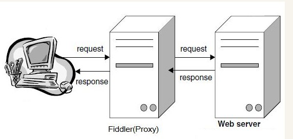
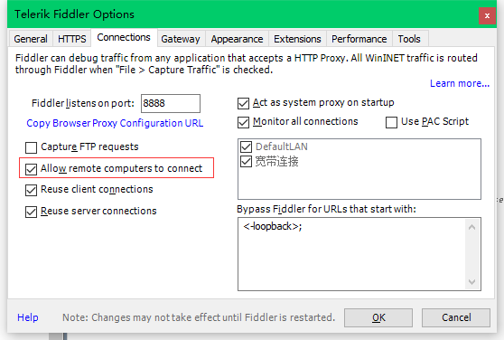
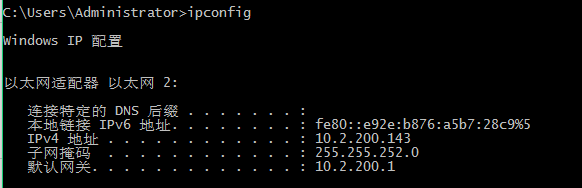
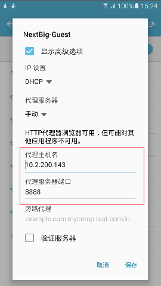
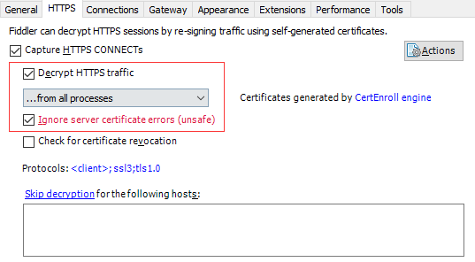

# 网络基础-抓包

---
## 1 利用Fiddler进行抓包

浏览器一般都提供了简单的**调试工具**，可以使用调试工具进行简单网络抓包。Chrome为例，按下F12键就可以打开调试工具。

Fiddler（中文名称：小提琴）它能够在本机和服务端之间建立一个代理，通过这个代理，可以对所有经过的请求和响应进行拦截、修改、分析等。理论上说，只要你使用的软件支持代理，都可以用 Fiddler 进行拦截，包括浏览器、命令行等。

### Fiddler的工作原理

Fiddler 是以代理web服务器的形式工作的,它使用代理地址:127.0.0.1, 端口:8888\. 当Fiddler退出的时候它会自动注销，这样就不会影响别的程序。不过如果Fiddler非正常退出，这时候因为Fiddler没有自动注销，会造成网页无法访问。解决的办法是重新启动下Fiddler.

>代理：不直接访问web服务器，而是通过中间服务器访问。这个中间服务器即为代理。

###  Fiddler相关功能介绍

- Session列表，即一次会话列表，其中包含了会话的各种信息，比如状态、处理者、地址等。
- statistics 统计信息
- Inspectors 审视界面，查看详细请求与响应内容
- Composer 可以模拟请求
- AutoResponder：这个地方可以模拟服务端返回值。顾名思义，当浏览器发出的请求满足你设置的匹配条件的话，Fiddler 就自动响应了，并不需要走网络。
- QuickExec 可以执行命令行
- Capturing按钮，开始或停止监控(左下角)(左下角)

###  利用Fiddler对Android进行抓包

在 Fiddler 的 `Tools->Optios` 中有一个 Connections 选项，勾上允许远程连接即可。

可以看到Fidder的端口号为**8888**.

然后在命令行使用ipconfig查看本机的ip地址：

最后一步就是在Android手机上进行配置：

至此，配置已经完成了。如果手机在配置后无法上网，尝试等待两分钟或者重启Fiddler。

###  开启 Https 抓包

在Fiddler的 `Tools->Optios` 中有一个HTTPS选项，勾选 **capure https connects** 选项。

如果需要对 Android 端进行 Https 抓包，则需要在 Android 端安装相关证书。具体查看下面链接：**Android抓包方法(一)之Fiddler代理**。
 
---
## 2 Wireshark

Wireshark 也是网络包分析工具。网络包分析工具的主要作用是尝试捕获网络包， 并尝试显示包的尽可能详细的情况。Wireshark 非常强大。

- Wireshark 以网卡为目标进行抓包
- Wireshark 解密整体可以分为：工具栏、历史流量包列表展示界面、选定的单个包的详细信息展示面板、选定的单个包的二进制流信息展示面板。
- 使用Filter过滤包：Wireshark 的 Filter分为两种，一种为 Capture Filter，另一种是 Display Filter。过滤的语法可以在 wiki 中查找。
- Wireshark 对不同协议的包使用了不同的颜色标记，可以在 `View->Coloring Rules` 中查看。
- 流量跟踪：Wireshark 默认情况下将不同网络连接的流量都混在一起展示，即使给不同协议的包上色之后，要单独查看某个特定连接的流量依然不怎么方便，我们可以通过Wireshark提供的两种方式来进行流量追踪。
    - Follow Stream：右键任意的包，然后选择Follow Stream，其更适合分析针对某一个服务器地址的流量。
    - Flow Graph：`Statistics->Flow Graph`，其更适合分析某个 App    的整体网络行为，包含从DNS解析开始到和多个服务器交互等。
-  Wireshark 默认无法抓取回环地址（127.0.0.1）上的包

### Wireshark Https 抓包

由于 Https 采用的是加密传输，默认情况下抓到的 TLS 层的数据是密文，破解 HTTPS 加密的方式有：

- 中间人攻击。
- 设置 web 服务器使用 RSA 作为交换密钥算法，因为如果密钥交换使用 Diffie-Hellman 算法，过在 Key Exchange 阶段交换的信息由各自计算出 pre-master-secret。所以 pre-master-secret 没有存到硬盘，也没有在网络上传输，wireshark 就无法获取 session key，也就无法解密应用数据。
- 如果是用 chrome、firefox，可以设置导出 pre-master-secret log，然后 wireshark 设置 pre-master-secret log 路径，这样就可以解密了。

Wireshark 实现 Android 抓包相对麻烦，可以配合 Fiddler 进行抓包，即通过 Fiddler 把 Android 网络请求代理到 PC，然后使用 Wrieshark 进行 PC 抓包。

---
## 引用

* [Fiddler_官方网站](http://www.telerik.com/fiddler)
* [Fiddler_官方文档](http://docs.telerik.com/fiddler/configure-fiddler/tasks/configurefiddler)
* [Fiddler_官方插件](http://www.telerik.com/fiddler/add-ons)
* [Fiddler 实用教程](https://segmentfault.com/a/1190000004240812)
* [Fiddler 教程](http://www.jianshu.com/p/99b6b4cd273c)
* [Android 抓包方法(一)之 Fiddler 代理](http://www.cnblogs.com/findyou/p/3491014.html)
* [Android 抓包方法(二)之 Tcpdump 命令+Wireshark](https://www.cnblogs.com/findyou/p/3491035.html)
* [Android 抓包方法(三)之 Win7 笔记本 Wifi 热点+WireShark 工具](https://www.cnblogs.com/findyou/p/3491065.html)
* [wireshark wiki](https://wiki.wireshark.org/)
* [The First Few Milliseconds of an HTTPS Connection](http://www.moserware.com/2009/06/first-few-milliseconds-of-https.html)

Android 7.0 抓包

- [Android 7.0 https 抓包实现](https://juejin.im/post/5aa9f35b51882555731bd922)
- [Using Fiddler With iOS 10 and Android 7](https://textslashplain.com/2016/07/27/using-fiddler-with-ios-10-and-android-7/)
- [Wireshark和Fiddler分析Android中的TLS协议包数据(附带案例样本)](https://mp.weixin.qq.com/s?__biz=MzIzNDA3MDgwNA==&mid=2649230437&idx=1&sn=e8f6d96836013cec994ebeebca2e1c6c&chksm=f0e75a1ec790d308b4266e069da81572c49b1284b9ad7b48d137f34eb585319b48d45c68e67a&scene=0&pass_ticket=4gJV6LG0ICRC%2BqzI56wSh3iO6aUleEO3enZiG6DAkW7yavuMxfG7C%2FVQwUsWRfTJ#rd)