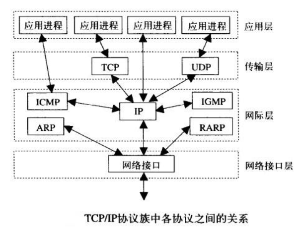
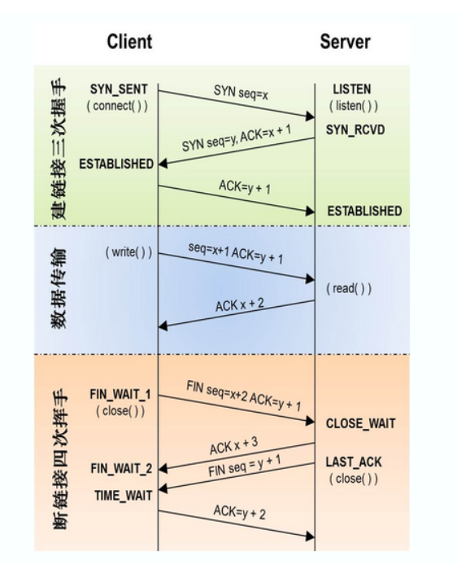
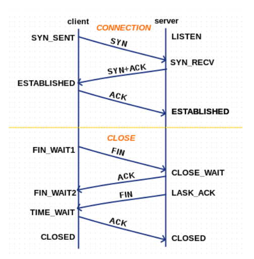
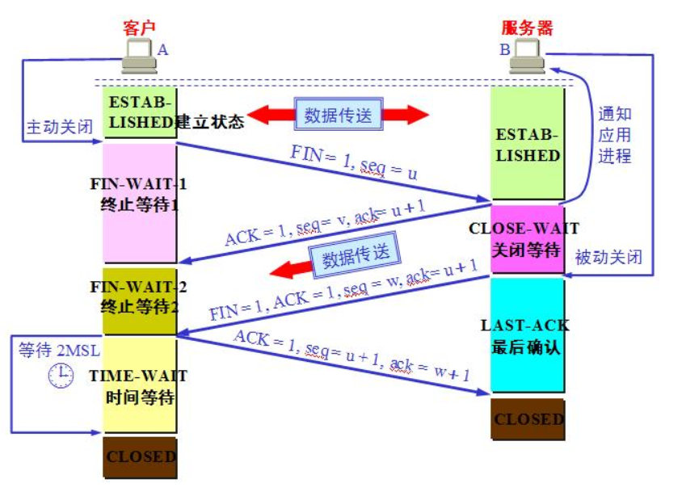
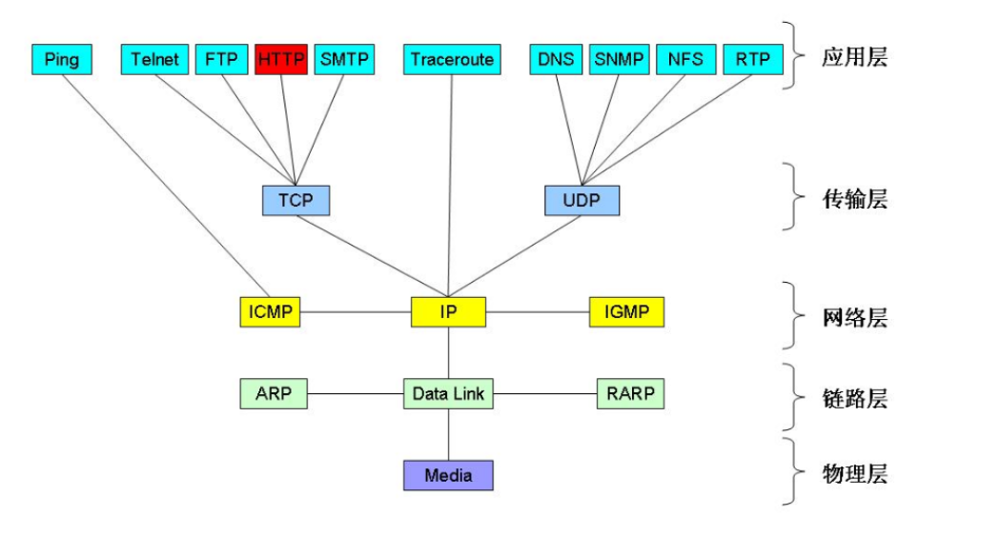
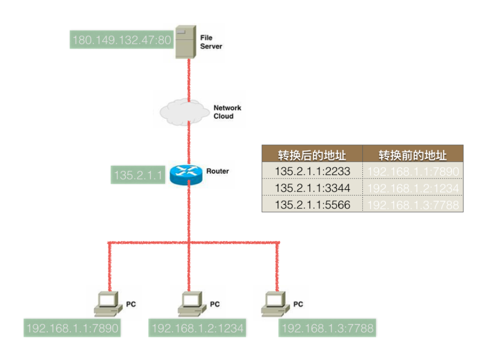

# 计算机网络基础知识

>什么是协议：有的说英语，有的说中文，有的说德语，说同一种语言的人可以交流，不同的语言之间就不行了为了解决不同种族人之间的语言沟通障碍，现在规定国际通用语言是英语，这就是一个规定，这就是协议，现在的生活中，不同的计算机只需要能够联网（有线无线都可以）那么就可以相互进行传递数据，那么不同种类之间的计算机到底是怎么进行数据传递的呢？就像说不同语言的人沟通一样，只要有一种大家都认可都遵守的协议即可。

---
## 1 网络模型与网络分层

多台计算机的互联，计算机之间通过什么样的协议进行通讯，就是网络模型研究的问题。

### OSI

国际标准化组织ISO定义了OSI(**开放式系统互联通信参考模型**)网络模型，把网络分为七层：

- **1.物理层**：主要定义物理设备标准，如网线的接口类型、光纤的接口类型、各种传输介质的传输速率等。它的主要作用是传输比特流（就是由1、0转化为电流强弱来进行传输,到达目的地后在转化为1、0，也就是我们常说的数模转换与模数转换）。这一层的数据叫做比特。
- **2.数据链路层**：主要将从物理层接收的数据进行MAC地址（网卡的地址）的封装与解封装。常把这一层的数据叫做帧。在这一层工作的设备是交换机，数据通过交换机来传输。
- **3.网络层**：主要将从下层接收到的数据进行IP地址（例192.168.0.1)的封装与解封装。在这一层工作的设备是路由器，常把这一层的数据叫做数据包。
- **4.传输层**：定义了一些传输数据的协议和端口号，如：TCP（传输控制协议，可靠性强，用于传输可靠性要求高，数据量大的数据），UDP（用户数据报协议，与TCP特性恰恰相反，用于传输可靠性要求不高，数据量小的数据）。 主要是将从下层接收的数据进行分段和传输，到达目的地址后再进行重组。常常把这一层数据叫做段。
- **5.会话层**：通过传输层（端口号：传输端口与接收端口）建立数据传输的通路。主要在你的系统之间发起会话或者接受会话请求（设备之间需要互相认识，可以是IP也可以是MAC或者是主机名）
- **6.表示层**：主要是进行对接收的数据进行解释、加密与解密、压缩与解压缩等（也就是把计算机能够识别的东西转换成人能够能识别的东西（如图片、声音等）。
- **7.应用层**： 主要是一些终端的应用，比如说FTP（各种文件下载），WEB（IE浏览），QQ之类的（可以把它理解成我们在电脑屏幕上可以看到的东西．就是终端应用）。

### TCP/IP 模型

规范与实现之间总是存在非常大的差异，现在通讯的通用协议标准 TCP/IP 协议簇把网络分为四层。

TCP/IP提供点对点的链接机制，将数据应该如何 **封装、定址、传输、路由** 以及在目的地 **如何接收**，都加以 **标准化**。它将软件通信过程抽象化为 **四个抽象层**，采取协议堆栈的方式，分别实现出不同通信协议。协议族下的各种协议，依其功能不同，被分别归属到这四个层次结构之中



- 应用层：例如 HTTP、FTP、DNS
- 传输层：例如 TCP、UDP、RTP、SCTP
- 网际层：对于 TCP/IP 来说这是因特网协议
- 主机至网络层：例如以太网、Wi-Fi 等。

学习计算机网络时我们一般采用折中的办法，也就是中和 OSI 和 TCP/IP 的优点，采用一种只有五层协议的体系结构，这样既简洁又能将概念阐述清楚。

- 应用层
- 传输层
- 网络层
- 链路层
- 物理层

---
## 2 传输协议

### UDP

UDP即用户数据报协议，是一个无连接的简单的面向数据报的运输层协议。UDP不提供可靠性，它只是把应用程序传给IP层的数据报发送出去，但是并不能保证它们能到达目的地。由于UDP在传输数据报前不用在客户和服务器之间建立一个连接，且没有超时重发等机制，故而传输速度很快。UDP是一种面向无连接的协议，每个数据报都是一个独立的信息，包括完整的源地址或目的地址，它在网络上以任何可能的路径传往目的地，因此能否到达目的地，到达目的地的时间以及内容的正确性都是不能被保证的。UDP是面向无连接的通讯协议，UDP数据包括目的端口号和源端口号信息，由于通讯不需要连接，所以可以实现广播发送。 UDP传输数据时有大小限制，每个被传输的数据报必须限定在64KB之内。 UDP是一个不可靠的协议，发送方所发送的数据报并不一定以相同的次序到达接收方。

- **无连接的**：UDP传输数据不需要建立连接，就像写信寄邮件一样
- **不可靠的**：因为UDP发出去的数据包发出去就不管了，不管它会不会到达，所以很可能会出现丢包现象，使传输的数据出错。
- **面向报文**：数据报文，就相当于一个数据包，不会像TCP那样拆分。UDP的最大包长度是`2^16-1`的个字节。
- **没有拥塞控制**：拥塞是指到达通信子网中某一部分的分组数量过多，使得该部分网络来不及处理，以致引起这部分乃至整个网络性能下降的现象，严重时甚至会导致网络通信业务陷入停顿，即出现死锁现象，就像交通堵塞一样。TCP建立连接后如果发送的数据因为信道质量的原因不能到达目的地，它会不断重发，有可能导致越来越塞，所以需要一个复杂的原理来控制拥塞。而UDP就没有这个烦恼，发出去就不管了。

对数据实时传输要求高，但是可以容忍在网络发生拥塞时候丢失一些数据的应用可以使用 UDP 协议。

### TCP

TCP(Transmission Control Protocol)是面向连接的协议，特点为：形成数据传输通道、面向字节流、全双工通信，在连接中可以进行大数据传输，通过三次握手完成连接，是可靠协议，通讯必须建立连接 。

- **面向连接**：指的是要使用TCP传输数据，必须先建立TCP连接，传输完成后释放连接，类似我们打电话
- **全双工通信**：即一旦建立了TCP连接，通信双方可以在任何时候都能发送数据。
- **可靠的**：指的是通过TCP连接传送的数据，无差错，不丢失，不重复，并且按序到达。对于发送失败的数据块，TCP还会进行重试
- **面向字节流**：流指的是流入到进程或从进程流出的字符序列。传输过程中的数据流的大小不确定，而TCP报文长度有限制，不能一次传输完，要把它分为好几个数据块，但是由于TCP的可靠性保证，接收方可以按顺序接收数据块然后重新组成分块之前的数据流，**所以TCP看起来就像直接互相传输字节流一样面向字节流**

#### TCP 三次握手、四次挥手



TCP要求通讯的双方，每一次收到数据后，都要向发送端发送 ACK 确认收到的信息，否则发送方会任务数据没有送达目标地址，会进行重试。

##### 三次握手

TCP建立连接协议需要进行三次握手，具体过程如下：

1. 客户端发送一个带 SYN 标志的 TCP 报文到服务器。这是三次握手过程中的报文 1
2. 服务器端回应客户端的连接请求，这是三次握手中的第 2 个报文，这个报文同时带 ACK 标志和 SYN 标志。因此它表示对刚才客户端 SYN 报文的回应；同时又将标志 SYN 发送给客户端，询问客户端是否准备好进行数据通讯
3. 客户必须再次回应服务端一个 ACK 报文，这是报文段 3

为什么要三次握手？防止服务器端因为接收了早已失效的连接请求报文从而一直等待客户端请求，从而浪费资源，具体的描述如下：

1. “已失效的连接请求报文段”的产生在这样一种情况下：client发出的第一个连接请求报文段并没有丢失，而是在某个网络结点长时间的滞留了，以致延误到连接释放以后的某个时间才到达server。
2. 本来这是一个早已失效的报文段。但server收到此失效的连接请求报文段后，就误认为是client再次发出的一个新的连接请求。于是就向client发出确认报文段，同意建立连接。
3. 假设不采用“三次握手”，那么只要server发出确认，新的连接就建立了。由于现在client并没有发出建立连接的请求，因此不会理睬server的确认，也不会向server发送数据。但server却以为新的运输连接已经建立，并一直等待client发来数据。这样，server的很多资源就白白浪费掉了。

采用三次握手的办法可以防止上述现象发生。例如刚才那种情况，client不会向server的确认发出确认。server由于收不到确认，就知道client并没有要求建立连接。 所以主要目的是防止server端一直等待，浪费资源。

##### 四次挥手

由于TCP连接是**全双工的**，因此每个方向都必须**单独进行关闭**。这原则是当一方完成它的数据发送任务后就能发送一个 FIN 来终止这个方向的连接。收到一个 FIN 只意味着这一方向上没有数据流动，一个 TCP 连接在收到一个 FIN 后仍能发送数据。首先进行关闭的一方将执行主动关闭，而另一方执行被动关闭。

1. TCP客户端发送一个 FIN，用来关闭客户到服务器的数据传送（
2. 服务器收到这个 FIN，它发回一个 ACK，确认序号为收到的序号加1，和 SYN 一样，一个 FIN 将占用一个序号。
3. 服务器关闭客户端的连接，发送一个 FIN 给客户端。
4. 客户段发回 ACK 报文确认，并将确认序号设置为收到序号加1。

为什么需要四次挥手？为了保证双方都能通知对方“需要释放连接”，即在释放连接后都无法接收或发送消息给对方：

1. TCP 是全双工模式，这意味着是双向都可以发送、接收的
2. 释放连接的定义是：双方都无法接收或发送消息给对方，是双向的
3. 当主机 1 发出“释放连接请求”（FIN报文段）时，只是表示主机 1 已经没有数据要发送或数据已经全部发送完毕；**但是这个时候主机 1 还是可以接受来自主机 2 的数据**
4. 当主机 2 返回“确认释放连接”信息（ACK报文段）时，表示它已经知道主机 1 没有数据发送了，**但此时主机 2 还是可以发送数据给主机1 **
5. 当主机 2 也发送了 FIN 报文段时，即告诉主机 1 我也没有数据要发送了，**此时，主机 1 和 2 已经无法进行通信：主机 1 无法发送数据给主机 2，主机 2 也无法发送数据给主机 1，此时，TCP 的连接才算释放**

#### TCP 的十种状态



- established：确定的；已制定的，已建立的
- 当一端收到一个FIN，内核让read返回0来通知应用层另一端已经终止了向本端的数据传送
- 发送FIN通常是应用层对socket进行关闭的结果

#### 2MSL 问题

MSL（Maximum Segment Lifetime，报文最大生成时间） 表示一个数据包在网络种存活的最长时间，2MSL 是指在 TCP 四次挥手时，客户端在发送最后一次 ACK 信号后，需要等待 2MSL 的时间再关闭，为了确保服务器已经收到客户端的 ACK 信号，如果客户端的 ACK 信号发送失败(最长为 MSL 时间)，则服务器会再一次重试(最长为 MS L时间)，所以最坏时长为 2MSL。



#### TCP 长连接和短连接

TCP在真正的读写操作之前，server与client之间必须建立一个连接，当读写操作完成后，双方不再需要这个连接时它们可以释放这个连接，连接的建立通过三次握手，释放则需要四次握手，所以说每个连接的建立都是需要资源消耗和时间消耗的。

TCP短连接：

```
1. client 向 server 发起连接请求
2. server 接到请求，双方建立连接
3. client 向 server 发送消息
4. server 回应 client
5. 一次读写完成，此时双方任何一个都可以发起 close 操作
```

在第 步骤5中，一般都是 client 先发起 close 操作。当然也不排除有特殊的情况。从上面的描述看，短连接一般只会在 client/server 间传递一次读写操作！

TCP长连接：

```
1. client 向 server 发起连接
2. server 接到请求，双方建立连接
3. client 向 server 发送消息
4. server 回应 client
5. 一次读写完成，连接不关闭
6. 后续读写操作...
7. 长时间操作之后client发起关闭请求
```

TCP长/短连接的优点和缺点：

- 长连接可以省去较多的TCP建立和关闭的操作，减少浪费，节约时间。对于频繁请求资源的客户来说，较适用长连接。
- client与server之间的连接如果一直不关闭的话，会存在一个问题，随着客户端连接越来越多，server早晚有扛不住的时候，这时候server端需要采取一些策略，
    - 关闭一些长时间没有读写事件发生的连接，这样可以避免一些恶意连接导致server端服务受损；
    - 如果条件再允许就可以以客户端机器为颗粒度，限制每个客户端的最大长连接数，这样可以完全避免某个蛋疼的客户端连累后端服务。
- 短连接对于服务器来说管理较为简单，存在的连接都是有用的连接，不需要额外的控制手段。但如果客户请求频繁，将在TCP的建立和关闭操作上浪费时间和带宽。

TCP 长/短连接的应用场景

- 长连接多用于操作频繁，点对点的通讯，而且连接数不能太多情况。
- 而像 WEB 网站的 http 服务一般都用短链接，因为长连接对于服务端来说会耗费一定的资源。

---
## 3 端口

端口号用于唯一标识系统中运行的一个进程。端口是通过端口号来标记的，端口号只有整数，范围是从 0 到 65535，从 0 到 1024 一般都是系统级端口。另外我们还应该了解常用应用程序的默认端口号如：`Tomcat：8080, MySQL：3306`，开发中需要避开这些常见的端口号。用`netstat －an`可以查看端口占用状态。

---
## 4 IP 与子网掩码

### IP 与 IP分类

ip 地址是用来在网络中标记一台电脑的一串字符


A类IP地址：一个A类IP地址由1字节的网络地址和3字节主机地址组成，网络地址的最高位必须是“0”：

- 地址范围`1.0.0.1-126.255.255.254`
- 二进制表示为：`00000001 00000000 00000000 00000001 - 01111110 11111111 11111111 11111110`
- 可用的A类网络有126个，每个网络能容纳1677214个主机

B类IP地址：一个B类IP地址由2个字节的网络地址和2个字节的主机地址组成，网络地址的最高位必须是“10”：

- 地址范围`128.1.0.1-191.255.255.254`
- 二进制表示为：`10000000 00000001 00000000 00000001 - 10111111 11111111 11111111 11111110`
- 可用的B类网络有16384个，每个网络能容纳65534主机

C类IP地址：一个C类IP地址由3字节的网络地址和1字节的主机地址组成，网络地址的最高位必须是“110”：

- 范围`192.0.1.1-223.255.255.254`
- 二进制表示为: `11000000 00000000 00000001 00000001 - 11011111 11111111 11111110 11111110`
- C类网络可达2097152个，每个网络能容纳254个主机

D类地址用于多点广播：D类IP地址第一个字节以“1110”开始，它是一个专门保留的地址：

- 它并不指向特定的网络，目前这一类地址被用在多点广播（MultiCast）中
- 多点广播地址用来一次寻址一组计算机
- 地址范围`224.0.0.1-239.255.255.254`

E类IP地址：

- 以“1111”开始，为将来使用保留
- E类地址保留，仅作实验和开发用

私有ip：在这么多网络IP中，国际规定有一部分IP地址是用于我们的局域网使用，也就是属于私网IP，不在公网中使用的，它们的范围是：

    10.0.0.0～10.255.255.255
    172.16.0.0～172.31.255.255
    192.168.0.0～192.168.255.255

IP地址`127．0．0．1~127．255．255．255`用于回路测试，如：`127.0.0.1`可以代表本机IP地址，用`http://127.0.0.1`就可以测试本机中配置的Web服务器。

每一个IP地址包括两部分：网络地址和主机地址，比如一个C类地址：`192.168.155.1`，子网掩码为`255.255.255.0`，则

- 其中`192.168.155.0`和`192.168.155.255`不允许使用
- 经过与子网掩码计算后可得`192.168.155.0`为网络号
- `192.168.155.255`是广播地址，广播地址(Broadcast Address)是专门用于同时向网络中所有工作站进行发送的一个地址
- 一个C类地址最多容纳254个地址，即1-254

### 子网掩码

要想理解什么是子网掩码，就需要了解IP地址的构成。互联网是由许多小型网络构成的，每个网络上都有许多主机，这样便构成了一个有层次的结构。IP地址在设计时就考虑到地址分配的层次特点，将每个IP地址都分割成网络号和主机号两部分，以便于IP地址的寻址操作。

IP地址的网络号和主机号各是多少位呢？如果不指定，就不知道哪些位是网络号、哪些是主机号，这就需要通过子网掩码来实现。子网掩码不能单独存在，它必须结合IP地址一起使用。

子网掩码只有一个作用，就是**将某个IP地址划分成网络地址和主机地址两部分，子网掩码的设定必须遵循一定的规则。**

与IP地址相同，子网掩码的长度也是32位，

- 左边是网络位，用二进制数字“1”表示；
- 右边是主机位，用二进制数字“0”表示。

假设IP地址为`192.168.1.1`子网掩码为`255.255.255.0`。

```
            将IP地址和子网掩码换算为二进制，子网掩码连续全1的是网络地址，后面的是主机地址
        
            其中，“1”有24个，代表与此相对应的IP地址左边24位是网络号； “0”有8个，代表与此相对应的IP地址右边8位是主机号。
            
            将IP地址和子网掩码进行与运算，结果是网络地址（即主机号全0是网络地址）
            将子网掩码取反再与IP地址按位与（&）后得到的结果即为主机部分
            将运算结果中的网络地址不变，主机地址变为1，结果就是广播地址
            
            这样，子网掩码就确定了一个IP地址的32位二进制数字中哪些是网络号、哪些是主机号。
            这对于采用TCP/IP协议的网络来说非常重要，只有通过子网掩码，才能表明一台主机所在的子网与其他子网的关系，使网络正常工作。
```

常用子网掩码是`255.255.255.0`的网络：最后面一个数字可以在0~255范围内任意变化，因此可以提供256个IP地址。但是实际可用的IP地址数量是256-2，即254个，因为主机号不能全是“0”或全是“1”。

主机号全为0，表示网络号，主机号全为1，表示网络广播。

子网掩码应该根据网络的规模进行设置。如果一个网络的规模不超过254台电脑，采用`255.255.255.0`作为子网掩码就可以了，现在大多数局域网都不会超过这个数字，因此`255.255.255.0`是最常用的IP地址子网掩码；假如在一所大学具有1500多台电脑，这种规模的局域网可以使用`255.255.0.0`。


---
## 5 网络通讯过程

### 集线器(hub)

集线器，类似 USB 转接头

 - 集线器能够完成多个电脑的链接
 - 每个数据包的发送都是以广播的形式进行的，容易堵塞网络

### 网络交换机(switch)

网络交换机（又称“网络交换器”），是一个扩大网络的器材，能为子网络中提供更多的连接端口，以便连接更多的计算机，具有性能价格比高、高度灵活、相对简单、易于实现等特点 以太网技术已成为当今最重要的一种局域网组网技术，网络交换机也就成为了最普及的交换机。

使用交换机的通信过程：如果PC不知目标IP所对应的的MAC，那么pc会先发送arp广播，得到对方的MAC地址，然后再进行数据的传送

问题：

1. 两台计算机之间能通讯的前提是什么？在同一网段内
2. 多态计算机之间为什么不能把网线剪开链接在一起？数据是通过电信号传输的
3. 链接多台计算机的hub(集线器)有什么作用？实现多台计算机链接在一起，组成小型网络
4. 集线器与交换机的区别？集线器使用以广播形式发送数据，交换机有一个学习过程，开始以广播发送数据，之后是单播。

### ARP 和 ICMP 协议

TCP/IP协议族把网络分为四层：

- 应用层：原始数据
- 传输层：加上端口
- 网络层：网络层协议有`icmp、arp、rarp、igmp、ip`
- 链路层：加上MAC地址

端口号、ip地址、MAC地址是通讯的必要因素，否则通讯的双方无法确认对方。在整个通讯过程中，ip地址不会改变，而MAC地址在没两台设备之间会改变一次，所有ip地址是一种逻辑地址，而MAC地址是是真实的物理地址，用于标记实际转发数据时的设备地址。举个例子，老师要把一个东西交给坐在最后面的A同学，但是老师不需要直接交给他，而是把东西交给坐在前面的同学，然后同学们一个接一个传递这个东西，最后把东西传递给了最后面的A同学，在这个过程中，A同学就是那个IP，而每个同学的地址可以理解为MAC地址。整个过程中IP没变，每一段的传输，MAC都会改变。

各种协议的作用：

- ping使用的是icmp协议
- arp协议用于根据ip获取MAC地址
- rarp协议根据MAC地址找ip地址

那么数据链路层在收到数据时是把数据交给arp还是ip呢？在网络层发送数据时，会加上一个type，比如type为0x806则交给arp，type为0x800则交给给ip。

在交换机的组成的网络中，一台计算机A ping一台从未通讯过的另一台计算机B 的过程时怎样的呢？



A首先只知道B的IP，于是先使用arp协议发送数据包，并把数据包的MAC地址设置为`FFFF-FFFF-FFFF`广播MAC地址，数据发送到路由器后，路由器会以广播的形式发送这个数据包，连接这个路由器的所有其他计算机都会收到收到这个数据包，但是只有IP地址匹配的计算机才会接收这个数据包(其他计算机都会丢弃)，接收数据包的计算机会把自己的MAC地址发送给A，A得到B的MAC地址之后进行一对一的通讯。

arp 缓存表：每台pc都会有一个arp缓存表，用来记录IP所对应的的MAC地址。使用`arp -a`可以查看pc上的arp缓存表，使用`arp -d`用于删除arp缓存表

```shell
λ arp -a

接口: 192.168.56.1 --- 0xe
  Internet 地址         物理地址              类型
  192.168.56.255        ff-ff-ff-ff-ff-ff     静态
  224.0.0.2             01-00-5e-00-00-02     静态
  224.0.0.22            01-00-5e-00-00-16     静态
  224.0.0.251           01-00-5e-00-00-fb     静态
  224.0.0.252           01-00-5e-00-00-fc     静态
  239.255.255.250       01-00-5e-7f-ff-fa     静态

接口: 192.168.180.2 --- 0xf
  Internet 地址         物理地址              类型
  192.168.180.255       ff-ff-ff-ff-ff-ff     静态
  224.0.0.2             01-00-5e-00-00-02     静态
  224.0.0.22            01-00-5e-00-00-16     静态
  224.0.0.251           01-00-5e-00-00-fb     静态
  224.0.0.252           01-00-5e-00-00-fc     静态
  239.255.255.250       01-00-5e-7f-ff-fa     静态
```

### 路由器

TCP/IP规定，不允许跨网络直接通讯。

路由器（Router）又称网关设备（Gateway）是用于连接多个逻辑上分开的网络，所谓逻辑网络是代表一个单独的网络或者一个子网。当数据从一个子网传输到另一个子网时，可通过路由器的路由功能来完成具有判断网络地址和选择IP路径的功能。

路由器上至少存在两个网卡，于是可以和至少连接到两个逻辑网络，两个逻辑网络可以通过路由器进行通讯。不同逻辑网络之间的通讯需要配置默认网关，当发送的ip地址不在同一网段内时，就会把数据发送给默认网关(比如一个路由器)

- 不在同一网段的pc，需要设置默认网关才能把数据传送过去 通常情况下，都会把路由器默认网关
- 当路由器收到一个其它网段的数据包时，会根据“路由表”来决定，把此数据包发送到哪个端口；路由表的设定有静态和动态方法
- 每经过一次路由器，那么TTL值就会减一
- DNS服务器用来解析出IP（类似电话簿）
- Default Gateway（默认网关）用来对顶，当发送的数据包的目的ip不是当前网络时，此数据包包转发的目的ip
- 在路由器中路由表指定数据包的”下一跳”的地址

>网关(Gateway)又称网间连接器、协议转换器。默认网关在网络层上以实现网络互连，是最复杂的网络互连设备，仅用于两个高层协议不同的网络互连。网关的结构也和路由器类似，不同的是互连层。网关既可以用于广域网互连，也可以用于局域网互连，网关实质上是一个网络通向其他网络的IP地址。比如有网络 A 和网络 B，网络 A 的 IP 地址范围为 `192.168.1.1~192. 168.1.254`，子网掩码为 `255.255.255.0`；网络 B 的IP地址范围为`192.168.2.1~192.168.2.254`，子网掩码为`255.255.255.0`。在没有路由器的情况下，两个网络之间是不能进行 TCP/IP 通信的，即使是两个网络连接在同一台交换机（或集线器）上，TCP/IP 协议也会根据子网掩码 `255.255.255.0` 判定两个网络中的主机处在不同的网络里。而要实现这两个网络之间的通信，则必须通过网关。如果网络 A 中的主机发现数据包的目的主机不在本地网络中，就把数据包转发给它自己的网关，再由网关转发给网络 B 的网关，网络 B 的网关再转发给网络 B 的某个主机。所以说，只有设置好网关的IP地址，TCP/IP 协议才能实现不同网络之间的相互通信。那么这个 IP 地址是哪台机器的IP地址呢？网关的 IP 地址是具有路由功能的设备的 IP 地址，具有路由功能的设备有路由器、启用了路由协议的服务器、代理服务器。

### 一次网络请求的过程

假设已经配置好默认网关和dns服务器，以访问abc.com为例。

1. 先要解析除abc.com对应的ip地址
    1. 通过arp获取默认网关的MAC地址
    2. 阻止数据，发送给默认网关(ip时dns服务器的ip，MAC地址是默认网关的ma地址)
    3. 默认拥有转发数据的能力，把数据转发给路由器
    4. 路由器根据自己的路由协议，来选择一个合适的较快的路径，转发数给目的网关
    5. 目的网关(dns服务器所在的网关)把数据转发给dns服务器
    6. dns服务器查询解析出来abc.com对应的ip地址，原路返回给请求这个域名的client
2. 得到abc.com对用的ip地址，之后发送三次握手，进行连接
3. 使用http协议发送请求给web服务器
4. web服务器收到数据请求之后，通过查询自己服务器得到对用的结果，原路返回给client
5. client上浏览器收到数据后，进行渲染
6. 断开tcp连接，即四次挥手

---
## 6 如何联网：互联网服务提供商

我们平时连接互联网是是由 ISP 提供服务的。互联网服务提供商 ISP(Internet Service Provider) 可以从 **互联网管理机构** 获得许多 IP 地址，同时拥有通信线路以及路由器等联网设备，个人或机构向 ISP 缴纳一定的费用就可以接入互联网。ISP 是网络最终用户进入 Internet 的入口和桥梁。它包括Internet 接入服务和 Internet 内容提供服务。这里主要是 Internet 接入服务，即通过电话线把你的计算机或其他终端设备连入Internet。

中国三大基础运营商及其提供的服务：

- 中国电信：拨号上网、ADSL、1X、CDMA1X,EVDO rev.A、FTTx、光纤接入EPON、FDD/TDD LTE
- 中国移动：拨号上网、GPRS及EDGE无线上网、TD-SCDMA无线上网，一少部分FTTx、FDD LTE
- 中国联通：GPRS,W-CDMA、无线上网、 拨号上网、ADSL、FTTx、FDD/TDD LTE

### 家庭上网解析

电话线-->调制解调器(俗称猫，电信号->网络信号)->路由器->PC

路由器：

- WAN，外网接口
- LAN，内网接口
- 路由表，记录本地PC的ip、端口的映射
- 家庭 PC 只能主动访问外网，而不能被外网访问，可以使用花生壳映射。

NAT：网络地址转换器




---
## 7 网络编程：Socket

在计算机科学中，网络套接字（Network socket），又译网络套接字、网络接口、网络插槽，是电脑网络中进程间数据流的端点。使用以网际协议（Internet Protocol）为通信基础的网络套接字，称为网际套接字（Internet socket）。因为网际协议的流行，现代绝大多数的网络套接字，都是属于网际套接字。socket是一种操作系统提供的进程间通信机制 ——维基百科

- Socket 就是为网络服务提供的一种机制，为编程提供的通讯接口。
- Socket 是支持 TCP/IP 协议的网络通信基本操作单元，操作系统为应用程序提供了一套调用接口（API)，方便开发者开发网络程序。注意，Socket本身并不是协议，只是提供一个针对TCP或UDP的编程接口。
- Socket 最早在 Unix 系统中得到支持，现在几乎所有的计算机操作系统都支持 Socket。

---
## 引用

- [维基百科：TCP/IP协议族](https://zh.wikipedia.org/wiki/TCP/IP%E5%8D%8F%E8%AE%AE%E6%97%8F#.E5.9B.A0.E7.89.B9.E7.BD.91.E5.8D.8F.E8.AE.AE.E6.A0.88.E4.B8.AD.E7.9A.84.E5.B1.82)
