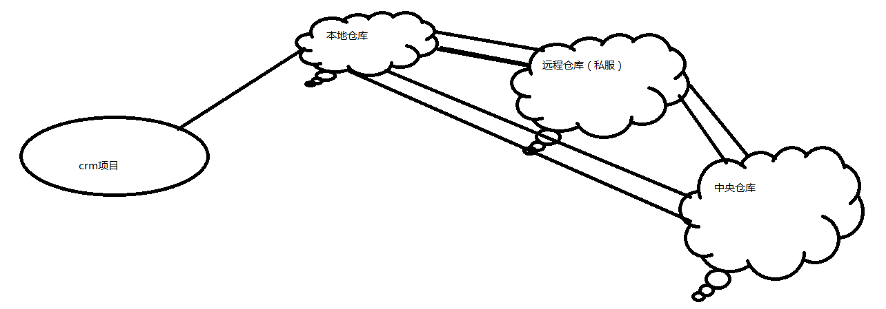

# Maven 入门

---
## 1 Maven 简介

### Maven 是什么

- 什么是maven：是apache下的一个开源项目，是纯java开发，并且只用来管理java项目
- Maven好处
  - 提供项目的一键化构建，包括编译、测试(junit)、运行、打包、部署
  - 依赖管理
  - 可以跨平台
  - 应用于大型项目 可以提高开发效率

### Maven的安装配置

1. 要配置jdk，`maven 3.3.9` 这个版本所需的jdk版本必须要`1.7`以上
2. 最终要运行的是 maven 软件中 bin 目录的 mvn 命令，所以要配置 maven 的环境变量，在系统变量添加环境变量的名称：`MAVEN_HOME`，变量值：就是maven解压的目录，比如`F:\class32\apache-maven-3.3.9`

验证maven是否配置成功：`mvn -v`

### 配置本地仓库位置

- 修改 maven 解压目录下的 `conf/setting.xml`文件
- 把文件拷贝一份到用户目录的 `.m2`目录下(ide默认读取位置)

---
## 2 Maven仓库

1. 本地仓库 自己维护
2. 远程仓库（私服），公司维护
3. 中央仓库，maven团队维护

---
## 3 Manen 常用命令

- `clean` 清理编译的文件
- `compile` 编译了主目录的文件
- `test` 编译并运行了test目录的代码
- `package` 打包
- `install` 就是把项目发布到本地仓库
- `tomcat：run` 一键启动
