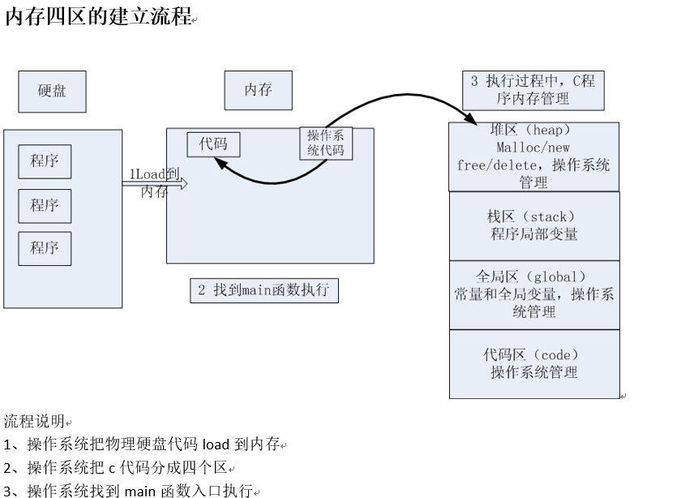

# C 提高

建立正确的程序运行内存布局图是学好C语言的关键。

能力：

- 接口的封装与设计能力
    - api的使用能力
    - api的查找能力
    - api的封装能力
- 建立正确程序运行的内存布局图
    - 内存四区模型
    - 函数调用模型


---
##  1 程序内存模型

###  数组当作参数时会退化为指针

```
static void passArray(int intArr[]) {
    int size = sizeof(intArr);//8
    printf("stack size = %d \n", size);
}


static void array() {
    int intArr[10];
    int size = sizeof(intArr);//40
    printf("stack size = %d \n", size);
    passArray(intArr);
}
```


###  数据类型的本质

数据类型可以理解为创建变量的一个模具，是固定内存块大小的别名，通过`sizeof`测试。
其作用是让编译器预算对象分配内存空间的大小。

变量是既能读又能写的内存对象，其本质是一段连续内存空间的别名。
程序通过变量来申请和命名内存空间` int a = 0`，变量三要素(名称、大小、作用域)。

指针也是一种数据类型。指针变量也是一种变量，指针指向谁就把谁的地址赋值给指针。

```
int a = 10;     //4个字节
int b[10];      //4*10个字节，&b表示取整个数组的首地址，也就是40个字节
printf("%p, %p, %p, %p ", &a, &a+1, &b, &b+1);//&a+1加了4，&b+1加了40
```

### sizeof

`sizeof`是操作符，不是函数；`sizeof`测量的实体大小为编译期间就已确定

### void类型

- 当函数的无参数时，int fun(void);
- 当函数无返回值时，void fun(int a);
- 不能定义void类型变量，因为void表示没有类型，所以无法确定内存的大小
- 可以定义`void *`类型，指针类型的大小是固定的
- `void *`是万能指针，用于函数参数，返回值等等
- `void *`用作数据类型封装，典型的如内存操作函数malloc：`void *__cdecl malloc(size_t _Size);`
- `void *`在使用时应该转换为实际类型的指针

### pragma once

```
#progam once //可用于头文件中，防止头文件重复包含
```

### 让C代码可以在C++编译器编译运行

`__cplusplus`是编译器提供好的宏。

```c
    #ifdef __cplusplus
    extern "C"{
    #endif // __cplusplus
    
    //函数的声明
    
    #ifdef __cplusplus
    }
    #endif // __cplusplus
```

### 内存四区

- 堆区
- 栈区
- 全局区、文字常量区
- 代码区




绘制内存四区图来分析程序内存分配


### 函数的调用模型

- 函数的模型是一个栈的模型，先进后出
- 关心函数调用顺序，函数内部变量的作用域，不关心出栈进栈
- 函数结束后，变量是否还存在内存中
- 主调函数在栈空间分配的内存，在其后面的调用的子函数都可以使用

### 内存的生长方向

- 栈的生长方向是高位到地位
- 堆的生长方向是低位到高位
- 注意：栈中声明的一个数组buf，`buf+1`顺序永远是由低位到高位分配

---
## 2 指针知识体系搭建

以指针变量`*p`为例说明

### 2.1 指针是一种数据类型

- 指针也是一种变量，占有内存空间，用来保存内存地址，32位系统指针占4个字节，64位系统指针占8个字节

- `*p`操作内存
    - 在指针**声明**时，*号表示所声明的变量为指针
    - 在指针**使用**时，*号表示操作指针所指向的内存空间中的值
    - `*p`相当于通过地址(p变量的值)找到一块内存；然后操作内存
    - `*p`放在等号的左边赋值（给内存赋值）
    - `*p`放在等号的右边取值（从内存获取值）

- 指针变量和它指向的内存块是两个不同的概念
    - 给p赋值`p=0x1111`; 只会改变指针变量值，不会改变所指的内容：`p = p +1`;
    - 给`*p`赋值`*p='a'`; 不会改变指针变量的值，只会改变所指的内存块的值
    - `=`左边`*p`表示给内存赋值，`=`右边`*p`表示取值，含义截然不同
    
- 使用指针修改变量时，保证所指的内存块是能修改的

- 指针的数据类型，是指它指向的内存空间的数据类型，数据类型决定了**指针步长(p++)**，步长根据所指内存空间的数据类型来确定
    - `int *p;  p++;` 移动了4个字节
    - `char *p; p++;` 移动了1个字节

建立指针指向谁，就把把谁的地址赋值给指针


### 2.2 间接赋值（*p）是指针存在的最大意义

`*p`间接赋值成立条件：

- 2个变量（一个实参，一个形参）
- 建立关系，实参取地址赋给形参指针
- `*p`形参去间接修改实参的值

```c
int iNum = 0;// 条件一：两个变量
int *p = NULL;
p = &iNum;// 条件一：两个变量
*p = 1;// 条件三：通过* 操作符， 间接的给变量内存赋值
```

函数调用时，用`n`级指针(形参)改变`n-1`级指针(实参)的值。


### 2.3 理解指针必须和内存四区概念相结合

主调函数与被调函数 

- 主调函数可把堆区、栈区、全局数据内存地址传给被调用函数
- 被调用函数只能返回堆区、全局数据

内存分配方式

- 指针做函数参数，是有输入和输出特性的。
- 函数返回普通变量和指针变量的本质是一样的，问题在于返回后的指针变量所指向的内存是还可以使用。

### 2.4 应用指针必须和函数调用相结合——指针做函数参数

指针做函数参数，问题的实质不是指针，而是看指针指向的内存块。
理清是主调函数还是被调用函数分配内存；被调用函数是在`heap/stack`上分配内存。

- 一级指针做输入
- 一级指针做输出
- 二级指针做输入
- 二级指针做输出

### 2.5 避免错误

- 避免野指针
- 必要时才使用`malloc/new`
- 不允许向NULL和未知非法地址拷贝内存。

---
## 3 字符串和一级指针内存模型

1. 在C语言中使用字符数组来模拟字符串
2. C语言中的字符串是以`\0`结束的字符数组
3. C语言中的字符串可以分配于栈空间，堆空间或者只读存储区


### 字符串的初始化

数组初始化有2种方： 默认元素个数、指定元素个数

```c
int sample1(){    
    //若没有指定长度，默认不分配零
    `char buf1[] = {'a', 'b', 'c', 'd', 'e'};`
    
    //若指定长度，不够报错；buf长度多于初始化个数，会自动补充零
    char buf2[6] = {'a', 'b', 'c', 'd', 'e'};
    char buf3[6] = {'a', 'b', 'c', 'd', 'e'};
    char buf4[5] = {'a', 'b', 'c', 'd', 'e'};
    char buf5[100] = {0};//所有元素赋值为0
    
    //测试
    printf("buf3:%s", buf3);//乱码，为什么？
    system("pause");
}


int sample2(){
    //用字符数组来初始化数组，主动补0
    char buf2[] = {'a', 'b','c','d','\0'};

    //字符串常量初始化一个字符数组，会自动补充零
    char buf3[] = {"abcde"};
    char buf4[] = "abcde";//"abcde"从字符串常量区拷贝到栈区
    char buf5[100] = "abcde";  
    char *buf6 = "abcde";//"abcde"在字符串常量区

    printf(" strlen(buf5) :%d \n", strlen(buf5));
    printf(" sizeof(buf4) :%d \n", sizeof(buf5));
    printf(" sizeof(buf4) :%d \n", sizeof(buf4));    
}
```

- `strlen()`：求字符串的长度，注意字符串的长度不包含`\0`
- `sizeof(类型)`：字符串类型的大小，包括`\0`
- `\0129`：转义字符，相当于`\n9`
- 不要混淆空字符` `和0字符`\0`
- 数字`0`和`'\0'`等价

### 字符串做函数参数

指针和数组的区别：

- 指针是变量，初始化后可以指向其他字符串
- 数组是常量，初始化后不能被再次赋值
- `char *p = "abcd";`，abcd是字符串常量，不可修改
- `char p[] = "abcd";`，abcd在栈中，可修改

为什么栈中的字符数组不能做如下修改？
```
int sample(){
    char buf[] = "abce;
    buf ++;
}
```
不能，因为栈中的内存分配在编译期就已经确定了，然后栈中内存的回收也是按照这个值去回收的，而栈中的数组分配到栈中的，
所以如果能够改变栈中数组，栈中的内存占用也会发生改变，这就导致栈中内存无法正常的回收。

### 模拟`strcpy`函数

```c
int copy_str(const char *src, char *dest){
    
    //不要直接使用形参
    char *from = src;
    char *to = dest;

    if (from==NULL || to==NULL){
        printf("func copy_str05_good() err. (from==NULL || to==NULL)\n");
        return -1;
    }

    while( (*to++=*from++) !='\0');

    return 0;
}
```

指针作为函数的参数：

- 判断形参指针是否为空
- 不要直接使用形参

### 一级指针(char *)常见使用错误

- 对空字符串和非法字符串的判断
```
void copy_str(char *from, char *to){

    //这样判断没有效果，使用from == NULL
    if (*from == '\0' || *to == '\0'){
        printf("func copy_str() err\n");
        return;
    }

    for (; *from!='\0'; from++, to++){
        *to = *from;
    }
    *to = '\0';
}
```

- 指针的叠加会不断改变指针的方向
```
    char *a = (char *)malloc(50);
    a++;
    free(a);//释放错误
}
```

- 返回局部指针变量

### const

const的使用，对于指针变量：

- 从左往右看，跳过类型，看修饰哪个字符
- 如果是`*`， 说明指针指向的内存不能改变
- 如果是指针变量，说明指针的指向不能改变，指针的值不能修改
- 在c语言中, const是一个冒牌货，通过指针可以间接的修改const变量

```
int main(void){
    //const修饰一个变量为只读
    const int a = 10;
    //a = 100; //err

    //指针变量， 指针指向的内存， 2个不同概念
    char buf[] = "aklgjdlsgjlkds";

    //从左往右看，跳过类型，看修饰哪个字符
    //如果是*， 说明指针指向的内存不能改变
    //如果是指针变量，说明指针的指向不能改变，指针的值不能修改
    const char *p = buf;
    // 等价于上面 char const *p1 = buf;
    //p[1] = '2'; //err
    p = "agdlsjaglkdsajgl"; //ok

    char * const p2 = buf;
    p2[1] = '3';
    //p2 = "salkjgldsjaglk"; //err

    //p3为只读，指向不能变，指向的内存也不能变
    const char * const p3 = buf;

    //如何引用另外.c中const变量，了解
    extern const int aa; //不能再赋值，只能声明
    printf("aa = %d\n", aa);

    //const修饰的变量，定义时就要初始化

    //在c语言中, const是一个冒牌货
    const int b = 10;
    //b = 100; //err
    int *q = &b;
    *q = 22;
    printf("%d, %d\n", b, *q);

    return 0;
}
```

### 合理的利用const

- 指针做函数参数，可以有效的提高代码可读性，减少bug；
- 清楚的分清参数的输入和输出特性

---
## 4 二级指针

二级指针基本概念：如果一个指针变量存放的又是另一个指针变量的地址，则称这个指针变量为指向指针的指针变量。也称为“二级指针”。
通过指针访问变量称为间接访问。由于指针变量直接指向变量，所以称为“一级指针”。而如果通过指向指针的指针变量来访问变量则构成“二级指针”。 

- 二级指针输出特性(作为函数的参数)
- 二级指针输入特性(作为函数的参数)

---
##  5 多维数组

### 一维数组

```
void sample(){
    int a[] = { 1, 2, 3, 4, 5, 6, 7, 8};

    int n = 0;
    int i = 0;
    //sizeof(a) = 4 * 8 = 32 数组类型：由元素个数和元素类型对应
    //sizeof(a[0]) 首元素大小，每个元素4个字节
    n = sizeof(a) / sizeof(a[0]); //n = 8
    //*(a+i) : a+i代表第I元素地址, *(a+i)指针指向的内存（取值）
    
    //通过typedef定义一个数组类型
    typedef int A[8]; //代表数组类型，它是一类型，不是变量
    A b; // 即int b[8], 去了typedef, b替换到A的位置
}
```

数组类型：

- `a`代表首元素地址
- `&a`代表整个数组首地址，它和首元素地址一样的，但是，它们步长不一样

### 指针数组与数组指针

指针数组是数组，每个元素都是指针

```
    //[] 比 * 优先级高
    char *a[] = { "aaaaaaa", "bbbbbbbbbb", "ccccccc" };
```

数组指针是指针，指向一个数组的指针，**数组指针指向一维数组的整个数组**，而不是首元素地址。

```
//定义数组指针
    int a[10] = { 0 };
    
//方式1
    typedef int A[10]; //A数组类型, [10]代表步长
    A *p = NULL; //p数组指针类型变量
    //p = a; //a代表首元素地址， a和&a值一样，但是步长不一样
    p = &a; //&a代表整个数组首地址

//方式2：先定义数组指针类型，根据类型定义变量
//指向数组的指针，它有typedef，所以它是一个数组指针类型
    typedef int(*P)[10];
    P q = &a; //数组指针变量

//方式3：
    int(*q)[10];//q数组指针变量
    q = &a; //q指向a数组
```


### 多维数组的本质

c语言中并没有多维数组，本质上就是一维数组。也可以理解为数组指针

```
    int a1[3][4] = {
        {1, 2, 3, 4},
        {5, 6, 7, 8},
        {9, 10, 11, 12}
    }; 

    int a2[3][4] = { 1, 2, 3, 4, 5, 6, 7, 8, 9, 10, 11, 12 };

    int a3[][4] = { 1, 2, 3, 4, 5, 6, 7, 8, 9, 10, 11, 12 };
```

二维数组数组名代表第0行的首地址（区别于第0行首元素地址，虽然值一样，它们步长不一样）

对于`int a[][4] = { 1, 2, 3, 4, 5, 6, 7, 8, 9, 10, 11, 12 };`有：

- `a`: 代表第0行首地址
- `a+i -> &a[i]`: 代表第i行首地址
- `*(a+i) -> a[i]`: 代表第0行首元素地址
- `*(a+i)+j  -> &a[i][j]`: 第i行第j列元素的地址
- `*(*(a+i)+j) -> a[i][j]`: 等于第i行第j列元素的值
- `sizeof(a[i])`获取的是整行的size，这里为`4*4 = 16`

---
## 6 结构体

结构体的作用：把不同类型的数据组合成一个整体，自定义数据类型

- 结构体定义
- 结构体变量相互赋值
- 结构体数组：静态数组与动态数组
- 结构体嵌套一级/二级指针
- 深拷贝与浅拷贝
- 结构体偏移量：一旦结构体定义下来，则结构体中的成员内存布局就定下了
- 字节对其与位域
- pragma pack预编译指令

### 有关结构体字节对齐

在用`sizeof`运算符求算某结构体所占空间时，并不是简单地将结构体中所有元素各自占的空间相加，这涉及到内存字节对齐的问题。从理论上讲，对于任何变量的访问都可以从任何地址开始访问，但是事实上不是如此，实际上访问特定类型的变量只能在特定的地址访问，这就需要各个变量在空间上按一定的规则排列， 而不是简单地顺序排列，这就是内存对齐。

内存对齐的原因：

- 某些平台只能在特定的地址处访问特定类型的数据
- 提高存取数据的速度。比如有的平台每次都是从偶地址处读取数据，对于一个int型的变量，若从偶地址单元处存放，则只需一个读取周期即可读取该变量；但是若从奇地址单元处存放，则需要2个读取周期读取该变量。

原则：

- 数据成员的对齐规则(以最大的类型字节为单位)：结构体（struct）的数据成员，第一个数据成员放在offset为0的地方，以后每个数据成员存放在offset为该数据成员大小的整数倍的地方（比如int在32位机为４字节，则要从4的整数倍地址开始存储）
- 结构体作为成员的对齐规则：如果一个结构体B里嵌套另一个结构体A，则结构体A应从offset为A内部最大成员的整数倍的地方开始存储。（struct B里存有struct A，A里有char，int，double等成员，那A应该从8的整数倍开始存储），结构体A中的成员的对齐规则仍满足原则1、原则2。
    1. 结构体A所占的大小为该结构体成员内部最大元素的整数倍，不足补齐。
    2. 不是直接将结构体A的成员直接移动到结构体B中
- 收尾工作：结构体的总大小，也就是sizeof的结果，必须是其内部最大成员的整数倍，不足的要补齐。

字节对齐示例1：
```
struct
{
    int a;
    short b;
}A;
对齐单位为4个字节，sizeof(A) = 8;
偏移量：
a: 4*0 = 0
b: 2*2 = 4
内存布局：
a a a a 
b b * *
```

字节对齐示例2：
```
struct
{
    int a;
    char b;
    short c;
}A;
对齐单位4个字节，sizeof(A) = 8;
偏移量：
a: 4*0 = 0
b: 1*4 = 4
c: 2*3 = 6
内存布局：
a a a a 
b * c c
```

字节对齐示例3：
```
struct
{
    char b;
    int a;
    short c;
}A;
对齐单位4个字节，sizeof(A) = 12;
偏移量：
b: 1*0 = 0
a: 4*1 = 4
c: 2*4 = 8
内存布局：
b * * * 
a a a a
c c * *
```

字节对齐示例4：
```
struct A
{
    int a;
    double b;
    float c;
};

struct
{
    char e[2];
    int f;
    double g;
    short h;
    struct A i;
} B;

//对齐单位为8个字节(所有结构体中最大位数的)，`sizeof(B) = 48;`

//普通成员偏移量
e: 1*0 = 0
f: 4*1 = 4
g: 8*1 = 8
h: 2*8 = 16

//子结构体起点坐标：8*3 = 24
//结构体成员偏移量：
a: 24 + 4*0 = 24
b: 24 + 8*1 = 32
c: 24 + 4*4 = 40

内存布局：
e e * * f f f f
g g g g g g g g
h h * * * * * *
a a a a * * * *
b b b b b b b b
c c c c * * * *
```

---
## 7 文件操作

### 文件概念

#### 分类

按文件的逻辑结构：

- 记录文件：由具有一定结构的记录组成（定长和不定长）
- 流式文件：由一个个字符（字节）数据顺序组成

按存储介质：

- 普通文件：存储介质文件（磁盘、磁带等）
- 设备文件：非存储介质（键盘、显示器、打印机等）

按数据的组织形式：

- 文本文件： ASCII文件，每个字节存放一个字符的ASCII码
- 二进制文件：数据按其在内存中的存储形式原样存放

#### 流概念

流是一个动态的概念，可以将一个字节形象地比喻成一滴水，字节在设备、文件和程序之间的传输就是流，类似于水在管道中的传输，
可以看出，**流是对输入输出源的一种抽象，也是对传输信息的一种抽象**。
通过对输入输出源的抽象，屏蔽了设备之间的差异，使程序员能以一种通用的方式进行存储操作，
通过对传输信息的抽象，使得所有信息都转化为字节流的形式传输，信息解读的过程与传输过程分离。

C语言中，I/O操作可以简单地看作是从程序移进或移出字节，这种搬运的过程便称为流(stream)。
程序只需要关心是否正确地输出了字节数据，以及是否正确地输入了要读取字节数据，特定I/O设备的细节对程序员是隐藏的。

#### 文件处理方法

文件缓冲区：ANSI C标准采用“缓冲文件系统”处理数据文件，所谓缓冲文件系统是指系统自动地在内存区为程序中每一个正在使用的文件开辟一个文件缓冲区，从内存向磁盘输出数据必须先送到内存中的缓冲区，装满缓冲区后才一起送到磁盘去，如果从磁盘向计算机读入数据，则一次从磁盘文件将一批数据输入到内存缓冲区(充满缓冲区)，然后再从缓冲区逐个地将数据送到程序数据区(给程序变量)


输入输出流：输入输出是数据传送的过程，数据如流水一样从一处流向另一处，因此常将输入输出形象地称为 流(stream)，即数据流。流表示了信息从源到目的端的流动。 

文件句柄：句柄可以理解为一种标识

```
typedef struct
{
    short           level;      /* 缓冲区"满"或者"空"的程度 */
    unsigned        flags;      /* 文件状态标志 */
    char            fd;         /* 文件描述符，用于标识当前操作的文件 */
    unsigned char   hold;       /* 如无缓冲区不读取字符 */
    short           bsize;      /* 缓冲区的大小 */
    unsigned char   *buffer;    /* 数据缓冲区的位置 */
    unsigned        ar;         /* 指针，当前的指向 */
    unsigned        istemp;     /* 临时文件，指示器 */
    short           token;      /* 用于有效性的检查 */
}FILE;

```

### C语言文件指针

在C语言中用一个指针变量指向一个文件，这个指针称为文件指针。 声明`FILE`结构体类型的信息包含在头文件`stdio.h`中 

### 文件操作API

```
fgetc     fputc     按照字符读写文件
fputs     fgets      按照行读写文件 （读写配置文件）    
fread     fwirte     按照块读写文件 （大数据块迁移）    
fprintf    fscanf    按照格式化进行读写文件
```

### 标准的文件读写

#### 文件的打开`fopen()`

文件的打开操作表示将给用户指定的文件在内存分配一个FILE结构区，并将该结构的指针返回给用户程序，以后用户程序就可用此FILE指针来实现对指定文件的存取操作了。
当使用打开函数时，必须给出文件名、文件操作方式(读、写或读写),如果该文件名不存在，就意味着建立(只对写文件而言，对读文件则出错)，并将文件指针指向文件开头。
若已有一个同名文件存在，则删除该文件，若无同名文件，则建立该文件，并将文件指针指向文件开头。

```
fopen(char *filename,char *type);
```
其中*filename是要打开文件的文件名指针，一般用双引号括起来的文件名表示，也可使用双反斜杠隔开的路径名。
而`*type`参数表示了对打开文件的操作方式。其可采用的操作方式如下：

方式    | 含义
--- | ---
`r`    |     打开，只读，文件必须已经存在。
`w`    |     只写,如果文件不存在则创建,如果文件已存在则把文件长度截断(Truncate)为0字节。再重新写,也就是替换掉原来的文件内容文件指针指到头。
`a`    |     只能在文件末尾追加数据,如果文件不存在则创建
`rb`|    打开一个二进制文件，只读
`wb`|    打开一个二进制文件，只写
`ab`|    打开一个二进制文件，追加
`r+`|    允许读和写,文件必须已存在
`w+`|    允许读和写,如果文件不存在则创建,如果文件已存在则把文件长度截断为0字节再重新写 。
`a+`|    允许读和追加数据,如果文件不存在则创建
`rb+`|    以读/写方式打开一个二进制文件
`wb+`|    以读/写方式建立一个新的二进制文件
`ab+`|    以读/写方式打开一个二进制文件进行追加


当用`fopen()`成功的打开一个文件时，该函数将返回一个FILE指针，如果文件打开失败，将返回一个NULL指针。

c语言中有三个特殊的文件指针无需定义、打开可直接使用:

- `stdin`： 标准输入，默认为当前终端（键盘），我们使用的`scanf、getchar`函数默认从此终端获得数据
- `stdout`：标准输出，默认为当前终端（屏幕），我们使用的`printf、puts`函数默认输出信息到此终端
- `stderr`：标准出错，默认为当前终端（屏幕），当我们程序出错或者使用:`perror`函数时信息打印在此终端

#### 关闭文件函数`fclose()`

文件操作完成后，必须要用fclose()函数进行关闭，这是因为对打开的文件进行写入时，若文件缓冲区的空间未被写入的内容填满，这些内容不会写到打开的文件中去而丢失。
只有对打开的文件进行关闭操作时，停留在文件缓冲区的内容才能写到该文件中去，从而使文件完整。再者一旦关闭了文件，该文件对应的FILE结构将被释放，
从而使关闭的文件得到保护，因为这时对该文件的存取操作将不会进行。文件的关闭也意味着释放了该文件的缓冲区。

```
int fclose(FILE *stream);
```

它表示该函数将关闭FILE指针对应的文件，并返回一个整数值。若成功地关闭了文件，则返回一个0值，否则返回一个非0值。

#### 文件的读写

- 读写文件中字符的函数(一次只读写文件中的一个字符)
```
int fgetc(FILE *stream);//读到文件结尾返回EOF
int fputc(int ch,FILE *stream);

int getc(FILE *stream);
int putc(int ch,FILE *stream);
```

- 读写文件中字符串的函数
```
char *fgets(char *string,int n,FILE *stream);//把由流指针指定的文件中n-1个字符，读到由指针stream指向的字符数组中去，自动补上'\0'

int fprintf(FILE *stream,char *format, ...);//fprintf()同printf()函数类似，不同之处就是printf()函数是想显示器输出，fprintf()则是向流指针指向的文件输出。

int fputs(char *string,FILE *stream);//`fputs()`函数想指定文件写入一个由string指向的字符串，`'\0'`不写入文件。
```

`fgets()`函数执行完以后，返回一个指向该串的指针。如果读到文件尾或出错，则均返回一个空指针NULL，
所以常用`feof()`函数来测定是否到了文件尾或者是`ferror()`函数来测试是否出错。

- 文件二进制块读写函数
```
size_t fread(void *ptr, size_t size, size_t nmemb, FILE *stream);
size_t fwrite(const void *ptr, size_t size, size_t nmemb, FILE *stream);
```
返回值:读或写的记录数，成功时返回的记录数等于nmemb，出错或读到文件末尾时返回的记录数小于nmemb，也可能返回0，`fread()`和`fwrite()`用于读写记录，这里的记录是指一串固定长度的字节，比如一个int、一个结构体或者一个定长数组。参数size指出一条记录的长度，而nmemb指出要读或写多少条记录，这些记录在ptr所指的内存空间中连续存放，共占`size * nmemb`个字节，`fread()`从文件`stream`中读出`size * nmemb`个字节保存到ptr中,而`fwrite()`把ptr中的`size * nmemb`个字节写到文件stream中。
nmemb是请求读或写的记录数，`fread()`和`fwrite()`返回的记录数有可能小于nmemb指定的记录数。例如当前读写位置距文件末尾只有一条记录的长度，调用`fread()`时指定nmemb为2，则返回值为1。 如果当前读写位置已经在文件末尾了或者读文件时出错了，则`fread()`返回0。如果写文件时出错了,则`fwrite()`的返回值小于nmemb指定的值。

- 清除和设置文件缓冲区
```
int fflush(FILE *stream);
```
fflush()函数将清除由stream指向的文件缓冲区里的内容，常用于写完一些数据后，立即用该函数清除缓冲区，以免误操作时，破坏原来的数据。

- 文件的随机读写函数
```
int fseek(FILE *stream, long offset, int whence);   fseek的whence和offset参数共同决定了读写位置移动到何处
whence参数的含义如下：
    SEEK_SET：从文件开头移动offset个字节
    SEEK_CUR：从当前位置移动offset个字节
    SEEK_END：从文件末尾移动offset个字节
返回值：成功返回0，出错返回-1并设置errno

long ftell(FILE *stream);   获取当前文件偏移位置：成功返回当前读写位置，出错返回-1并设置errno

void rewind(FILE *stream);
```
offset可正可负，负值表示向前(向文件开头的方向)移动，正值表示向后(向文件末尾的方向)移动，如果向前移动的字节数超过了文件开头则出错返回，如果向后移动的字节数超过了文件末尾，再次写入时将增大文件尺寸，从原来的文件末尾到fseek移动之后的读写位置之间的字节都是0。


---
## 8 链表、函数指针

### 链表

链表是一种常用的数据结构，它通过指针将一些列数据结点，连接成一个数据链。相对于数组，链表具有更好的动态性（非顺序存储）。

数组为一次性分配一块连续的存储区域，优点为随机访问元素效率高；缺点为需要分配一块连续的存储区域（很大区域，有可能分配失败）；删除和插入某个元素效率低，
与数组相比，链表的优点为不需要一块连续的存储区域；删除和插入某个元素效率高。缺点为随机访问元素效率低。

分类：
- 带头链表和不带头链表，带头链表为head固定，不用来存储数据，仅作为头部标识
- 单向链表、双向链表、循环链表等

### 函数指针

一个函数在编译时被分配一个入口地址，这个地址就称为函数的指针，函数名代表函数的入口地址。

区分：返回指针的函数为指针函数，指向函数的指针即函数指针。

函数指针的应用：

- 函数指针数组
- 函数回调


--- 
## 9 预处理

C语言对源程序处理的四个步骤：预处理、编译、汇编、链接。

预处理是在程序源代码被编译之前，由预处理器（Preprocessor）对程序源代码进行的处理。
这个过程并不对程序的源代码语法进行解析，但它会把源代码分割或处理成为特定的符号为下一步的编译做准备工作。

---
## 10 内存检测

memwatch

---
## 引用

- [C++基础教程完整版——C提高](http://yun.itheima.com/course/275.html)


