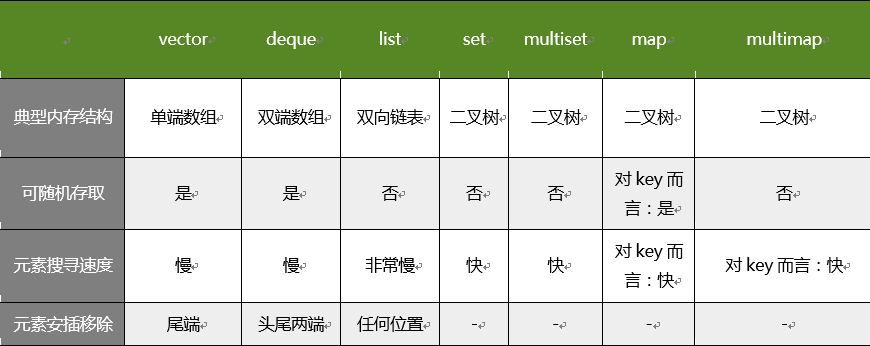

# STL

---
## 1 STL简介

STL(Standard Template Library,标准模板库)，是惠普实验室开发的一系列软件的统称。现在主要出现在c++中，但是在引入c++之前该技术已经存在很长时间了。

STL从广义上分为: 

- 容器(container) 
- 算法(algorithm) 
- 迭代器(iterator)

容器和算法之间通过迭代器进行无缝连接。STL几乎所有的代码都采用了模板类或者模板函数，
这相比传统的由函数和类组成的库来说提供了更好的代码重用机会。在c++标准程序库中隶属于STL的占到了80%以上。

在c++标准中，STL被组织成以下13个头文件：

```
<algorithm>、<deque>、<functional>、<iterator>、<vector>、<list>、<map>、<memory>、<numeric>、<queue>、<set>、<stack> 和<utility>
```

STL的一个重要特点是数据结构和算法的分离。尽管这是个简单的概念，但是这种分离确实使得STL变得非常通用。
例如:在STL的vector容器中，可以放入元素、基础数据类型变量、元素的地址；STL的`sort() `排序函数可以用来操作vector,list等容器。


STL具有高可重用性，高性能，高移植性，跨平台的优点：

- 高可重用性：STL中几乎所有的代码都采用了模板类和模版函数的方式实现，这相比于传统的由函数和类组成的库来说提供了更好的代码重用机会。
- 高性能：如map可以高效地从十万条记录里面查找出指定的记录，因为map是采用红黑树的变体实现的。(红黑树是平横二叉树的一种)
- 高移植性：如在项目A上用STL编写的模块，可以直接移植到项目B上。
- 跨平台：如用windows的Visual Studio编写的代码可以在Mac OS的XCode上直接编译。

### STL三大组件介绍

#### 容器概念介绍

STL中容器是指存储有限数据元素的一种数据结构。比如栈(stack)，队列(queue)...，那么什么是数据结构，我们研究把数据按照特定的方式排列起来，
便于我们查找、删除、排序或者其他一些目的，这种不同的排列方式我们就可以叫数据结构。STL中容器分为：序列式容器和关联式容器。

#### 迭代器介绍

迭代器（iterator）是一种对象，它能够用来遍历标准模板库容器中的部分或全部元素


#### 算法介绍

以有限的步骤，解决逻辑或者数学上的问题，这门学科我们就叫做算法。

STL提供的算法，都很高效，而且还有个最大的特点，可复用性。STL提供了大约100个实现算法的模版函数，比如算法for_each将为指定序列中的每一个元素调用指定的函数等。
这样一来，只要我们熟悉了STL之后，许多代码可以被大大的化简，只需要通过调用一两个算法函数，就可以完成所需要的功能并大大地提升效率


---
## 2 常用容器

相关内容：

- `string`容器特性,及其相关API的使用
- `vector`容器特性,及其相关API的使用
- `deque`容器特性,及其相关API的使用
- `queue`容器特性,及其相关API的使用
- `stack`容器特性,及其相关API的使用
- `list`容器特性,及其相关API的使用
- `set/multiset`容器特性，及其相关API的使用
- `map/multiset`容器特性，及其相关API的使用
- 函数对象的概念

### 2.1 string容器

说到string的特性，就不得不和char*类型的字符串的对比：
    
- char*是一个指针，String是一个类
- string封装了char*，管理这个字符串，是一个char*型的容器
- String封装了很多实用的成员方法
- string管理char*所分配的内存。每一次string的复制，取值都由string类负责维护，不用担心复制越界和取值越界等

#### string初始化

```
string();//创建一个空的字符串 例如: string str;      
string(const string& str);//使用一个string对象初始化另一个string对象
string(const char* s);//使用字符串s初始化
string(int n, char c);//使用n个字符c初始化 
//例子:
//默认构造函数
string s1;
//拷贝构造函数
string s2(s1);
string s2 = s1;
//带参数构造函数
char* str = "itcast";
string s3(str);
string s4(10, 'a');
```
#### 赋值操作
```
string& operator=(const char* s);//char*类型字符串 赋值给当前的字符串
string& operator=(const string &s);//把字符串s赋给当前的字符串
string& operator=(char c);//字符赋值给当前的字符串
string& assign(const char *s);//把字符串s赋给当前的字符串
string& assign(const char *s, int n);//把字符串s的前n个字符赋给当前的字符串
string& assign(const string &s);//把字符串s赋给当前字符串
string& assign(int n, char c);//用n个字符c赋给当前字符串
string& assign(const string &s, int start, int n);//将s从start开始n个字符赋值给字符串
```
#### string存取字符操作
```
char& operator[](int n);//通过[]方式取字符
char& at(int n);//通过at方法获取字符
//at访问越界会抛出异常，[]越界会直接程序会挂掉。
string s = "itcast";
char c = s[1];
c = s.at(1);
```
####  string拼接操作
```
string& operator+=(const string& str);//重载+=操作符
string& operator+=(const char* str);//重载+=操作符
string& operator+=(const char c);//重载+=操作符
string& append(const char *s);//把字符串s连接到当前字符串结尾
string& append(const char *s, int n);//把字符串s的前n个字符连接到当前字符串结尾
string& append(const string &s);//同operator+=()
string& append(const string &s, int pos, int n);//把字符串s中从pos开始的n个字符连接到当前字符串结尾
string& append(int n, char c);//在当前字符串结尾添加n个字符c
```
#### string查找和替换
```
int find(const string& str, int pos = 0) const; //查找str第一次出现位置,从pos开始查找
int find(const char* s, int pos = 0) const;  //查找s第一次出现位置,从pos开始查找
int find(const char* s, int pos, int n) const;  //从pos位置查找s的前n个字符第一次位置
int find(const char c, int pos = 0) const;  //查找字符c第一次出现位置
int rfind(const string& str, int pos = npos) const;//查找str最后一次位置,从pos开始查找
int rfind(const char* s, int pos = npos) const;//查找s最后一次出现位置,从pos开始查找
int rfind(const char* s, int pos, int n) const;//从pos查找s的前n个字符最后一次位置
int rfind(const char c, int pos = 0) const; //查找字符c最后一次出现位置
string& replace(int pos, int n, const string& str); //替换从pos开始n个字符为字符串str
string& replace(int pos, int n, const char* s); //替换从pos开始的n个字符为字符串s
```
#### string比较操作
```
/*
compare函数在>时返回 1，<时返回 -1，==时返回 0。
比较区分大小写，比较时参考字典顺序，排越前面的越小。
大写的A比小写的a小。
*/
int compare(const string &s) const;//与字符串s比较
int compare(const char *s) const;//与字符串s比较
```
####  string子串
``` 
string substr(int pos = 0, int n = npos) const;//返回由pos开始的n个字符组成的字符串
```

#### string插入和删除操作
```
string& insert(int pos, const char* s); //插入字符串
string& insert(int pos, const string& str); //插入字符串
string& insert(int pos, int n, char c);//在指定位置插入n个字符c
string& erase(int pos, int n = npos);//删除从Pos开始的n个字符 
```

### 2.2 vector容器

vector容器是一个长度动态改变的动态数组，既然也是数组，那么其内存是一段连续的内存，具有数组的随机存取的优点。

- vector是动态数组，连续内存空间，具有随机存取效率高的优点。
- vector是单口容器，在队尾插入和删除元素效率高，在指定位置插入会导致数据元素移动，效率低。
- 当vector空间满的时候，再当插入新元素的时候，vector会重新申请一块更大的内存空间，将原空间数据拷贝到新的内存空间，然后释放旧的内存空间，再将新元素插入到新空间中，以此可以看出vector的空间动态增长效率较低。


####  vector构造函数
```
vector<T> v; //采用模板实现类实现，默认构造函数
vector(v.begin(), v.end());//将v[begin(), end())区间中的元素拷贝给本身。
vector(n, elem);//构造函数将n个elem拷贝给本身。
vector(const vector &vec);//拷贝构造函数。

//例子：使用第二个构造函数 我们可以...
int arr[] = {2,3,4,1,9};
vector<int> v1(arr, arr + sizeof(arr) / sizeof(int)); 
```
#### vector常用赋值操作
```
assign(beg, end);//将[beg, end)区间中的数据拷贝赋值给本身。
assign(n, elem);//将n个elem拷贝赋值给本身。
vector& operator=(const vector  &vec);//重载等号操作符
swap(vec);// 将vec与本身的元素互换。

//第一个赋值函数，可以这么写：
int arr[] = { 0, 1, 2, 3, 4 };
assign(arr, arr + 5);//使用数组初始化vector
```
#### vector大小操作
```
size();//返回容器中元素的个数
empty();//判断容器是否为空
resize(int num);//重新指定容器的长度为num，若容器变长，则以默认值填充新位置。如果容器变短，则末尾超出容器长度的元素被删除。
resize(int num, elem);//重新指定容器的长度为num，若容器变长，则以elem值填充新位置。如果容器变短，则末尾超出容器长>度的元素被删除。
capacity();//容器的容量
reserve(int len);//容器预留len个元素长度，预留位置不初始化，元素不可访问。
```
 
- resize 若容器变长，则以默认值填充新位置。如果容器变短，则末尾超出容器长度的元素被删除。
- reserve和resize的区别？reserve是容器预留空间，但在空间内不真正创建元素对象，所以在没有添加新的对象之前，不能引用容器内的元素，
resize是改变容器的大小，且在创建对象，因此，调用这个函数之后，就可以引用容器内的对象了.


####  vector数据存取操作
```
at(int idx); //返回索引idx所指的数据，如果idx越界，抛出out_of_range异常。
operator[];//返回索引idx所指的数据，越界时，运行直接报错
front();//返回容器中第一个数据元素
back();//返回容器中最后一个数据元素
```
#### vector插入和删除操作
```
insert(const_iterator pos, int count,ele);//迭代器指向位置pos插入count个元素ele.
push_back(ele); //尾部插入元素ele
pop_back();//删除最后一个元素
erase(const_iterator start, const_iterator end);//删除迭代器从start到end之间的元素
erase(const_iterator pos);//删除迭代器指向的元素
clear();//删除容器中所有元素
```

###  2.3  deque容器

deque是“double-ended queue”的缩写,和vector一样，deque也支持随机存取。vector是单向开口的连续性空间，deque则是一种双向开口的连续性空间，
所谓双向开口，意思是可以在头尾两端分别做元素的插入和删除操作，vector当然也可以在头尾两端进行插入和删除操作，但是头部插入和删除操作效率奇差，无法被接受。

deque和vector的最大差异：

1. 一在于deque允许常数时间内对头端进行元素插入和删除操作。
1. 二在于deque没有容量的概念，因为它是动态的以分段的连续空间组合而成，随时可以增加一段新的空间并链接起来，换句话说，
像vector那样“因旧空间不足而重新分配一块更大的空间，然后再复制元素，释放空间”这样的操作不会发生在deque身上，也因此deque没有必要提供所谓的空间保留功能。


#### deque构造函数
```
vector<T> v; //采用模板实现类实现，默认构造函数
vector(v.begin(), v.end());//将v[begin(), end())区间中的元素拷贝给本身。
vector(n, elem);//构造函数将n个elem拷贝给本身。
vector(const vector &vec);//拷贝构造函数。

//例子 使用第二个构造函数 我们可以...
int arr[] = {2,3,4,1,9};
vector<int> v1(arr, arr + sizeof(arr) / sizeof(int)); 
```

#### deque赋值操作
```
assign(beg, end);//将[beg, end)区间中的数据拷贝赋值给本身。
assign(n, elem);//将n个elem拷贝赋值给本身。
deque& operator=(const deque &deq); //重载等号操作符 
swap(deq);// 将deq与本身的元素互换
```
####  deque大小操作
```
deque.size();//返回容器中元素的个数
deque.empty();//判断容器是否为空
deque.resize(num);//重新指定容器的长度为num,若容器变长，则以默认值填充新位置。如果容器变短，则末尾超出容器长度的元素被删除。
deque.resize(num, elem); //重新指定容器的长度为num,若容器变长，则以elem值填充新位置,如果容器变短，则末尾超出容器长度的元素被删除。
```
#### deque双端插入和删除操作
```
push_back(elem);//在容器尾部添加一个数据
push_front(elem);//在容器头部插入一个数据
pop_back();//删除容器最后一个数据
pop_front();//删除容器第一个数据
```
####  deque数据存取
```
at(idx);//返回索引idx所指的数据，如果idx越界，抛出out_of_range。
operator[];//返回索引idx所指的数据，如果idx越界，不抛出异常，直接出错。
front();//返回第一个数据。
back();//返回最后一个数据
```
####  deque插入操作
```
insert(pos,elem);//在pos位置插入一个elem元素的拷贝，返回新数据的位置。
insert(pos,n,elem);//在pos位置插入n个elem数据，无返回值。
insert(pos,beg,end);//在pos位置插入[beg,end)区间的数据，无返回值。
```

 deque是分段连续的内存空间，通过中控器维持一种连续内存空间的状态，其实现复杂性要大于vector queue stack等容器，
 其迭代器的实现也更加复杂，在需要对deque容器元素进行排序的时候，建议先将deque容器中数据数据元素拷贝到vector容器中，
 对vector进行排序，然后再将排序完成的数据拷贝回deque容器。
 

#### deque删除操作
```
clear();//移除容器的所有数据
erase(beg,end);//删除[beg,end)区间的数据，返回下一个数据的位置。
erase(pos);//删除pos位置的数据，返回下一个数据的位置。
```

### 2.4  stack特性

stack是一种先进后出(first in last out,FILO)的数据结构，它只有一个出口，stack只允许在栈顶新增元素，移除元素，获得顶端元素，
但是除了顶端之外，其他地方不允许存取元素，只有栈顶元素可以被外界使用，也就是说stack不具有遍历行为，没有迭代器。


#### stack构造函数
```
stack<T> stkT;//stack采用模板类实现， stack对象的默认构造形式： 
stack(const stack &stk);//拷贝构造函数
```
#### stack赋值操作
```
stack& operator=(const stack &stk);//重载等号操作符
```
#### stack数据存取操作
```
push(elem);//向栈顶添加元素
pop();//从栈顶移除第一个元素
top();//返回栈顶元素
```
#### stack大小操作
```
empty();//判断堆栈是否为空
size();//返回堆栈的大小
```

### 2.5 queue

queue是一种先进先出(first in first out, FIFO)的数据类型,他有两个口，数据元素只能从一个口进，
从另一个口出.队列只允许从队尾加入元素，队头删除元素，必须符合先进先出的原则，queue和stack一样不具有遍历行为，不能随机存取。


#### queue构造函数
```
queue<T> queT;//queue采用模板类实现，queue对象的默认构造形式：
queue(const queue &que);//拷贝构造函数
```

#### queue存取、插入和删除操作
```
push(elem);//往队尾添加元素
pop();//从队头移除第一个元素
back();//返回最后一个元素
front();//返回第一个元素
```
#### queue赋值操作
```
queue& operator=(const queue &que);//重载等号操作z
```
#### queue大小操作
```
empty();//判断队列是否为空
size();//返回队列的大小
```

### 2.6 list容器

链表是一种物理存储单元上非连续、非顺序的存储结构，数据元素的逻辑顺序是通过链表中的指针链接次序实现的。链表由一系列节点（链表中每一个元素称为节点）组成，节点可以在运行时动态生成。每个节点包括两个部分：一个是存储数据元素的数据域，另一个是存储下一个节点地址的指针域。

- 采用动态存储分配，不会造成内存浪费和溢出
- 链表执行插入和删除操作十分方便，修改指针即可，不需要移动大量元素
- 链表灵活，但是空间和时间额外耗费较大

#### list构造函数
```
list<T> lstT;//list采用采用模板类实现,对象的默认构造形式：
list(beg,end);//构造函数将[beg, end)区间中的元素拷贝给本身。
list(n,elem);//构造函数将n个elem拷贝给本身。
list(const list &lst);//拷贝构造函数。
```
####  list数据元素插入和删除操作
```
push_back(elem);//在容器尾部加入一个元素
pop_back();//删除容器中最后一个元素
push_front(elem);//在容器开头插入一个元素
pop_front();//从容器开头移除第一个元素
insert(pos,elem);//在pos位置插elem元素的拷贝，返回新数据的位置。
insert(pos,n,elem);//在pos位置插入n个elem数据，无返回值。
insert(pos,beg,end);//在pos位置插入[beg,end)区间的数据，无返回值。
clear();//移除容器的所有数据
erase(beg,end);//删除[beg,end)区间的数据，返回下一个数据的位置。
erase(pos);//删除pos位置的数据，返回下一个数据的位置。
remove(elem);//删除容器中所有与elem值匹配的元素。
```
#### list大小操作
```
size();//返回容器中元素的个数
empty();//判断容器是否为空
resize(num);//重新指定容器的长度为num，若容器变长，则以默认值填充新位置。如果容器变短，则末尾超出容器长度的元素被删除。
resize(num, elem);//重新指定容器的长度为num，若容器变长，则以elem值填充新位置。如果容器变短，则末尾超出容器长度的元素被删除。
```

#### list赋值操作
```
assign(beg, end);//将[beg, end)区间中的数据拷贝赋值给本身。
assign(n, elem);//将n个elem拷贝赋值给本身。
list& operator=(const list &lst);//重载等号操作符
swap(lst);//将lst与本身的元素互换。
```

#### list数据的存取
```
front();//返回第一个元素。
back();//返回最后一个元素。
```

####  list反转排列排序
```
reverse();//反转链表，比如lst包含1,3,5元素，运行此方法后，lst就包含5,3,1元素。
sort(); //list排序
```

#### 链表和数组有什么区别

- 数组必须事先定义固定的长度（元素个数），不能适应数据动态地增减的情况。当数据增加时，可能超出原先定义的元素个数；当数据减少时，造成内存浪费。
- 链表动态地进行存储分配，可以适应数据动态地增减的情况，且可以方便地插入、删除数据元素。（数组中插入、删除数据项时，需要移动其它数据项）

### 2.7 set/multiset容器

set/multiset的特性是所有元素会根据元素的值自动进行排序。set是以RB-tree（红黑树，平衡二叉树的一种）为底层机制，其查找效率非常好。
**set容器中不允许重复元素,multiset允许重复元素。**

不可以通过set的迭代器改变元素的值吗，因为set集合是根据元素值进行排序，关系到set的排序规则，如果任意改变set的元素值，会严重破坏set组织。


#### set构造函数
```
set<T> st;//set默认构造函数：
mulitset<T> mst; //multiset默认构造函数: 
set(const set &st);//拷贝构造函数
```

#### set大小操作
```
size();//返回容器中元素的数目
empty();//判断容器是否为空
```


#### set插入和删除操作
```
insert(elem);//在容器中插入元素。
clear();//清除所有元素
erase(pos);//删除pos迭代器所指的元素，返回下一个元素的迭代器。
erase(beg, end);//删除区间[beg,end)的所有元素 ，返回下一个元素的迭代器。
erase(elem);//删除容器中值为elem的元素。
```

#### set查找操作
```
find(key);//查找键key是否存在,若存在，返回该键的元素的迭代器；若不存在，返回map.end();
lower_bound(keyElem);//返回第一个key>=keyElem元素的迭代器。
upper_bound(keyElem);//返回第一个key>keyElem元素的迭代器。
equal_range(keyElem);//返回容器中key与keyElem相等的上下限的两个迭代器。
```

#### set元素排序

往set中添加元素后，我们发现打印出来set集合中的元素是从小到大的升序排列，那么我们如何指定排序为降序呢？需要了解函数对象的概念。


### 2.8 map/multimap容器

map相对于set区别，map具有键值和实值，所有元素根据键值自动排序。pair的第一元素被称为键值，第二元素被称为实值。map也是以红黑树为底层实现机制。
map和multimap区别在于，map不允许相同key值存在，multimap则允许相同key值存在。

#### 对组

对组(pair)将一对值组合成一个值，这一对值可以具有不同的数据类型，两个值可以分别用pair的两个公有函数first和second访问。

类模板：`template <class T1, class T2> struct pair`

```
//第一种方法创建一个对组
pair<string, int> pair1(string("name"), 20);
cout << pair1.first << endl; //访问pair第一个值
cout << pair1.second << endl;//访问pair第二个值
//第二种
pair<string, int> pair2 = make_pair("name", 30);
cout << pair2.first << endl;
cout << pair2.second << endl;
//pair=赋值
pair<string, int> pair3 = pair2;
cout << pair3.first << endl;
cout << pair3.second << endl;
```

####  map构造函数
```
map<T1, T2> mapTT;//map默认构造函数: 
map(const map &mp);//拷贝构造函数
```

####  map赋值操作
```
map& operator=(const map &mp);//重载等号操作符
swap(mp);//交换两个集合容器
```

#### map大小操作
```
size();//返回容器中元素的数目
empty();//判断容器是否为空

```

#### map插入数据元素操作
```
map.insert(...); //往容器插入元素，返回pair<iterator,bool>
map<int, string> mapStu;
// 第一种 通过pair的方式插入对象
mapStu.insert(pair<int, string>(3, "小张"));
// 第二种 通过pair的方式插入对象
mapStu.inset(make_pair(-1, "校长"));
// 第三种 通过value_type的方式插入对象
mapStu.insert(map<int, string>::value_type(1, "小李"));
// 第四种 通过数组的方式插入值
mapStu[3] = "小刘";
mapStu[5] = "小王";
```
注意：
- 前三种方法，采用的是`insert()`方法，该方法返回值为`pair<iterator,bool>`
- 第四种方法非常直观，但存在一个性能的问题。插入3时，先在mapStu中查找主键为3的项，若没发现，则将一个键为3，值为初始化值的对组插入到mapStu中，然后再将值修改成“小刘”。若发现已存在3这个键，则修改这个键对应的value。
- `string strName = mapStu[2];`//取操作或插入操作，只有当mapStu存在2这个键时才是正确的取操作，否则会自动插入一个实例，    键为2，值为初始化值。


#### map删除操作
```
clear();//删除所有元素
erase(pos);//删除pos迭代器所指的元素，返回下一个元素的迭代器。
erase(beg,end);//删除区间[beg,end)的所有元素 ，返回下一个元素的迭代器。
erase(keyElem);//删除容器中key为keyElem的对组。
```

####  map查找操作
```
find(key);//查找键key是否存在,若存在，返回该键的元素的迭代器；/若不存在，返回map.end();
count(keyElem);//返回容器中key为keyElem的对组个数。对map来说，要么是0，要么是1。对multimap来说，值可能大于1。
lower_bound(keyElem);//返回第一个key<=keyElem元素的迭代器。
upper_bound(keyElem);//返回第一个key>keyElem元素的迭代器。
equal_range(keyElem);//返回容器中key与keyElem相等的上下限的两个迭代器。
```

### 2.9 STL容器共性机制

STL容器所提供的都是值(value)寓意，而非引用(reference)寓意，也就是说当我们给容器中插入元素的时候，容器内部实施了拷贝动作，将我们要插入的元素再另行拷贝一份放入到容器中，而不是将原数据元素直接放进容器中，**也就是说我们提供的元素必须能够被拷贝。**

- 除了queue和stack之外，每个容器都提供可返回迭代器的函数，运用返回的迭代器就可以访问元素。
- 通常STL不会抛出异常，需要使用者传入正确参数。
- 每个容器都提供了一个默认的构造函数和默认的拷贝构造函数。
- 大小相关的构造方法:  
    - `size()`返回容器中元素的个数 
    - `empty()`判断容器是否为空

#### 向容器中插入元素，需要注意元素的深拷贝与浅拷贝问题

```c++
#include<iostream>
#include<vector>

using namespace std;

class myclass{
public:
    myclass(char* data){
        int len = strlen(data) + 1; //计算传进来的字符串长度
        this->data = new char[len];  //在堆区分配了len字节内存
        strcpy(this->data, data); //将数据拷贝到我们在堆分配的内存中
    }
    //既然我们在堆区分配了内存，需要在析构函数中释放内存
    ~myclass(){
        delete[] this->data;
        this->data = NULL;
    }
private:
    char* data;
};

void test_deep_copy(){
    char* data = "abcd";
    myclass mc(data); //创建myclass的实例 并用char*字符串data初始化对象

    vector<myclass> v;//创建vector容器
    v.push_back(mc); //将mc实例插入到vector容器尾部
}

int main(){
    test_deep_copy(); //调用测试函数
    return 0;
}
```

在函数`test_deep_copy()`中创建了一个myclass对象，vector对象，这两个对象在函数`test_deep_copy()`执行完毕之后，会调用自身的析构函数，
而STL容器都是值引用，再向容器中加入元素的时候，实际上是对元数据进行了一份拷贝，将拷贝的数据放入到容器中。

由于我们没有提供拷贝构造函数,没有重载`=`操作符，vector对我们的mc对象进行的简单的浅拷贝，将拷贝的对象插入到容器中，导致我们的mc对象的data指针和容器中mc对象的拷贝对象中的data指针都指向了我们在堆区分配的内存，当函数结束，两个对象都调用了析构函数，先调用析构函数的对象成功释放了堆区内存，后调用析构函数的对象一释放，程序挂掉了。

原因在于两个指针指向了同一块堆区内存，这样会导致不可预知的结果，函数结束其中一个调用析构函数，销毁了data指向的内存空间，而另一个对象析构的时候就会挂掉。
问题的解决办法就是，**给我们的对象提供一个拷贝构造函数，并且重载=操作符,两个指针分别指向自己的那一块内存，互不影响。**


### 2.10 STL容器使用时机



- vector的使用场景：比如软件历史操作记录的存储，我们经常要查看历史记录，比如上一次的记录，上上次的记录，但却不会去删除记录，因为记录是事实的描述。
- deque的使用场景：比如排队购票系统，对排队者的存储可以采用deque，支持头端的快速移除，尾端的快速添加。如果采用vector，则头端移除时，会移动大量的数据，速度慢。
- vector与deque的比较：
    - 一：`vector.at()`比`deque.at()`效率高，比如`vector.at(0)`是固定的，deque的开始位置却是不固定的。
    - 二：如果有大量释放操作的话，vector花的时间更少，这跟二者的内部实现有关。
    - 三：deque支持头部的快速插入与快速移除，这是deque的优点。
- list的使用场景：比如公交车乘客的存储，随时可能有乘客下车，支持频繁的不确实位置元素的移除插入。
set的使用场景：比如对手机游戏的个人得分记录的存储，存储要求从高分到低分的顺序排列。 
- map的使用场景：比如按ID号存储十万个用户，想要快速要通过ID查找对应的用户。二叉树的查找效率，这时就体现出来了。如果是vector容器，最坏的情况下可能要遍历完整个容器才能找到该用户。

---
## 3 常用算法 

相关内容：
- 函数对象适配器
- 算法基本分类
- 常用遍历算法
- 常用查找算法
- 常用排序算法
- 常用拷贝和替换算法
- 常用算数生成算法
- 集合常用算法

### 3.1 函数对象

#### 函数对象的概念

重载函数调用操作符的类，其对象常称为函数对象（function object），即它们是行为类似函数的对象，也叫仿函数(functor),其实就是重载“()”操作符，使得类对象可以像函数那样调用。

注意:
1. 函数对象(仿函数)是一个类，不是一个函数。
2. 函数对象(仿函数)重载了”() ”操作符使得它可以像函数一样调用。

假定某个类有一个重载的operator()，而且重载的operator()要求获取一个参数，我们就将这个类称为“一元仿函数”（unary functor）；相反，如果重载的operator()要求获取两个参数，就将这个类称为“二元仿函数”（binary functor）。

示例：
```c++
#include<iostream>
#include<vector>
#include<algorithm>
#include<functional>

using namespace std;

class FuncObject01{
public:
    void operator()(){
        cout << "hello world" << endl;
    }
};

void FuncObject02(){
    cout << "hello world" << endl;
}

//函数对象概念
void test01(){
    FuncObject01 fobj;
    fobj();
    FuncObject02();
}

class FuncObject03{
public:
    int operator()(int a, int b){
        return a + b;
    }
};

int FuncObject04(int a,int b){
    return a + b;
}

//函数对象也可以像普通函数一样 具有返回值和参数
void test02(){
    FuncObject03 fobj;
    int ret = fobj(10,20);
    cout << "ret :" << ret << endl;

    ret = FuncObject04(10,20);
    cout << "ret :" << ret << endl;
}

//函数对象超出了普通函数的功能，可以具有保存函数调用状态
//例如 我们要统计函数调用次数
class FuncObject05{
public:
    FuncObject05() :count(0){}
    void operator()(){
        cout << "hello world" << endl;
        count++;
    }
    int count;
};

//普通函数要统计调用次数 需要一个全局变量
int g_count = 0;
void FuncObject06(){
    cout << "hello world" << endl;
    g_count++;
}

void test03(){
    FuncObject06();
    FuncObject06();
    cout << "函数调用次数：" << g_count << endl;

    //使用函数对象 不需要使用全局变量
    FuncObject05 fobj;
    fobj();
    fobj();
    fobj();
    cout << "函数调用次数：" << fobj.count << endl;
}

//函数对象做参数和返回值
class print{
public:
    print() :count(0){}
    void operator()(const int& val){
        cout << val << " ";
        count++;
    }
    int count;
};

void test04(){
    
    vector<int> v;
    v.push_back(1);
    v.push_back(3);
    v.push_back(5);
    v.push_back(2);

    //通过for_each算法 遍历容器元素
    print myprint;
    //函数对象做返回值和参数
    myprint = for_each(v.begin(), v.end(), myprint);
    cout << endl;

    cout << "函数对象调用次数:" << myprint.count << endl;
}

int main(){
    test01();
    test02();
    test03();
    test04();

    system("pause");
    return EXIT_SUCCESS;
```

#### 谓词概念

谓词是指普通函数或重载的operator()返回值是bool类型的函数对象(仿函数)。如果operator接受一个参数，那么叫做一元谓词,如果接受两个参数，那么叫做二元谓词，谓词可作为一个判断式。

示例：
```c++
struct myfuncobj01{
      bool operator(int v){}  //接受一个参数，并且返回值为Bool 即一元谓词
}
bool compare01(int v); //同样是叫做一元谓词

struct myfuncobj02{
      bool operator(int v1，int v2){}  //接受两个参数，返回值为Bool 即二元谓词
}
bool compare02(int v1，int v2); //同样是叫做二元谓词
```

- 一元函数对象 应用举例: `for_each`
- 一元谓词 应用举例：`find_if`
- 二元函数对象 应用举例: `transform`
- 二元谓词 应用举例 : `sort`

示例：
```
#include<iostream>
#include<vector>
#include<algorithm>
#include<functional>

using namespace std;

//一元函数对象
class print{
public:
    void operator()(const int& v){
        cout << v << " ";
    }
};

void test01(){
    vector<int> v;
    v.push_back(1);
    v.push_back(2);
    v.push_back(5);
    v.push_back(3);

    //一元函数对象
    for_each(v.begin(),v.end(), print());
    cout << endl;

}

//一元谓词
class mygreater{
public:
    bool operator()(const int& v){
        return v > 2;
    }
};

void test02(){
    vector<int> v;
    v.push_back(1);
    v.push_back(2);
    v.push_back(5);
    v.push_back(3);

    vector<int>::iterator it = find_if(v.begin(), v.end(), mygreater()); //匿名函数对象
    cout << *it << endl;
}

//二元函数对象
class myplus{
public:
    int operator()(int v1,int v2){
        return v1 + v2;
    }
};
void test03(){

    vector<int> v1, v2,v3;
    v1.push_back(3);
    v1.push_back(4);
    v1.push_back(5);

    v2.push_back(7);
    v2.push_back(8);
    v2.push_back(2);


    v3.resize(v1.size()+ v2.size()); // 给v3开辟空间

    transform(v1.begin(), v1.end(), v2.begin(),v3.begin(), myplus());
    for_each(v3.begin(), v3.end(), print());
    cout << endl;
}

//二元谓词
class mycompare{
public:
    bool operator()(int v1,int v2){
        return v1 > v2;
    }
};

void test04(){
    vector<int> v;
    v.push_back(1);
    v.push_back(2);
    v.push_back(5);
    v.push_back(3);

    sort(v.begin(), v.end(), mycompare());
    for_each(v.begin(), v.end(), print());
}

int main(){

    test01();
    test02();
    test03();
    test04();

    system("pause");
    return EXIT_SUCCESS;
}
```
#### 内建函数对象

STL内建了一些函数对象。分为:算数类函数对象,关系运算类函数对象，逻辑运算类仿函数。这些仿函数所产生的对象，用法和一般函数完全相同，当然我们还可以产生无名的临时对象来履行函数功能。使用内建函数对象，需要引入头文件 `#include<functional>`。

- 6个算数类函数对象，除了negate是一元运算，其他都是二元运算。
```
template<class T> T plus<T>//加法仿函数
template<class T> T minute<T>//减法仿函数
template<class T> T multiplies<T>//乘法仿函数
template<class T> T divides<T>//除法仿函数
template<class T> T modulus<T>//取模仿函数
template<class T> T negate<T>//取反仿函数
```
- 6个关系运算类函数对象，每一种都是二元运算。
```
template<class T> bool equal_to<T>//等于
template<class T> bool not_equal_to<T>//不等于
template<class T> bool greater<T>//大于
template<class T> bool greater_equal<T>//大于等于
template<class T> bool less<T>//小于
template<class T> bool less_equal<T>//小于等于
```
- 逻辑运算类运算函数，not为一元运算，其余为二元运算
```
template<class T> bool logical_and<T>//逻辑与
template<class T> bool logical_or<T>//逻辑或
template<class T> bool logical_not<T>//逻辑非
```

使用示例
```
//使用内建函数对象声明一个对象
plus<int> myPlus;
cout << myPlus(5, 3) << endl;
//使用匿名临时对象
cout << plus<int>()(5, 6) << endl;
sort排序使用预定义函数对象进行排序。
count_if equal_to 参数绑定
```

#### 函数对象适配器

函数对象适配器是完成一些配接工作，这些配接包括绑定(bind)，否定(negate)，以及对一般函数或成员函数的修饰，使其成为函数对象。

- bind1st ：将参数绑定为函数对象的第一个参数
- bind2nd ： 将参数绑定为函数对象的第二个参数
- not1 ：  对一元函数对象取反
- not2 : 对二元函数对象取反
- ptr_fun ： 将普通函数修饰成函数对象
- mem_fun ： 修饰成员函数
- mem_fun_ref ： 修饰成员函数

分类：
- 预定义函数对象
- 仿函数适配器`bind1st、bind2nd`
- 仿函数适配器`not1、not2`
- 仿函数适配器`ptr_fun`
- 成员函数适配器`mem_fun、mem_fun_ref`

示例：
```c++
#include<vector>
#include<string>
using namespace std;

/*
    template<class T> T plus<T>//加法仿函数
    template<class T> T minute<T>//减法仿函数
    template<class T> T multiplies<T>//乘法仿函数
    template<class T> T divides<T>//除法仿函数
    template<class T> T modulus<T>//取模仿函数
    template<class T> T negate<T>//取反仿函数
*/

//预定义函数对象
class print{
public:
    void operator()(int v){
        cout << v << "    ";
    }
};

void test01(){
    
    plus<int> myplus; //实例化一个对象
    int ret = myplus(10, 20);
    cout << "ret : " << ret << endl;

    cout << plus<int>()(30, 40) << endl;

    vector<int> v1, v2, v3;
    for (int i = 0; i < 10;i++){
        v1.push_back(i);
        v2.push_back(i + 1);
    }

    v3.resize(v1.size());
    transform(v1.begin(),v1.end(),v2.begin(),v3.begin(),plus<int>());

    for_each(v1.begin(), v1.end(), print());
    cout << endl;

    for_each(v2.begin(), v2.end(), print());
    cout << endl;

    for_each(v3.begin(), v3.end(), print());
    cout << endl;
}

//函数适配器bind1st bind2nd
//现在我有这个需求 在遍历容器的时候，我希望将容器中的值全部加上100之后显示出来，怎么做哇？
struct myprint : public binary_function<int,int,void>{   //二元函数对象 所以需要继承 binary_fucntion<参数类型,参数类型,返回值类型>
    void operator()(int v1 ,int v2) const{
        cout << v1 + v2 << " ";
    }
};

void test02(){
    
    vector<int> v;
    v.push_back(1);
    v.push_back(2);
    v.push_back(3);
    v.push_back(4);

    //我们直接给函数对象绑定参数 编译阶段就会报错
    //for_each(v.begin(), v.end(), bind2nd(myprint(),100));
    //如果我们想使用绑定适配器,需要我们自己的函数对象继承binary_function 或者 unary_function
    //根据我们函数对象是一元函数对象 还是二元函数对象
    for_each(v.begin(), v.end(), bind2nd(myprint(), 100));
    cout << endl;

    //总结：  bind1st和bind2nd区别?
    //bind1st ： 将参数绑定为函数对象的第一个参数
    //bind2nd ： 将参数绑定为函数对象的第二个参数
    //bind1st bind2nd将二元函数对象转为一元函数对象

}

//函数对象适配器 not1 not2
struct myprint02 {
    void operator()(int v1) const{
        cout << v1 << " ";
    }
};

void test03(){

    vector<int> v;
    v.push_back(2);
    v.push_back(1);
    v.push_back(5);
    v.push_back(4);
    
    vector<int>::iterator it =  find_if(v.begin(), v.end(), not1(bind2nd(less_equal<int>(), 2)));
    cout << "it:" << *it << endl;
    sort(v.begin(),v.end(),not2(greater<int>()));

    for_each(v.begin(), v.end(), myprint02());
    cout << endl;

    //not1 对一元函数对象取反
    //not2 对二元函数对象取反
}

//如何给一个普通函数使用绑定适配器(bind1st bind2nd)绑定一个参数？(拓展)
//ptr_fun
void myprint04(int v1,int v2){
    cout << v1 + v2 << " ";
}

void test04(){
    vector<int> v;
    v.push_back(2);
    v.push_back(1);
    v.push_back(5);
    v.push_back(4);
    //1 将普通函数适配成函数对象
    //2 然后通过绑定器绑定参数
    for_each(v.begin(), v.end(), bind2nd(ptr_fun(myprint04),100));
    cout << endl;
    //总结: ptr_fun 将普通函数转变为函数对象
}

//mem_fun mem_fun_ref
//如果我们容器中存储的是对象或者对象指针，如果能指定某个成员函数处理成员数据。
class student{
public:
    student(string name, int age) :name(name), age(age){}
    void print(){
        cout << "name:" << name << " age:" << age << endl;;
    }
    void print2(int a){
        cout << "name:" << name << " age:" << age << " a:" << a << endl;
    }
    int age;
    string name;
};

void test05(){
    //mem_fun : 如果存储的是对象指针，需要使用mem_fun
    vector<student*> v;
    student* s1 = new student("zhaosi",10);
    student* s2 = new student("liuneng", 20);
    student* s3 = new student("shenyang", 30);
    student* s4 = new student("xiaobao", 40);

    v.push_back(s1);
    v.push_back(s2);
    v.push_back(s3);
    v.push_back(s4);

    for_each(v.begin(), v.end(), mem_fun(&student::print));
    cout << "-----------------------------" << endl;

    //mem_fun_ref : 如果存储的是对象，需要使用mem_fun_ref

    vector<student> v2;
    v2.push_back(student("zhaosi",50));
    v2.push_back(student("liuneng", 60));
    v2.push_back(student("shenyang", 70));
    v2.push_back(student("xiaobao", 80));

    for_each(v2.begin(), v2.end(), mem_fun_ref(&student::print));
}


int main(){
    //test01();
    //test02();
    //test03();
    //test04();
    test05();

    system("pause");
    return EXIT_SUCCESS;
}
```


如果希望函数对象适配器能对我们自己编写的函数对象有效，我们需要根据我们的函数对象类型继承STL的父类对象。
如果你本身是二元函数对象则需要继承 
- 二元函数继承：`public binary_function<参数类型,参数类型,返回类型>`
- 一元函数继承：`public unary_function<参数类型,返回类型>`


### 3.2 算法概述

算法主要是由头文件`<algorithm> <functional> <numeric>`组成。

- `<algorithm>`是所有STL头文件中最大的一个,其中常用的功能涉及到比较、交换、查找、遍历、复制、修改、反转、排序、合并等...
- `<numeric>`体积很小，只包括在几个序列容器上进行的简单运算的模板函数.
- `<functional>`定义了一些模板类,用以声明函数对象

STL算法分为：**质变算法和非质变算法。**

所有的STL算法都作用在由迭代器[first,end)所标示出来的区间上，所谓质变算法，是指运算过程中会改变区间内的(迭代器所指)的元素内容。
比如，拷贝(copy)、互换(swap)、替换(replace)、填写(fill)、删除(remove)、排序(sort)等算法都属于此类。

非质变算法是指是指在运算过程中不会区间内(迭代器所指)的元素内容，比如查找(find)、计数(count)、遍历(for_each)、寻找极值(max, min)等，都属于此类。
但是如果你在`for_each`遍历每个元素的时候试图应用一个会改变元素内容的仿函数，那么元素当然也会改变。


#### 常用遍历算法
```
/*
    遍历算法 遍历容器元素
    @param beg 开始迭代器
    @param end 结束迭代器
    @param _callback  函数回调或者函数对象
    @return 函数对象
*/
for_each(iterator beg, iterator end, _callback);
/*
    transform算法 将指定容器区间元素搬运到另一容器中
    注意 : transform 不会给目标容器分配内存，所以需要我们提前分配好内存
    @param beg1 源容器开始迭代器
    @param end1 源容器结束迭代器
    @param beg2 目标容器开始迭代器
    @param _cakkback 回调函数或者函数对象
    @return 返回目标容器迭代器
*/
transform(iterator beg1, iterator end1, iterator beg2, _callbakc)
```

#### 常用查找算法
```
/*
    find算法 查找元素
    @param beg 容器开始迭代器
    @param end 容器结束迭代器
    @param value 查找的元素
    @return 返回查找元素的位置
*/
find(iterator beg, iterator end, value)
/*
    adjacent_find算法 查找相邻重复元素
    @param beg 容器开始迭代器
    @param end 容器结束迭代器
    @param  _callback 回调函数或者谓词(返回bool类型的函数对象)
    @return 返回相邻元素的第一个位置的迭代器
*/
adjacent_find(iterator beg, iterator end, _callback);
/*
    binary_search算法 二分查找法
    注意: 在无序序列中不可用
    @param beg 容器开始迭代器
    @param end 容器结束迭代器
    @param value 查找的元素
    @return bool 查找返回true 否则false
*/
bool binary_search(iterator beg, iterator end, value);
/*
    find_if算法 条件查找
    @param beg 容器开始迭代器
    @param end 容器结束迭代器
    @param  callback 回调函数或者谓词(返回bool类型的函数对象)
    @return bool 查找返回true 否则false
*/
find_if(iterator beg, iterator end, _callback);
/*
    count算法 统计元素出现次数
    @param beg 容器开始迭代器
    @param end 容器结束迭代器
    @param  value回调函数或者谓词(返回bool类型的函数对象)
    @return int返回元素个数
*/
count(iterator beg, iterator end, value);
/*
    count算法 统计元素出现次数
    @param beg 容器开始迭代器
    @param end 容器结束迭代器
    @param  callback 回调函数或者谓词(返回bool类型的函数对象)
    @return int返回元素个数
*/
count_if(iterator beg, iterator end, _callback);
```

#### 常用排序算法
```
/*
    merge算法 容器元素合并，并存储到另一容器中
    @param beg1 容器1开始迭代器
    @param end1 容器1结束迭代器
    @param beg2 容器2开始迭代器
    @param end2 容器2结束迭代器
    @param dest  目标容器开始迭代器
*/
merge(iterator beg1, iterator end1, iterator beg2, iterator end2, iterator dest)
/*
    sort算法 容器元素排序
    注意:两个容器必须是有序的
    @param beg 容器1开始迭代器
    @param end 容器1结束迭代器
    @param _callback 回调函数或者谓词(返回bool类型的函数对象)
*/
sort(iterator beg, iterator end, _callback)
/*
    sort算法 对指定范围内的元素随机调整次序
    @param beg 容器开始迭代器
    @param end 容器结束迭代器
*/
random_shuffle(iterator beg, iterator end)
/*
    reverse算法 反转指定范围的元素
    @param beg 容器开始迭代器
    @param end 容器结束迭代器
*/
reverse(iterator beg, iterator end)
```

#### 常用拷贝和替换算法
```
/*
    copy算法 将容器内指定范围的元素拷贝到另一容器中
    @param beg 容器开始迭代器
    @param end 容器结束迭代器
    @param dest 目标容器结束迭代器
*/
copy(iterator beg, iterator end, iterator dest)
/*
    replace算法 将容器内指定范围的旧元素修改为新元素
    @param beg 容器开始迭代器
    @param end 容器结束迭代器
    @param oldvalue 旧元素
    @param oldvalue 新元素
*/
replace(iterator beg, iterator end, oldvalue, newvalue)
/*
    replace_if算法 将容器内指定范围满足条件的元素替换为新元素
    @param beg 容器开始迭代器
    @param end 容器结束迭代器
    @param callback函数回调或者谓词(返回Bool类型的函数对象)
    @param oldvalue 新元素
*/
replace_if(iterator beg, iterator end, _callback, newvalue)
/*
    swap算法 互换两个容器的元素
    @param c1容器1
    @param c2容器2
*/
swap(container c1, container c2)
```

#### 常用算数生成算法
```
/*
    accumulate算法 计算容器元素累计总和
    @param beg 容器开始迭代器
    @param end 容器结束迭代器
    @param value累加值
*/
accumulate(iterator beg, iterator end, value)
/*
    fill算法 向容器中添加元素
    @param beg 容器开始迭代器
    @param end 容器结束迭代器
    @param value t填充元素
*/
fill(iterator beg, iterator end, value)
```
#### 常用集合算法
```
/*
    set_intersection算法 求两个set集合的交集
    注意:两个集合必须是有序序列
    @param beg1 容器1开始迭代器
    @param end1 容器1结束迭代器
    @param beg2 容器2开始迭代器
    @param end2 容器2结束迭代器
    @param dest  目标容器开始迭代器
    @return 目标容器的最后一个元素的迭代器地址
*/
set_intersection(iterator beg1, iterator end1, iterator beg2, iterator end2, iterator dest)
/*
    set_union算法 求两个set集合的并集
    注意:两个集合必须是有序序列
    @param beg1 容器1开始迭代器
    @param end1 容器1结束迭代器
    @param beg2 容器2开始迭代器
    @param end2 容器2结束迭代器
    @param dest  目标容器开始迭代器
    @return 目标容器的最后一个元素的迭代器地址
*/
set_union(iterator beg1, iterator end1, iterator beg2, iterator end2, iterator dest)
/*
    set_difference算法 求两个set集合的差集
    注意:两个集合必须是有序序列
    @param beg1 容器1开始迭代器
    @param end1 容器1结束迭代器
    @param beg2 容器2开始迭代器
    @param end2 容器2结束迭代器
    @param dest  目标容器开始迭代器
    @return 目标容器的最后一个元素的迭代器地址
*/
set_difference(iterator beg1, iterator end1, iterator beg2, iterator end2, iterator dest)

```

---
## 引用

- [C++基础教程完整版](http://yun.itheima.com/course/275.html)