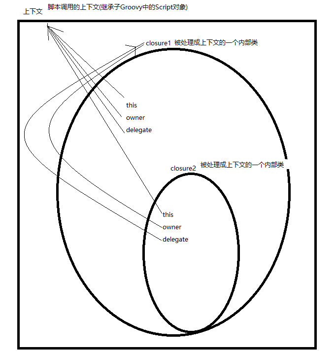

# 第四章：闭包

**闭包是轻量级的、短小的、简洁的、而且将会是我们在Groovy中使用最多的特性之一，过去我们需要传递匿名内部类，现在我们可以传递闭包.**

闭包是从函数式(一种编程规范，主要思想是把一些列运算写成一系列嵌套的函数调用)的Lambda表达式派生而来的，一个Lambda表达式指定了一个函数的参数与映射)派生而来的。

---
## 1 闭包基本语法

### 定义闭包

闭包是一种数据类型，代表一段可以执行的代码，其外形定义如下：
```groovy
    def aClosure1 = {
        //这个箭头很关键，箭头前面的是参数定义，箭头后面是代码
        String str1, int int1 ->
        //如果这是最后一句，其执行结果就是返回值，
        println "str1 = $str1, int1 = $int1"
    }

    def aClosure2 = {
        arg1, arg2 ->
            println(arg1 + "    -->     " + arg2)
            return 'aClosure2 end'//当然也可以使用return指定返回类型
    }


    def aClosureNoArgs = {//没有参数的闭包
        println("i am a Closure NoArgs ,no args")
        println(it)
    }

    def aStringClosure = {
        "Hello $it"
    }
```
简而言之，closure的定义格式如下：

1. `def xxx {args -> code}`
2. `def xxx {无参数 , 纯code}  不需要->`

果闭包没有参数定义的话，则隐含一个参数，这个参数名字叫it，和this的作用类似，用it代表闭包的参数

### 调用闭包

```groovy

    aClosure1.call("String1", 3)
    aClosure1("String1", 4)
    aClosureNoArgs.call(7)//虽然闭包没有定义参数，但是在调用的时候，可以传入一个参数
    println aClosure2.call(1, 3)
    println aStringClosure.call("Ztiany")
```

### 闭包使用注意

闭包在groovy中大量使用，比如很多类中都定义了一些函数，这些函数最后一个参数都是一个闭包，比如：
```
         public static <T> Iterable<T> each(Iterable<T> self, @ClosureParams(FirstParam.FirstGenericType.class) Closure closure) {
            each(self.iterator(), closure);
            return self;
        }
```
这个函数表示针对List的每一个元素都会调用closure做一些处理，这里的closure就有点回掉的感觉，但是在使用这个each函数的时候，我们传递一个怎样的闭包进去呢？
```
    def aList = [1, 2, "String1"]
    aList.each({//匿名闭包
        println(it)
    })
```
**在Groovy中，如果一个函数的最后一个值是闭包的话，那么调用这个函数可以不写圆括号**，比如：
```
    //与上面效果一样
    aList.each {
        println(it)
    }
```
先定义闭包，后传递闭包参数
```
    def aListClosure = {
        println(it)
    }
    aList.each(aListClosure)
```

下面语法很容易误解，所以需要特别注意
```
    def functionForClosure(int int1, String str, Closure closure) {
        closure(int1, str)
    }

    //调用functionForClosure函数
    functionForClosure 2, "Ztiany", {
        args1, arg2 ->
            println(args1 + "   ----   " + arg2)
    }
```
**闭包总是有返回值，返回值是闭包的最后一条语句执行结果，如果最后一条语句执行没有类型，则闭包的返回值为null**

---
## 2 闭包的便利性

实例：求一到某一个特定值n之间的所有偶数之和：

**Java的方式**
```java

def sum(int n) {
    total = 0;
    for (int i = 2; i <= n; i += 2) {
        total += i
    }
    total
}

println sum(10)

//现在需求变了，要求一个数到某一个特定值n之间的所有偶数之积，以是代码变成了这样的
def product(int n) {
    total = 1;
    for (int i = 2; i <= n; i += 2) {
        total *= i
    }
    total
}
println product(10)
//后面每次的需求变化，都需要更改代码
```
**Groovy的方式**

```groovy

Groovy的方式，上面计算方式都有一个共同点，从1到给定的数之间挑选出偶数，我们可以抽出这段代码：

def pickEven(int n, closure) {
    for (int i = 2; i <= n; i += 2) {
        closure(i)
    }
}

pickEven(10, {
    println it
})
```
pickEven是一个**高阶函数(以函数为参数，或者返回一个函数作为结果的函数)**，与前面方式一样pickEven对给定的值进行迭代，但不同的是pickEven把值发送给一个代码块，在groovy中我们称这种代码块为闭包(Closure),上面变量closure指向的是一个闭包的引用，可以像传递对象一样传递闭包，

```groovy

pickEven(10, {
    println it
})

上面表示将代码块{println it}传递给closure，就像把10传递给n一样，如果一个方法的最后一个参数是闭包，我们可以简写成一下方式：

pickEven 10,{
    println(it)
}
或者：
pickEven (10){//当方法的最后一个参数是闭包，可以让闭包附到方法的调用上
    println(it)
}
不同于Java的代码块，groovy的闭包不能单独存在，只能附到一个方法上或者赋值给一个变量。
```
**如果代码块只有一个参数，则可以使用it来引用这个参数，就像上面一样。与下面代码的意思是一样的**

```groovy
pickEven 10 , {
    n ->
        println n
}
```

了解完闭包，我们来使用闭包实现上面的求值:

```groovy
sum1 = 0;
pickEven(10){
    sum1 += it
}
product1 = 1;
pickEven(10){
    product1 *= it
}
println "sum1 = $sum1"
println "product1 = $product1"

```
除了语法上的优雅，闭包还为**函数的部分实现逻辑委托出去**提供了一种简单的方便的方式,上面演示的代码块中，闭包使用了变量product1，可见**闭包将触角伸到了pickEvent的调用者的作用域内**，这是闭包的一个有趣的特性，闭包是一个函数，这里变量都绑定到了一个上下文环境中，这个闭包函数就在其中。


---
## 3 闭包的应用

比好有两个擅长的领域：

1. 赋值清理资源
2. 赋值创建领域特定语言(DSL)

普通函数在实现某个目标明确的功能时优于闭包，重构是引入闭包的好时机，闭包应该保持短小，有内聚性，应该把闭包设计为附到调用方法上的上的一小段代码，最好不要乱用闭包的动态属性，比如在运行时确定参数的数目和类型。

---
## 4  闭包的使用方式

前面介绍了如何定义方法调用参数的参数时即时创建闭包，此外还可以将闭包赋值给变量：

```groovy

def totalSelectValue(n, closure) {
    total = 0
    for (i in 1..n) {
        if (closure.call(i)) {
            total += i
        }
    }
    total
}

def isOdd = {//闭包也不需要指明返回值，类似于方法
    it % 2 != 0
}
println totalSelectValue(20, isOdd)
```

### 向闭包传递参数

如何行闭包传递多个参数?当闭包只接受一个参数时，可以使用it引用参数，如果传递的参数多于一个，就需要通过名字一一列出，如下面例子：

```groovy
def tellFortune(closure) {
    closure(new Date("09/20/2012"), 'your day is filled with ceremony')
}

tellFortune() {
    data, str ->
        println "fortune for ${data} is '${str}'"
}
```
符号->将闭包的参数声明和闭包的主体分隔，同时闭包中也可以指定参数的类型，如果为参数选择表现力好的名字，通常可以避免定义类型，后面会看到，在元编程中可以使用闭包来覆盖或者替代方法，而在那种情况下类型信息对确定实现的正确性非常重要


### 使用闭包进行资源清理

对于某些资源密集型对象，通常可以看到有close或者destroy方法用于释放资源，但是使用这些类的人可能忘记调用这些方法，闭包可以确保这些方法被调用如：

```groovy
write = new FileWriter("out put.txt")
write.write("/")
//忘记调用write.close()
```

使用Groovy的withWriter方法重写这段代码，当从闭包返回时，withWriter会自刷新并关闭整个流

```groovy
new FileWriter("out.txt").withWriter {
    it.write('我叫Ztiany， 我正在学Groovy')
}
```
现在不必关心流的关闭了，我们可以集中精力完成工作，也可以在自己的类中实现这样的便捷方;
比如要给Resource类，希望在调用它的任何其他方法之前，先调用open方法，使用完成时还需要调用close方法释放资源


### Execute Around Method

如果有一对必须连续执行的动作，比如：**打开关闭**，我们就可以使用Execute Around Method模式：

编写一个Execute Around Method，它接受一个代码块，把该代码块的调用夹到多对方法的调用之间。使用者不必担心这对动作，它们会自动调用。

```groovy
class Resource1 {

    def isOpen = false

    def open() {
        isOpen = true
        println "open resource1"
    }

    def read() {
        check()
        println 'read source1'
    }

    def write() {
        check()
        println 'write source1'
    }

    def close() {
        check()
        println "close resource1"
    }

    static def use(closure) {
        def r = new Resource1()
        try {
            r.open()
            closure(r)
        }finally {
            r.close()
        }
    }

    private void check() {
        if (!isOpen) {
            throw new RuntimeException("you should call open before you call other methods")
        }
    }
}
//多亏了闭包，现在close的调用时自动的，确定性的！！！
Resource1.use(){
    it.read()
    it.write()
}
```


---
## 5 闭包与协程

调用一个函数或方法会在程序的执行序列中创建一个新的作用域，我们会在一个入口点进入函数，在方法完成之后，回到调用者的作用域。

**协程(Coroutine)则支持多个入口点**，每个入口点都是上次挂起调用的位置，我们可以进入一个函数，执行部分代码后挂起，在回到调用的位置的上下文或作用域内执行一个代码，之后我们可以在挂起的地方恢复该函数的执行。

```groovy

def iterate(n, closure) {
    1.upto(n) {
        println "in iterate with value $it"
        closure.call(it)
    }
}

total = 0
iterate(10){
    total += it
    println "in closure total so fir is $total"
}

//每次调用闭包，我们都会从上次调用中恢复total的值
```

---
## 6 科里化闭包

带有预绑定形参的闭包叫做科里化闭包，当对一个闭包调用`curry`时，就是要求预先绑定某些形参，在预先绑定一个形参后，调用这个闭包就没有必要为这个形参提供实参了。

```groovy
def tellFortunes(closure) {
    Date date = new Date()
    postFotrune = closure.curry(date)//预先绑定形参date
    postFotrune "you day is filled wih ceremony"
    postFotrune "they`re features , not bugs"
}

tellFortunes() {
    date, fortune ->
        println "fortune for $date is ${fortune}"//直接使用date
}
```
可以使用curry方法科里化任意多个形参，但这些形参必须是从前面开始的若干个参数。
也就是说，如果有n个形参，我们可以科里化前k个，其中`0<=k<=n`,如果要科里化形参中间的值，可以使用ncurry方法，传入要进行科里化的形参的位置和对应的值

---
## 7 动态闭包

可以确定一个闭包是否已经提供了，如果尚未提供，我们可以决定使用一个默认的实现来代替：

```groovy
def doSomthing(closure) {
    if (closure) {
        closure()
    } else {
        println "Using default implementation"
    }
}

doSomthing() {
    println "using specialized implementation"
}
doSomthing()
```
在传递参数是也很有灵活性，可以动态的确定一个表达所期望的参数的数目与类型：

```groovy
def completeOrder(amount, taxComputer) {
    tax = 0;
    if (taxComputer.maximumNumberOfParameters == 2) {
        //期望传入汇率 , maximumNumberOfParameters表示闭包接受的参数的个数
        tax = taxComputer.call(amount, 6.05)
    } else {
        tax = taxComputer.call(amount)
    }
}

println completeOrder(100) {
    it * 0.0825
}
println completeOrder(100) {
    amount, rate ->
        amount * (rate / 100)
}
```
还可以使用parameterTypes属性或者getParameterTypes方法获知这些参数的类型：

```groovy
def examine(closure) {
    println "$closure.maximumNumberOfParameters parameter(s) given:"
    for (aParameter in closure.parameterTypes) {
        println aParameter.name
    }
    println "--"
}

examine(){}
examine() {
    it
}
examine() {
    val ->
}
examine() {
    Date val1 ->
}
examine() {
    Date val1, val2 ->
}

examine() {
    Date val1, String val2 ->
}
```
**即使一个闭包没有声明任何形参,比如`{}`,其实他也会接受一个参数，如果调用者没有向闭包提供任何值，则第一个形参it为null，如果希望闭包不接受任何参数，可以使用`{->}`语法，在->之前没有任何形参**

```groovy
def closure{
         ->
   print "no arguments"
}
```


---
## 7 闭包的委托

Groovy中的闭包远远超出了简单的匿名方法，Groovy闭包支持方法委托，而且提供了方法分派的能力，这点和JavaScript对原型继承的支持很像，**this、owner、delegate是闭包的三个属性**，用于确定有哪个对象处理该闭包的方法调用，**一般而言，delegate会设置为owner，但是对其加以修改，可以挖掘出Groovy的一些非常好的元编程能力**：


```groovy
def examiningClosure(closure) {
    closure.call()
}

examiningClosure(){//调用上面定义的方法，传入我们的闭包

    println "in first closure:"
    println "class is "+getClass().name
    println "this is "+this+", super: "+this.getClass().superclass.name
    println "owner is "+owner+" , super: "+owner.getClass().superclass.name
    println "delegate is "+delegate+" , super: "+delegate.getClass().superclass.name

    examiningClosure(){//在闭包里面再次调用examiningClosure,再次传入闭包
        println "in  closure    with the first closure:"
        println "class is "+getClass().name
        println "this is "+this+", super: "+this.getClass().superclass.name
        println "owner is "+owner+" , super :"+owner.getClass().superclass.name
        println "delegate is "+delegate+" , super: "+delegate.getClass().superclass.name
    }
}
打印结果为：

in first closure:

class is         ztiany.chapter4._006ClosureDelegate$_run_closure1
this is          ztiany.chapter4._006ClosureDelegate@149e0f5d, super: groovy.lang.Script
owner is         ztiany.chapter4._006ClosureDelegate@149e0f5d , super: groovy.lang.Script
delegate is      ztiany.chapter4._006ClosureDelegate@149e0f5d , super: groovy.lang.Script

in  closure    with the first closure:
class is                     ztiany.chapter4._006ClosureDelegate$_run_closure1_closure2
this is                      ztiany.chapter4._006ClosureDelegate@149e0f5d, super: groovy.lang.Script
owner is                     ztiany.chapter4._006ClosureDelegate$_run_closure1@10e92f8f , super :groovy.lang.Closure
delegate is                  ztiany.chapter4._006ClosureDelegate$_run_closure1@10e92f8f , super: groovy.lang.Closure

```
上面打印了闭包的`this、owner、delegate`信息，由于第二个闭包是在第一个闭包中创建的，所以第一个闭包成了第二个闭包的owner。
通过代码和打印信息说明：闭包被创建成了内部类，此外还说名，delegate被设置为owner，某些函数会修改闭包的delegate，比如with方法，闭包内的this指向的是该闭包所绑定的对象(正在执行的上下文)，**在闭包内引用的变量和方法都会绑定到this，他负责处理任何方法的调用，以及任何属性或变量的访问，如果this无法处理，则转型owner，最后是delegate**




>无法修改闭包的owner属性

设置闭包的delegate属性可能会导致副作用，尤其是闭包还用与其他函数和线程时，如果完全肯定该闭包不会用在别的地方，那自然可以设置delegate，如果闭包用在了其他地方，则可以复制一个闭包，在副本上设置delegate，：

```groovy
def closure = {
    f1()
    f2()
}
def clone = closure.clone()
new Example().foo {clone}

//还可以更优化，加载with方法剋一次性完成这三个动作
new Example().with {
   //这里的闭包就会被clone
}
```

---
## 8 使用尾递归编写程序

使用递归会遇到一些问题(StackOverFlowError)，而是用Groovy的闭包可以获得递归的优势同时避免递归的问题,:例如：

```groovy
def factorial(BigDecimal number) {
    if (number == 1) {
        1
    }else {
        number * factorial(number -1)
    }
}


try {
    println "factorial of 5 is ${factorial(5)}"//计算5的阶乘
    println "number of bits in the result is ${factorial(5000).bitCount()}"//计算5000的阶乘
} catch (Throwable throwable) {
    println "caught ${throwable.class.name}"
}


结果是：
  factorial of 5 is120
  caught java.lang.StackOverflowError
```
可以把递归转换成迭代过程，Groovy闭包使用一个trampoline(蹦床)方法实现：


```groovy
Closure factorial

factorial = {
    int number , BigInteger theFactorial->
        number == 1?
                  theFactorial://返回1
                  factorial.trampoline(number-1,number*theFactorial)//返回一个trampolineClosure实例
}.trampoline()

println "factorial of 5 is ${factorial(5,1)}"//计算5的阶乘
println "number of bits in the result is ${factorial(5000,1).bitCount()}"//计算5000的阶乘
```
这里定义了一个变量factorial，并把一个闭包赋值给它，该闭包接受两个参数，一个是number，要计算的阶乘，一个是theFactorial，表示通过递归计算出的部分结果。

factorial变量本身被赋的就是在闭包上次掉用的那个trampoline方法的结果，Groovy上的这种尾递归实现：当我们调用trampoline方法时，该闭包会返回一个特殊类TrampolineClosure的一个实例，当我们向该闭包传递参数时，其实就是调用该对象的call方法，该方法使用了一个简单的for循环来调用闭包上的call方法，直到不产生trampolineClosure实例，这种技术在背后将递归转换成了一个简单的迭代

```groovy
// 带有参数的trampoline方法会curr化所传入的参数
    public Closure<V> trampoline(final Object... args) {
        return new TrampolineClosure<V>(this.curry(args));
    }

// trampolineClosure的call方法实现
  private V loop(final Object lastResult) {//传入1或者一个trampolineClosure实例
        Object result = lastResult;
        for (;;) {
            if (result instanceof TrampolineClosure) {//是trampolineClosure，继续调用original的call方法
                result = ((TrampolineClosure)result).original.call();/这里的参数已经被curry化了
            } else return (V) result;
        }
    }
```


使用Trampoline让我们避免了闭包的缺陷，但是这样一来简洁性也失去了，这里可以给BigInteger提供一个默认的值，
BigInteger = 1,调用者可以省略第二个参数，但是还需要在封装一层，防止他们传多个参数

```groovy
def factorialEnhance(int factorialFor) {
    def tailFactorial
    tailFactorial = {
        int number , BigInteger theFactorial = 1->
            number == 1?
                    theFactorial://返回1
                    tailFactorial.trampoline(number-1,number*theFactorial)//返回一个trampolineClosure实例
    }.trampoline()

    tailFactorial.call(factorialFor)
}
println "factorialEnhance 50 = " +factorialEnhance(50)
```
需要注意的是使用trampoline时，性能会有所折扣


---
## 9 使用记忆化改进性能

递归的本质是是使用子问题的解决方案来解决问题本身的方式，将问题分解为可以多次重复解决的若干部分，**在执行期间
我们将子问题的结果保存起来，当调用到重复的计算时，直接使用相同的值，这就避免了重复运算，这被称作动态规划**

卖杆业务：不同长度的杆子售价不同，我们会批发特定长度的杆子，比如说27英寸，然后将其分割成长度不一的杆销售，
已实现收入最大化：首先使用递归解决此问题，然后使用记忆化

```groovy

def timeIt(length, closure) {
    long start = System.nanoTime()
    println "max revenue for $length is ${closure(length)}"
    long end = System.nanoTime()
    println "time taken ${(end - start) / 1.0e9} seconds"
}


//定义一个列表，为各组长度的杆(0-30inch)的零售价，之所以包含0是为了弥合基于0的数组索引带来的问题（加入0后就可以以杆的长度来获取其价格了）
def radPrices = [
        0, 1, 3, 4, 5, 8, 9, 11, 12, 14,
        15, 15, 16, 18, 19, 15, 20, 21, 22, 24,
        25, 24, 26, 28, 29, 35, 37, 38, 39, 40
]
println radPrices.size()


def desiredLength = 27//desiredLength是我们采购的杆子的长度，如果直接售出其价格为：38
println radPrices[desiredLength]

//希望有一个程序来计算最优解
@Immutable
@ToString
class RevenueDetails {
    int revenue
    ArrayList splits

    RevenueDetails(int revenue, ArrayList splits) {
        this.revenue = revenue
        this.splits = splits
    }
}


//计算的方案是计算所有的可能性的值，取其中最大的值
def cutRad(prices, length) {
    if (length == 0) {
        new RevenueDetails(0, [])
    } else {
        def maxRevenueDetails = new RevenueDetails(Integer.MIN_VALUE, [])
        for (rodSize in 1..length) {
            def revenueFormSecondHalf = cutRad(prices, length - rodSize)
//1 length-1 , 2, length -2, 3, length-3,......

            def potentialRevenue = new RevenueDetails(
                    prices[rodSize] + revenueFormSecondHalf.revenue,
                    revenueFormSecondHalf.splits + rodSize
            )
            if (potentialRevenue.revenue > maxRevenueDetails.revenue) {
                maxRevenueDetails = potentialRevenue
            }
        }
        maxRevenueDetails

    }
}

timeIt desiredLength, {
    length ->
        cutRad( radPrices, length)
}
```
打印结果为：
max revenue for 27 is ztiany.chapter4.RevenueDetails(43, [5, 5, 5, 5, 5, 2])
time taken 59.813592001 senonds

**使用记忆进行优化**

```groovy
def cutRadOpt

cutRadOpt = {
    prices, length ->
        if (length == 0) {
            new RevenueDetails(0, [])
        } else {
            def maxRevenueDetails = new RevenueDetails(Integer.MIN_VALUE, [])
            for (rodSize in 1..length) {
                def revenueFormSecondHalf = cutRadOpt(prices, length - rodSize)
//1 length-1 , 2, length -2, 3, length-3,......

                def potentialRevenue = new RevenueDetails(
                        prices[rodSize] + revenueFormSecondHalf.revenue,
                        revenueFormSecondHalf.splits + rodSize
                )
                if (potentialRevenue.revenue > maxRevenueDetails.revenue) {
                    maxRevenueDetails = potentialRevenue
                }
            }
            maxRevenueDetails
        }
}.memoize()

timeIt desiredLength, {
    length ->
        cutRadOpt(radPrices, length)
}
```
打印结果为：
max revenue for 27 is ztiany.chapter4.RevenueDetails(43, [5, 5, 5, 5, 5, 2])
time taken 0.341842142 seconds


将函数保存为闭包，并在其上调用memoize方法后，这样就创建了一个Memoize类，该实例中有一个执行所提供闭包的引用，还有一个缓存结果，从结果可以看出，我们程序的性能的得到了大大的提升记忆话技术是以控件换取速度，处于内存的考虑，可以使用memoize的变种：memoizeAtMost方法代替，其使用lru淘汰算法。

变种方法包括：

-  memoizeAtLeast(final int protectedCacheSize)
-  memoizeAtMost(final int maxCacheSize)
-  memoizeBetween(final int protectedCacheSize, final int maxCacheSize)