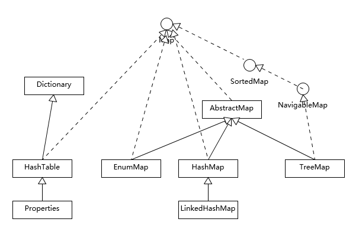
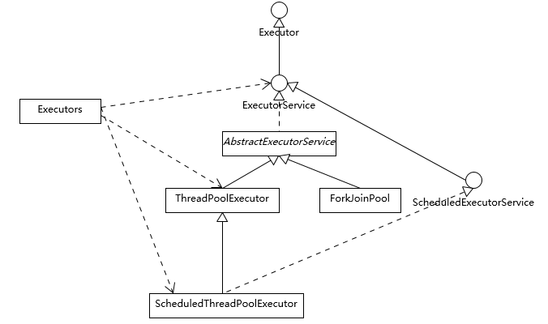
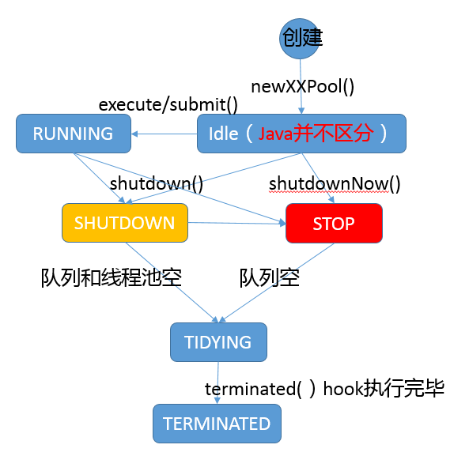
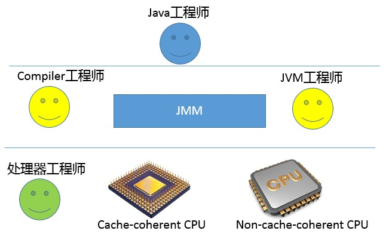

>[Java 核心技术 36 讲](https://time.geekbang.org/column/article/6478)总结，好吧，说总结还不如说是**摘录重点**。
- 几乎全部来行来自重点摘录，为了对专栏的内容有一个整体的概览
- 对全部 39 讲做了进一步分类，可以算作是对整个 Java 核心技术（当然肯定不完整）的一个概览
- 很多方面并没有深入，也无法在一个专栏或是一个重点摘录中进行深入，所以针对某个技术点，还是需要自行探索，专栏更多是起一个引导的作用
- 这里只是摘录了专栏重点部分，更推荐去订阅和精读这个专栏，那里更多精彩的内容，对你了解 Java 世界很有帮助，也为深入学习 java 作了很好的放心指引。

---
# 第一部分：Java 基础

- 01-01-谈谈你对Java平台的理解，“Java 是解释执行”，这句话正确吗？
- 02-Exception和Error有什么区别？
- 03-谈谈final、finally、 finalize有什么不同？
- 04-强引用、软引用、弱引用、幻象引用有什么区别？

---
## 1 谈谈你对Java平台的理解，“Java 是解释执行”，这句话正确吗？

Java 本身是一种面向对象的语言，最显著的特性有两个方面：

- **书写一次，到处运行**（Write once, run anywhere），能够非常容易地获得**跨平台**能力
- **垃圾收集**（GC, Garbage Collection），Java 通过垃圾收集器（Garbage Collector）回收分配内存，大部分情况下，程序员不需要自己操心内存的分配和回收。

<br/>掌握 Java 平台的哪些技术？

- **Java 语言特性**:包括泛型、Lambda 等语言特性；基础类库，包括集合、IO/NIO、网络、并发、安全等基础类库。
- **JVM 的一些基础概念和机制**：
    *   Java 的类加载机制，JDK 内嵌的 Class-Loader，例如 `Bootstrap、 Application 和 Extension Class-loader`
    *   类加载大致过程：`加载、验证、链接、初始化`；自定义 Class-Loader 等。
    *   垃圾收集的基本原理。
    *   最常见的垃圾收集器，如 `SerialGC、Parallel GC、 CMS、 G1` 等。
    *   不同垃圾收集器适用于什么样的工作负载。
- **JDK 工具 和 Java 领域内其他工具**:如编译器、运行时环境、安全工具、诊断和监控工具等。这些基本工具是日常工作效率的保证。

<br/>对于“Java 是解释执行”这句话，这个说法不太准确：

- 通常把 Java 分为**编译期和运行时**
    - 编译期：javac->class，**Java 通过字节码和 Java 虚拟机（JVM）这种跨平台的抽象，屏蔽了操作系统和硬件的细节，这也是实现“一次编译，到处执行”的基础。**
    - 运行期：在运行时，通过 Java 虚拟机（JVM）内嵌的解释器将字节码转换成为最终的机器码来执行，这是解释执行模式
- 除了解释执行之外，常见的 JVM 都提供了 **JIT（Just-In-Time）编译器**，也就是通常所说的**动态编译器**，JIT 能够在运行时将热点代码编译成机器码，这种情况下部分热点代码就属于编译执行，而不是解释执行了。
- 在 JVM 中，解释执行和编译执行是可以同时存在的，即混合模式

<br/>AOT 模式：

- 一种新的编译方式，即所谓的 AOT（Ahead-of-Time Compilation），直接将字节码编译成机器代码，这样就避免了 JIT 预热等各方面的开销，比如 Oracle JDK 9 就引入了实验性的 AOT 特性，并且增加了新的 jaotc 工具。

---
## 2 Exception 和 Error 有什么区别？

Java 异常体系：

- Exception 和 Error 都是继承了 Throwable 类，在 Java 中只有 Throwable 类型的实例才可以被抛出（throw）或者捕获（catch），它是异常处理机制的基本组成类型。

- Exception 和 Error 体现了 Java 平台设计者对不同异常情况的分类。
    - Exception 是程序正常运行中，可以预料的意外情况，可能并且应该被捕获，进行相应处理。
    - Error 是指在正常情况下，不大可能出现的情况，绝大部分的 Error 都会导致程序（比如 JVM 自身）处于非正常的、不可恢复状态。既然是非正常情况，所以不便于也不需要捕获，常见的比如 OutOfMemoryError 之类，都是 Error 的子类。
    
- Exception 又分为可检查（checked）异常和不检查（unchecked）异常：
    - 可检查异常在源代码里必须显式地进行捕获处理，这是编译期检查的一部分。
    - 不检查异常就是所谓的运行时异常，类似 `NullPointerException、ArrayIndexOutOfBoundsException`之类，通常是可以编码避免的逻辑错误，具体根据需要来判断是否需要捕获，并不会在编译期强制要求。

<br>如果掌握 Java 异常体系：

- 理解 Throwable、Exception、Error 的设计和分类
- 懂得如何处理典型场景

<br>异常处理实践

- 如何选择捕获异常的类型、生吞异常的弊端
    - **尽量不要捕获类似 Exception 这样的通用异常，而是应该捕获特定异常**。
    - **不要生吞（swallow）异常**。*   生吞异常，往往是基于假设这段代码可能不会发生，或者感觉忽略异常是无所谓的，但是千万不要在产品代码做这种假设！
- 异常如何输出
    - 在稍微复杂一点的生产系统中，标准出错（STERR）不是个合适的输出选项，因为你很难判断出到底输出到哪里去了。
    - 而对于分布式系统，如果发生异常，但是无法找到堆栈轨迹（stacktrace），这纯属是为诊断设置障碍。
    - 所以，**最好使用产品日志，详细地输出到日志系统里。**
- Throw early, catch late 原则
- throw early：有些异常不应该 catch，则应尽早暴露异常信息，即**在发现问题的时候，第一时间抛出，能够更加清晰地反映问题。**
- catch late：如何处理捕获后的异常
    - 最差的处理方式，就是生吞异常，本质上其实是掩盖问题。
    - 如果实在不知道如何处理，可以选择保留原有异常的 cause 信息，直接再抛出或者构建新的异常抛出去。在更高层面，因为有了清晰的（业务）逻辑，往往会更清楚合适的处理方式是什么。
    - 自定义异常，有的时候，我们会根据需要自定义异常，这个时候除了保证提供足够的信息，还有两点需要考虑：1 是否需要定义成 Checked Exception，因为这种类型设计的初衷更是为了从异常情况恢复，作为异常设计者，我们往往有充足信息进行分类；2 **在保证诊断信息足够的同时，也要考虑避免包含敏感信息**，类似 `java.net.ConnectException`，出错信息是类似“ Connection refused (Connection refused)”，而不包含具体的机器名、IP、端口等，一个重要考量就是信息安全。

<br/>关于受检测异常的业界争论

- 反面观点:，Java 语言的 Checked Exception 也许是个设计错误
    - Checked Exception 的假设是我们捕获了异常，然后恢复程序。但是，其实我们大多数情况下，根本就不可能恢复。Checked Exception 的使用，已经大大偏离了最初的设计目的。
    - Checked Exception 不兼容 functional 编程，如果你写过 Lambda/Stream 代码，相信深有体会
- 正面观点：没有必要矫枉过正，原因如下：
    *   确实有一些异常，比如和环境相关的 IO、网络等，其实是存在可恢复性的，
    *   Java 已经通过业界的海量实践，证明了其构建高质量软件的能力。

<br/>从性能角度来审视 Java 的异常处理机制

- `try-catch` 代码段会产生额外的性能开销，或者换个角度说，它往往会影响 JVM 对代码进行优化，所以**建议仅捕获有必要的代码**段，尽量不要一个大的 try 包住整段的代码。
- 不建议利用异常控制代码流程，因为这远比我们通常意义上的条件语句（if/else、switch）要低效
- Java 每实例化一个 Exception，都会对当时的栈进行快照，这是一个相对比较重的操作。如果发生的非常频繁，这个开销可就不能被忽略了。
- **当我们的服务出现反应变慢、吞吐量下降的时候，检查发生最频繁的 Exception 也是一种思路。**

<br>掌握 JDK 中定义的常见异常的含义，比如：

- NoClassDefFoundError 和 ClassNotFoundException 有什么区别，对于 NoClassDefFoundError ，做安卓开发的可能更加常见。
- UnsatisfiedLinkError：当 Java 虚拟机无法找到声明为 `native` 的方法的适当本地语言定义时，抛出该错误。
- ExceptionInInitializerError：静态初始化程序中发生意外异常的信号。抛出 `ExceptionInInitializerError` 表明在计算静态初始值或静态变量的初始值期间发生异常。

---
## 3 谈谈final、finally、 finalize有什么不同？

概要总结：

- **final**
    - 用来修饰类、方法、变量，分别有不同的意义
    - final 修饰的 class 代表不可以继承扩展，
    - final 的变量是不可以修改的
    - final 的方法也是不可以重写的（override）
- **finally**
    - 是 Java 保证重点代码一定要被执行的一种机制。
    - 可以使用 `try-finally` 或者 `try-catch-finally` 来进行类似关闭 JDBC 连接、保证 unlock 锁等动作。
- **finalize**
    *   Java 基础类 `java.lang.Object` 的一个方法，它的设计目的是保证对象在被垃圾收集前完成特定资源的回收。
    *   finalize 机制现在已经不推荐使用，并且在 JDK 9 开始被标记为 deprecated。

<br>关于 final：

- 使用 final 关键字来明确表示代码的语义、逻辑意图
    *   可以将方法或者类声明为 final，这样就可以明确告知别人，这些行为是不许修改的。
    *   在设计 API 是，定义某些类为 final 的。可以有效避免 API 使用者更改基础功能，某种程度上，这是保证平台安全的必要手段。
    *   使用 final 修饰参数或者变量，也可以清楚地避免意外赋值导致的编程错误。
    *   final 变量产生了某种程度的不可变（immutable）的效果，所以，可以用于保护只读数据，尤其是在并发编程中，因为明确地不能再赋值 final 变量，有利于减少额外的同步开销，也可以省去一些防御性拷贝的必要。
- 在日常开发中，除非有特别考虑，不然最好不要指望定义 `final类或方法` 这种小技巧带来的所谓性能好处，**程序最好是体现它的语义目的**。
- **final 不是 immutable**，Immutable 在很多场景是非常棒的选择，比如 Immutable 可以大大简化并发编程环境下的同步，Java 语言目前并没有原生的不可变支持，如果要实现 immutable 的类：
    *   将 class 自身声明为 final，这样别人就不能扩展来绕过限制了。
    *   将所有成员变量定义为 private 和 final，并且 private 变量不要实现 setter 方法。
    *   通常构造对象时，成员变量使用深度拷贝来初始化，而不是直接赋值，这是一种防御措施，因为无法确定输入对象不被其他人修改。
    *   如果确实需要实现 getter 方法，或者其他可能会返回内部状态的方法，使用 copy-on-write 原则，创建私有的 copy。

<br/>关于 finally

- 对于 finally，明确知道怎么使用就足够了。需要关闭的连接等资源，更推荐使用 Java 7 中添加的 `try-with-resources` 语句，因为通常 Java 平台能够更好地处理异常情况。
- 有一种情况 finally 代码不会被执行：`try { System.exit(1); } finally{ ... }`

<br/>关于 finalize

- finalize 方法是不被推荐使用的
- finalize 为什么不被推荐使用
    *   无法保证 finalize 什么时候执行，执行的是否符合预期。
    *   finalize 使用不当会影响性能，导致程序死锁、挂起等。
    *   finalize 的执行是和垃圾收集关联在一起的，一旦实现了非空的 finalize 方法，就会导致相应对象回收呈现数量级上的变慢，有人专门做过 benchmark（基准测试），大概是 40~50 倍的下降。
    *   finalize 被设计成在对象被垃圾收集前调用，这就意味着实现了 finalize 方法的对象是个“特殊公民”，JVM 要对它进行额外处理。finalize 本质上成为了快速回收的阻碍者，可能导致对象经过多个垃圾收集周期才能被回收。
    *   `System.runFinalization()`是不可预测、不能保证的，所以本质上还是不能指望。finalize 方法就会被执行。
    *   实践中，因为 finalize 拖慢垃圾收集，导致大量对象堆积，也是一种典型的导致 OOM 的原因。即就算 finalize 方法被执行了，如果 finalize 中有耗时或不当的操作，反而会影响垃圾回收。

<br>有什么机制可以替换 finalize：**Cleaner机制**

*   Java 平台目前在逐步使用 `java.lang.ref.Cleaner` 来替换掉原有的 finalize 实现。Cleaner 的实现利用了幻象引用（PhantomReference），这是一种常见的所谓 post-mortem(事后的) 清理机制。
*   如果熟悉 Java 的各种引用，利用幻象引用和引用队列，可以保证对象被彻底销毁前做一些类似资源回收的工作，比如关闭文件描述符（操作系统有限的资源），它比 finalize 更加轻量、更加可靠。
*   吸取了 finalize 里的教训，每个 Cleaner 的操作都是独立的，它有自己的运行线程，所以可以避免意外死锁等问题。
*   除此之外，很多第三方库自己直接利用幻象引用定制资源收集，比如广泛使用的 MySQL JDBC driver 之一的 mysql-connector-j，就利用了幻象引用机制。

<br/>扩展：copy-on-write 原则

- Copy-On-Write 简称 COW，是一种用于程序设计中的优化策略。其基本思路是，**从一开始大家都在共享同一个内容，当某个人想要修改这个内容的时候，才会真正把内容Copy出去形成一个新的内容然后再改，这是一种延时懒惰策略**。从JDK1.5开始Java并发包里提供了两个使用 CopyOnWrite 机制实现的并发容器,它们是 CopyOnWriteArrayList 和 CopyOnWriteArraySet 。CopyOnWrite 容器非常有用，可以在非常多的并发场景中使用到。

---
## 4 强引用、软引用、弱引用、幻象引用有什么区别？

四种引用的概要总结：

- **强引用**：所谓强引用（"Strong" Reference），就是我们最常见的普通对象引用，只要还有强引用指向一个对象，就能表明对象还“活着”，垃圾收集器不会碰这种对象。即使将要发生 OOM。
- **软引用**：
    *   软引用（SoftReference），是一种相对强引用弱化一些的引用，可以让对象豁免一些垃圾收集，只有当 JVM 认为内存不足时，才会去试图回收软引用指向的对象。
    *   JVM 会确保在抛出 OutOfMemoryError 之前，清理软引用指向的对象。
    *   软引用通常用来实现内存敏感的缓存，如果还有空闲内存，就可以暂时保留缓存，当内存不足时清理掉，这样就保证了使用缓存的同时，不会耗尽内存。
- **弱引用**：弱引用（WeakReference）是比软引用更弱化的一种引用，它并不能使对象豁免垃圾收集，仅仅是提供一种访问在弱引用状态下对象的途径。只要垃圾回收器发现了弱引用就有能回收它
- **幻象引用**：
    *   幻象引用（PhantomReference）有时候也翻译成虚引用，你不能通过它访问对象。
    *   幻象引用仅仅是提供了一种确保对象被 finalize 以后，做某些事情的机制，比如，通常用来做所谓的 Post-Mortem(死后的；事后的) 清理机制。
    *   也有人利用幻象引用监控对象的创建和销毁。

<br>Java 定义的不同可达性级别（reachability level），具体如下：

*   强可达（Strongly Reachable），就是当一个对象可以有一个或多个线程可以不通过各种引用访问到的情况。比如，我们新创建一个对象，那么创建它的线程对它就是强可达。
*   软可达（Softly Reachable），就是当我们只能通过软引用才能访问到对象的状态。
*   弱可达（Weakly Reachable），就是无法通过强引用或者软引用访问，只能通过弱引用访问时的状态。**这是十分临近 finalize 状态的时机，当弱引用被清除的时候，就符合 finalize 的条件了。**
*   幻象可达（Phantom Reachable），就是没有强、软、弱引用关联，并且 finalize 过了，只有幻象引用指向这个对象的时候。


<br>处理好软引用、弱引用对象

- 除了幻象引用（因为 get 永远返回 null），如果对象还没有被销毁，都可以通过 get 方法获取原有对象。这意味着，利用软引用和弱引用，我们可以将访问到的对象，重新指向强引用
- 因为软引用、弱引用的对象可以重新指向强引用，对于软引用、弱引用之类，垃圾收集器可能会存在**二次确认**的问题，以保证处于弱引用状态的对象，没有改变为强引用。
- 在编程时间中，在处理软引用、弱引用的对象时，要防止错误的重新保持了该类对象强引用（比如，赋值给了 static 变量），那么对象可能就没有机会变回类似弱引用的可达性状态了，就会产生内存泄漏。
- 检查弱引用指向对象是否被垃圾收集，也是诊断是否有特定内存泄漏的一个思路，如果我们的框架使用到弱引用又怀疑有内存泄漏，就可以从这个角度检查。

<br>扩展：引用队列（ReferenceQueue）使用

- 我们在创建各种引用并关联到响应对象时，可以选择是否需要关联引用队列，JVM 会在特定时机将引用 enqueue 到队列里（enque发生在 finalize 之后），我们可以从队列里获取引用（remove 方法在这里实际是有获取的意思）进行相关后续逻辑。**编程实践中，对于幻象引用，get 方法只返回 null，如果不指定引用队列，基本上就没有意义。**
```
Object counter = new Object();
//引用队列
ReferenceQueue refQueue = new ReferenceQueue<>();
//创建一个关联引用队列的PhantomReference
PhantomReference<Object> p = new PhantomReference<>(counter, refQueue);
counter = null;
//在对象被GC的同时，会把该对象的包装类即 PhantomReference 放入到 ReferenceQueue 里面
System.gc();
try {
    // Remove 是一个阻塞方法，可以指定 timeout，或者选择一直阻塞
    Reference<Object> ref = refQueue.remove(1000L);
    if (ref != null) {
        // do something
    }
} catch (InterruptedException e) {
    // Handle it
}
```

<br/>诊断 JVM 引用情况

- 如果你怀疑应用存在引用（或 finalize）导致的回收问题，可以有很多工具或者选项可供选择。比如 HotSpot JVM 自身便提供了明确的选项（PrintReferenceGC）去获取相关信息：
```
# 指定了下面选项去使用 JDK 8 运行一个样例应用
-XX:+PrintGCDetails -XX:+PrintGCTimeStamps -XX:+PrintReferenceGC
```
- JDK 9 对 JVM 和垃圾收集日志进行了广泛的重构，类似 PrintGCTimeStamps 和 PrintReferenceGC 已经不再存在。

<br>**Reachability Fence**(栅栏；围栏)，为什么需要这种 Reachability Fence 机制？

1.  按照 Java 语言规范，如果一个对象没有指向强引用，就符合垃圾收集的标准，就有可能被回收
2.  有些时候，对象本身并没有强引用，但是也许它的部分属性还在被使用，这样就导致诡异的问题
3.  所以需要一个方法，在没有强引用情况下，通知 JVM 对象是在被使用的。


---
# 第二部分：编码与编译器优化

- 05-String、StringBuffer、StringBuilder有什么区别？
- 07-int和Integer有什么区别？谈谈 Integer 的值缓存范围。

---
## 1 String、StringBuffer、StringBuilder有什么区别？

String、StringBuffer、StringBuilder概要总结：

- **String**：
    *   String 是 Java 语言非常基础和重要的类，提供了构造和管理字符串的各种基本逻辑。
    *   String 是典型的 Immutable 类，被声明成为 final class，所有属性也都是 final 的。也由于它的不可变性，类似拼接、裁剪字符串等动作，都会产生新的 String 对象。
    *   由于字符串操作的普遍性和字符串本身的不可变性，所以相关操作的效率往往对应用性能有明显影响。
    *   由于 String 是不可变的，所以它是线程安全的。
    
- **StringBuffer**：
    *   StringBuffer是 Java 1.5 中新增的，为解决 String 拼接产生太多中间对象的问题而提供的一个类。
    *   可以用 append 或者 add 方法，把字符串添加到已有序列的末尾或者指定位置。
    *   StringBuffer 本质是一个线程安全的可修改字符序列，它保证了线程安全，也随之带来了额外的性能开销，所以除非有线程安全的需要，不然还是推荐使用它的后继者，也就是 StringBuilder。
    
- **StringBuilder**：
    *   StringBuilder 在能力上和 StringBuffer 没有本质区别，但是它去掉了线程安全的部分，有效减小了开销，是绝大部分情况下进行字符串拼接的首选。

<br>字符串设计和实现考量

- String 是 Immutable 类的典型实现，原生的保证了基础线程安全
- StringBuffer 细节
    - **线程安全**：StringBuffer 的线程安全是通过把各种修改数据的方法都加上 synchronized 关键字实现的，非常直白。
    - 一般情况下不必纠结于 synchronized 性能之类的，有人说**过早优化是万恶之源**，考虑可靠性、正确性和代码可读性才是大多数应用开发最重要的因素。
    **底层实现**：为了实现修改字符序列的目的，StringBuffer 和 StringBuilder 底层都是利用可修改的（char，JDK 9 以后是 byte）数组，二者都继承了 AbstractStringBuilder，里面包含了基本操作，区别仅在于最终的方法是否加了 synchronized。
    - **优化**：StringBuffer 和 StringBuilder 内部数组的长度默认为 16，如果确定拼接会发生非常多次，而且大概是可预计的，那么就可以指定合适的大小，避免很多次扩容的开销。扩容会产生多重开销，因为要抛弃原有数组，创建新的（可以简单认为是倍数）数组，还要进行 arraycopy。


<br>Javac 对 String 拼接的优化

- 很多时候你代码的逻辑与实际运行的逻辑是有区别的，原因在于 javac 和 jvm 会对部分代码进行优化
- 面对 String、StringBuffer、StringBuilder 三个可选的类，在具体的代码书写中，应该如何选择呢？
- 在没有线程安全问题的情况下，全部拼接操作是应该都用 StringBuider 实现吗？（要多敲很多字的，可读性也不理想）
- 在通常情况下，没有必要过于担心，要相信 Java 还是非常智能的。
- 在 JDK 8 中，字符串拼接操作会自动被 javac 转换为 StringBuilder 操作，(这里的编译优化仅能针对字面量拼接进行优化)
- 在 JDK 9 中，是因为 Java 9 为了更加统一字符串操作优化，提供了 StringConcatFactory，作为一个统一的入口。
- 所以：javac 自动生成的代码，虽然未必是最优化的，但普通场景也足够了，可以酌情选择。


<br>**字符串缓存**（重点）

- 把常见应用进行堆转储（Dump Heap），然后分析对象组成，会发现**平均 25% 的对象是字符串，并且其中约半数是重复**的。如果能避免创建重复字符串，可以有效降低内存消耗和对象创建开销。
- 字符串常量池：Java 中有 8 种基本类型和一种比较特殊的类型 String，对于这些类型的字面常量，JVM 会将它们直接存储在常量池中，这样可以在很大程度上节省内存和提高程序的运行效率。
- String 类型的常量池比较特殊。它的主要使用方法有两种：
    *   如果是直接使用双引号声明出来的 String 对象，即字符串字面常量，则会直接存储在常量池中。
    *   如果不是用双引号声明的 String 对象，可以使用 String 提供的 intern 方法。intern 方法会从字符串常量池中查询当前字符串是否存在，若不存在就会将当前字符串放入常量池中
- `intern()` 方法，目的是提示 JVM 把相应字符串缓存起来，以备重复使用。`intern()` 是一个 native 方法，其 API 文档说明为：“如果常量池中存在当前字符串, 就会直接返回当前字符串. 如果常量池中没有此字符串, 会将此字符串放入常量池中后, 再返回”
- 不同 JDK 版本的字符串常量池
    *   **在 Java6 中**：一般使用 Java 6 这种历史版本，并不推荐大量使用 intern，为什么呢？因为被缓存的字符串是存在所谓 PermGen 里的，也就是臭名昭著的“永久代”，这个空间是很有限的，也基本不会被 FullGC 之外的垃圾收集照顾到。所以，如果使用不当，OOM 就会光顾。
    *   **在 Java7 中**：字符串常量池已经从 Perm 区移到正常的 Java Heap 区域了，因为 PermGen 太小，而且 GC 一般不回收 PermGen 区，而把字符串常量池放在堆中，就极大避免了永久代占满的问题。
    *   **在 Java8 中**：永久代在 JDK 8 中被 MetaSpace（元数据区）替代了。而且，默认缓存大小也在不断地扩大中，从最初的 1009，到 7u40 以后被修改为 60013。
    *   由于不同版本的 JDK 对字符串常量池的实现存在差异，某些代码在不同版本的 JDK 上运行可能结果不一致，关于这一点，可以参考文章：[美团技术团队：深入解析String#intern](https://tech.meituan.com/in_depth_understanding_string_intern.html)

<br>字符串排重

- Intern 是一种**显式地排重机制**，但是它也有一定的副作用，因为需要开发者写代码时明确调用，一是不方便，每一个都显式调用是非常麻烦的；另外就是我们很难保证效率，应用开发阶段很难清楚地预计字符串的重复情况，有人认为这是一种污染代码的实践。
- 在 Oracle JDK 8u20 之后，推出了一个新的特性，也就是 G1 GC 下的字符串排重。它是通过将相同数据的字符串指向同一份数据来做到的，是 JVM 底层的改变，并不需要 Java 类库做什么修改。这个功能目前是默认关闭的，需要使用 `-XX:+UseStringDeduplication` 参数开启，并且记得指定使用 G1 GC。


<br>Intrinsic(内在的；本身的) 机制

- 来自 JVM 底层的优化

<br>String 自身的演化

1. **使用 char 数组**：Java 的字符串，在历史版本中，它是使用 char 数组来存数据的，这样非常直接。但是 Java 中的 char 是两个 bytes 大小，拉丁语系语言的字符，根本就不需要太宽的 char，这样无区别的实现就造成了一定的浪费。密度是编程语言平台永恒的话题，因为归根结底绝大部分任务是要来操作数据的。
1. **使用 byte 数组**：
    - **改用Compact Strings 设计**：在 Java 9 中，引入了 Compact Strings 的设计，对字符串进行了大刀阔斧的改进。将数据存储方式从 char 数组，改变为一个 byte 数组加上一个标识编码的所谓 coder，并且将相关字符串操作类都进行了修改。另外，所有相关的 Intrinsic 之类也都进行了重写，以保证没有任何性能损失。
    - **可能的弊端**：在极端情况下，字符串也出现了一些能力退化，比如最大字符串的大小。原来 char 数组的实现，字符串的最大长度就是数组本身的长度限制，但是替换成 byte 数组，同样数组长度下，存储能力是退化了一倍的！还好这是存在于理论中的极限，还没有发现现实应用受此影响。

<br>编码相关的问题：很多字符串操作，比如 `getBytes()/String(byte[] bytes)` 等都是隐含着使用平台默认编码，这是一种好的实践吗？是否有利于避免乱码？

- `getBytes和String`相关的转换时根据业务需要**建议指定编码方式**
- 如果没有指定则看 JVM 参数里有没有指定 `file.encoding`
- 如果还没有则使用的默认编码就是运行的操作系统环境的编码
- 为了保证编码的确定性，**建议指定编码方式可以不依赖于不确定因素**

---
## 2 int和Integer有什么区别？谈谈 Integer 的值缓存范围。

int和Integer有什么区别？

- int 是整形数字，是 Java 的 8 个原始数据类型（Primitive Types，`boolean、byte 、short、char、int、float、double、long`）之一。Java 语言虽然号称一切都是对象，但原始数据类型是例外。
- Integer 是 int 对应的包装类，它有一个 int 类型的字段存储数据，并且提供了基本操作：
    *   数学运算、int 和字符串之间转换等。
    *   在 Java 5 中，引入了自动装箱和自动拆箱功能（boxing/unboxing），Java 可以根据上下文，自动进行转换，极大地简化了相关编程。

<br>**关于 Integer 的值缓存**

- Java 5 的改进。构建 Integer 对象的传统方式是直接调用构造器，直接 new 一个对象。但是根据实践，我们发现大部分数据操作都是集中在有限的、较小的数值范围，因而，在 Java 5 中新增了静态工厂方法 valueOf，在调用它的时候会利用一个缓存机制，带来了明显的性能改进。按照 Javadoc，这个值默认缓存是 -128 到 127 之间。


<br/>理解自动装箱、拆箱 与 性能考量

- 自动装箱实际上算是一种语法糖。什么是语法糖？可以简单理解为 Java 平台为我们自动进行了一些转换，保证不同的写法在运行时等价，它们发生在**编译阶段**，也就是生成的字节码是一致的。
- javac 替我们自动把装箱转换为 `Integer.valueOf()`，把拆箱替换为 `Integer.intValue()`，但是注意 `new Integer()`不涉及到自动装箱，而是创建了新的 Integer 对象。应该尽量使用`Integer.valueOf()`方法
- 可以通过 javap 反编译查看自动装箱拆箱
- **建议避免无意中的装箱、拆箱行为**，尤其是在性能敏感的场合，创建 10 万个 Java 对象和 10 万个整数的开销可不是一个数量级的
- 使用原始数据类型、数组甚至本地代码实现等，在性能极度敏感的场景往往具有比较大的优势，用其替换掉包装类、动态数组（如 ArrayList）等可以作为**性能优化的备选项**。

<br>Integer 源码分析

- 整体看一下 Integer 的职责：
    *   各种基础的常量，比如最大值、最小值、位数等
    *   各种静态工厂方法 valueOf()；获取环境变量数值的方法；各种转换方法，比如转换为不同进制的字符串，如 8 进制，或者反过来的解析方法等。
- 深挖缓存机制
    - Integer 的缓存范围虽然默认是 -128 到 127，但是在特别的应用场景，比如我们明确知道应用会频繁使用更大的数值，这时候应该怎么办呢？缓存上限值实际是可以根据需要调整的，JVM 提供了参数设置：`-XX:AutoBoxCacheMax=N`
    - 缓存机制体现在 Integer 的静态内部类 `private static class IntegerCache` 中
- Integer 内部的成员变量 value ，都被声明为“private final”，所以，它们同样是不可变类型。
- Integer 等包装类，定义了类似 SIZE 或者 BYTES 这样的常量，这反映了 Java 跨平台的特性，Java 中原始数据类型是不存在差异的，这些明确定义在Java 语言规范里面，不管是 32 位还是 64 位环境，开发者无需担心数据的位数差异。

<br>原始类型线程安全

- 原始数据类型的变量，显然要使用并发相关手段，才能保证线程安全，比如 AtomicInteger、AtomicLong 这样的线程安全类。
- 部分比较宽的数据类型，比如 **float、double**，甚至不能保证更新操作的原子性，可能出现程序读取到只更新了一半数据位的数值！

<br>Java 原始数据类型和引用类型局限性

- **原始数据类型和 Java 泛型并不能配合使用**：这是因为 Java 的泛型某种程度上可以算作伪泛型，它完全是一种编译期的技巧，Java 编译期会自动将类型转换为对应的特定类型，这就决定了使用泛型，必须保证相应类型可以转换为 Object。而 C++ 支持原始数据类型泛型
- **无法高效地表达数据**，也不便于表达复杂的数据结构，比如 vector 和 tuple：Java 的对象都是引用类型，如果是一个原始数据类型数组，它在内存里是一段连续的内存，**而对象数组则不然，数据存储的是引用，对象往往是分散地存储在堆的不同位置**。这种设计虽然带来了极大灵活性，但是也导致了数据操作的低效，尤其是无法充分利用现代 CPU 缓存机制。

<br/>扩展：对象的结构与大小？

- 在HotSpot虚拟机中，对象在内存中存储的布局可以分为 3 块区域：
    *   对象头（Header）
    *   实例数据（Instance Data）
    *   对齐填充（Padding）
- 具体参考《深入理解Java虚拟机：JVM高级特性与最佳实践》

---
# 第三部分：容器

- 08-对比Vector、ArrayList、LinkedList有何区别？
- 09-对比Hashtable、HashMap、TreeMap有什么不同？
- 10-如何保证集合是线程安全的? ConcurrentHashMap如何实现高效地线程安全？

## 1 对比Vector、ArrayList、LinkedList有何区别？

这三者都是实现集合框架中的 List，也就是所谓的有序集合，因此具体功能也比较近似，比如都提供按照位置进行定位、添加或者删除的操作，都提供迭代器以遍历其内容等。但因为具体的设计区别，在`行为、性能、线程安全`等方面，表现又有很大不同
*   Vector 是 Java 早期提供的线程安全的动态数组，一般不推荐使用，Vector 内部是使用对象数组来保存数据，可以根据需要自动的增加容量，当数组已满时，会创建新的数组，并拷贝原有数组数据。
*   ArrayList 是应用更加广泛的动态数组实现，它本身不是线程安全的，所以性能要好很多。ArrayList 也是可以根据需要调整容量，不过两者的调整逻辑有所区别，Vector 在扩容时会提高 1 倍，而 ArrayList 则是增加 50%。
*   LinkedList 是 Java 提供的**双向链表**，所以它不需要像上面两种那样调整容量，它也不是线程安全的。

<br>不同容器类型适合的场景

- `动态数组`，其内部元素以数组形式顺序存储的，所以非常适合`随机访问`的场合。除了尾部插入和删除元素，往往性能会相对较差，比如我们在中间位置插入一个元素，需要移动后续所有元素。 
- LinkedList 进行节点插入、删除却要高效得多，但是随机访问性能则要比动态数组慢。

<br>如何 深入 Java 集合框架

- Java 集合框架的设计结构，至少要有一个整体印象。
- Java 提供的主要容器（集合和 Map）类型，了解或掌握对应的数据结构、算法，思考具体技术选择。
- 集合框架与`性能、并发`等领域。
- 集合框架的演进与发展。

<br>集合算法

- 数据结构和算法是基本功，以需要掌握典型排序算法为例，你至少需要熟知：
    *   内部排序，至少掌握基础算法如`归并排序、交换排序（冒泡、快排）、选择排序、插入排序`等。
    *   外部排序，掌握利用内存和外部存储处理超大数据集，至少要理解过程和思路。
- 考察算法不仅仅是如何简单实现，还可以再深入一点，比如：
    *   哪些是排序是不稳定的呢（快排、堆排），思考稳定意味着什么
    *   对不同数据集，各种排序的最好或最差情况
    *   从某个角度如何进一步优化（比如空间占用，假设业务场景需要最小辅助空间，这个角度堆排序就比归并优异）

<br>集合框架的整体设计(不包括 Map)：Collection 接口是所有集合的根，然后扩展开提供了三大类集合

*   List，有序集合，它提供了方便的访问、插入、删除等操作。
*   Set，Set 是不允许重复元素的，这是和 List 最明显的区别，也就是不存在两个对象 equals 返回 true。我们在日常开发中有很多需要保证元素唯一性的场合。
*   Queue/Deque，则是 Java 提供的标准队列结构的实现，除了集合的基本功能，它还支持类似先入先出（FIFO， First-in-First-Out）或者后入先出（LIFO，Last-In-First-Out）等特定行为。这里不包括 BlockingQueue，因为通常是并发编程场合，所以被放置在并发包里。


<br>掌握基本特征和典型使用场景，以 Set 的几个实现为例：

*   TreeSet 支持自然顺序访问，但是添加、删除、包含等操作要相对低效（log(n) 时间）。
*   HashSet 则是利用哈希算法，理想情况下，如果哈希散列正常，可以提供常数时间的添加、删除、包含等操作，但是它不保证有序。
*   LinkedHashSet，内部构建了一个记录插入顺序的双向链表，因此提供了按照插入顺序遍历的能力，与此同时，也保证了常数时间的添加、删除、包含等操作，这些操作性能略低于 HashSet，因为需要维护链表的开销。
*   在遍历元素时，HashSet 性能受自身容量影响，所以初始化时，除非有必要，不然不要将其背后的 HashMap 容量设置过大。而对于 LinkedHashSet，由于其内部链表提供的方便，遍历性能只和元素多少有关系。


<br>Java 集合线程安全性

- 如果需要线程安全的集合，可以考虑 `java.util.concurrent` 里面的线程安全容器
- 在 Collections 工具类中，提供了一系列的 synchronized 方法，它的实现，基本就是将每个基本方法，比如 get、set、add 之类，都通过 synchronizd 添加基本的同步支持，非常简单粗暴，但也非常实用。注意这些方法创建的线程安全集合，都符合迭代时 fail-fast(**快速失败机制**) 行为，当发生意外的并发修改时，尽早会抛出 ConcurrentModificationException 异常，以避免不可预计的行为。
- 注意同步并不代表绝对的安全，在多线程环境下对集合的遍历应该使用COW，否则即使是同步的集合，在多个线程同时对其进行遍历时可能出现  IndexOutOfBoundsException

<br>Java 提供的默认排序算法

- 理解 Java 提供的默认排序算法，具体是什么排序方式以及设计思路等

<br>Java 8 Lambda 和 Stream

- 在 Java 8 之中，Java 平台支持了 Lambda 和 Stream，相应的 Java 集合框架也进行了大范围的增强，以支持类似为集合创建相应 stream 或者 parallelStream 的方法实现

<br>Java 9 静态工厂方法

- 在 Java 9 中，Java 标准类库提供了一系列的静态工厂方法，比如，List.of()、Set.of()，大大简化了构建小的容器实例的代码量。

---
## 2 对比Hashtable、HashMap、TreeMap有什么不同？

Hashtable、HashMap、TreeMap 都是最常见的一些 Map 实现，是以键值对的形式存储和操作数据的容器类型。

*   Hashtable 是早期 Java 类库提供的一个**哈希表**实现，本身是同步的，不支持 null 键和值，由于同步导致的性能开销，所以已经很少被推荐使用。
*   HashMap 是应用更加广泛的哈希表实现，行为上大致上与 HashTable 一致，主要区别在于 HashMap 不是同步的，支持 null 键和值等。通常情况下，HashMap 进行 put 或者 get 操作，可以达到**常数时间**的性能，所以它是绝大部分利用键值对存取场景的首选，比如，实现一个用户 ID 和用户信息对应的运行时存储结构。
*   TreeMap 则是基于**红黑树**的一种提供顺序访问的 Map，和 HashMap 不同，它的 get、put、remove 之类操作都是 `O（log(n)）`的时间复杂度，具体顺序可以由指定的 Comparator 来决定，或者根据键的自然顺序来判断。


<br>**Map 整体结构**



<br>**hashCode 和 equals 的基本约定**：大部分使用 Map 的场景，通常就是放入、访问或者删除，而对顺序没有特别要求，HashMap 在这种情况下基本是最好的选择。HashMap 的性能表现非常依赖于哈希码的有效性，请务必掌握 hashCode 和 equals 的一些基本约定，比如：

*   equals 相等，hashCode 一定要相等。
*   重写了 hashCode 也要重写 equals。
*   hashCode 需要保持一致性，状态改变返回的哈希值仍然要一致。
*   equals 的对称、反射、传递等特性。

<br>**LinkedHashMap 和 TreeMap 的有序性**：虽然 LinkedHashMap 和 TreeMap 都可以保证某种顺序，但二者的实现还是非常不同的。

- LinkedHashMap 通常提供的是遍历顺序符合插入顺序，它的实现是通过为条目（键值对）维护一个双向链表。
- 对于 TreeMap，它的整体顺序是由键的顺序关系决定的，通过 Comparator 或 Comparable（自然顺序）来决定。
- LinkedHashMap 创建反映访问顺序的这种行为适用于一些特定应用场景，例如，我们构建一个空间占用敏感的资源池，希望可以自动将最不常被访问的对象释放掉(LRU)，这就可以利用 LinkedHashMap 提供的机制来实现

<br>compareTo 与 equals 返回一致

- 类似 hashCode 和 equals 的约定，为了避免模棱两可的情况，自然顺序同样需要符合一个约定，就是 compareTo 的返回值需要和 equals 一致，否则就会出现模棱两可情况。

<br>**HashMap 源码分析**

- **HashMap 内部的结构**，可以看作是数组（`Node[] table`）和链表结合组成的复合结构，数组被分为一个个桶（bucket），通过哈希值决定了键值对在这个数组的寻址；哈希值相同的键值对，则以链表形式存储
- 需要注意的是，如果链表大小超过阈值（`TREEIFY_THRESHOLD = 8`），链表就会被改造为树形结构
- **resize** 方法兼顾两个职责，创建初始存储表格，或者在容量不满足需求的时候，进行扩容（resize）。
- **容量、负载因子和树化**：为什么我们需要在乎容量和负载因子呢？这是因为容量和负载系数决定了可用的桶的数量，空桶太多会浪费空间，如果使用的太满则会严重影响操作的性能(冲突可能会增加，影响查询之类性能)。极端情况下，假设只有一个桶，那么它就退化成了链表，完全不能提供所谓常数时间存的性能。
- **树化改造**： treeifyBin 用于进行链表的树化改造，**为什么 HashMap 要树化呢？**本质上这是个安全问题。因为在元素放置过程中，如果一个对象哈希冲突，都被放置到同一个桶里，则会形成一个链表，我们知道链表查询是线性的，会严重影响存取的性能。而在现实世界，构造哈希冲突的数据并不是非常复杂的事情，恶意代码就可以利用这些数据大量与服务器端交互，导致服务器端 CPU 大量占用，这就构成了哈希碰撞拒绝服务攻击，国内一线互联网公司就发生过类似攻击事件。

<br>解决哈希冲突有哪些典型方法

*   开放定址法
*   再哈希法
*   链地址法
*   建立公共溢出区

---
## 3 如何保证集合是线程安全的? ConcurrentHashMap如何实现高效地线程安全？

Java 提供了不同层面的线程安全支持：

- 在传统集合框架内部，除了 Hashtable 等同步容器，还提供了所谓的同步包装器（Synchronized Wrapper），我们可以调用 Collections 工具类提供的包装方法，来获取一个同步的包装容器（如 Collections.synchronizedMap），但是它们都是利用非常粗粒度的同步方式，在高并发情况下，性能比较低下。

- 更加普遍的选择是利用并发包提供的线程安全容器类，它提供了
    *   各种并发容器，比如 ConcurrentHashMap、CopyOnWriteArrayList。
    *   各种线程安全队列（Queue/Deque），如 ArrayBlockingQueue、SynchronousQueue。
    *   各种有序容器的线程安全版本等。

<br>**如何深入并发容器**

*   理解基本的线程安全工具。
*   理解传统集合框架并发编程中 Map 存在的问题，清楚简单同步方式的不足。
*   梳理并发包内，尤其是 ConcurrentHashMap 采取了哪些方法来提高并发表现。
*   最好能够掌握 ConcurrentHashMap 自身的演进，目前的很多分析资料还是基于其早期版本。

<br>**为什么需要 ConcurrentHashMap**

- Hashtable 本身比较低效，因为它的实现基本就是将 put、get、size 等各种方法加上 synchronized
- HashMap 不是线程安全的，并发情况会导致类似 CPU 占用 100% 等一些问题
- Collections 提供的同步包装器只是简单的使用 synchronized 来包装原对象的方法调用

<br>**ConcurrentHashMap 分析**：ConcurrentHashMap 的设计实现其实一直在演化，比如在 Java 8 中就发生了非常大的变化（Java 7 其实也有不少更新）
- 早期 ConcurrentHashMap，其实现是基于：
    *   分离锁，也就是将内部进行分段（Segment），里面则是 HashEntry 的数组，和 HashMap 类似，哈希相同的条目也是以链表形式存放。
    *   HashEntry 内部使用 volatile 的 value 字段来保证可见性，也利用了不可变对象的机制以改进利用 Unsafe 提供的底层能力，比如 volatile access，去直接完成部分操作，以最优化性能，毕竟 Unsafe 中的很多操作都是 JVM intrinsic 优化过的。

- 在 Java 8 ConcurrentHashMap 发生的变化
    *   总体结构上，它的内部存储变得和 HashMap 结构非常相似，同样是大的桶（bucket）数组，然后内部也是一个个所谓的链表结构（bin），同步的粒度要更细致一些。
    *   其内部仍然有 Segment 定义，但仅仅是为了保证序列化时的兼容性而已，不再有任何结构上的用处。
    *   因为不再使用 Segment，初始化操作大大简化，修改为 lazy-load 形式，这样可以有效避免初始开销，解决了老版本很多人抱怨的这一点。
    *   数据存储利用 volatile 来保证可见性。
    *   使用 CAS 等操作，在特定场景进行无锁并发操作。
    *   使用 Unsafe、LongAdder 之类底层手段，进行极端情况的优化。

---
# 第四部分：IO、NIO

- 11-Java提供了哪些IO方式？ NIO如何实现多路复用？
- 12-Java有几种文件拷贝方式？哪一种最高效？

---
## 1 Java提供了哪些IO方式？ NIO如何实现多路复用？

Java IO 方式有很多种，基于不同的 IO 抽象模型和交互方式，可以进行简单区分。

- **传统IO**：

    *   传统的 `java.io` 包，基于流模型实现，提供了我们最熟知的一些 IO 功能，比如 File 抽象、输入输出流等。
    *   部分网络 API，比如 `Socket、ServerSocket、HttpURLConnection` 也可以归类到同步阻塞 IO 类库，因为网络通信同样是 IO 行为
    *   交互方式是同步、阻塞的方式，也就是说，在读取输入流或者写入输出流时，在读、写动作完成之前，线程会一直阻塞在那里，它们之间的调用是可靠的线性顺序。
    *   优点：代码比较简单、直观
    *   缺点：IO 效率和扩展性存在局限性，容易成为应用性能的瓶颈。

- **NIO**：

    *   在 Java 1.4 中引入了 NIO 框架（`java.nio` 包）
    *   提供了 Channel、Selector、Buffer 等新的抽象，可以构建多路复用的、同步非阻塞 IO 程序
    *   同时提供了更接近操作系统底层的高性能数据操作方式

- **NIO 2(AIO)**：

    *   在 Java 7 中，NIO 有了进一步的改进，也就是 NIO 2，引入了异步非阻塞 IO 方式，也有很多人叫它 AIO（Asynchronous IO）
    *   异步 IO 操作基于事件和回调机制，可以简单理解为，应用操作直接返回，而不会阻塞在那里，当后台处理完成，操作系统会通知相应线程进行后续工作。

<br>从传统 IO 到 NIO、NIO 2，其中有很多地方可以扩展开来：

*   基础 API 功能与设计， InputStream/OutputStream 和 Reader/Writer 的关系和区别。
*   NIO、NIO 2 的基本组成。
*   给定场景，分别用不同模型实现，分析 BIO、NIO 等模式的设计和实现原理。
*   NIO 提供的高性能数据操作方式是基于什么原理，如何使用？
*   从开发者的角度来看，你觉得 NIO 自身实现存在哪些问题？有什么改进的想法吗？


<br>同步或异步、阻塞与非阻塞概念

- 区分同步或异步（synchronous/asynchronous）。简单来说：
    - 同步是一种可靠的**有序运行机制**，当我们进行同步操作时，后续的任务是等待当前调用返回，才会进行下一步；
    - 而异步则相反，其他任务不需要等待当前调用返回，通常依靠事件、回调等机制来实现任务间次序关系。
    
- 区分阻塞与非阻塞（blocking/non-blocking）。
    - 在进行阻塞操作时，当前线程会处于阻塞状态，无法从事其他任务，只有当条件就绪才能继续，比如 ServerSocket 新连接建立完毕，或数据读取、写入操作完成；
    - 而非阻塞则是不管 IO 操作是否结束，直接返回，相应操作在后台继续处理。
    
- 同步或异步，阻塞与非阻塞两者本质上并没有关联，它们分别两个不同层次的概念

- 不能一概而论认为同步或阻塞就是低效，具体还要看应用和系统特征

<br/>**传统 IO**

- IO 不仅仅是对文件的操作，网络编程中，比如 Socket 通信，都是典型的 IO 操作目标。
- 输入流、输出流（InputStream/OutputStream）是用于读取或写入字节的，例如操作图片文件。
- Reader/Writer 用于操作字符，增加了字符编解码等功能，适用于类似从文件中读取或者写入文本信息。本质上计算机操作的都是字节，不管是网络通信还是文件读取，Reader/Writer 相当于构建了应用逻辑和原始数据之间的桥梁。
- BufferedOutputStream 等带缓冲区的实现，可以避免频繁的磁盘读写，进而提高 IO 处理效率。这种设计利用了缓冲区，将批量数据进行一次操作，但在使用中千万别忘了 flush。
- 很多 IO 工具类都实现了 Closeable 接口，因为需要进行资源的释放。比如，打开 FileInputStream，它就会获取相应的文件描述符（FileDescriptor），需要利用 `try-with-resources`、 `try-finally` 等机制保证 FileInputStream 被明确关闭，进而相应文件描述符也会失效，否则将导致资源无法被释放。

<br>**NIO 的主要组成部分**

*   **Buffer**，高效的数据容器，除了布尔类型，所有原始数据类型都有相应的 Buffer 实现。
*   **Channel**，类似在 Linux 之类操作系统上看到的文件描述符，是 NIO 中被用来支持批量式 IO 操作的一种抽象。
    - File 或者 Socket，通常被认为是比较高层次的抽象，而 Channel 则是更加操作系统底层的一种抽象，这也使得 NIO 得以充分利用现代操作系统底层机制，获得特定场景的性能优化，例如，DMA（Direct Memory Access）等。不同层次的抽象是相互关联的，我们可以通过 Socket 获取 Channel，反之亦然。
- **Selector**，是 NIO 实现多路复用的基础，它提供了一种高效的机制，可以检测到注册在 Selector 上的多个 Channel 中，是否有 Channel 处于就绪状态，进而实现了单线程对多 Channel 的高效管理。 
    - Selector 同样是基于底层操作系统机制，不同模式、不同版本都存在区别，例如，Linux 上依赖于 epoll、Windows 上 NIO2（AIO）模式则是依赖于 iocp
- **Chartset**，提供 Unicode 字符串定义，NIO 也提供了相应的编解码器等，比如 `Charset.defaultCharset().encode("Hello world!"));` 将字符串转换到 ByteBuffer

<br>**NIO 能解决什么问题**

- 没有 NIO 的情况下，构建服务器的方式

    - “一客户一线程”的编程方式
    - “线程池”的编程方式：通过一个固定大小的线程池，来负责管理工作线程，避免频繁创建、销毁线程的开销，这是我们构建并发服务的典型方式
    
- “一客户一线程”或“线程池”的编程方式存在的问题：

    - 如果连接数并不是非常多，只有最多几百个连接的普通应用，这种模式往往可以工作的很好。
    - 如果连接数量急剧上升，这种实现方式就无法很好地工作了，因为线程上下文切换开销会在高并发时变得很明显，这是同步阻塞方式的低扩展性劣势。
    - 对于连接生存期周期较长的应用协议，线程池的大小仍然限制了系统可以同时的处理客户端数量。

- NIO 引入的多路复用机制

    - NIO 利用了单线程轮询事件的机制，通过高效地定位就绪的 Channel，来决定做什么，仅仅 select 阶段是阻塞的，
    - 单线程轮询方法可以有效避免大量客户端连接时，频繁线程切换带来的问题，应用的扩展能力有了非常大的提高。

<br> NIO 2 的异步 IO 方式

- 在 Java 7 引入的 NIO 2 中，又增添了一种额外的异步 IO 模式，利用事件和回调，处理 Accept、Read 等操作。

<br>NIO 多路复用的局限性是什么

- NIO 不适合数据量太大交互的场景
- 对于多路复用IO，当出现有的IO请求在数据拷贝阶段，会出现由于资源类型过份庞大而导致线程长期阻塞，最后造成性能瓶颈的情况
- NIO 的 selector 主要的问题是效率，当并发连接数达到`数万甚至数十万`的时候 ，单线程的 selector 会是一个瓶颈，nio 的目的是通用场景的基础API，和终端应用有一定距离，核心类库很多都是如此定位，netty 这种开源框架更贴近用户场景

---
## 2 Java有几种文件拷贝方式？哪一种最高效？

Java 有多种比较典型的文件拷贝实现方式：

*   利用 `java.io` 类库，直接为源文件构建一个 FileInputStream 读取，然后再为目标文件构建一个 FileOutputStream，完成写入工作。
*   利用 `java.nio` 类库提供的 transferTo 或 transferFrom 方法实现。
*   Java 标准类库本身已经提供了几种 `Files.copy` 的实现。

<br>哪一种效率更高

- 对于 Copy 的效率，这个其实与**操作系统和配置等情况**相关，总体上来说，NIO transferTo/From 的方式可能更快，因为它更能利用现代操作系统底层机制，避免不必要拷贝和上下文切换。

<br>对于 IO，从技术角度展开，下面这些方面值得注意：

*   不同的 copy 方式，底层机制有什么区别？
*   为什么零拷贝（zero-copy）可能有性能优势？
*   Buffer 分类与使用。
*   Direct Buffer 对垃圾收集等方面的影响与实践选择。

<br>**拷贝实现机制分析**

- 用户态空间和内核态空间，用户态空间（User Space）和内核态空间（Kernel Space）：这是操作系统层面的基本概念：
    *   内核态空间：操作系统内核、硬件驱动等运行在内核态空间，具有相对高的特权；运行在该模式的代码，可以无限制地对系统存储、外部设备进行访问。
    *   用户态空间，则是给普通应用和服务使用

- **普通 IO 的拷贝过程**：当我们使用输入输出流进行读写时，实际上是进行了多次上下文切换，比如应用读取数据时，先在内核态将数据从磁盘读取到内核缓存，再切换到用户态将数据从内核缓存读取到用户缓存。写入操作也是类似，由于数据至少需要拷贝两次，这种方式会带来一定的额外开销，可能会降低 IO 效率。

- 基于 NIO transferTo 的实现方式
    - 基于 NIO transferTo 的实现方式，在 Linux 和 Unix 上，则会使用到零拷贝技术，数据传输并不需要用户态参与，省去了上下文切换的开销和不必要的内存拷贝，进而可能提高应用拷贝性能。
    - transferTo 不仅仅是可以用在文件拷贝中，与其类似的，例如读取磁盘文件，然后进行 Socket 发送，同样可以享受这种机制带来的性能和扩展性提高。

<br>NIO 的源码结构

- NIO 底层是和操作系统紧密相关的，所以每个平台都有自己的部分特有文件系统逻辑。

<br>如何提高类似拷贝等 IO 操作的性能

*   在程序中，使用`缓存`等机制，合理`减少 IO 次数`（在网络通信中，如 TCP 传输，window 大小也可以看作是类似思路）。
*   使用 transferTo 等机制，`减少上下文切换`和额外 IO 操作。
*   尽量`减少不必要的转换过程`，比如编解码；对象序列化和反序列化，比如操作文本文件或者网络通信，如果不是过程中需要使用文本信息，可以考虑不要将二进制信息转换成字符串，直接传输二进制信息。

<br>**掌握 NIO Buffer**，Buffer 是 NIO 操作数据的基本工具，Java 为每种原始数据类型都提供了相应的 Buffer 实现（布尔除外），所以掌握和使用 Buffer 是十分必要的，尤其是涉及 Direct Buffer 等使用，因为其在垃圾收集等方面的特殊性，更要重点掌握。

*   capcity，它反映这个 Buffer 到底有多大，也就是数组的长度。
*   position，要操作的数据起始位置。
*   limit，相当于操作的限额。在读取或者写入时，limit 的意义很明显是不一样的。比如，读取操作时，很可能将 limit 设置到所容纳数据的上限；而在写入时，则会设置容量或容量以下的可写限度。
*   mark，记录上一次 postion 的位置，默认是 0，算是一个便利性的考虑，往往不是必须的。

<br>Direct Buffer 和垃圾收集

- **Direct Buffer**：如果我们看 Buffer 的方法定义，会发现它定义了 `isDirect()` 方法，返回当前 Buffer 是否是 Direct 类型。这是因为 Java 提供了堆内和堆外（Direct）Buffer，我们可以以它的 allocate 或者 allocateDirect 方法直接创建。
- **MappedByteBuffer**：它将文件按照指定大小直接映射为内存区域，当程序访问这个内存区域时将直接操作这块儿文件数据，省去了将数据从内核空间向用户空间传输的损耗。我们可以使用 `FileChannel.map`创建 MappedByteBuffer，它本质上也是种 Direct Buffer。

<br>Direct Buffer 的优势和适用场景

*   在实际使用中，Java 会尽量对 Direct Buffer 仅做本地 IO 操作，对于**很多大数据量的 IO 密集操作**，可能会带来非常大的性能优势
*   Direct Buffer 生命周期内内存地址都不会再发生更改，进而内核可以安全地对其进行访问，很多 IO 操作会很高效。
*   减少了堆内对象存储的可能额外维护工作，所以访问效率可能有所提高。
*   Direct Buffer 创建和销毁过程中，都会比一般的堆内 Buffer 增加部分开销，所以通常都建议用于长期使用、数据较大的场景。

<br>如何指定 Direct Buffer 的大小 和 处理对于 Direct Buffer 的 回收：

- Direct Buffer 不在堆上，所以 Xmx 之类参数，不能影响 Direct Buffer 等堆外成员所使用的内存额度，可以使用 `-XX:MaxDirectMemorySize=512M` 参数设置大小
- 在计算 Java 可以使用的内存大小的时候，不能只考虑堆的需要，还有 Direct Buffer 等一系列堆外因素。如果出现内存不足，堆外内存占用也是一种可能性。
- 大多数垃圾收集过程中，都不会主动收集 Direct Buffer，它的垃圾收集过程，就是基于 Cleaner（一个内部实现）和幻象引用（PhantomReference）机制，其本身不是 public 类型，内部实现了一个 Deallocator 负责销毁的逻辑。对它的销毁往往要拖到 full GC 的时候，所以使用不当很容易导致 OutOfMemoryError。
- 一般建议在应用程序中，显式地调用 System.gc() 来强制触发。
- 尽可能的重复使用 Direct Buffer

<br>如何跟踪和诊断 Direct Buffer 内存占用

- 在 JDK 8 之后的版本，可以使用 Native Memory Tracking（NMT）特性来进行诊断

---
# 第五部分：面向对象、SOLID原则、设计模式

- 13-谈谈接口和抽象类有什么区别？
- 14-谈谈你知道的设计模式

## 1 接口和抽象类是 Java 面向对象设计的两个基础机制

接口和抽象类是 Java 面向对象设计的两个基础机制。

- 接口：
    *   接口是对行为的抽象，它是抽象方法的集合，利用接口可以达到 API 定义和实现分离的目的。
    *   接口，不能实例化；不能包含任何非常量成员，任何 field 都是隐含着 public static final 的意义；同时，没有非静态方法实现，也就是说要么是抽象方法，要么是静态方法。
    *   Java 标准类库中，定义了非常多的接口，比如 java.util.List。
- 抽象类：
    *   抽象类是不能实例化的类，用 abstract 关键字修饰 class，其目的主要是代码重用。
    *   除了不能实例化，形式上和一般的 Java 类并没有太大区别，可以有一个或者多个抽象方法，也可以没有抽象方法。
    *   抽象类大多用于抽取相关 Java 类的共用方法实现或者是共同成员变量，然后通过继承的方式达到代码复用的目的。
    *   Java 标准库中，比如 collection 框架，很多通用部分就被抽取成为抽象类，例如 `java.util.AbstractList`。

<br>考察对 Java 基本机制的理解和掌握

*   对于 Java 的基本元素的语法是否理解准确。能否定义出语法基本正确的接口、抽象类或者相关继承实现，涉及重载（Overload）、重写（Override）更是有各种不同的题目。
*   在软件设计开发中妥善地使用接口和抽象类。你至少知道典型应用场景，掌握基础类库重要接口的使用；掌握设计方法，能够在 review 代码的时候看出明显的不利于未来维护的设计。
*   掌握 Java 语言特性演进。现在非常多的框架已经是基于 Java 8，并逐渐支持更新版本，掌握相关语法，理解设计目的是很有必要的。

<br>接口引申：

- Java 相比于其他面向对象语言，如 C++，设计上有一些基本区别，比如Java 不支持多继承。但 Java 接口支持多继承
- 接口的职责也不仅仅限于抽象方法的集合，其实有各种不同的实践。有一类没有任何方法的接口，通常叫作 `Marker Interface`，顾名思义，它的目的就是为了声明某些东西，比如我们熟知的 Cloneable、Serializable 等。这种用法，也存在于业界其他的 Java 产品代码中。
- 与 `Marker Interface` 对比，Annotation 因为可以指定参数和值，**在表达能力上要更强大一些**，所以更多人选择使用 Annotation。
- Java 8 增加了函数式编程的支持，所以又增加了一类定义，即所谓 functional interface，简单说就是只有一个抽象方法的接口，通常建议使用 `@FunctionalInterface` Annotation 来标记。
- default method：从 Java 8 开始，interface 增加了对 default method 的支持。Java 9 以后，甚至可以定义 private default method。Default method 提供了一种二进制兼容的扩展已有接口的办法。比如，我们熟知的 java.util.Collection，它是 collection 体系的 root interface，在 Java 8 中添加了一系列 default method，主要是增加 Lambda、Stream 相关的功能。

<br>面向对象设计

- **封装**的目的是隐藏事务内部的实现细节，以便提高安全性和简化编程。封装提供了合理的边界，避免外部调用者接触到内部的细节。我们在日常开发中，因为无意间暴露了细节导致的难缠 bug 太多了，比如在多线程环境暴露内部状态，导致的并发修改问题。从另外一个角度看，封装这种隐藏，也提供了简化的界面，避免太多无意义的细节浪费调用者的精力。
- **继承**是代码复用的基础机制，类似于我们对于马、白马、黑马的归纳总结。但要注意，**继承可以看作是非常紧耦合的一种关系**，父类代码修改，子类行为也会变动。在实践中，过度滥用继承，可能会起到反效果。
- **多态**是同一类事物的不同表现形式，你可能立即会想到重写（override）和重载（overload）、向上转型。简单说，重写是父子类中相同名字和参数的方法，不同的实现；重载则是相同名字的方法，但是不同的参数，本质上这些方法签名是不一样的。

<br>`S.O.L.I.D` 原则：进行面向对象编程，掌握基本的设计原则是必须的：

*   **单一职责**（Single Responsibility），类或者对象最好是只有单一职责，在程序设计中如果发现某个类承担着多种义务，可以考虑进行拆分。
*   **开关原则**（Open-Close, Open for extension, close for modification），设计要对扩展开放，对修改关闭。换句话说，程序设计应`保证平滑的扩展性`，尽量避免因为新增同类功能而修改已有实现，这样可以少产出些回归（regression）问题。
*   **里氏替换**（Liskov Substitution），这是面向对象的基本要素之一，进行继承关系抽象时，凡是可以用父类或者基类的地方，都可以用子类替换。
*   **接口分离**（Interface Segregation），我们在进行类和接口设计时，如果在一个接口里定义了太多方法，其子类很可能面临两难，就是只有部分方法对它是有意义的，这就破坏了程序的内聚性。对于这种情况，可以通过拆分成功能单一的多个接口，将行为进行解耦。在未来维护中，如果某个接口设计有变，不会对使用其他接口的子类构成影响。
*   **依赖反转**（Dependency Inversion），实体应该依赖于抽象而不是实现。也就是说高层次模块，不应该依赖于低层次模块，而是应该基于抽象。实践这一原则是保证产品代码之间适当耦合度的法宝。

<br>**实践中我们还是要按照得失利弊进行选择，而不是一味得遵循原则**

---
## 2 谈谈你知道的设计模式

大致按照模式的应用目标分类，设计模式可以分为`创建型模式、结构型模式和行为型模式`：

*   **创建型模式**，是`对对象创建过程的各种问题和解决方案的总结`，包括各种工厂模式（Factory、Abstract Factory）、单例模式（Singleton）、构建器模式（Builder）、原型模式（ProtoType）。
*   **结构型模式**，是`针对软件设计结构的总结，关注于类、对象继承、组合方式的实践经验`。常见的结构型模式，包括桥接模式（Bridge）、适配器模式（Adapter）、装饰者模式（Decorator）、代理模式（Proxy）、组合模式（Composite）、外观模式（Facade）、享元模式（Flyweight）等。
*   **行为型模式**，是`从类或对象之间交互、职责划分等角度总结的模式`。比较常见的行为型模式有策略模式（Strategy）、解释器模式（Interpreter）、命令模式（Command）、观察者模式（Observer）、迭代器模式（Iterator）、模板方法模式（Template Method）、访问者模式（Visitor）。

<br>设计模式举例：

- **装饰器模式**：InputStream 是一个抽象类，标准类库中提供了 FileInputStream、ByteArrayInputStream 等各种不同的子类，分别从不同角度对 InputStream 进行了功能扩展，这是典型的装饰器模式应用案例。识别装饰器模式，可以通过**识别类设计特征**来进行判断，也就是其类构造函数以**相同的**抽象类或者接口为输入参数。

- **构建器模式**：创建型模式尤其是工厂模式，在我们的代码中随处可见，比如，JDK 最新版本中 HTTP/2 Client API，创建 HttpRequest 的过程，就是典型的构建器模式（Builder），通常会被实现成 fluent(流式) 风格的 API，也有人叫它方法链。使用构建器模式，可以比较优雅地解决构建复杂对象的麻烦，这里的“复杂”是指类似需要输入的参数组合较多，如果用构造函数，我们往往需要为每一种可能的输入参数组合实现相应的构造函数，一系列复杂的构造函数会让代码阅读性和可维护性变得很差。

- **外观模式**：外观模式形象上来讲就是**在原系统之前放置了一个新的代理对象**，只能通过该对象才能使用该系统，不再允许其它方式访问该系统。该代理对象封装了访问原系统的所有规则和接口方法，提供的 API 接口较之使用原系统会更加的简单。

<br>扩展-深入单例设计模式

- 饿汉式：为单例定义一个 private 的构造函数（也有建议声明为枚举，这是有争议的，我个人不建议选择相对复杂的枚举，毕竟日常开发不是学术研究）
- 懒加载与线程安全：使用懒加载（lazy-load），可以改善初始内存开销，单例同样适用，对于单例懒加载，最熟悉的就莫过于“双检锁”
    *   volatile 能够提供可见性，以及保证 getInstance 返回的是初始化完全的对象。
    *   在同步之前进行 null 检查，以尽量避免进入相对昂贵的同步块。
    *   直接在 class 级别进行同步，保证线程安全的类方法调用。
- 静态内部类方式：也有一些人推荐利用内部类持有静态对象的方式实现，其理论依据是对象初始化过程中隐含的初始化锁（参考jls-12.4.2 中对 LC 的说明），这种和前面的双检锁实现都能保证线程安全，不过语法稍显晦涩，未必有特别的优势。

<br>Spring 框架中的设计模式

*   BeanFactory和ApplicationContext应用了工厂模式。
*   在 Bean 的创建中，Spring 也为不同 scope 定义的对象，提供了单例和原型等模式实现。
*   AOP 领域则是使用了代理模式、装饰器模式、适配器模式等。
*   各种事件监听器，是观察者模式的典型应用。
*   类似 JdbcTemplate 等则是应用了模板模式。


---
# 第六部分：Java 并发相关

- 15-synchronized和ReentrantLock有什么区别？
- 16-synchronized底层如何实现？什么是锁的升级、降级？
- 17- 一个线程两次调用start()方法会出现什么情况？
- 18-什么情况下Java程序会产生死锁？如何定位、修复？
- 19-Java并发包提供了哪些并发工具类？
- 20-并发包中的ConcurrentLinkedQueue和LinkedBlockingQueue有什么区别？
- 21-Java并发类库提供的线程池有哪几种？ 分别有什么特点？
- 22-AtomicInteger底层实现原理是什么？如何在自己的产品代码中应用CAS操作？

---
## 1 synchronized和ReentrantLock有什么区别？

- synchronized：

    - synchronized 是 Java 内建的同步机制，所以也有人称其为 Intrinsic Locking(内置锁)，它提供了互斥的语义和可见性，当一个线程已经获取当前锁时，其他试图获取的线程只能等待或者阻塞在那里。
    - 在 Java 5 以前，synchronized 是仅有的同步手段，在代码中， synchronized 可以用来修饰方法，也可以使用在特定的代码块儿上，本质上 synchronized 方法等同于把方法全部语句用 synchronized 块包起来。

- ReentrantLock：

    - 通常翻译为再入锁，是 Java 5 提供的锁实现，它的语义和 synchronized 基本相同。
    - 再入锁通过代码直接调用 lock() 方法获取，代码书写也更加灵活。
    - ReentrantLock 提供了很多实用的方法，能够实现很多 synchronized 无法做到的细节控制，比如可以控制 fairness，也就是公平性，或者利用定义条件等。
    - 编码中需要注意，必须要明确调用 unlock() 方法释放，不然就会一直持有该锁。

- 性能：synchronized 和 ReentrantLock 的性能不能一概而论，早期版本 synchronized 在很多场景下性能相差较大，在后续版本进行了较多改进，在低竞争场景中表现可能优于 ReentrantLock。


<br>什么是线程安全

- 《Java 并发编程实战》是一本非常系统和全面的 Java 并发编程书籍，按照其中的定义，线程安全是一个多线程环境下正确性的概念，也就是保证多线程环境下共享的、可修改的状态的正确性，这里的状态反映在程序中其实可以看作是数据。
  
- 换个角度来看，如果状态不是共享的，或者不是可修改的，也就不存在线程安全问题，进而可以推理出保证线程安全的两个办法：
    - 封装：通过封装，我们可以将对象内部状态隐藏、保护起来。
    - 不可变：final 和 immutable ，Java 语言目前还没有真正意义上的原生不可变，但是未来也许会引入。

<br>线程安全需要保证几个基本特性

- 原子性，简单说就是相关操作不会中途被其他线程干扰，一般通过同步机制实现。
- 可见性，是一个线程修改了某个共享变量，其状态能够立即被其他线程知晓，通常被解释为将线程本地状态反映到主内存上，volatile 就是负责保证可见性的。
- 有序性，是保证线程内串行语义，避免指令重排等。

<br>synchronized

- 如果用 javap 反编译，可以看到类似片段，利用 `monitorenter/monitorexit` 对实现了同步的语义
- 如果使用 synchronized，我们根本无法进行公平性的选择，其永远是不公平的，这也是主流操作系统线程调度的选择。

<br>ReentrantLock

- 再入锁：再入是表示当一个线程试图获取一个它已经获取的锁时，这个获取动作就自动成功，这是对锁获取粒度的一个概念，也就是锁的持有是以线程为单位而不是基于调用次数。Java 锁实现强调再入性是为了和 pthread 的行为进行区分。
- 公平性：再入锁可以设置公平性（fairness），我们可在创建再入锁时选择是否是公平的。这里所谓的公平性是指在竞争场景中，当公平性为真时，会倾向于将锁赋予等待时间最久的线程。公平性是减少线程“饥饿”（个别线程长期等待锁，但始终无法获取）情况发生的一个办法。
    - 通用场景中，公平性未必有想象中的那么重要，Java 默认的调度策略很少会导致 “饥饿”发生。与此同时，若要保证公平性则会引入额外开销，自然会导致一定的吞吐量下降。所以，我建议只有当你的程序确实有公平性需要的时候，才有必要指定它。

<br>ReentrantLock 相比 synchronized 优势：ReentrantLock 相比 synchronized，因为可以像普通对象一样使用，所以可以利用其提供的各种便利方法，进行精细的同步操作，甚至是实现 synchronized 难以表达的用例，如：

- 带超时的获取锁尝试。
- 可以判断是否有线程，或者某个特定线程，在排队等待获取锁。
- 可以响应中断请求。

<br>Condition 条件等待

- 如果说 ReentrantLock 是 synchronized 的替代选择，Condition 则是将 wait、notify、notifyAll 等操作转化为相应的对象，将复杂而晦涩的同步操作转变为直观可控的对象行为。

<br>性能对比

- 从性能角度，synchronized 早期的实现比较低效，对比 ReentrantLock，大多数场景性能都相差较大。
- 在 Java 6 中对 synchronized 进行了非常多的改进，可以参考性能对比，在高竞争情况下，ReentrantLock 仍然有一定优势。
- 不过在大多数情况下，无需纠结于性能，还是考虑代码书写结构的便利性、可维护性等。

<br>在高竞争情况下，为什么 ReentrantLock 比 synchronized 仍然有一定优势

- ReentractLock 是基于双向链表的对接和 CAS 实现的，比 Object 锁增加了很多逻辑，怎么会比Synchronized效率高？
- 如果从单个线程做的事来看，也许并没有优势，不管是空间还是时间，但 ReentrantLock 这种所谓cas ，或者叫 lock-free 方式的好处在于高竞争情况的扩展性，而原来那种频繁的上下文切换则会导致吞吐量迅速下降


---
## 2 synchronized底层如何实现？什么是锁的升级、降级？

synchronized的实现与改进：

- 通过反编译可知，synchronized 代码块是由一对儿 monitorenter/monitorexit 指令实现的，Monitor 对象是同步的基本实现单元。
- 在 Java 6 之前，Monitor 的实现完全是依靠操作系统内部的互斥锁，因为需要进行用户态到内核态的切换，所以同步操作是一个无差别的重量级操作。
- 现代的（Oracle）JDK 中，JVM 对此进行了大刀阔斧地改进，提供了三种不同的 Monitor 实现，也就是常说的三种不同的锁：偏斜锁（Biased Locking）、轻量级锁和重量级锁，大大改进了其性能。
- 所谓锁的升级、降级，就是 JVM 优化 synchronized 运行的机制，当 JVM 检测到不同的竞争状况时，会自动切换到适合的锁实现，这种切换就是锁的升级、降级。

<br>锁的升级过程：

- 当没有竞争出现时，默认会使用偏斜锁。JVM 会利用 CAS 操作（compare and swap），在对象头上的 Mark Word 部分设置线程 ID，以表示这个对象偏向于当前线程，所以并不涉及真正的互斥锁。这样做的假设是基于在很多应用场景中，大部分对象生命周期中最多会被一个线程锁定，使用偏斜锁可以降低无竞争开销。
- 如果有另外的线程试图锁定某个已经被偏斜过的对象，JVM 就需要撤销（revoke）偏斜锁，并切换到轻量级锁实现。轻量级锁依赖 CAS 操作 Mark Word 来试图获取锁，如果重试成功，就使用普通的轻量级锁；否则，进一步升级为重量级锁。
- 有的观点认为 Java 不会进行锁降级。实际锁降级确实是会发生的，当 JVM 进入安全点（SafePoint）的时候，会检查是否有闲置的 Monitor，然后试图进行降级。

<br>synchronized 简要分析

- synchronized 是 JVM 内部的 Intrinsic Lock，所以偏斜锁、轻量级锁、重量级锁的代码实现，并不在核心类库部分，而是在 JVM 的代码中。

<br>关于偏斜锁：

- 偏斜锁并不适合所有应用场景，撤销操作（revoke）是比较重的行为，只有当存在较多不会真正竞争的 synchronized 块儿时，才能体现出明显改善。
- 实践中对于偏斜锁的一直是有争议的，有人甚至认为，当你需要大量使用并发类库时，往往意味着你不需要偏斜锁。
- 还有一方面是，偏斜锁会延缓 JIT 预热的进程，所以很多性能测试中会显式地关闭偏斜锁
- 从具体选择来看，还是建议需要在实践中进行测试，根据结果再决定是否使用。

<br>JUC 中的其他锁类型

- ReadWriteLock：Java 并发包提供的读写锁等扩展了锁的能力，它所基于的原理是多个读操作是不需要互斥的，因为读操作并不会更改数据，所以不存在互相干扰。而写操作则会导致并发一致性的问题，所以写线程之间、读写线程之间，需要精心设计的互斥逻辑。
- 读写锁看起来比 synchronized 的粒度似乎细一些，但在实际应用中，其表现也并不尽如人意，主要还是因为相对比较大的开销。
所以，JDK 在后期引入了 StampedLock。StampedLock，在提供类似读写锁的同时，还支持优化读模式。优化读基于假设，大多数情况下读操作并不会和写操作冲突，写操作不需要等待读操作完成，其逻辑是先试着修改，然后通过 validate 方法确认是否进入了写模式，如果没有进入，就成功避免了开销；如果进入，则尝试获取读锁。

<br>这些显式锁的实现机制，Java 并发包内的各种同步工具，不仅仅是各种 Lock，其他的如Semaphore、CountDownLatch，甚至是早期的FutureTask等，都是基于一种 AQS框架。

---
## 3 一个线程两次调用start()方法会出现什么情况？

Java 的线程是不允许启动两次的，第二次调用必然会抛出 IllegalThreadStateException，这是一种运行时异常，多次调用 start 被认为是编程错误。关于线程生命周期的不同状态，在 Java 5 以后，线程状态被明确定义在其公共内部枚举类型 java.lang.Thread.State 中，分别是：

- **新建**（NEW），表示线程被创建出来还没真正启动的状态，可以认为它是个 Java 内部状态。
- **就绪**（RUNNABLE），表示该线程已经在 JVM 中执行，当然由于执行需要计算资源，它可能是正在运行，也可能还在等待系统分配给它 CPU 片段，在就绪队列里面排队。
在其他一些分析中，会额外区分一种状态 RUNNING，但是从 Java API 的角度，并不能表示出来。
- **阻塞**（BLOCKED），这个状态和前面介绍的同步非常相关，阻塞表示线程在等待 Monitor lock。比如，线程试图通过 synchronized 去获取某个锁，但是其他线程已经独占了，那么当前线程就会处于阻塞状态。
- **等待**（WAITING），表示正在等待其他线程采取某些操作。一个常见的场景是类似生产者消费者模式，发现任务条件尚未满足，就让当前消费者线程等待（wait），另外的生产者线程去准备任务数据，然后通过类似 notify 等动作，通知消费线程可以继续工作了。Thread.join() 也会令线程进入等待状态。
- **计时等待**（TIMED_WAIT），其进入条件和等待状态类似，但是调用的是存在超时条件的方法，比如 wait 或 join 等方法的指定超时版本，如public final native void wait(long timeout) throws InterruptedException;
- **终止**（TERMINATED），不管是意外退出还是正常执行结束，线程已经完成使命，终止运行，也有人把这个状态叫作死亡。

<br>Java 线程的底层实现

- 线程是系统调度的最小单元：从操作系统的角度，可以简单认为，线程是系统调度的最小单元，一个进程可以包含多个线程，作为任务的真正运作者，有自己的栈（Stack）、寄存器（Register）、本地存储（Thread Local）等，但是会和进程内其他线程共享文件描述符、虚拟地址空间等。
- 一对一映射到操作系统内核线程：在具体实现中，线程还分为内核线程、用户线程，Java 的线程实现其实是与虚拟机相关的。对于我们最熟悉的 Sun/Oracle JDK，其线程也经历了一个演进过程，基本上在 Java 1.2 之后，JDK 已经抛弃了所谓的 Green Thread，也就是用户调度的线程，现在的模型是一对一映射到操作系统内核线程。

<br>在 Java 编程中，有哪些因素可能影响线程的状态

- 线程自身的方法，除了 start，还有多个 join 方法，等待线程结束；yield 是告诉调度器，主动让出 CPU；另外，就是一些已经被标记为过时的 resume、stop、suspend 之类，据我所知，在 JDK 最新版本中，destory/stop 方法将被直接移除。
- 基类 Object 提供了一些基础的 wait/notify/notifyAll 方法。如果我们持有某个对象的 Monitor 锁，调用 wait 会让当前线程处于等待状态，直到其他线程 notify 或者 notifyAll。所以，本质上是提供了 Monitor 的获取和释放的能力，是基本的线程间通信方式。
- 并发类库中的工具，比如 CountDownLatch.await() 会让当前线程进入等待状态，直到 latch 被基数为 0，这可以看作是线程间通信的 Signal。
- 注意：一个调用 yield() 方法的线程告诉虚拟机它可以让其他线程占用自己的位置。这表明该线程没有在做一些紧急的事情。但这仅是一个暗示，并不能保证不会产生任何影响。


<br>Spurious wakeup（虚假唤醒）

- 尤其是在多核 CPU 的系统中，线程等待存在一种可能，就是在没有任何线程广播或者发出信号的情况下，线程就被唤醒，如果处理不当就可能出现诡异的并发问题，所以我们在等待条件过程中，建议采用 while 模式来书写。

<br>`Thread.onSpinWait()`

Thread.onSpinWait() 是 Java 9 中引入的特性。表示调用者暂时无法进展“自旋锁”（spin-wait, busy-waiting）也可以认为其不算是一种锁，而是一种针对短期等待的性能优化技术。onSpinWait() 没有任何行为上的保证，而是对 JVM 的一个暗示，JVM 可能会利用 CPU 的 pause 指令进一步提高性能，性能特别敏感的应用可以关注。

<br>慎用 ThreadLocal

- ThreadLocal 是 Java 提供的一种保存线程私有信息的机制，因为其在整个线程生命周期内有效，所以可以方便地在一个线程关联的不同业务模块之间传递信息，比如事务 ID、Cookie 等上下文相关信息。
- 使用 ThreadLocal 时，数据存储于线程相关的 ThreadLocalMap，其内部条目是弱引用
- 通常弱引用都会和引用队列配合清理机制使用，但是 ThreadLocal 是个例外，它并没有这么做。这意味着，废弃项目的回收依赖于显式地触发，否则就要等待线程结束，进而回收相应 ThreadLocalMap！这就是很多 OOM 的来源
- 所以通常都会建议，应用一定要自己负责 remove，并且不要和线程池配合，因为 worker 线程往往是不会退出的。

<br>默认情况下 Java 至少会创建几个线程：写一个最简单的打印 HelloWorld 的程序，说说看，运行这个应用，Java 至少会创建几个线程呢？

- 使用了两种方式可以获取当前程序的线程数。
    - 使用线程管理器 MXBean
    - 直接通过线程组的 activeCount（不断地向上找父线程组）
  
- windows + jdk8 结果如下：
    - [6]Monitor Ctrl-Break：IDEA 直接运行会多一个Monitor Ctrl-break线程
    - [5]Attach Listener：负责接收外部命令的，如jmap、jstack
    - [4]Signal Dispatcher：外部jvm命令的转发器
    - [3]Finalizer：处理用户的Finalizer方法
    - [2]Reference Handler：处理引用对象本身的垃圾回收
    - [1]main：主线程

---
## 4 什么情况下Java程序会产生死锁？如何定位、修复？

什么是死锁：
- 死锁是一种特定的程序状态，在实体之间，由于循环依赖导致彼此一直处于等待之中，没有任何个体可以继续前进。
- 死锁不仅仅是在线程之间会发生，存在资源独占的进程之间同样也可能出现死锁。
- 通常来说，我们大多是聚焦在多线程场景中的死锁，指两个或多个线程之间，由于互相持有对方需要的锁，而永久处于阻塞的状态。

<br>定位死锁：

- 最常见的方式就是利用 jstack 等工具获取线程栈，然后定位互相之间的依赖关系，进而找到死锁。如果是比较明显的死锁，往往 jstack 等就能直接定位。
- JConsole 可以在图形界面进行有限的死锁检测。
- 在实际应用中，类死锁情况未必有很清晰的输出，但是总体上可以理解为：`区分线程状态 -> 查看等待目标 -> 对比 Monitor 等持有状态`，所以，理解线程基本状态和并发相关元素是定位问题的关键，然后配合程序调用栈结构，基本就可以定位到具体的问题代码。

<br>解决死锁：

- 如果程序运行时发生了死锁，绝大多数情况下都是无法在线解决的，只能重启、修正程序本身问题。所以，代码开发阶段互相审查，或者利用工具进行预防性排查，往往也是很重要的。
- 大部分死锁本身并不难定位，掌握基本思路和工具使用，理解线程相关的基本概念，比如各种线程状态和同步、锁、Latch 等并发工具，就已经足够解决大多数问题了。

<br>ThreadMXBean

- 如果我们是开发自己的管理工具，需要用更加程序化的方式扫描服务进程、定位死锁，可以考虑使用 Java 提供的标准管理 API，ThreadMXBean，其直接就提供了 findDeadlockedThreads() 方法用于定位。

<br>如何在编程中尽量预防死锁

- 基本上死锁的发生是因为：
    - 互斥条件，类似 Java 中 Monitor 都是独占的，要么是我用，要么是你用。
    - 互斥条件是长期持有的，在使用结束之前，自己不会释放，也不能被其他线程抢占。
    - 循环依赖关系，两个或者多个个体之间出现了锁的链条环。
  
- 我们可以据此分析可能的避免死锁的思路和方法：
    - 第一种方法：如果可能的话，尽量避免使用多个锁，并且只有需要时才持有锁。否则，即使是非常精通并发编程的工程师，也难免会掉进坑里，嵌套的 synchronized 或者 lock 非常容易出问题。
    - 第二种方法：如果必须使用多个锁，尽量设计好锁的获取顺序，这个说起来简单，做起来可不容易，你可以参看著名的银行家算法，`银行家算法（Banker's Algorithm）是一个避免死锁（Deadlock）的著名算法，是由艾兹格·迪杰斯特拉在1965年为T.H.E系统设计的一种避免死锁产生的算法。它以银行借贷系统的分配策略为基础，判断并保证系统的安全运行。`——WIKI百科
    - 第三种方法：超时机制，使用带超时的方法，为程序带来更多可控性。
    - 第四种方法：静态代码分析，通过静态代码分析（如 FindBugs）去查找固定的模式，进而定位可能的死锁或者竞争情况。实践证明这种方法也有一定作用。
    - 除了典型应用中的死锁场景，其实还有一些更令人头疼的死锁，比如类加载过程发生的死锁，尤其是在框架大量使用自定义类加载时，因为往往不是在应用本身的代码库中，jstack 等工具也不见得能够显示全部锁信息，所以处理起来比较棘手。对此，Java 有官方文档进行了详细解释，并针对特定情况提供了相应 JVM 参数和基本原则。


---
## 5 Java并发包提供了哪些并发工具类？

通常所说的并发包也就是 java.util.concurrent 及其子包，集中了 Java 并发的各种基础工具类，具体主要包括几个方面：

- 提供了比 synchronized 更加高级的各种同步结构，包括 CountDownLatch、CyclicBarrier、Semaphore 等，可以实现更加丰富的多线程操作，比如利用 Semaphore 作为资源控制器，限制同时进行工作的线程数量。
- 各种线程安全的容器，比如最常见的 ConcurrentHashMap、有序的 ConcunrrentSkipListMap，或者通过类似快照机制，实现线程安全的动态数组 CopyOnWriteArrayList 等。
- 各种并发队列实现，如各种 BlockedQueue 实现，比较典型的 ArrayBlockingQueue、 SynchorousQueue 或针对特定场景的 PriorityBlockingQueue 等。
- 强大的 Executor 框架，可以创建各种不同类型的线程池，调度任务运行等，绝大部分情况下，不再需要自己从头实现线程池和任务调度器。
- 各种数据类型的原子操作支持

<br>同步工具

- CountDownLatch，允许一个或多个线程等待某些操作完成。
- CyclicBarrier，一种辅助性的同步结构，允许多个线程等待到达某个屏障。
- Semaphore，Java 版本的信号量实现。

<br>Semaphore

- Java 提供了经典信号量（Semaphore)）的实现，它通过控制一定数量的允许（permit）的方式，来达到限制通用资源访问的目的。
- **避免反实践**：比如使用了 sleep 来协调任务执行，而且使用轮询调用 availalePermits 来检测信号量获取情况，这都是很低效并且脆弱的，通常只是用在测试或者诊断场景。

<br>CountDownLatch 和 CyclicBarrier：CountDownLatch 和 CyclicBarrier，它们的行为有一定的相似度，经常会被考察二者有什么区别，简单总结一下：

- CountDownLatch 是不可以重置的，所以无法重用；而 CyclicBarrier 则没有这种限制，可以重用。
- CountDownLatch 的基本操作组合是 countDown/await。调用 await 的线程阻塞等待 countDown 足够的次数，不管你是在一个线程还是多个线程里 countDown，只要次数足够即可。所以就像 Brain Goetz 说过的，CountDownLatch 操作的是事件。
- CyclicBarrier 的基本操作组合，则就是 await，当所有的伙伴（parties）都调用了 await，才会继续进行任务，并自动进行重置。注意，正常情况下，CyclicBarrier 的重置都是自动发生的，如果我们调用 reset 方法，但还有线程在等待，就会导致等待线程被打扰，抛出 BrokenBarrierException 异常。CyclicBarrier 侧重点是线程，而不是调用事件，它的典型应用场景是用来等待并发线程结束。
- CountDownLatch 用于线程间等待操作结束是非常简单普遍的用法。通过 countDown/await 组合进行通信是很高效的，通常不建议使用循环等待方式

<br>Phaser(JDK 7)

- Java 并发类库还提供了Phaser，功能与 CountDownLatch 很接近，但是它允许线程动态地注册到 Phaser 上面，而 CountDownLatch 显然是不能动态设置的。
- Phaser 的设计初衷是，实现多个线程类似步骤、阶段场景的协调，线程注册等待屏障条件触发，进而协调彼此间行动，具体请参考这个[例子](http://www.baeldung.com/java-phaser)。

<br>线程安全的 Map、List 和 Set

- Concurrent
    - 如果我们的应用侧重于 Map 放入或者获取的速度，而不在乎顺序，大多推荐使用 ConcurrentHashMap，反之则使用 ConcurrentSkipListMap；
    - 如果我们需要对大量数据进行非常频繁地修改，ConcurrentSkipListMap 也可能表现出优势。
- CopyOnWrite
    - CopyOnWrite 到底是什么意思呢？它的原理是，任何修改操作，如 add、set、remove，都会拷贝原数组，修改后替换原来的数组，通过这种防御性的方式，实现另类的线程安全。
    - 这种数据结构，相对比较适合读多写少的操作，不然修改的开销还是非常明显的。


---
## 6 并发包中的ConcurrentLinkedQueue和LinkedBlockingQueue有什么区别？

有时候我们把并发包下面的所有容器都习惯叫作并发容器，但是严格来讲，类似 ConcurrentLinkedQueue 这种“Concurrent*”容器，才是真正代表并发，关于

- Concurrent 类型基于 lock-free（无锁或者锁无关），在常见的多线程访问场景，一般可以提供较高吞吐量。
- 而 LinkedBlockingQueue 内部则是基于锁，并提供了 BlockingQueue 的等待性方法。

<br>`java.util.concurrent` 包提供的容器（Queue、List、Set）、Map，从命名上可以大概区分为 Concurrent、CopyOnWrite和 Blocking 等三类，同样是线程安全容器，可以简单认为：

- Concurrent 类型没有类似 CopyOnWrite 之类容器相对较重的修改开销。
- 但是，凡事都是有代价的，Concurrent 往往提供了较低的遍历一致性。你可以这样理解所谓的弱一致性，例如，当利用迭代器遍历时，如果容器发生修改，迭代器仍然可以继续进行遍历。
- 与弱一致性对应的，就是同步容器常见的行为“fast-fail”(Collections)，也就是检测到容器在遍历过程中发生了修改，则抛出 ConcurrentModificationException，不再继续遍历。
- 弱一致性的另外一个体现是，size 等操作准确性是有限的，未必是 100% 准确。
- 与此同时，读取的性能具有一定的不确定性。

<br>线程安全队列一览


- BlockingQueue：从行为特征来看，绝大部分 Queue 都是实现了 BlockingQueue 接口。在常规队列操作基础上，Blocking 意味着其提供了特定的等待性操作，获取时（take）等待元素进队，或者插入时（put）等待队列出现空位。
- 有界与无界：Bounded、Unbounded，BlockingQueue 经常被考察的点，就是是否有界（Bounded、Unbounded），这一点也往往会影响我们在应用开发中的选择
    - ArrayBlockingQueue 是最典型的的有界队列，其内部以 final 的数组保存数据，数组的大小就决定了队列的边界，所以我们在创建 ArrayBlockingQueue 时，都要指定容量
    - LinkedBlockingQueue，容易被误解为无边界，但其实其行为和内部代码都是基于有界的逻辑实现的，只不过如果我们没有在创建队列时就指定容量，那么其容量限制就自动被设置为 Integer.MAX_VALUE，成为了无界队列。
    - SynchronousQueue，这是一个非常奇葩的队列实现，每个删除操作都要等待插入操作，反之每个插入操作也都要等待删除动作。那么这个队列的容量是多少呢？是 1 吗？其实不是的，其内部容量是 0。
    - PriorityBlockingQueue 是无边界的优先队列，虽然严格意义上来讲，其大小总归是要受系统资源影响。
    - DelayedQueue 和 LinkedTransferQueue 同样是无边界的队列。
    - 对于无边界的队列，有一个自然的结果，就是 put 操作永远也不会发生其他 BlockingQueue 的那种等待情况。


<br>底层实现

- 如果我们分析不同队列的底层实现，BlockingQueue 基本都是基于锁实现
- ArrayBlockingQueue 和 LinkedBlockingQueue都使用了 ReentrantLock，但是 ArrayBlockingQueue 的条件变量与 LinkedBlockingQueue 版本的实现是有区别的。notEmpty、notFull 都是同一个再入锁的条件变量，而 LinkedBlockingQueue 则改进了锁操作的粒度，头、尾操作使用不同的锁，所以在通用场景下，它的吞吐量相对要更好一些。
- 类似 ConcurrentLinkedQueue 等，则是基于 CAS 的无锁技术，不需要在每个操作时使用锁，所以扩展性表现要更加优异。
- 相对比较另类的 SynchronousQueue，在 Java 6 中，其实现发生了非常大的变化，利用 CAS 替换掉了原本基于锁的逻辑，同步开销比较小。它是 Executors.newCachedThreadPool() 的默认队列。

<br>队列使用场景与典型用例

- 在实际开发中，Queue 被广泛使用在生产者 - 消费者场景，比如利用 BlockingQueue 来实现，由于其提供的等待机制，我们可以少操心很多协调工作

<br>如何进行选择，以 LinkedBlockingQueue、ArrayBlockingQueue 和 SynchronousQueue 为例，根据需求可以从很多方面考量：

*   考虑应用场景中对队列边界的要求。ArrayBlockingQueue 是有明确的容量限制的，而 LinkedBlockingQueue 则取决于我们是否在创建时指定，SynchronousQueue 则干脆不能缓存任何元素。
*   从空间利用角度，数组结构的 ArrayBlockingQueue 要比 LinkedBlockingQueue 紧凑，因为其不需要创建所谓节点，但是其初始分配阶段就需要一段连续的空间，所以初始内存需求更大。
*   通用场景中，**LinkedBlockingQueue 的吞吐量一般优于 ArrayBlockingQueue**，因为它实现了更加细粒度的锁操作。
*   ArrayBlockingQueue 实现比较简单，性能更好预测，属于表现稳定的“选手”。
*   如果我们需要实现的是两个线程之间接力性（handoff）的场景，SynchronousQueue也是完美符合这种场景的，而且线程间协调和数据传输统一起来，代码更加规范。
*   可能令人意外的是，很多时候 SynchronousQueue 的性能表现，往往大大超过其他实现，尤其是在队列元素较小的场景。


---
## 7 Java并发类库提供的线程池有哪几种？ 分别有什么特点？

通常开发者都是利用 Executors 提供的通用线程池创建方法，去创建不同配置的线程池，主要区别在于不同的 ExecutorService 类型或者不同的初始参数。Executors 目前提供了 5 种不同的线程池创建配置：

*   `newCachedThreadPool()`，它是一种用来处理大量短时间工作任务的线程池，具有几个鲜明特点：它会试图缓存线程并重用，当无缓存线程可用时，就会创建新的工作线程；如果线程闲置的时间超过 60 秒，则被终止并移出缓存；长时间闲置时，这种线程池，不会消耗什么资源。其内部使用 SynchronousQueue 作为工作队列。

*   `newFixedThreadPool(int nThreads)`，重用指定数目（nThreads）的线程，其背后使用的是无界的工作队列，任何时候最多有 nThreads 个工作线程是活动的。这意味着，如果任务数量超过了活动队列数目，将在工作队列中等待空闲线程出现；如果有工作线程退出，将会有新的工作线程被创建，以补足指定的数目 nThreads。

*   `newSingleThreadExecutor()`，它的特点在于工作线程数目被限制为 1，操作一个无界的工作队列，所以它保证了所有任务的都是被顺序执行，最多会有一个任务处于活动状态，并且不允许使用者改动线程池实例，因此可以避免其改变线程数目。

*   `newSingleThreadScheduledExecutor()` 和 newScheduledThreadPool(int corePoolSize)，创建的是个 ScheduledExecutorService，可以进行定时或周期性的工作调度，区别在于单一工作线程还是多个工作线程。

*   `newWorkStealingPool(int parallelism)`，这是一个经常被人忽略的线程池，Java 8 才加入这个创建方法，其内部会构建[ForkJoinPool](https://docs.oracle.com/javase/9/docs/api/java/util/concurrent/ForkJoinPool.html)，利用[Work-Stealing](https://en.wikipedia.org/wiki/Work_stealing)算法，并行地处理任务，不保证处理顺序。

<br>Executor 框架的基本组成



- Executor 是一个基础的接口，其初衷是将任务提交和任务执行细节解耦，这一点可以体会其定义的唯一方法`void execute(Runnable command);`。
- ExecutorService 则更加完善，不仅提供 service 的管理功能，比如 shutdown 等方法，也提供了更加全面的提交任务机制，如返回Future而不是 void 的 submit 方法。

<br>理解应用与线程池的交互和线程池的内部工作过程


<br>线程池生命周期



```
//ThreadPoolExecutor 内部状态
private static final int RUNNING    = -1 << COUNT_BITS;
private static final int SHUTDOWN   =  0 << COUNT_BITS;
private static final int STOP       =  1 << COUNT_BITS;
private static final int TIDYING    =  2 << COUNT_BITS;
private static final int TERMINATED =  3 << COUNT_BITS;
```

<br>**避免使用不当**：线程池虽然为提供了非常强大、方便的功能，但是也不是银弹，使用不当同样会导致问题：

*   **避免任务堆积**。前面我说过 newFixedThreadPool 是创建指定数目的线程，但是其工作队列是`无界的`，如果工作线程数目太少，导致处理跟不上入队的速度，这就很有可能占用大量系统内存，甚至是出现 `OOM`。诊断时，你可以使用 jmap 之类的工具，查看是否有大量的任务对象入队。
*   **避免过度扩展线程**。我们通常在处理大量短时任务时，使用缓存的线程池，比如在最新的 HTTP/2 client API 中，目前的默认实现就是如此。我们在创建线程池的时候，并不能准确预计任务压力有多大、数据特征是什么样子（大部分请求是 1K 、100K 还是 1M 以上？），所以很难明确设定一个线程数目。
*   **如果线程数目不断增长**（可以使用 jstack 等工具检查），也需要警惕另外一种可能性，就是线程泄漏，这种情况往往是因为任务逻辑有问题，导致工作线程迟迟不能被释放。建议你排查下线程栈，很有可能多个线程都是卡在近似的代码处。
*   **避免死锁**等同步问题
*   尽量避免在使用线程池时操作 **ThreadLocal**，工作线程的生命周期通常都会超过任务的生命周期。

<br>**线程池大小的选择策略**：线程池大小不合适，太多会太少，都会导致麻烦，所以我们需要去考虑一个合适的线程池大小。虽然不能完全确定，但是有一些相对普适的规则和思路。

*   如果我们的任务主要是进行计算，那么就意味着 CPU 的处理能力是稀缺的资源，我们能够通过大量增加线程数提高计算能力吗？往往是不能的，如果线程太多，反倒可能导致大量的上下文切换开销。所以，这种情况下，通常建议按照 CPU 核的数目 `N` 或者 `N+1`。
*   如果是需要较多等待的任务，例如 I/O 操作比较多，可以参考 Brain Goetz 推荐的计算方法：`线程数 = CPU 核数 × （1 + 平均等待时间 / 平均工作时间）`
*   上面是仅仅考虑了 CPU 等限制，实际还可能受各种系统资源限制影响，如果我们不能调整资源的容量，那么就只能限制工作线程的数目了。这里的资源可以是文件句柄、内存等。
*   在实际工作中，不要把解决问题的思路全部指望到调整线程池上，很多时候架构上的改变更能解决问题，比如利用背压机制的[Reactive Stream](http://www.reactive-streams.org/)、合理的拆分等。

---
## 8 AtomicInteger底层实现原理是什么？如何在自己的产品代码中应用CAS操作？

AtomicInteger底层实现原理：

- AtomicInteger 是对 int 类型的一个封装，提供原子性的访问和更新操作，其原子性操作的实现是基于 CAS（compare-and-swap）技术。
- 所谓 CAS，表征的是一些列操作的集合，获取当前数值，进行一些运算，利用 CAS 指令试图进行更新。如果当前数值未变，代表没有其他线程进行并发修改，则成功更新。否则，可能出现不同的选择，要么进行重试，要么就返回一个成功或者失败的结果。CAS是一条CPU的原子指令，不会造成所谓的数据不一致问题。
- 从 AtomicInteger 的内部属性可以看出，它依赖于 Unsafe 提供的一些底层能力，进行底层操作；以 volatile 的 value 字段，记录数值，以保证可见性。

<br>CAS 依赖于 CPU 提供的特定指令

- CAS 依赖于 CPU 提供的特定指令，具体根据体系结构的不同还存在着明显区别。
    *   比如，x86 CPU 提供 cmpxchg 指令；
    *   而在精简指令集的体系架构中，则通常是靠一对儿指令（如“load and reserve”和“store conditional”）实现的
    
- 在大多数处理器上 CAS 都是个**非常轻量级**的操作，这也是其**优势**所在。

<br>CAS 在 Java 中的应用

- 关于 CAS 的使用，你可以设想这样一个场景：`在数据库产品中，为保证索引的一致性，一个常见的选择是，保证只有一个线程能够排他性地修改一个索引分区`，如何在数据库抽象层面实现呢？可以考虑为索引分区对象添加一个逻辑上的锁，例如，以当前独占的线程 ID 作为锁的数值，然后通过原子操作设置 lock 数值，来实现加锁和释放锁：
```
public class AtomicBTreePartition {
    private volatile long lock;
    public void acquireLock(){}
    public void releaseeLock(){}
}
```

<br>**不要使用 Unsafe**：在 Java 代码中，我们怎么实现锁操作呢？Unsafe 似乎不是个好的选择，例如类似 Cassandra 等产品，因为 Java 9 中移除了 `Unsafe.moniterEnter()/moniterExit()`，导致无法平滑升级到新的 JDK 版本。目前 Java 提供了两种公共 API，可以实现这种 CAS 操作。

- Atomic 类：比如使用 `java.util.concurrent.atomic.AtomicLongFieldUpdater`，它是基于反射机制创建，我们需要保证类型和字段名称正确。
- `Atomic*FieldUpdater`、AtomicLong、LongAdder
- Java 9：Variable Handle API：Java 9 以后，我们完全可以采用另外一种方式实现，也就是 Variable Handle API，这是源自于[JEP 193](http://openjdk.java.net/jeps/193)，提供了各种粒度的原子或者有序性的操作等。

<br>CAS 的问题

- **自旋的次数**：CAS 也并不是没有副作用，试想，其常用的失败重试机制，隐含着一个假设，即`竞争情况是短暂的`。大多数应用场景中，确实大部分重试只会发生一次就获得了成功，但是总是有意外情况，所以在有需要的时候，还是要考虑限制自旋的次数，以免过度消耗 CPU。
- *   另外一个就是著名的ABA问题，这是通常只在 lock-free 算法下暴露的问题。我前面说过 CAS 是在更新时比较前值，如果对方只是恰好相同，例如期间发生了 A -> B -> A 的更新，仅仅判断数值是 A，可能导致不合理的修改操作。针对这种情况，Java 提供了 AtomicStampedReference 工具类，通过为引用建立类似版本号（stamp）的方式，来保证 CAS 的正确性，具体用法请参考这里的[介绍](http://tutorials.jenkov.com/java-util-concurrent/atomicstampedreference.html)。

<br>关于自旋锁

- 自旋锁：竞争锁的失败的线程，并**不会真实的在操作系统层面挂起等待**，而是JVM会让线程做几个空循环(基于预测在不久的将来就能获得)，在经过若干次循环后，如果可以获得锁，那么进入临界区，如果还不能获得锁，才会真实的将线程在操作系统层面进行挂起。
- 适用场景:自旋锁可以减少线程的阻塞，这对于**锁竞争不激烈，且占用锁时间非常短的代码块**来说，有较大的性能提升，因为自旋的消耗会小于线程阻塞挂起操作的消耗。如果锁的竞争激烈，或者持有锁的线程需要长时间占用锁执行同步块，就不适合使用自旋锁了，因为自旋锁在获取锁前一直都是占用cpu做无用功，线程自旋的消耗大于线程阻塞挂起操作的消耗，造成cpu的浪费。
- 自旋锁是 `for(;;)` 结合 cas 确保线程获取取锁
- 自旋锁是尝试获取锁的线程不会立即阻塞，采用循环的方式去获取锁，好处是减少了上下文切换，缺点是消耗cpu
- 提出自旋锁，是因为互斥锁在线程的睡眠和唤醒都是复杂而昂贵的操作，需要大量的CPU指令。如果互斥仅仅被锁住是一小段时间，用来进行线程休眠和唤醒的操作时间比睡眠时间还长，更有可能比不上不断自旋锁上轮询的时间长。
- `在单核CPU上，自旋锁是无用`，因为当自旋锁尝试获取锁不成功会一直尝试，这会一直占用CPU，其他线程不可能运行，同时由于其他线程无法运行，所以当前线程无法释放锁。因此自旋锁在单核上毫无效果，只是浪费时间。

<br>AbstractQueuedSynchronizer（AQS）

- AbstractQueuedSynchronizer（AQS）是 Java 并发包中，实现各种同步结构和部分其他组成单元（如线程池中的 Worker）的基础。
- 学习 AQS，如果上来就去看它的一系列方法，很有可能把自己看晕，这种似懂非懂的状态也没有太大的实践意义。推荐的学习方法是：
    *   理解为什么需要 AQS。
    *   如何使用 AQS，至少要做什么。
    *   再进一步结合 JDK 源代码中的实践，理解 AQS 的原理与应用。

<br>AQS 的设计初衷

- [Doug Lea](https://en.wikipedia.org/wiki/Doug_Lea)曾经介绍过 AQS 的设计初衷。从原理上，`一种同步结构往往是可以利用其他的结构实现的`，例如可以使用 Semaphore 实现互斥锁。但是，对某种同步结构的倾向，会导致复杂、晦涩的实现逻辑，所以，他选择了将基础的同步相关操作抽象在 AbstractQueuedSynchronizer 中，利用 AQS 为我们构建同步结构提供了范本。

<br>AQS 的同步结构

*   一个 volatile 的整数成员表征状态，同时提供了 setState 和 getState 方法
*   一个先入先出（FIFO）的等待线程队列，以实现多线程间竞争和等待，这是 AQS 机制的核心之一。
*   各种基于 CAS 的基础操作方法，以及各种期望具体同步结构去实现的 acquire/release 方法。

---
# 第七部分：类加载与动态生成类、AOP、动态代理

- 06-动态代理是基于什么原理？
- 23-请介绍类加载过程，什么是双亲委派模型？
- 24-有哪些方法可以在运行时动态生成一个Java类？

## 1 动态代理是基于什么原理？

三个方面：
- **反射机制**：
    *   Java 语言提供的一种基础功能，赋予程序在运行时自省（introspect，官方用语）的能力。
    *   通过反射我们可以直接操作类或者对象，比如获取某个对象的类定义，获取类声明的属性和方法，调用方法或者构造对象，甚至可以运行时修改类定义。
- **动态代理**：
    *   是一种`方便运行时动态构建代理、动态处理代理方法调用的机制`，很多场景都是利用类似机制做到的，比如用来包装 RPC 调用、面向切面的编程（AOP）。
    *   实现动态代理的方式很多，比如 JDK 自身提供的动态代理，就是主要利用了上面提到的反射机制。还有其他的实现方式，比如利用传说中更高性能的字节码操作机制，类似 ASM、cglib（基于 ASM）、Javassist 等。
- **区别与关联**：
    *   动态代理的实现有多种方式，而利用反射机制也是其中一种
    *   反射引入运行时自省能力，通过运行时操作元数据或对象，Java 可以灵活地操作运行时才能确定的信息。
    *   动态代理，则是延伸出来的一种广泛应用于产品开发中的技术，很多繁琐的重复编程，都可以被动态代理机制优雅地解决。

<br>反射机制及其演进

- `java.lang.reflect` 包下的 Class、Field、Method、Constructor 等，是操作类和对象的元数据对应。

- 关于 `AccessibleObject.setAccessible(boolean flag)`
    - 反射提供的 `AccessibleObject.setAccessible(boolean flag)`。它的子类也大都重写了这个方法，这里的所谓 accessible 可以理解成修饰成员的 `public、protected、private`，这意味着我们可以在**运行时修改成员访问限制**。
    - setAccessible 的应用场景非常普遍，遍布日常开发、测试、依赖注入等各种框架中
    - 在 Java 9 以后，`AccessibleObject.setAccessible(boolean flag)`方法的使用可能会存在一些争议，Jigsaw 项目新增的模块化系统，出于强封装性的考虑，对反射访问进行了限制。Jigsaw 引入了所谓 Open 的概念，只有当被反射操作的模块和指定的包对反射调用者模块 Open，才能使用 setAccessible；否则，被认为是不合法（illegal）操作，因为反射机制使用广泛，根据社区讨论，目前，Java 9 仍然保留了兼容 Java 8 的行为，但是很有可能在未来版本，完全启用前面提到的针对 setAccessible 的限制

<br>动态代理解决了什么问题？

- 动态代理是一个代理机制。如果熟悉设计模式中的**代理模式**，我们可以把代理可以看作是对调用目标的一个包装，这样我们对目标代码的调用不是直接发生的，而是通过代理完成。很多动态代理场景，为也可以看作是**装饰器（Decorator）模式**的应用。
- 通过代理可以让调用者与实现者之间**解耦**。比如进行 `RPC 调用，框架内部的寻址、序列化、反序列化`等，对于调用者往往是没有太大意义的，通过代理，可以提供更加友善的界面。代理对象可以封装业务之外的逻辑，而让被代理对象专注于业务实现，而代理对象封装的业务之外的逻辑，对于调用者来说是完全透明的。

<br>代理的发展：代理的发展经历了静态到动态的过程，源于静态代理引入的额外工作。

- 早期的 RMI 之类古董技术，还需要 rmic 之类工具生成静态 stub 等各种文件，增加了很多繁琐的准备工作，而这又和我们的业务逻辑没有关系。

<br>**JDK 动态代理**：JDK Proxy 中，代理对象需要一个代理 InvocationHandler，来控制被代理对象的方法调用。JDK Proxy 有其局限性
*   从 API 设计和实现的角度，这种实现有局限性，因为它是以接口为中心的，相当于添加了一种对于被调用者没有太大意义的限制。我们实例化的是 Proxy 对象，而不是真正的被调用类型，这在实践中还是可能带来各种不便和能力退化。
*   如果被调用者没有实现接口，而我们还是希望利用动态代理机制，那么可以考虑其他方式。

<br>**cglib 动态代理**

- Spring AOP 支持两种模式的动态代理，JDK Proxy 或者 cglib，如果选择 cglib 方式，对接口的依赖就被克服了。
- cglib 动态代理采取的是**创建目标类的子类的方式**，因为是子类化，我们可以达到近似使用被调用者本身的效果。

<br> cglib 动态代理 和 JDK 动态代理两种方式各自优势

- JDK Proxy 的优势：
    *   最小化依赖关系，减少依赖意味着简化开发和维护，JDK 本身的支持，可能比 cglib 更加可靠。
    *   平滑进行 JDK 版本升级，而字节码类库通常需要进行更新以保证在新版 Java 上能够使用。
    *   代码实现简单。

- 基于类似 cglib 框架的优势：
    *   有的时候调用目标可能不便实现额外接口，从某种角度看，限定调用者实现接口是有些侵入性的实践，类似 cglib 动态代理就没有这种限制。
    *   只操作我们关心的类，而不必为其他相关类增加工作量。
    *   高性能。

<br>**动态代理应用：AOP**

- 动态代理应用非常广泛，它完美符合 Spring AOP 等切面编程。AOP 可以看作是对 OOP 的一个补充，因为 **OOP 对于跨越不同对象或类的分散、纠缠逻辑表现力不够**，比如在不同模块的特定阶段做一些事情，类似日志、用户鉴权、全局性异常处理、性能监控，甚至事务处理等。
- AOP 通过（动态）代理机制可以让开发者从这些繁琐事项中抽身出来，大幅度提高了代码的抽象程度和复用度。
- 从逻辑上来说，我们在软件设计和实现中的类似代理，如 Facade、Observer 等很多设计目的，都可以通过动态代理优雅地实现。

---
## 2 请介绍类加载过程，什么是双亲委派模型？

**Java 的类加载过程分为三个主要步骤**：`加载、链接、初始化`，具体行为在[Java 虚拟机规范](https://docs.oracle.com/javase/specs/jvms/se8/html/jvms-5.html)里有非常详细的定义。

*   **加载阶段（Loading）**：
    *   它是 Java 将字节码数据从不同的数据源读取到 JVM 中，并映射为 JVM 认可的数据结构（Class 对象），这里的数据源可能是各种各样的形态，如 `jar 文件、class 文件，甚至是网络数据源`等；如果输入数据不是 ClassFile 的结构，则会抛出 `ClassFormatError`。
    *   加载阶段是用户参与的阶段，我们可以`自定义类加载器`，去实现自己的类加载过程。
*   **链接（Linking）**：
    *   验证（Verification），这是虚拟机安全的重要保障，JVM 需要核验字节信息是符合 Java 虚拟机规范的，否则就被认为是 VerifyError，这样就防止了恶意信息或者不合规的信息危害 JVM 的运行，验证阶段有可能触发更多 class 的加载。
    *   准备（Preparation），创建类或接口中的静态变量，并初始化静态变量的初始值。但这里的“初始化”和下面的显式初始化阶段是有区别的，侧重点在于`分配所需要的内存空间`，不会去执行更进一步的 JVM 指令。
    *   解析（Resolution），在这一步会将常量池中的符号引用（symbolic reference）替换为直接引用。在[Java 虚拟机规范](https://docs.oracle.com/javase/specs/jvms/se8/html/jvms-5.html#jvms-5.4.3)中，详细介绍了类、接口、方法和字段等各个方面的解析。
*   **初始化阶段（initialization）**：
    *   这一步真正去执行类初始化的代码逻辑，包括静态字段赋值的动作，以及执行类定义中的静态初始化块内的逻辑，编译器在编译阶段就会把这部分逻辑整理好，父类型的初始化逻辑优先于当前类型的逻辑。

<br>什么**是双亲委派模型**

- 简单说就是当类加载器（Class-Loader）试图加载某个类型的时候，除非父加载器找不到相应类型，否则尽量将这个任务代理给当前加载器的父加载器去做。使用委派模型的目的是避免重复加载 Java 类型。
- 如果不同类加载器都自己加载需要的某个类型，那么就会出现多次重复加载，完全是种浪费

<br>Java 8 以前各种**类加载器的结构**

- **启动类加载器**（Bootstrap Class-Loader），加载 jre/lib 下面的 jar 文件，如 rt.jar。它是个超级公民，即使是在开启了 Security Manager 的时候，JDK 仍赋予了它加载的程序 AllPermission。这个类加载器一般是由底层 C/C++ 实现的，所以在通常的 JDK/JRE 实现中，扩展类加载器 getParent() 都只能返回 null
- *   **扩展类加载器**（Extension or Ext Class-Loader），负责加载我们放到 jre/lib/ext/ 目录下面的 jar 包，这就是所谓的 extension 机制。该目录也可以通过设置 `“java.ext.dirs”`来覆盖。
- **应用类加载器**（Application or App Class-Loader），就是加载我们最熟悉的 classpath 的内容。这里有一个容易混淆的概念，系统（System）类加载器，通常来说，其默认就是 JDK 内建的应用类加载器，但是它同样是可能修改的

<br>类加载机制**三个基本特征**

- **双亲委派模型**。但`不是所有类加载都遵守这个模型`，有的时候，启动类加载器所加载的类型，是可能要加载用户代码的，比如 JDK 内部的 `ServiceProvider/ServiceLoader`机制，用户可以在标准 API 框架上，提供自己的实现，JDK 也需要提供些默认的参考实现。 例如，Java 中 JNDI、JDBC、文件系统、Cipher 等很多方面，都是利用的这种机制，这种情况就不会用双亲委派模型去加载，而是利用所谓的**上下文加载器**。
- **可见性**，子类加载器可以访问父加载器加载的类型，但是反过来是不允许的，不然，因为缺少必要的隔离，我们就没有办法利用类加载器去实现容器的逻辑
- **单一性**，由于父加载器的类型对于子加载器是可见的，所以父加载器中加载过的类型，就不会在子加载器中重复加载。但是注意，类加载器“邻居”间，同一类型仍然可以被加载多次，因为互相并不可见。

<br>**JDK 9 模块化系统与类加载机制的变更**

- 在 JDK 9 中，由于 Jigsaw 项目引入了 Java 平台模块化系统（JPMS），Java SE 的源代码被划分为一系列模块
- 类加载器，类文件容器等都发生了非常大的变化

<br>**自定义类加载器**

- 常见的场景：

    *   实现类似进程内隔离，类加载器实际上用作不同的命名空间，以提供类似容器、模块化的效果。例如，两个模块依赖于某个类库的不同版本，如果分别被不同的容器加载，就可以互不干扰。这个方面的集大成者是Java EE和OSGI、JPMS等框架。
    *   应用需要从不同的数据源获取类定义信息，例如网络数据源，而不是本地文件系统。
    *   或者是需要自己操纵字节码，动态修改或者生成类型。

- 自定义类加载过程

    *   通过指定名称，找到其二进制实现，这里往往就是自定义类加载器会“定制”的部分，例如，在特定数据源根据名字获取字节码，或者修改或生成字节码。
    *   然后，创建 Class 对象，并完成类加载过程。二进制信息到 Class 对象的转换，通常就依赖defineClass，我们无需自己实现，它是 final 方法。有了 Class 对象，后续完成加载过程就顺理成章了

<br>**降低类加载的开销**：Java 需要类加载和解释、编译，这些都导致 Java 启动变慢，如何提升类加载的效率

- AOT 机制，相当于直接编译成机器码，降低的其实主要是解释和编译开销。(目前在JDK 9 仅支持 Linux x64)
- AppCDS（Application Class-Data Sharing），CDS 在 Java 5 中被引进，但仅限于 Bootstrap Class-loader，在 8u40 中实现了 AppCDS，支持其他的类加载器

<br>**Jar Hell 问题**

- 当一个类或一个资源文件存在多个jar中，就会出现jar hell问题

---
## 3 有哪些方法可以在运行时动态生成一个Java类？

从 .java 到 .class，然后被 JVM 加载运行的过程，我们可以得到启发：

*   **使用独立进程编译 Java 文件，然后加载**：直接用 ProcessBuilder 之类启动 javac 进程，并指定上面生成的文件作为输入，进行编译。最后，再利用类加载器，在运行时加载即可。这种方法本质上还是在当前程序进程之外编译的，是属于比较 low 的办法？

*   **使用内置的 Java Compiler API**：这是 JDK 提供的标准 API，里面提供了与 javac 对等的编译器功能，具体请参考[java.compiler](https://docs.oracle.com/javase/9/docs/api/javax/tools/package-summary.html)相关文档。

*   **直接生成相应的字节码**：进一步思考，我们一直围绕 Java 源码编译成为 JVM 可以理解的字节码，换句话说，只要是符合 JVM 规范的字节码，不管它是如何生成的，是不是都可以被 JVM 加载呢？我们能不能直接生成相应的字节码，然后交给类加载器去加载呢？不过直接去写字节码难度太大，通常我们可以利用 Java 字节码操纵工具和类库来实现，比如 [ASM](https://asm.ow2.io/)、[Javassist](http://www.javassist.org/)、cglib 等。

<br>字节码操纵

- JDK 内部动态代理的逻辑，可以参考 `java.lang.reflect.ProxyGenerator` 的内部实现。可以认为这是种**另类的字节码操纵技术**，其利用了 DataOutputStrem 提供的能力，配合 `hard-coded` 的各种 JVM 指令实现方法，生成所需的字节码数组。
- 字节码操作类库：**JDK 内部就集成了 ASM 类库**，虽然并未作为公共 API 暴露出来，但是它广泛应用在 JDK 内部实现中

<br>字节码操纵技术，除了动态代理，还可以应用在什么地方

*   各种 Mock 框架
*   ORM 框架
*   IOC 容器
*   部分 Profiler 工具，或者运行时诊断工具等
*   生成形式化代码的工具


---
# 第八部分：JVM 部分

- 25-谈谈JVM内存区域的划分，哪些区域可能发生OutOfMemoryError?
- 26-如何监控和诊断JVM堆内和堆外内存使用？
- 27-Java常见的垃圾收集器有哪些？
- 28-谈谈你的GC调优思路?

---
## 1 谈谈JVM内存区域的划分，哪些区域可能发生OutOfMemoryError?

- JVM 内存区域划分：`程序计数器、栈、堆、方法区、运行时常量池、本地栈`
- 关于各个区域的作用的描述
- 那些区域是线程独享的，哪些区域是线程共性的
- 除程序计数器之外的其他区域都可能引发 OOM，异常信息是怎样的
- JDK8 永久代被废弃（永久代用于实现方法区）
- JDK8 添加元数据区
- 额外的空间：直接内存区域（NIO）、JVM 作为应用程序本身需要占用的操作系统内存
- 对象始终在堆上创建

通常可以把 JVM 内存区域分为下面几个方面，其中，有的区域是**以线程为单位**，而有的区域则是**整个 JVM 进程唯一**的。JVM 内存区域划分：

- **程序计数器**（PC，Program Counter Register）：在 JVM 规范中，每个线程都有它自己的程序计数器，并且任何时间一个线程都只有一个方法在执行，也就是所谓的`当前方法`。程序计数器会存储当前线程正在执行的 Java 方法的 `JVM 指令地址`；或者，如果是在执行本地方法，则是未指定值`（undefined）`。

- **Java 虚拟机栈**（Java Virtual Machine Stack）：早期也叫 Java 栈。每个线程在创建时都会创建一个虚拟机栈，其内部保存一个个的`栈帧（Stack Frame）`，对应着一次次的 Java 方法调用。前面谈程序计数器时，提到了当前方法；同理，在一个时间点，对应的只会有一个活动的栈帧，通常叫作`当前帧`，方法所在的类叫作`当前类`。如果在该方法中调用了其他方法，对应的新的栈帧会被创建出来，成为新的当前帧，一直到它返回结果或者执行结束。JVM 直接对 Java 栈的操作只有两个，就是对栈帧的**压栈和出栈**。栈帧中存储着`局部变量表`、`操作数（operand）栈`、`动态链接`、`方法正常退出或者异常退出的定义`等。

- **堆**（Heap）：它是 Java 内存管理的**核心区域**，用来放置 Java 对象实例，几乎所有创建的 Java 对象实例都是被直接分配在堆上。堆被所有的线程共享，在虚拟机启动时，我们指定的`“Xmx”`之类参数就是用来指定最大堆空间等指标。理所当然，堆也是垃圾收集器重点照顾的区域，所以堆内空间还会被不同的垃圾收集器进行进一步的细分，最有名的就是`新生代`、`老年代`的划分。

- **方法区**（Method Area）：这也是所有线程共享的一块内存区域，用于存储所谓的`元（Meta）数据`，例如类结构信息，以及对应的运行时常量池、字段、方法代码等。由于早期的 Hotspot JVM 实现，很多人习惯于将方法区称为`永久代（Permanent Generation）`。Oracle JDK 8 中将**永久代移除**，同时增加了`元数据区（Metaspace）`。方法区逻辑上属于堆的一部分，但是为了与堆进行区分，通常又叫“非堆”。

- **运行时常量池**（Run-Time Constant Pool）：这是方法区的一部分。如果仔细分析过反编译的类文件结构，你能看到`版本号、字段、方法、超类、接口`等各种信息，还有一项信息就是`常量池`。Java 的常量池可以存放各种常量信息，不管是编译期生成的各种字面量，还是需要在运行时决定的符号引用，所以它比一般语言的符号表存储的信息更加宽泛。

- **本地方法栈**（Native Method Stack）：它和 Java 虚拟机栈是非常相似的，支持对本地方法的调用，也是每个线程都会创建一个。在 Oracle Hotspot JVM 中，本地方法栈和 Java 虚拟机栈是在同一块儿区域，这完全取决于技术实现的决定，并未在规范中强制。

---
## 2 如何监控和诊断JVM堆内和堆外内存使用？

Java的诊断工具和诊断方法

- JConsole，JDK自带，[官方教程](https://docs.oracle.com/javase/7/docs/technotes/guides/management/jconsole.html)
- VisualVM，需要单独下载
- `jstat`：用于监控基于HotSpot的JVM，对其堆的使用情况进行实时的命令行的统计
- `jmap`：Memory map，可以生成堆转储快照
- `jinfo`：查看和调整虚拟机各项参数
- 堆转储分析工具：`jhat` 或 `Eclipse MAT`
- GC 日志：使用相关 VM 参数可以在运行时打印 GC 日志
- 直接内存分析：`Native Memory Tracking（NMT）`，使用 VM 参数开启
- JMC，使用 `jmc` 打开

<br>堆外内存使用

- 堆内部结构：新生代、老年代、永久代(已废弃)
- 默认新生代的大小是 1/4 堆，老年代的大小是 3/4 堆
- 新生代：一个 Eden + 两个 Survivor 区，默认一个 Survivor 是 Eden 的 1/8，即新生代的 1/10
- TLAB概念：Thread Local Allocation Buffer，为每个线程分配的一个私有缓存区域
- 使用 JVM 参数设置各个区域的大小或比例
- 使用 NAT 分析 JVM 运行时内存信息
- 使用代码对 Java 内存使用进行监控：Runtime 和 JMX 中的 ManagementFactory
- 使用 NAT 分析 JVM 运行时内存包括：`Java堆、 Class 内存占用、线程、Code统计信息、GC本身占用、Compiler等`
- 非堆的内存包括：`GC、JIT、Threads、Classes and Classloaders(PermGen)、NIO(direct buffer)`

<br>JVM 参数相关链接

- [JVM系列 1](http://www.cnblogs.com/redcreen/tag/jvm/)
- [JVM系列 2](http://www.ityouknow.com/jvm.html)
- [JVM参数配置大全](http://www.cnblogs.com/edwardlauxh/archive/2010/04/25/1918603.html)


<br>JVM 诊断工具相关链接

- [Diagnose Leaks in Java Language Code （ 诊断 Java 语言代码中的泄漏）](https://docs.oracle.com/javase/8/docs/technotes/guides/troubleshoot/memleaks004.html#CIHIEEFH)
- [Java Language and Virtual Machine Specifications（Java 语言和虚拟机规范）](https://docs.oracle.com/javase/specs/index.html)

---
## 3 Java常见的垃圾收集器有哪些？

不同的JVM 版本，以及不同厂商的 JVM 实现有不同的 GC 实现，场景的 GC 实现如下：

- Serial GC：单线程 GC，新生代使用复制算法，老年代 GC 称为`Serial Old`，采用 Mark-Compact 算法，GC 时会进入 `Stop the world`
- ParNew：Serial GC 的多线程版本
- CMS（Concurrent Mark Sweep）：使用 Mark-Sweep 算法，容易产生内存碎片，由于强调了并发，GC 本身也占用了过多的内存消耗，JDK 9 已经被标记为废弃
- Parallel GC：在早期 JDK 8 等版本中，它是 server 模式 JVM 的默认 GC 选择
- G1 GC：是一种兼顾吞吐量和停顿时间的 GC 实现，是 Oracle JDK 9 以后的默认 GC 选项

<br>使用 JVM 参数选择不同的 GC 实现：

- `-XX:+UseSerialGC`
- `-XX:+UseConcMarkSweepGC -XX:+UseParNewGC`
- `-XX:+UseParallelGC`

<br>垃圾收集的原理和基础概念：

- 规定哪些内存可以被回收：`可达性分析、引用计数`
- Java 选用的是可达性分析
- 可达性包括：强可达、软可达、弱可达、幻象可达
- 可达性中的GC Root：JVM 会把`虚拟机栈和本地方法栈中正在引用的对象、静态属性引用的对象和常量，作为 GC Roots`。

<br>常见的垃圾收集算法：

- 复制算法：属于新生代 GC，`Eden + 2 * survivor`，2 个 survivor 的 from 和 to 角色交替转换
- Mark-Sweep算法：容易产生内存碎片，不适合与大堆
- Mark-Compact算法，类似于 Mark-Sweep，但为避免内存碎片化，它会在清理过程中将对象移动

<br>垃圾回收过程的理解：

- 新生代使用复制算法，称为 Minor GC，大多数对象生命周期很短，分配在 Eden 区，同时在 Eden 区回收，经历过一次 GC 后会被复制到 Survivor 区，在多次 GC 后仍然存储的对象被升级到老年代
- 老年代的算法非常复杂，称为 Major GC，根据不同JVM参数可以选择不同的回收算法，比如 Mark-Compact 算法

<br>深入学习，可以参考相关连接

- [JVM内存垃圾回收方法](https://www.cnblogs.com/z-sm/p/6243378.html)
- [【JVM】JVM系列之JVM体系（一）](https://www.cnblogs.com/leesf456/p/5204694.html)
- [【JVM】JVM系列之垃圾回收（二）](https://www.cnblogs.com/leesf456/p/5218594.html)

---
## 4 谈谈你的GC调优思路?

基本的调优思路可以总结为：

- 理解应用需求和问题，确定调优目标
- 掌握 JVM 和 GC 的状态，定位具体的问题
- 确定 GC 类型
- 调整，通过分析确定具体调整的参数或者软硬件配置
- 验证，验证是否达到调优目标

<br>G1 GC 的内部结构和主要机制：

- G1 GC 结构与算法：region、Humongous
- region 副作用：region 大小和大对象很难保证一致，这会导致空间的浪费
- G1 的复合算法

<br>调优的建议：

- 尽量升级到较新的 JDK 版本
- 掌握 GC 调优信息收集途径，一些常用参数 `-XX:+PrintGCDetails -XX:+PrintGCDateStamps`
- 跟紧 G1 的更变，很多参数都已经废弃

---
# 第九部分：JMM（Java 内存模型）

- 29-Java内存模型中的happen-before是什么？

## 1 Java内存模型中的happen-before是什么？

Happen-before 关系，是 Java 内存模型中保证多线程操作可见性的机制，也是对早期语言规范中含糊的可见性概念的一个精确定义。它的具体表现形式，包括但远不止于我们直觉中的 `synchronized、volatile、lock` 操作顺序等方面，例如：

*   线程内执行的每个操作，都保证 happen-before 后面的操作，这就保证了基本的程序顺序规则，这是开发者在书写程序时的基本约定。
*   对于 volatile 变量，对它的写操作，保证 happen-before 在随后对该变量的读取操作。
*   对于一个锁的解锁操作，保证 happen-before 加锁操作。
*   对象构建完成，保证 happen-before 于 finalizer 的开始动作。
*   甚至是类似线程内部操作的完成，保证 happen-before 其他 Thread.join() 的线程等。
*   这些 happen-before 关系是存在着传递性的，如果满足 a happen-before b 和 b happen-before c，那么 a happen-before c 也成立。

<br>happen-before 并不是简单的前后顺序关系

- happen-before 不是简单的前后关系，是因为它不仅仅是对执行时间的保证，也包括对`内存读、写操作`顺序的保证。仅仅是时钟顺序上的先后，并不能保证线程交互的可见性。

<br>为什么需要 JMM，它试图解决什么问题

- 内存模型的提出：
    - Java 是最早尝试提供`内存模型`的语言，这是简化多线程编程、保证程序可移植性的一个飞跃。早期类似 C、C++ 等语言，并不存在内存模型的概念（C++ 11 中也引入了标准内存模型），其行为依赖于处理器本身的[内存一致性模型](https://en.wikipedia.org/wiki/Memory_ordering)，但不同的处理器可能差异很大，所以一段 C++ 程序在处理器 A 上运行正常，并不能保证其在处理器 B 上也是一致的。
    - 最初的 Java 语言规范仍然是存在着缺陷的，当时的目标是，希望 Java 程序可以充分利用现代硬件的计算能力，同时保持“书写一次，到处执行”的能力。

- 初期内存模型遇到的问题：过于泛泛的内存模型定义，存在很多模棱两可之处，对 synchronized 或 volatile 等，类似指令重排序时的行为，并没有提供清晰规范。这里说的指令重排序，既可以是[编译器优化行为](https://en.wikipedia.org/wiki/Instruction_scheduling)，也可能是源自于现代处理器的[乱序执行](https://en.wikipedia.org/wiki/Out-of-order_execution)等。

- 完善内存模型：**Java 迫切需要一个完善的 JMM，能够让普通 Java 开发者和编译器、JVM 工程师，能够清晰地达成共识**。换句话说，可以相对简单并准确地判断出，多线程程序什么样的执行序列是符合规范的。
    *   对于编译器、JVM 开发者，关注点可能是如何使用类似[内存屏障](https://en.wikipedia.org/wiki/Memory_barrier)（Memory-Barrier）之类技术，保证执行结果符合 JMM 的推断。
    *   对于 Java 应用开发者，则可能更加关注 volatile、synchronized 等语义，如何利用类似 happen-before 的规则，写出可靠的多线程应用，而不是利用一些“秘籍”去糊弄编译器、JVM。

<br>角色层次图：不同工程师分工合作，其实所处的层面是有区别的：



<br>JMM 是怎么解决可见性等问题的

- 真正程序执行，实际是要跑在具体的处理器内核上。你可以简单理解为，把本地变量等数据从内存加载到缓存、寄存器，然后运算结束写回主内存。这不是一个原子操作
- **不管编译器、处理器怎么做重排序，都必须尊重数据依赖性的要求，否则就打破了正确性！这就是 JMM 所要解决的问题**。
- JMM 内部的实现通常是依赖于所谓的内存屏障，通过禁止某些重排序的方式，提供内存可见性保证，也就是实现了各种 happen-before 规则。比如写屏障、读屏障等

<br>volatile 典型示例

- 保证共享变量的可见性
- 使用 volatile 作为守卫对象，实现某种程度上轻量级的同步

---
# 第十部分：Java 安全基础部分

- 31-你了解Java应用开发中的注入攻击吗？
- 32-如何写出安全的Java代码？

---
## 1 你了解Java应用开发中的注入攻击吗？

注入式（Inject）攻击是一类非常常见的攻击方式，其基本特征是程序允许攻击者将不可信的动态内容注入到程序中，并将其执行，这就可能完全改变最初预计的执行过程，产生恶意效果。

- SQL 注入攻击
- 操作系统命令注入：Java 语言提供了类似 `Runtime.exec(…)` 的 API，可以用来执行特定命令
- XML 注入攻击：XML 注入攻击。Java 核心类库提供了全面的 XML 处理、转换等各种 API，而 XML 自身是可以包含动态内容的，例如 XPATH，如果使用不当，可能导致访问恶意内容。
- 还有类似 LDAP(Lightweight Directory Access Protocol) 等允许动态内容的协议，都是可能利用特定命令，构造注入式攻击的，包括 XSS（Cross-site Scripting）攻击，虽然并不和 Java 直接相关，但也可能在 JSP 等动态页面中发生。

<br>Java 安全基础：Java API 和工具构成的 Java 安全基础可以简单归为三个主要组成部分：

1. 运行时安全机制，可以简单认为，就是限制 Java 运行时的行为，不要做越权或者不靠谱的事情
    - 在类加载过程中，进行字节码验证。
    - 类加载器本身也可以对代码之间进行隔离，例如，应用无法获取启动类加载器（Bootstrap Class-Loader）对象实例。
    - 利用 SecurityManger 机制和相关的组件，限制代码的运行时行为能力，其中，你可以定制 policy 文件和各种粒度的权限定义，限制代码的作用域和权限。
    
2. Java 提供的安全框架 API，这是构建安全通信等应用的基础。例如：
    *   加密、解密 API。
    *   授权、鉴权 API。
    *   安全通信相关的类库，比如基本 HTTPS 通信协议相关标准实现

3. JDK 集成的各种安全工具
    *   [keytool](https://docs.oracle.com/javase/8/docs/technotes/tools/unix/keytool.html)，这是个强大的工具，可以管理安全场景中不可或缺的秘钥、证书等，并且可以管理 Java 程序使用的 keystore 文件。
    *   [jarsigner](https://docs.oracle.com/javase/9/tools/jarsigner.htm#JSWOR-GUID-925E7A1B-B3F3-44D2-8B49-0B3FA2C54864)，用于对 jar 文件进行签名或者验证。

<br>开启 SecurityManager

- 在应用实践中，如果对安全要求非常高，建议打开 SecurityManager：`-Djava.security.manager`
- 但是通常只要开启 SecurityManager，就会导致 `10% ~ 15%` 的性能下降，在 JDK 9 以后，这个开销有所改善。

<br>**安全漏洞**

- 按照传统的定义，任何可以用来**绕过系统安全策略限制**的程序瑕疵，都可以算作安全漏洞。具体原因可能非常多，设计或实现中的疏漏、配置错误等。
- DOS 攻击：要达到攻击的目的，未必都需要绕过权限限制。比如利用哈希碰撞发起拒绝服务攻击（DOS，Denial-Of-Service attack），常见的场景是，攻击者可以事先构造大量相同哈希值的数据，然后以 JSON 数据的形式发送给服务器端，服务器端在将其构建成为 Java 对象过程中，通常以 Hastable 或 HashMap 等形式存储，哈希碰撞将导致哈希表发生严重退化，算法复杂度可能上升一个数量级

<br>安全漏洞解决的方法

- 在数据输入阶段，填补期望输入和可能输入之间的鸿沟。可以进行输入校验，限定什么类型的输入是合法的
- 在 Java 应用进行数据库访问时，如果不用完全动态的 SQL，而是利用 PreparedStatement，可以有效防范 SQL 注入。不管是 SQL 注入，还是 OS 命令注入，程序利用字符串拼接生成运行逻辑都是个可能的风险点！
- 在数据库层面，如果对查询、修改等权限进行了合理限制，就可以在一定程度上避免被注入删除等高破坏性的代码。
- 在安全领域，有一句准则：安全倾向于 “**明显没有漏洞**”，而不是“**没有明显漏洞**”。

---
## 2 如何写出安全的Java代码？

用特定类型的安全风险为例，如拒绝服务（DoS）攻击，分析 Java 开发者需要重点考虑的点：

- DoS 是一种常见的网络攻击，有人也称其为“洪水攻击”。最常见的表现是，利用大量机器发送请求，将目标网站的带宽或者其他资源耗尽，导致其无法响应正常用户的请求

- 从 Java 语言的角度，更加需要重视的是程序级别的攻击，也就是利用 Java、JVM 或应用程序的瑕疵，进行低成本的 DoS 攻击，这也是想要写出安全的 Java 代码所必须考虑的。例如：
    - 如果使用的是早期的 JDK 和 Applet 等技术，攻击者构建合法但恶劣的程序就相对容易，例如，将其线程优先级设置为最高，做一些看起来无害但空耗资源的事情。
    - 哈希碰撞攻击就是个典型的例子，对方可以轻易消耗系统有限的 CPU 和线程资源。从这个角度思考，类似加密、解密、图形处理等计算密集型任务，都要防范被恶意滥用，以免攻击者通过直接调用或者间接触发方式，消耗系统资源。
    - 利用 Java 构建类似上传文件或者其他接受输入的服务，需要对消耗系统内存或存储的上限有所控制，因为我们不能将系统安全依赖于用户的合理使用。其中特别注意的是涉及解压缩功能时，就需要防范[Zip bomb](https://en.wikipedia.org/wiki/Zip_bomb)等特定攻击。
    - Java 程序中需要明确释放的资源有很多种，比如文件描述符、数据库连接，甚至是再入锁，任何情况下都应该保证资源释放成功，否则即使平时能够正常运行，也可能被攻击者利用而耗尽某类资源，这也算是可能的 DoS 攻击来源。

- 所以实现安全的 Java 代码，需要从功能设计到实现细节，都充分考虑可能的安全影响。

<br>编码细节与安全问题

- 数值类型需要防范溢出，比如 `if (a + b < c)` 可以改为 `if (a < c – b)`的形式
- 避免暴露过度的信息，比如抛出异常时，避免异常信息包含敏感内容
- 序列化安全
    *   敏感信息不要被序列化！在编码中，建议使用 transient 关键字将其保护起来。
    *   反序列化中，建议在 readObject 中实现与对象构件过程相同的安全检查和数据检查。
    *   利用在 JDK 9 中，Java 引入的过滤器机制，以保证反序列化过程中数据都要经过基本验证才可以使用。

<br>开发和测试阶段

- 尽量使用广泛验证过的工具、类库，不管是来自于 JDK 自身，还是 Apache 等第三方组织，都在社区的反馈下持续地完善代码安全。

- 开发过程中应用代码规约标准，是避免安全问题的有效手段。比如 **《阿里巴巴 Java 开发手册》**，以及其配套工具 c3p0。

- 以 OpenJDK 团队为例，应用了几个不同角度的实践：

    *   在早期设计阶段，就由安全专家组对新特性进行风险评估。
    *   开发过程中，尤其是 code review 阶段，应用 OpenJDK 自身定制的代码规范。
    *   利用多种静态分析工具如 [FindBugs](http://findbugs.sourceforge.net/)、[Parfait](https://labs.oracle.com/pls/apex/f?p=labs:49:::::P49_PROJECT_ID:13)等，帮助早期发现潜在安全风险，并对相应问题采取零容忍态度，强制要求解决。
    *   甚至 OpenJDK 会默认将任何（编译等）警告，都当作错误对待，并体现在 CI 流程中。
    *   在代码 check-in 等关键环节，利用 hook 机制去调用规则检查工具，以保证不合规代码不能进入 OpenJDK 代码库。

<br>部署阶段

- 如果是安全敏感型产品，建议关注 JDK 在加解密方面的[路线图](https://java.com/en/jre-jdk-cryptoroadmap.html)，同样的标准也应用于其他语言和平台，很多早期认为非常安全的算法，已经被攻破，及时地升级基础软件是安全的必要条件。
- **攻击和防守是不对称的**，只要有一个严重漏洞，对于攻击者就足够了，所以，不能对黑盒形式的部署心存侥幸，这并不能保证系统的安全，攻击者可以利用对软件设计的猜测，结合一系列手段，探测出漏洞。


---
# 第十一部分：Java 性能优化部分

- 33-后台服务出现明显“变慢”，谈谈你的诊断思路？
- 34-有人说“Lambda能让Java程序慢30倍”，你怎么看？
- 35-JVM优化Java代码时都做了什么？

---
## 1 后台服务出现明显“变慢”，谈谈你的诊断思路？

**掌握基本的性能知识和技能，往往是日常工作的需要，并且也是工程师进阶的必要条件之一，能否定位和解决性能问题也是对你知识、技能和能力的检验。**那么一般的诊断思路应该是怎样的？

- 首先，需要对这个问题进行更加清晰的定义:

    *   服务是突然变慢还是长时间运行后观察到变慢？类似问题是否重复出现？
    *   “慢”的定义是什么，我能够理解是系统对其他方面的请求的反应延时变长吗?

- 第二，理清问题的症状，这更便于定位具体的原因，有以下一些思路：
    - 问题可能来自于 Java 服务自身，也可能仅仅是受系统里其他服务的影响。初始判断可以先确认是否出现了意外的程序错误，例如检查应用本身的错误日志。对于分布式系统，很多公司都会实现更加系统的日志、性能等监控系统。一些 Java 诊断工具也可以用于这个诊断，例如通过 `JFR`（[Java Flight Recorder](https://docs.oracle.com/javacomponents/jmc-5-4/jfr-runtime-guide/about.htm#JFRUH173)），监控应用是否大量出现了某种类型的异常。
    - 监控 Java 服务自身，例如 GC 日志里面是否观察到 `Full GC` 等恶劣情况出现，或者是否 `Minor GC` 在变长等；利用 `jstat` 等工具，获取内存使用的统计信息也是个常用手段；利用 jstack 等工具检查是否出现死锁等。
    - 如果还不能确定具体问题，对应用进行 `Profiling` 也是个办法，但因为它会对系统产生侵入性，如果不是非常必要，大多数情况下并不建议在生产系统进行。
    - 定位了程序错误或者 JVM 配置的问题后，就可以采取相应的补救措施，然后验证是否解决，否则还需要重复上面部分过程。

<br>业界最广泛的性能分析方法论

- **自上而下**。从应用的顶层，逐步深入到具体的不同模块，或者更近一步的技术细节单元，找到可能的问题和解决办法。这是最常见的性能分析思路，也是大多数工程师的选择。
- **自下而上**。从类似 CPU 这种硬件底层，判断类似[Cache-Miss](https://en.wikipedia.org/wiki/CPU_cache#Cache_miss)之类的问题和调优机会，出发点是指令级别优化。这往往是专业的性能工程师才能掌握的技能，并且需要专业工具配合，大多数是移植到新的平台上，或需要提供极致性能时才会进行。

<br>自上而下分析中，各个阶段的常见工具和思路

- 对于 CPU，如果是常见的 Linux，可以先用 top 命令查看负载状况
- 查看上下文切换的数量：vmstat
- 查看内存和 IO：free、iostat
- 具体参考[Brendan Gregg](http://www.brendangregg.com/linuxperf.html)提供的完整图谱
- 层面的性能分析
    *   利用 `JMC`、`JConsole` 等工具进行运行时监控。
    *   利用各种工具，在运行时进行堆转储分析，或者获取各种角度的统计数据（如[jstat](https://docs.oracle.com/javase/7/docs/technotes/tools/share/jstat.html) -gcutil 分析 GC、内存分带等）。
    *   GC 日志等手段，诊断 Full GC、Minor GC，或者引用堆积等。

---
## 2 有人说“Lambda能让Java程序慢30倍”，你怎么看？

在实际工作中，我们不能仅仅等待性能出现问题再去试图解决，而是需要定量的、可对比的方法，去评估 Java 应用性能，来判断其是否能够符合业务支撑目标。从 Java 开发者角度，如何从代码级别判断应用的性能表现，重点理解最广泛使用的**基准测试（Benchmark**）。

<br>“Lambda 能让 Java 程序慢 30 倍”这个争论实际反映了几个方面：

- 第一，基准测试是一个非常有效的通用手段，让我们以直观、量化的方式，判断程序在特定条件下的性能表现。

- 第二，基准测试必须明确定义自身的`范围和目标`，否则很有可能产生误导的结果。

- 第三，虽然 Lambda/Stream 为 Java 提供了强大的函数式编程能力，但是也需要正视其局限性：
    *   一般来说，我们可以认为 Lambda/Stream 提供了与传统方式接近对等的性能，但是如果对于性能非常敏感，就不能完全忽视它在特定场景的性能差异了，例如：**初始化的开销**。 Lambda 并不算是语法糖，而是一种新的工作机制，在首次调用时，JVM 需要为其构建[CallSite](https://docs.oracle.com/javase/8/docs/api/java/lang/invoke/CallSite.html)实例。这意味着，如果 Java 应用启动过程引入了很多 Lambda 语句，会导致启动过程变慢。其实现特点决定了 JVM 对它的优化可能与传统方式存在差异。

    *   **增加了程序诊断等方面的复杂性**，程序栈要复杂很多，Fluent 风格本身也不算是对于调试非常友好的结构，并且在可检查异常的处理方面也存在着局限性等。

<br>基准测试的主要目的和特征

- 什么时候需要开发微基准测试：当需要对一个大型软件的某小部分的性能进行评估时，就可以考虑微基准测试。
- 如何构建自己的微基准测试：目前应用最为广泛的框架之一就是[JMH](http://openjdk.java.net/projects/code-tools/jmh/)，
- 如何保证微基准测试的正确性

---
## 3 JVM优化Java代码时都做了什么？

JVM 在对代码执行的优化可分为**运行时（runtime）优化**和**即时编译器（JIT）优化**。

- 运行时优化主要是解释执行和动态编译通用的一些机制，比如说锁机制（如偏斜锁）、内存分配机制（如 TLAB）等。除此之外，还有一些专门用于优化解释执行效率的，比如说模版解释器、内联缓存（inline cache，用于优化虚方法调用的动态绑定）。
- JVM 的即时编译器优化是指将热点代码以方法为单位转换成机器码，直接运行在底层硬件之上。它采用了多种优化方式，包括静态编译器可以使用的如方法内联、逃逸分析，也包括基于程序运行 profile 的投机性优化（speculative/optimistic optimization）。

<br>Java 代码的整个生命周期

- .java
- .class
- JVM解释执行，或者直接编译为机器码执行

<br>探查优化的具体发生情况

- 打印编译发生的细节：`-XX:+PrintCompilation`
- 输出更多编译的细节：`-XX:UnlockDiagnosticVMOptions -XX:+LogCompilation -XX:LogFile=<your_file_path>`
- 打印内联的发生：`-XX:+PrintInlining`
- 使用 JMC、JConsole 等工具，知晓 Code Cache 的使用状态

<br>触手可及的调优角度和手段

- 调整热点代码门限值
- 调整 Code Cache 大小
- 调整编译器线程数，或者选择适当的编译器模式

---
# 第十二部分：Java 后台应用开发

- 30-Java程序运行在Docker等容器环境有哪些新问题？
- 36-谈谈MySQL支持的事务隔离级别，以及悲观锁和乐观锁的原理和应用场景？
- 37-谈谈Spring Bean的生命周期和作用域？
- 38-对比Java标准NIO类库，你知道Netty是如何实现更高性能的吗？
- 39-谈谈常用的分布式ID的设计方案？Snowflake是否受冬令时切换影响？

---
## 1 Java程序运行在Docker等容器环境有哪些新问题？

对于 Java 来说，Docker 毕竟是一个较新的环境，例如，其内存、CPU 等资源限制是通过 **CGroup（Control Group**）实现的，早期的 JDK 版本（8u131 之前）并不能识别这些限制，进而会导致一些基础问题：

- 如果未配置合适的 JVM 堆和元数据区、直接内存等参数，Java 就有可能试图使用超过容器限制的内存，最终被容器 OOM kill，或者自身发生 OOM。
- 错误判断了可获取的 CPU 资源，例如，Docker 限制了 CPU 的核数，JVM 就可能设置不合适的 GC 并行线程数等。
- 从应用打包、发布等角度出发，JDK 自身就比较大，生成的镜像就更为臃肿，当我们的镜像非常多的时候，镜像的存储等开销就比较明显了。
- 如果考虑到微服务、Serverless 等新的架构和场景，`Java 自身的大小、内存占用、启动速度`，都存在一定局限性，因为 Java 早期的优化大多是针对长时间运行的大型服务器端应用。

<br>如何解决这些问题

- 尽量升级到最新的 JDK，针对这种情况，JDK 9 中引入了一些实验性的参数，以方便 Docker 和 Java“沟通”
- 针对老版本的JDK：明确设置堆、元数据区等内存区域大小，保证 Java 进程的总大小可控。

---
## 2 谈谈MySQL支持的事务隔离级别，以及悲观锁和乐观锁的原理和应用场景？

所谓**隔离级别**（[Isolation Level](https://en.wikipedia.org/wiki/Isolation_(database_systems)#Isolation_levels)），就是在数据库事务中，为保证并发数据读写的正确性而提出的定义，它并不是 MySQL 专有的概念，而是源于[ANSI](https://en.wikipedia.org/wiki/American_National_Standards_Institute)/[ISO](https://en.wikipedia.org/wiki/International_Organization_for_Standardization)制定的[SQL-92](https://en.wikipedia.org/wiki/SQL-92)标准。每种关系型数据库都提供了各自特色的隔离级别实现，虽然在通常的[定义](https://en.wikipedia.org/wiki/Isolation_(database_systems)#Isolation_levels)中是以锁为实现单元，但实际的实现千差万别。以最常见的 MySQL InnoDB 引擎为例，它是基于 [MVCC](https://dev.mysql.com/doc/refman/8.0/en/innodb-multi-versioning.html)（Multi-Versioning Concurrency Control）和锁的复合实现，按照隔离程度从低到高，MySQL 事务隔离级别分为四个不同层次：

*   **读未提交**（Read uncommitted），就是一个事务能够看到其他事务尚未提交的修改，这是最低的隔离水平，允许<a href="https://en.wikipedia.org/wiki/Isolation_(database_systems)#Dirty_reads">脏读</a>出现。
*   **读已提交**（Read committed），事务能够看到的数据都是其他事务已经提交的修改，也就是保证不会看到任何中间性状态，当然脏读也不会出现。读已提交仍然是比较低级别的隔离，并不保证再次读取时能够获取同样的数据，也就是允许其他事务并发修改数据，允许不可重复读和幻象读（Phantom Read）出现。
*   **可重复读**（Repeatable reads），保证同一个事务中多次读取的数据是一致的，这是 MySQL InnoDB 引擎的默认隔离级别，但是和一些其他数据库实现不同的是，可以简单认为 MySQL 在可重复读级别不会出现幻象读。
*   **串行化**（Serializable），并发事务之间是串行化的，通常意味着读取需要获取共享读锁，更新需要获取排他写锁，如果 SQL 使用 WHERE 语句，还会获取区间锁（MySQL 以 GAP 锁形式实现，可重复读级别中默认也会使用），这是最高的隔离级别。

<br>悲观锁和乐观锁

- 这也不是 MySQL 或者数据库中独有的概念，而是**并发编程的基本概念**。主要区别在于，操作共享数据时：
    *   “悲观锁”即认为数据出现冲突的可能性更大，
    *   而“乐观锁”则是认为大部分情况不会出现冲突，进而决定是否采取排他性措施。

- 反映到 MySQL 数据库应用开发中：
    *   悲观锁一般就是利用类似 SELECT … FOR UPDATE 这样的语句，对数据加锁，避免其他事务意外修改数据。
    *   乐观锁则与 Java 并发包中的 AtomicFieldUpdater 类似，也是利用 CAS 机制，并不会对数据加锁，而是通过对比数据的时间戳或者版本号，来实现乐观锁需要的版本判断。

<br>对数据库相关领域学习的看法

*   数据库设计基础，包括数据库设计中的几个基本范式，各种数据库的基础概念，例如`表、视图、索引、外键、序列号生成器`等，清楚如何将现实中业务实体和其依赖关系映射到数据库结构中，掌握典型实体数据应该使用什么样的数据库数据类型等。
*   每种数据库的设计和实现多少会存在差异，所以至少要精通你使用过的数据库的设计要点。比如 MySQL 事务隔离级别，就区别于其他数据库，进一步了解 `MVCC、Locking 等机制`对于处理进阶问题非常有帮助；还需要了解，不同索引类型的使用，甚至是底层数据结构和算法等。
*   常见的 SQL 语句，掌握基础的 SQL 调优技巧，至少要了解基本思路是怎样的，例如 SQL 怎样写才能更好利用索引、知道如何分析[SQL 执行计划](https://dev.mysql.com/doc/workbench/en/wb-performance-explain.html)等。
*   更进一步，至少需要了解针对高并发等特定场景中的解决方案，例如`读写分离、分库分表`，或者`如何利用缓存机制`等，目前的数据存储也远不止传统的关系型数据库了。

<br>Java 语言与数据库

- 目前最为通用的 Java 和数据库交互技术就是 JDBC，最常见的开源框架基本都是构建在 JDBC 之上，包括我们熟悉的[JPA](https://www.tutorialspoint.com/jpa/jpa_introduction.htm)/[Hibernate](https://en.wikipedia.org/wiki/Hibernate_(framework))、[MyBatis](http://www.mybatis.org/mybatis-3/)、Spring JDBC Template 等，各自都有独特的设计特点。


---
## 3  谈谈Spring Bean的生命周期和作用域？

在企业应用软件开发中，Java 是毫无争议的主流语言，开放的 Java EE 规范和强大的开源框架功不可没，其中 Spring 毫无疑问已经成为**企业软件开发的事实标准之一**

- Spring Bean 生命周期比较复杂，可以分为创建和销毁两个过程。

- Spring Bean 有五个作用域，其中最基础的有下面两种：
    *   Singleton，这是 Spring 的默认作用域，也就是为每个 IOC 容器创建唯一的一个 Bean 实例。
    *   Prototype，针对每个 getBean 请求，容器都会单独创建一个 Bean 实例。

- 如果是 Web 容器，则支持另外三种作用域：
    *   Request，为每个 HTTP 请求创建单独的 Bean 实例。
    *   Session，很显然 Bean 实例的作用域是 Session 范围。
    *   GlobalSession，用于 Portlet 容器，因为每个 Portlet 有单独的 Session，GlobalSession 提供一个全局性的 HTTP Session。

<br>Spring 的基础机制

*   **控制反转**（Inversion of Control），或者也叫依赖注入（Dependency Injection），广泛应用于 Spring 框架之中，可以有效地改善了模块之间的紧耦合问题。
    从 Bean 创建过程可以看到，它的依赖关系都是由容器负责注入，具体实现方式包括带参数的构造函数、setter 方法或者[AutoWired](https://docs.spring.io/spring-framework/docs/5.0.3.RELEASE/javadoc-api/org/springframework/beans/factory/annotation/Autowired.html)方式实现。

*   **AOP**，Spring 框架中的事务、安全、日志等功能都依赖于 AOP 技术。

<br>Spring 到底是指什么

- 狭义的[Spring Framework](https://github.com/spring-projects/spring-framework/blob/67ea4b3a050af3db5545f58ff85a0d132ee91c2a/spring-aop/src/main/java/org/aopalliance/aop/Advice.java)，其内部包含了依赖注入、事件机制等核心模块，也包括事务、`O/R Mapping` 等功能组成的数据访问模块，以及 `Spring MVC` 等 Web 框架和其他基础组件。

- 广义上的 Spring 已经成为了一个庞大的生态系统，例如：
    *   Spring Boot，通过整合通用实践，更加自动、智能的依赖管理等，Spring Boot 提供了各种典型应用领域的快速开发基础，所以它是以应用为中心的一个框架集合。
    *   Spring Cloud，可以看作是在 Spring Boot 基础上发展出的更加高层次的框架，它提供了构建分布式系统的通用模式，包含服务发现和服务注册、分布式配置管理、负载均衡、分布式诊断等各种子系统，可以简化微服务系统的构建。
    *   当然，还有针对特定领域的 Spring Security、Spring Data 等。

<br>Spring AOP 自身设计和实现的细节

- **切面编程落实到软件工程其实是为了更好地模块化，而不仅仅是为了减少重复代码。通过 AOP 等机制，我们可以把横跨多个不同模块的代码抽离出来，让模块本身变得更加内聚，进而业务开发者可以更加专注于业务逻辑本身**。
- Spring AOP 引入了其他几个关键概念：Aspect、**Join Point**、Advice、Pointcut
- 使用其他方式实现 AOP：Java Agent、AspectJ

---
## 4 对比Java标准NIO类库，你知道Netty是如何实现更高性能的吗？

单独从性能角度，Netty 在基础的 NIO 等类库之上进行了很多改进，例如：

- 更加优雅的 Reactor 模式实现、灵活的线程模型、利用 EventLoop 等创新性的机制，可以非常高效地管理成百上千的 Channel。
- 充分利用了 Java 的 Zero-Copy 机制，并且从多种角度，“斤斤计较”般的降低内存分配和回收的开销。例如，使用池化的 Direct Buffer 等技术，在提高 IO 性能的同时，减少了对象的创建和销毁；利用反射等技术直接操纵 SelectionKey，使用数组而不是 Java 容器等。
- 使用更多本地代码。例如，直接利用 JNI 调用 Open SSL 等方式，获得比 Java 内建 SSL 引擎更好的性能。
- 在通信协议、序列化等其他角度的优化。

总的来说，Netty 并没有 Java 核心类库那些强烈的通用性、跨平台等各种负担，针对性能等特定目标以及 Linux 等特定环境，采取了一些极致的优化手段。

---
## 5 谈谈常用的分布式ID的设计方案？Snowflake是否受冬令时切换影响？

常用的分布式ID的设计方案：

- 首先，我们需要明确通常的分布式 ID 定义，基本的要求包括：

    *   全局唯一，区别于单点系统的唯一，全局是要求分布式系统内唯一。

    *   有序性，通常都需要保证生成的 ID 是有序递增的。例如，在数据库存储等场景中，有序 ID 便于确定数据位置，往往更加高效。
    
- 目前业界的方案很多，典型方案包括：

    *   基于数据库自增序列的实现。这种方式优缺点都非常明显，好处是简单易用，但是在扩展性和可靠性等方面存在局限性。

    *   基于 Twitter 早期开源的[Snowflake](https://github.com/twitter/snowflake)的实现，以及相关改动方案。这是目前应用相对比较广泛的一种方式，其结构定义你可以参考下面的示意图。
    
<br>Snowflake 是否受冬令时切换影响

- 没有影响，你可以从 Snowflake 的具体算法实现寻找答案。我们知道 Snowflake 算法的 Java 实现，大都是依赖于 System.currentTimeMillis()，这个数值代表什么呢？从 Javadoc 可以看出，它是返回当前时间和 1970 年 1 月 1 号 UTC 时间相差的毫秒数，这个数值与夏 / 冬令时并没有关系，所以并不受其影响。